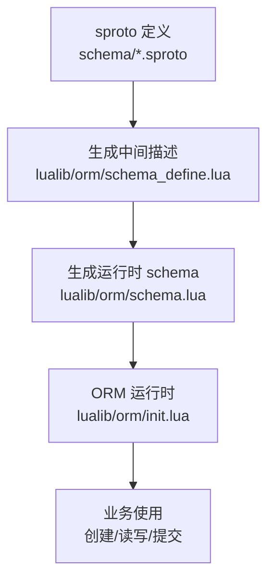
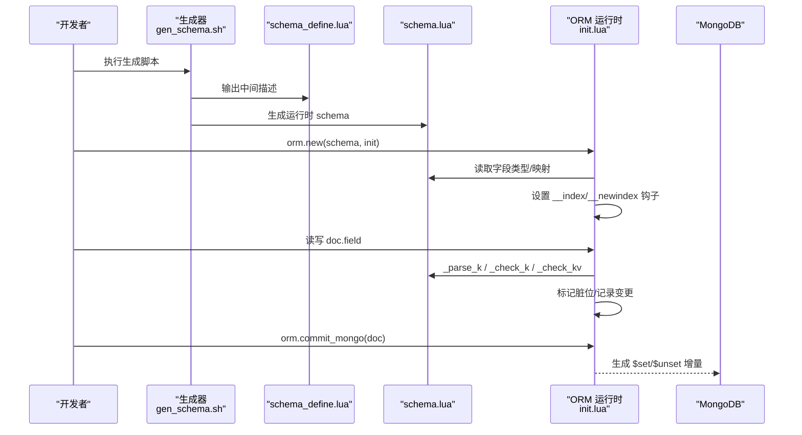
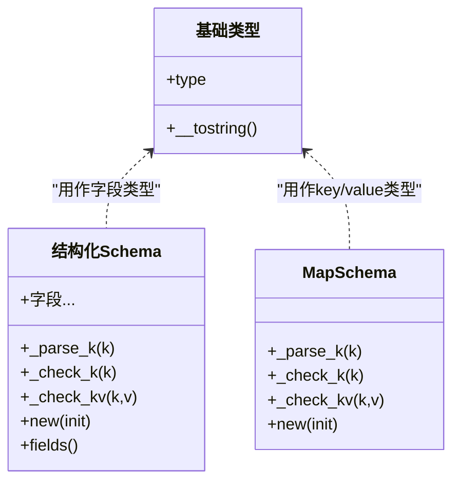
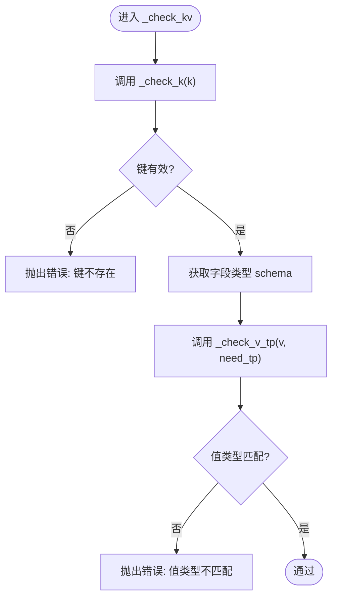
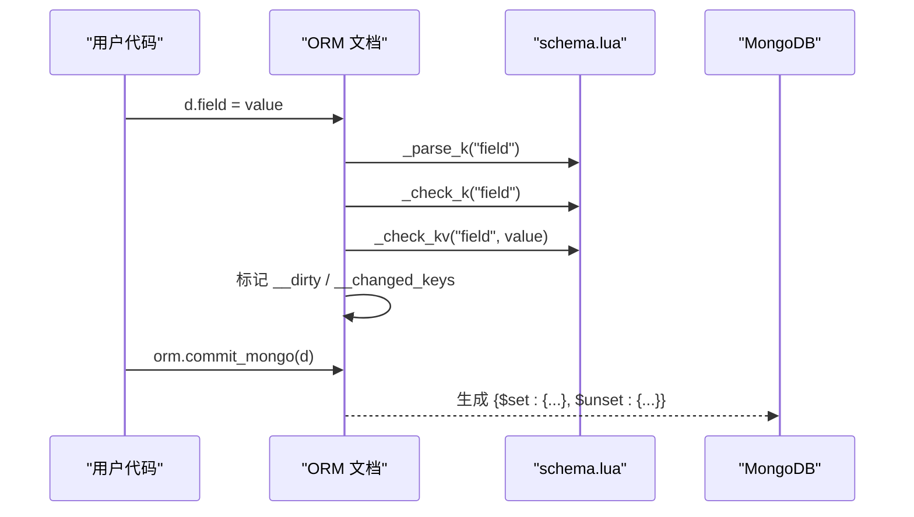

# Schema 定义系统

<cite>
**本文引用的文件**
- [lualib/orm/init.lua](file://lualib/orm/init.lua)
- [lualib/orm/schema.lua](file://lualib/orm/schema.lua)
- [lualib/orm/schema_define.lua](file://lualib/orm/schema_define.lua)
- [schema/bag.sproto](file://schema/bag.sproto)
- [schema/mail.sproto](file://schema/mail.sproto)
- [schema/role.sproto](file://schema/role.sproto)
- [tools/gen_schema.sh](file://tools/gen_schema.sh)
</cite>

## 目录
1. [简介](#简介)
2. [项目结构](#项目结构)
3. [核心组件](#核心组件)
4. [架构总览](#架构总览)
5. [详细组件分析](#详细组件分析)
6. [依赖关系分析](#依赖关系分析)
7. [性能考量](#性能考量)
8. [故障排查指南](#故障排查指南)
9. [结论](#结论)
10. [附录：完整示例与最佳实践](#附录完整示例与最佳实践)

## 简介
本系统基于 sproto 数据契约，自动生成 Lua ORM 的 schema 描述与运行时校验逻辑，提供强类型、可追踪变更的数据对象模型。通过声明式字段定义（基础类型、嵌套对象、数组、映射等），系统在读写时进行键名解析与值类型校验，并在提交到数据库时生成最小化的增量更新指令。

## 项目结构
- 数据契约层：位于 schema/*.sproto，定义业务数据结构（角色、背包、邮件等）。
- 代码生成层：tools/gen_schema.sh 调用工具链将 sproto 转换为中间描述 schema_define.lua，再进一步生成运行时 schema.lua。
- ORM 运行时：lualib/orm/init.lua 实现文档对象包装、脏标记、序列化、MongoDB 增量提交等能力；lualib/orm/schema.lua 由生成器产出，包含各类型的元表、字段访问与 _parse_k/_check_k/_check_kv 验证方法。

**图表来源**
- [tools/gen_schema.sh:1-10](file://tools/gen_schema.sh#L1-L10)
- [lualib/orm/schema_define.lua:1-131](file://lualib/orm/schema_define.lua#L1-L131)
- [lualib/orm/schema.lua:1-471](file://lualib/orm/schema.lua#L1-L471)
- [lualib/orm/init.lua:234-319](file://lualib/orm/init.lua#L234-L319)

**章节来源**
- [tools/gen_schema.sh:1-10](file://tools/gen_schema.sh#L1-L10)
- [lualib/orm/schema_define.lua:1-131](file://lualib/orm/schema_define.lua#L1-L131)
- [lualib/orm/schema.lua:1-471](file://lualib/orm/schema.lua#L1-L471)
- [lualib/orm/init.lua:234-319](file://lualib/orm/init.lua#L234-L319)

## 核心组件
- 基础类型与类型标记：number、integer、string、boolean，作为值类型或 map key/value 的类型约束。
- 字段访问与校验：每个 schema 对象暴露 _parse_k、_check_k、_check_kv 三个方法，分别负责键名解析、键存在性检查、键值类型检查。
- Map 类型：为特定 key/value 类型组合生成 map schema，支持自定义 key 解析与 kv 校验。
- 文档对象（Doc）：ORM 包装后的表，具备只读访问、写时校验、脏标记、克隆、序列化、MongoDB 增量提交等功能。

**章节来源**
- [lualib/orm/schema.lua:8-142](file://lualib/orm/schema.lua#L8-L142)
- [lualib/orm/schema.lua:144-185](file://lualib/orm/schema.lua#L144-L185)
- [lualib/orm/schema.lua:202-471](file://lualib/orm/schema.lua#L202-L471)
- [lualib/orm/init.lua:234-319](file://lualib/orm/init.lua#L234-L319)

## 架构总览
下图展示从 sproto 到 ORM 运行时的整体流程，以及关键校验点。

**图表来源**
- [tools/gen_schema.sh:1-10](file://tools/gen_schema.sh#L1-L10)
- [lualib/orm/schema_define.lua:1-131](file://lualib/orm/schema_define.lua#L1-L131)
- [lualib/orm/schema.lua:144-185](file://lualib/orm/schema.lua#L144-L185)
- [lualib/orm/init.lua:234-319](file://lualib/orm/init.lua#L234-L319)
- [lualib/orm/init.lua:329-447](file://lualib/orm/init.lua#L329-L447)

## 详细组件分析

### 数据类型与字段定义
- 基础类型：number、integer、string、boolean，用于值类型约束。
- 复合类型：struct（对象）、map（键值对）、array（列表）。
- 字段声明：在 sproto 中定义字段名与类型，生成器将其转为 schema_define.lua 的结构化描述，再由 schema.lua 构建运行时 schema 对象。

**图表来源**
- [lualib/orm/schema.lua:8-142](file://lualib/orm/schema.lua#L8-L142)
- [lualib/orm/schema.lua:202-471](file://lualib/orm/schema.lua#L202-L471)

**章节来源**
- [schema/bag.sproto:1-16](file://schema/bag.sproto#L1-L16)
- [schema/mail.sproto:1-37](file://schema/mail.sproto#L1-L37)
- [schema/role.sproto:1-24](file://schema/role.sproto#L1-L24)
- [lualib/orm/schema_define.lua:1-131](file://lualib/orm/schema_define.lua#L1-L131)
- [lualib/orm/schema.lua:202-471](file://lualib/orm/schema.lua#L202-L471)

### 字段验证机制：_parse_k、_check_k、_check_kv
- _parse_k：将传入的键名按 schema 要求解析为标准形式（如 integer/string），返回标准化键。
- _check_k：校验键是否存在于当前 schema 定义中，不存在则报错。
- _check_kv：先校验键存在，再根据字段类型校验值的类型，不匹配则报错。

**图表来源**
- [lualib/orm/schema.lua:163-185](file://lualib/orm/schema.lua#L163-L185)
- [lualib/orm/schema.lua:40-142](file://lualib/orm/schema.lua#L40-L142)

**章节来源**
- [lualib/orm/schema.lua:40-142](file://lualib/orm/schema.lua#L40-L142)
- [lualib/orm/schema.lua:163-185](file://lualib/orm/schema.lua#L163-L185)

### ORM 文档对象与变更追踪
- 构造：orm.new(schema, init) 将普通表包装为 ORM 文档，设置 __index/__newindex 钩子以拦截读写。
- 写入：__newindex 触发 doc_change，先解析键，再递归处理嵌套表，最后调用 _check_kv 校验并标记脏位。
- 遍历：默认迭代跳过“默认值”（空表/原子类型/BSON 原生类型），序列化时可将 map 的 key 统一转为字符串。
- 提交：orm.commit_mongo(doc) 收集变更，生成 $set/$unset 增量，避免全量覆盖。

**图表来源**
- [lualib/orm/init.lua:234-319](file://lualib/orm/init.lua#L234-L319)
- [lualib/orm/init.lua:329-447](file://lualib/orm/init.lua#L329-L447)

**章节来源**
- [lualib/orm/init.lua:234-319](file://lualib/orm/init.lua#L234-L319)
- [lualib/orm/init.lua:329-447](file://lualib/orm/init.lua#L329-L447)

### 继承机制与字段映射
- 继承：通过嵌套 struct 实现“组合式继承”，父 schema 的字段通过引用子 schema 完成扩展（例如 role.modules 引用 role_modules）。
- 字段映射：sproto 中的字段名直接映射为 schema 字段名；map 的 key/value 类型在 schema.lua 中以专用 map schema 表示。
- 默认值：未显式赋值的字段在序列化时可被跳过（视为默认），减少网络与存储开销。

**章节来源**
- [schema/role.sproto:1-24](file://schema/role.sproto#L1-L24)
- [lualib/orm/schema_define.lua:68-121](file://lualib/orm/schema_define.lua#L68-L121)
- [lualib/orm/schema.lua:328-435](file://lualib/orm/schema.lua#L328-L435)

### 数组与可选字段
- 数组：sproto 中使用 * 表示列表，生成 map_integer_* 或 array schema，配合 ORM 的插入/删除接口操作。
- 可选字段：未赋值的字段在序列化时会被跳过，达到“可选”的效果；写入 nil 会触发 $unset 以删除字段。

**章节来源**
- [schema/bag.sproto:1-16](file://schema/bag.sproto#L1-L16)
- [schema/mail.sproto:1-37](file://schema/mail.sproto#L1-L37)
- [lualib/orm/init.lua:178-232](file://lualib/orm/init.lua#L178-L232)
- [lualib/orm/init.lua:348-447](file://lualib/orm/init.lua#L348-L447)

## 依赖关系分析
- 生成器依赖：tools/gen_schema.sh 驱动 sproto 到 schema 的转换。
- 运行时依赖：schema.lua 依赖 orm.init 提供的 new 与校验能力；init.lua 依赖 schema 的 _parse_k/_check_k/_check_kv。
- 外部集成：MongoDB 通过 commit_mongo 接收增量更新指令。

**图表来源**
- [tools/gen_schema.sh:1-10](file://tools/gen_schema.sh#L1-L10)
- [lualib/orm/schema_define.lua:1-131](file://lualib/orm/schema_define.lua#L1-L131)
- [lualib/orm/schema.lua:1-471](file://lualib/orm/schema.lua#L1-L471)
- [lualib/orm/init.lua:329-447](file://lualib/orm/init.lua#L329-L447)

**章节来源**
- [tools/gen_schema.sh:1-10](file://tools/gen_schema.sh#L1-L10)
- [lualib/orm/schema.lua:1-471](file://lualib/orm/schema.lua#L1-L471)
- [lualib/orm/init.lua:329-447](file://lualib/orm/init.lua#L329-L447)

## 性能考量
- 增量提交：仅提交变更字段，降低网络与存储压力。
- 跳过默认值：序列化时跳过空值与原子类型，减少冗余数据。
- 类型快速校验：基于预定义类型对象与函数，避免反射开销。
- 建议：
  - 合理设计字段粒度，避免过深嵌套导致遍历成本上升。
  - 使用 map 时控制 key 数量，避免过大哈希表。
  - 批量更新时合并多次变更，减少提交次数。

[本节为通用指导，无需具体文件引用]

## 故障排查指南
- 常见错误：
  - 键不存在：访问未定义的字段会触发 _check_k 报错。
  - 类型不匹配：赋值类型与 schema 定义不符会触发 _check_v_tp 报错。
  - 循环引用：totable 检测循环引用并报错。
- 定位方法：
  - 查看错误信息中的 need_tp、real、k/v 值，确认实际输入与期望类型。
  - 使用 orm.is_dirty 判断是否已变更，结合 __changed_keys 定位具体字段。
  - 使用 orm.clone 隔离测试，避免污染原始对象。

**章节来源**
- [lualib/orm/schema.lua:40-142](file://lualib/orm/schema.lua#L40-L142)
- [lualib/orm/init.lua:100-124](file://lualib/orm/init.lua#L100-L124)
- [lualib/orm/init.lua:428-447](file://lualib/orm/init.lua#L428-L447)

## 结论
该 Schema 定义系统通过 sproto 契约驱动，自动生成强类型 schema 与 ORM 运行时，提供健壮的字段校验、变更追踪与高效增量提交能力。其组合式结构与清晰的验证流程，使得复杂业务数据的建模与维护更加可靠与直观。

[本节为总结，无需具体文件引用]

## 附录：完整示例与最佳实践

### 示例一：角色与模块（嵌套对象）
- 目标：定义角色基本信息及其模块（背包、邮件）。
- 步骤：
  - 在 schema/role.sproto 中定义 role 与 role_modules。
  - 运行 gen_schema.sh 生成 schema_define.lua 与 schema.lua。
  - 使用 orm.new(role, init) 创建角色对象，并通过 modules.bag/modules.mail 访问子模块。

**章节来源**
- [schema/role.sproto:1-24](file://schema/role.sproto#L1-L24)
- [tools/gen_schema.sh:1-10](file://tools/gen_schema.sh#L1-L10)
- [lualib/orm/schema.lua:328-435](file://lualib/orm/schema.lua#L328-L435)

### 示例二：背包资源（Map 与数组）
- 目标：管理玩家资源，支持按资源 ID 查询与数量更新。
- 步骤：
  - 在 schema/bag.sproto 中定义 bag 与 resource，使用 *resource(res_id) 表示资源列表。
  - 生成后通过 bag.res[res_id] 访问资源，修改 res_size 并提交。

**章节来源**
- [schema/bag.sproto:1-16](file://schema/bag.sproto#L1-L16)
- [lualib/orm/schema.lua:202-233](file://lualib/orm/schema.lua#L202-L233)
- [lualib/orm/init.lua:329-447](file://lualib/orm/init.lua#L329-L447)

### 示例三：邮件系统（复杂嵌套与多语言标题）
- 目标：支持邮件标题与内容的多语言映射，附带发送者与附件。
- 步骤：
  - 在 schema/mail.sproto 中定义 mail、mail_role、mail_attach、str2str。
  - 使用 map_string_string 表示 title/detail，通过 orm.new(mail, ...) 创建邮件对象。

**章节来源**
- [schema/mail.sproto:1-37](file://schema/mail.sproto#L1-L37)
- [lualib/orm/schema.lua:250-290](file://lualib/orm/schema.lua#L250-L290)
- [lualib/orm/init.lua:234-319](file://lualib/orm/init.lua#L234-L319)

### 最佳实践
- 字段命名：保持语义清晰，避免歧义；关键字段（如 rid、res_id）保持一致命名规范。
- 版本控制：在顶层结构引入 _version 字段，便于后续兼容演进。
- 数据校验：充分利用 _check_kv 进行严格类型检查，避免脏数据入库。
- 序列化优化：使用 with_bson_encode_context 确保 map key 正确序列化。
- 变更提交：优先使用 commit_mongo 进行增量更新，减少带宽与存储消耗。

[本节为通用指导，无需具体文件引用]