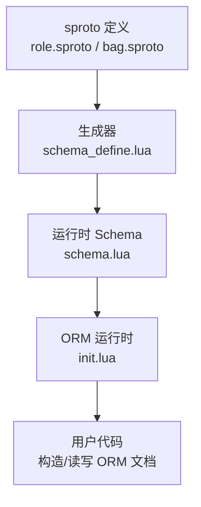
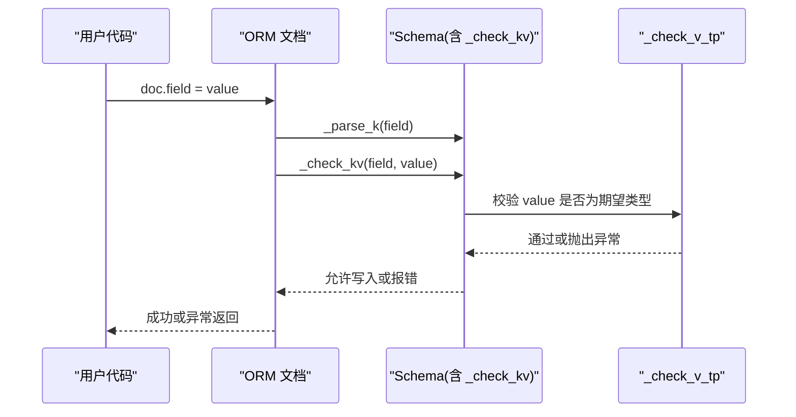
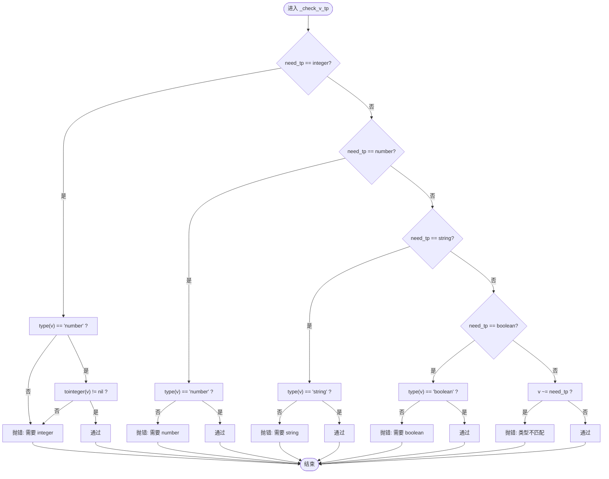

# 基础数据类型

<cite>
**本文引用的文件**
- [lualib/orm/schema.lua](file://lualib/orm/schema.lua)
- [lualib/orm/init.lua](file://lualib/orm/init.lua)
- [lualib/orm/schema_define.lua](file://lualib/orm/schema_define.lua)
- [schema/role.sproto](file://schema/role.sproto)
- [schema/bag.sproto](file://schema/bag.sproto)
</cite>

## 目录
1. [简介](#简介)
2. [项目结构](#项目结构)
3. [核心组件](#核心组件)
4. [架构总览](#架构总览)
5. [详细组件分析](#详细组件分析)
6. [依赖关系分析](#依赖关系分析)
7. [性能考量](#性能考量)
8. [故障排查指南](#故障排查指南)
9. [结论](#结论)
10. [附录：在 Schema 中声明基础类型字段的使用示例](#附录：在-schema-中声明基础类型字段的使用示例)

## 简介
本文件围绕 integer、number、string、boolean 四种基础数据类型，系统阐述其在 ORM 与 schema 体系中的定义、验证规则、转换机制、错误处理以及最佳实践。重点解释 _check_v_tp 函数的实现原理与类型检查机制，并给出在 schema 中声明这些类型的完整使用方式与常见陷阱。

## 项目结构
- 类型定义与校验逻辑集中在 lualib/orm/schema.lua，其中定义了 number、integer、string、boolean 四个“类型标记”对象，以及 _check_v_tp、_parse_k_tp、_check_k_tp 等核心函数。
- ORM 运行时在 lualib/orm/init.lua 中实现文档（doc）的创建、变更追踪、序列化与提交；通过调用 schema 暴露的 _parse_k、_check_k、_check_kv 完成键值解析与校验。
- 业务数据模型由 sproto 描述（如 role.sproto、bag.sproto），并由工具生成 lualib/orm/schema_define.lua 和 lualib/orm/schema.lua，将 sproto 字段映射为强类型字段。

图表来源
- [schema/role.sproto:1-24](file://schema/role.sproto#L1-L24)
- [schema/bag.sproto:1-16](file://schema/bag.sproto#L1-L16)
- [lualib/orm/schema_define.lua:1-131](file://lualib/orm/schema_define.lua#L1-L131)
- [lualib/orm/schema.lua:1-471](file://lualib/orm/schema.lua#L1-L471)
- [lualib/orm/init.lua:234-295](file://lualib/orm/init.lua#L234-L295)

章节来源
- [lualib/orm/schema.lua:1-471](file://lualib/orm/schema.lua#L1-L471)
- [lualib/orm/init.lua:234-295](file://lualib/orm/init.lua#L234-L295)
- [lualib/orm/schema_define.lua:1-131](file://lualib/orm/schema_define.lua#L1-L131)
- [schema/role.sproto:1-24](file://schema/role.sproto#L1-L24)
- [schema/bag.sproto:1-16](file://schema/bag.sproto#L1-L16)

## 核心组件
- 类型标记对象：number、integer、string、boolean，用于标识字段期望的类型。
- 校验函数：
  - _check_v_tp(v, need_tp)：对值进行类型校验。
  - _check_k_tp(k, need_tp)：对键进行类型校验（主要用于 map 的 key）。
  - parse_k_func/check_k_func/check_kv_func：组合上述校验，供 map 类型使用。
- ORM 运行时：
  - orm.new(schema, init)：根据 schema 构建受约束的文档对象。
  - __newindex/__index：拦截赋值与读取，触发 _parse_k/_check_k/_check_kv。
  - with_bson_encode_context：在 BSON 编码期间将非字符串 key 转为字符串。

章节来源
- [lualib/orm/schema.lua:8-142](file://lualib/orm/schema.lua#L8-L142)
- [lualib/orm/init.lua:234-295](file://lualib/orm/init.lua#L234-L295)
- [lualib/orm/init.lua:224-232](file://lualib/orm/init.lua#L224-L232)

## 架构总览
下图展示了从用户代码到类型校验的完整调用链：用户设置字段时，ORM 拦截赋值，调用 schema 的 _parse_k 与 _check_kv，最终落到 _check_v_tp 进行严格类型检查。

图表来源
- [lualib/orm/init.lua:234-295](file://lualib/orm/init.lua#L234-L295)
- [lualib/orm/schema.lua:144-185](file://lualib/orm/schema.lua#L144-L185)
- [lualib/orm/schema.lua:89-142](file://lualib/orm/schema.lua#L89-L142)

## 详细组件分析

### 类型标记对象：number、integer、string、boolean
- 设计要点
  - 每个类型是一个带 type 字段的元表对象，便于运行时识别。
  - 提供 __tostring 输出可读名称，便于错误信息定位。
- 行为差异
  - integer：要求值为 number 且可被精确转换为整数（tointeger 不为 nil）。
  - number：仅要求类型为 number。
  - string：仅要求类型为 string。
  - boolean：仅要求类型为 boolean。

章节来源
- [lualib/orm/schema.lua:8-38](file://lualib/orm/schema.lua#L8-L38)

### 值校验函数 _check_v_tp 的实现原理
- 输入：v（待校验的值）、need_tp（期望类型标记）。
- 流程
  - 若 need_tp 为 integer：要求 type(v) == "number" 且 tointeger(v) 不为 nil，否则抛错。
  - 若 need_tp 为 number：要求 type(v) == "number"。
  - 若 need_tp 为 string：要求 type(v) == "string"。
  - 若 need_tp 为 boolean：要求 type(v) == "boolean"。
  - 其他情况：比较 v 与 need_tp 是否相等，不等则抛错（用于自定义类型标记）。
- 错误信息：包含实际类型、实际值、期望类型，便于快速定位问题。

图表来源
- [lualib/orm/schema.lua:89-142](file://lualib/orm/schema.lua#L89-L142)

章节来源
- [lualib/orm/schema.lua:89-142](file://lualib/orm/schema.lua#L89-L142)

### 键校验与解析：_check_k_tp 与 _parse_k_tp
- _check_k_tp(k, need_tp)
  - integer：要求 type(k) == "number" 且 tointeger(k) != nil。
  - string：要求 type(k) == "string"。
  - 其他：抛错。
- _parse_k_tp(k, need_tp)
  - integer：尝试 tointeger(k)，失败抛错。
  - string：tostring(k)。
  - 其他：抛错。
- 用途：map 类型的键必须满足指定类型，并在访问/遍历时进行规范化（例如将数字键转为整数）。

章节来源
- [lualib/orm/schema.lua:40-87](file://lualib/orm/schema.lua#L40-L87)

### ORM 运行时如何驱动类型检查
- 文档创建：orm.new(schema, init) 会为每个字段建立受控的文档对象，并绑定 schema。
- 赋值拦截：__newindex 会先调用 _parse_k 规范化键，再根据值类型决定是否递归构造子文档，最后调用 _check_kv 进行类型校验。
- 读取拦截：__index 会调用 _check_k 确保键存在。
- 序列化上下文：with_bson_encode_context 会在 BSON 编码时将非字符串 key 统一转为字符串，避免数据库层出现非字符串键。

章节来源
- [lualib/orm/init.lua:234-295](file://lualib/orm/init.lua#L234-L295)
- [lualib/orm/init.lua:224-232](file://lualib/orm/init.lua#L224-L232)

### 在 Schema 中声明基础类型字段
- sproto 定义中使用 integer、string 等基础类型，例如：
  - role.sproto 中 rid、create_time、last_login_time 等为 integer；name、account、server、game 等为 string。
  - bag.sproto 中 res_id、res_size、res_type 等为 integer。
- 生成产物：
  - schema_define.lua 将 sproto 字段映射为结构化 schema 定义。
  - schema.lua 基于该定义生成对应的类型标记与校验函数，并装配到各结构体上。

章节来源
- [schema/role.sproto:1-24](file://schema/role.sproto#L1-L24)
- [schema/bag.sproto:1-16](file://schema/bag.sproto#L1-L16)
- [lualib/orm/schema_define.lua:1-131](file://lualib/orm/schema_define.lua#L1-L131)
- [lualib/orm/schema.lua:187-471](file://lualib/orm/schema.lua#L187-L471)

## 依赖关系分析
- schema.lua 依赖 orm.init 提供的 new 接口，并通过 setmetatable 将 _parse_k/_check_k/_check_kv 注入到各结构体。
- init.lua 在赋值/读取时调用 schema 暴露的方法，形成“运行时 ORM + 编译期 Schema”的耦合。
- sproto 作为数据契约，驱动 schema 生成，保证前后端一致。

图表来源
- [schema/role.sproto:1-24](file://schema/role.sproto#L1-L24)
- [schema/bag.sproto:1-16](file://schema/bag.sproto#L1-L16)
- [lualib/orm/schema_define.lua:1-131](file://lualib/orm/schema_define.lua#L1-L131)
- [lualib/orm/schema.lua:1-471](file://lualib/orm/schema.lua#L1-L471)
- [lualib/orm/init.lua:234-295](file://lualib/orm/init.lua#L234-L295)

章节来源
- [lualib/orm/schema.lua:1-471](file://lualib/orm/schema.lua#L1-L471)
- [lualib/orm/init.lua:234-295](file://lualib/orm/init.lua#L234-L295)

## 性能考量
- 类型检查开销
  - _check_v_tp 使用轻量级 type 判断与 tointeger 转换，整体开销低。
  - integer 校验比 number 多一次 tointeger 检查，但仍是常数时间。
- 键规范化
  - map 的 _parse_k_tp 会对键进行 tointeger/tostring 转换，建议在批量写入前尽量保持键类型正确，减少重复转换。
- 序列化优化
  - with_bson_encode_context 仅在 BSON 编码期间切换迭代器，避免额外拷贝。

[本节为通用性能建议，不直接分析具体文件]

## 故障排查指南
- 常见错误
  - “not equal v type. need integer...”：传入值不是 number 或无法转换为整数。
  - “not equal v type. need number...”：传入值不是 number。
  - “not equal v type. need string...”：传入值不是 string。
  - “not equal v type. need boolean...”：传入值不是 boolean。
  - “not exist key: ...”：访问了未定义的字段。
- 定位方法
  - 查看错误信息中的 real 值与 need_tp，确认传入数据的来源与类型。
  - 对于 map 键错误，检查键是否满足 integer/string 要求。
  - 在 ORM 赋值路径中，确认是否触发了 _check_kv。

章节来源
- [lualib/orm/schema.lua:40-87](file://lualib/orm/schema.lua#L40-L87)
- [lualib/orm/schema.lua:89-142](file://lualib/orm/schema.lua#L89-L142)
- [lualib/orm/schema.lua:163-185](file://lualib/orm/schema.lua#L163-L185)

## 结论
- 本项目通过“类型标记 + 运行时校验”的方式，为 integer、number、string、boolean 提供了严格的类型保障。
- _check_v_tp 是类型校验的核心，配合 _parse_k_tp/_check_k_tp 实现对键值的规范化与校验。
- 借助 sproto 生成的 schema，可在业务层以强类型方式操作数据，降低运行时错误概率。
- 最佳实践包括：明确字段类型、避免隐式类型转换、在 BSON 编码前统一键类型、及时捕获并处理类型错误。

[本节为总结性内容，不直接分析具体文件]

## 附录：在 Schema 中声明基础类型字段的使用示例
以下示例展示如何在 sproto 中声明基础类型字段，以及在 ORM 中如何使用。为避免泄露实现细节，仅提供路径引用。

- 在 sproto 中声明字段
  - role.sproto 中：rid、create_time、last_login_time 使用 integer；name、account、server、game 使用 string。
  - bag.sproto 中：res_id、res_size、res_type 使用 integer。
- 在 ORM 中使用
  - 通过 schema 暴露的结构体构造函数创建文档对象，并对字段进行赋值。
  - 赋值时会触发 _check_kv，进而调用 _check_v_tp 进行类型校验。
  - 对于 map 字段，键需满足 integer 或 string 的要求，读取/遍历时会自动规范化。

章节来源
- [schema/role.sproto:1-24](file://schema/role.sproto#L1-L24)
- [schema/bag.sproto:1-16](file://schema/bag.sproto#L1-L16)
- [lualib/orm/schema.lua:187-471](file://lualib/orm/schema.lua#L187-L471)
- [lualib/orm/init.lua:234-295](file://lualib/orm/init.lua#L234-L295)