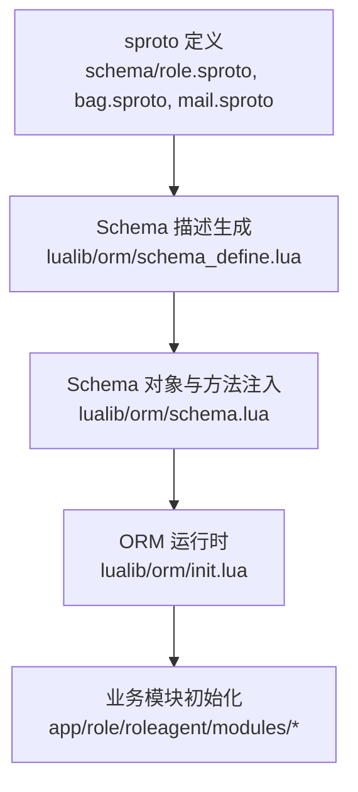
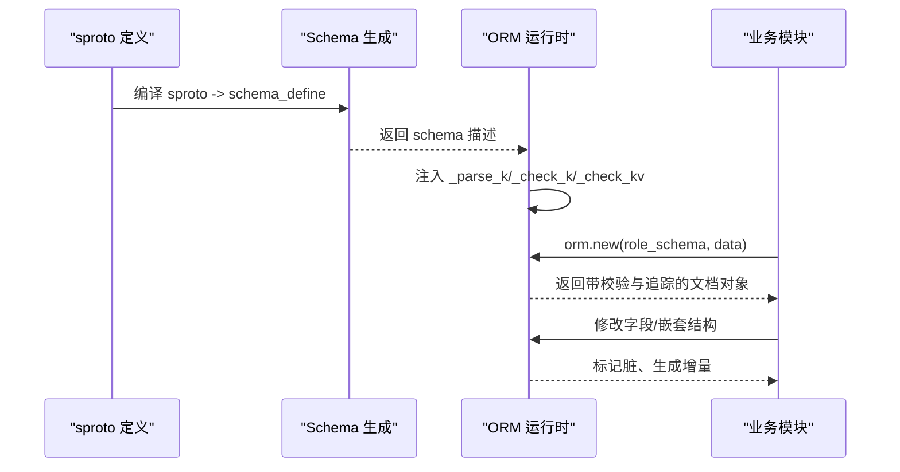
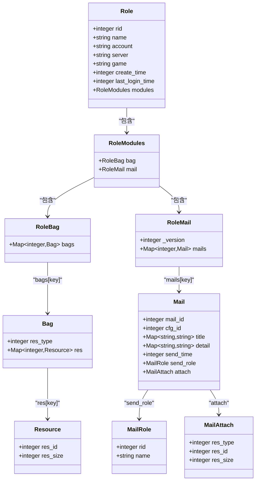
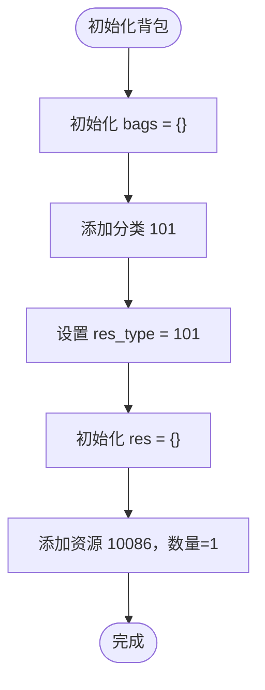
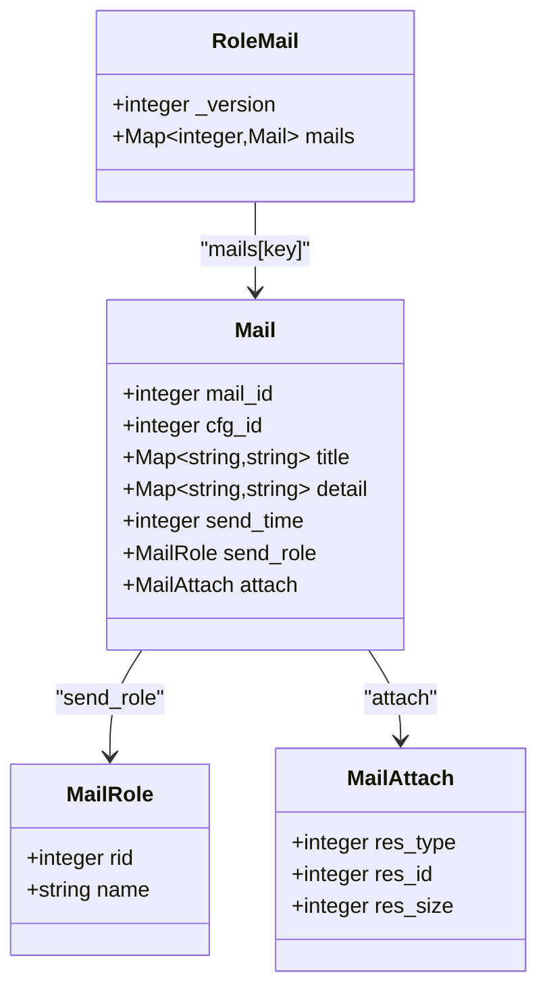
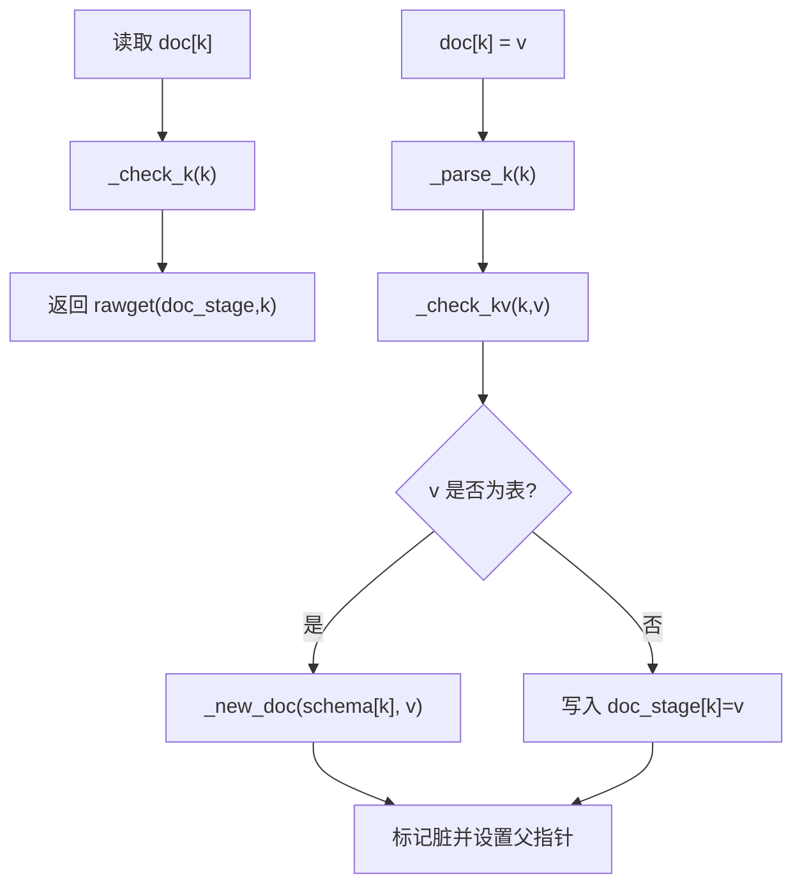
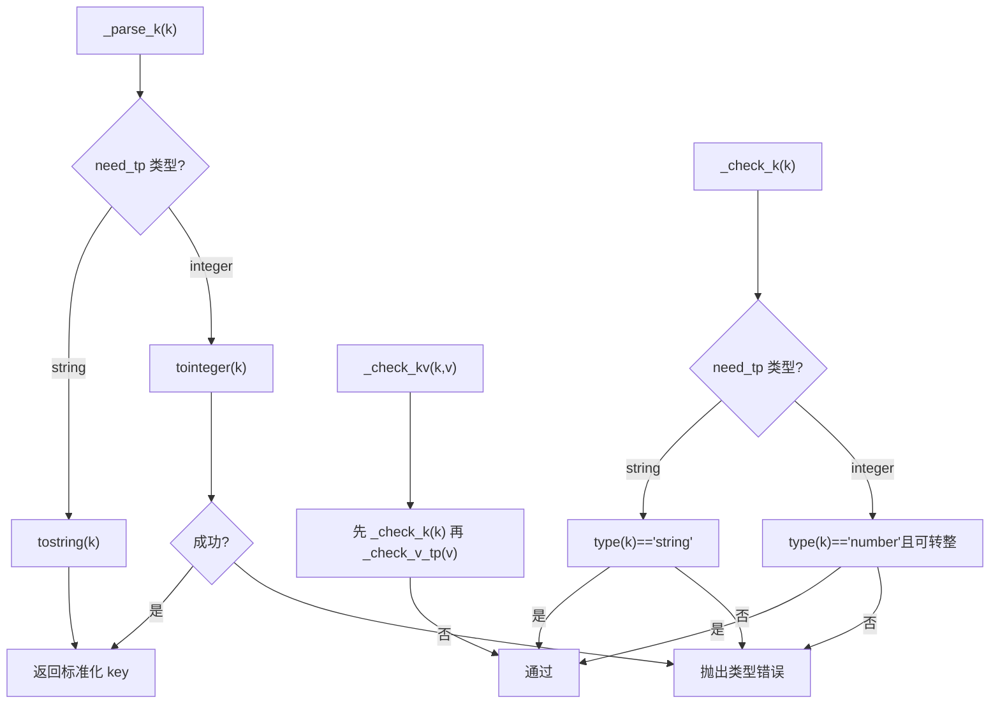
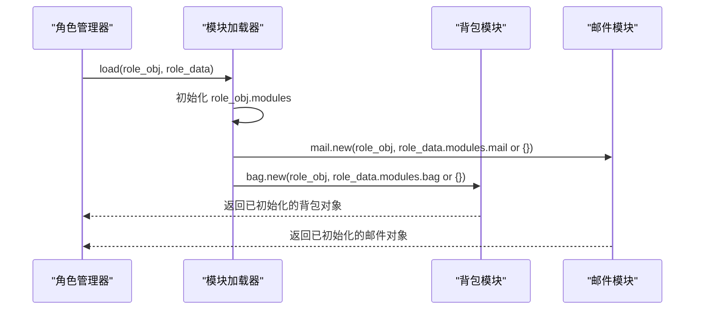
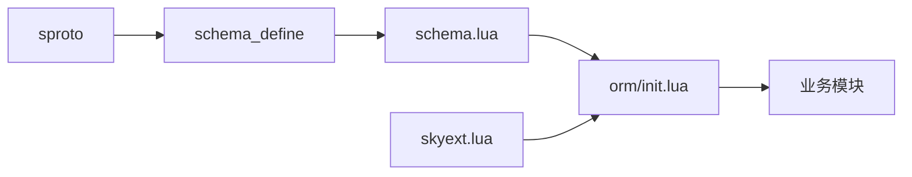

# 复杂数据结构

<cite>
**本文引用的文件**
- [schema/role.sproto](file://schema/role.sproto)
- [schema/bag.sproto](file://schema/bag.sproto)
- [schema/mail.sproto](file://schema/mail.sproto)
- [lualib/orm/schema_define.lua](file://lualib/orm/schema_define.lua)
- [lualib/orm/schema.lua](file://lualib/orm/schema.lua)
- [lualib/orm/init.lua](file://lualib/orm/init.lua)
- [lualib/skyext.lua](file://lualib/skyext.lua)
- [app/role/roleagent/modules/init.lua](file://app/role/roleagent/modules/init.lua)
- [app/role/roleagent/modules/bag/init.lua](file://app/role/roleagent/modules/bag/init.lua)
- [app/role/roleagent/modules/mail/init.lua](file://app/role/roleagent/modules/mail/init.lua)
</cite>

## 目录
1. [简介](#简介)
2. [项目结构](#项目结构)
3. [核心组件](#核心组件)
4. [架构总览](#架构总览)
5. [详细组件分析](#详细组件分析)
6. [依赖关系分析](#依赖关系分析)
7. [性能考量](#性能考量)
8. [故障排查指南](#故障排查指南)
9. [结论](#结论)
10. [附录](#附录)

## 简介
本文件围绕游戏服务器中的“复杂数据结构”进行系统化文档化，重点解释：
- struct（结构体）与 map（映射）的定义、嵌套、字段约束与默认值处理
- map 的键类型约束与动态访问机制
- 角色模块、背包系统、邮件系统等实际业务场景中的复合结构组织方式
- _parse_k、_check_k、_check_kv 方法的实现原理与使用场景

该方案通过 sproto 定义数据契约，由代码生成器产出 schema 描述，再由 ORM 层提供强类型、可追踪变更的数据对象，从而在读写、序列化、持久化过程中保证一致性与可维护性。

## 项目结构
- 数据契约定义位于 schema/*.sproto，描述角色、背包、邮件等核心实体的结构与字段类型
- 由工具将 sproto 转换为 lualib/orm/schema_define.lua 的结构化描述
- lualib/orm/schema.lua 根据 schema_define 生成具体 schema 对象，并注入 _parse_k/_check_k/_check_kv 等方法
- lualib/orm/init.lua 提供 ORM 运行时：创建文档、拦截赋值、脏标记、增量提交、序列化等
- 业务模块 app/role/... 使用这些 schema 对象构建角色及其子模块（背包、邮件）

**图表来源**
- [schema/role.sproto:1-24](file://schema/role.sproto#L1-L24)
- [schema/bag.sproto:1-16](file://schema/bag.sproto#L1-L16)
- [schema/mail.sproto:1-37](file://schema/mail.sproto#L1-L37)
- [lualib/orm/schema_define.lua:1-131](file://lualib/orm/schema_define.lua#L1-L131)
- [lualib/orm/schema.lua:187-470](file://lualib/orm/schema.lua#L187-L470)
- [lualib/orm/init.lua:234-295](file://lualib/orm/init.lua#L234-L295)
- [app/role/roleagent/modules/init.lua:18-34](file://app/role/roleagent/modules/init.lua#L18-L34)

**章节来源**
- [schema/role.sproto:1-24](file://schema/role.sproto#L1-L24)
- [schema/bag.sproto:1-16](file://schema/bag.sproto#L1-L16)
- [schema/mail.sproto:1-37](file://schema/mail.sproto#L1-L37)
- [lualib/orm/schema_define.lua:1-131](file://lualib/orm/schema_define.lua#L1-L131)
- [lualib/orm/schema.lua:187-470](file://lualib/orm/schema.lua#L187-L470)
- [lualib/orm/init.lua:234-295](file://lualib/orm/init.lua#L234-L295)
- [app/role/roleagent/modules/init.lua:18-34](file://app/role/roleagent/modules/init.lua#L18-L34)

## 核心组件
- sproto 契约：以 .struct/.map 声明实体与字段类型，支持泛型参数（如 *bag(res_type)、*mail(mail_id)），用于表达“列表/映射”语义
- Schema 描述：由 sproto 生成的结构化元信息，记录每个字段的类型、key/value 类型、嵌套关系
- Schema 对象与方法：为每个 struct/map 生成 schema 表，并绑定 _parse_k/_check_k/_check_kv 以及 new 构造器
- ORM 运行时：封装文档对象生命周期，包括：
  - 创建：_new_doc(schema, init)
  - 访问拦截：__index 调用 _check_k
  - 赋值拦截：__newindex 调用 _parse_k 与 _check_kv，递归包装子对象
  - 脏标记：mark_dirty 向上冒泡，commit_mongo 生成 $set/$unset 增量
  - 序列化：with_bson_encode_context 下 table_pairs 切换为 bson_pairs，自动将 key 转为字符串

**章节来源**
- [lualib/orm/schema.lua:187-470](file://lualib/orm/schema.lua#L187-L470)
- [lualib/orm/init.lua:40-97](file://lualib/orm/init.lua#L40-L97)
- [lualib/orm/init.lua:213-232](file://lualib/orm/init.lua#L213-L232)
- [lualib/orm/init.lua:348-447](file://lualib/orm/init.lua#L348-L447)

## 架构总览
下图展示了从 sproto 到 ORM 运行时的完整链路，以及业务模块如何使用这些能力。

**图表来源**
- [schema/role.sproto:1-24](file://schema/role.sproto#L1-L24)
- [lualib/orm/schema_define.lua:1-131](file://lualib/orm/schema_define.lua#L1-L131)
- [lualib/orm/schema.lua:187-470](file://lualib/orm/schema.lua#L187-L470)
- [lualib/orm/init.lua:234-295](file://lualib/orm/init.lua#L234-L295)

## 详细组件分析

### 角色模块（Role Modules）
- role 包含 modules 字段，modules 是 role_modules 结构体，内含 bag 与 mail 两个子模块
- 模块加载时，若对应模块数据为空则初始化为空表，再交由模块 new 初始化内部状态

**图表来源**
- [schema/role.sproto:1-24](file://schema/role.sproto#L1-L24)
- [schema/bag.sproto:1-16](file://schema/bag.sproto#L1-L16)
- [schema/mail.sproto:1-37](file://schema/mail.sproto#L1-L37)
- [lualib/orm/schema.lua:328-435](file://lualib/orm/schema.lua#L328-L435)

**章节来源**
- [schema/role.sproto:1-24](file://schema/role.sproto#L1-L24)
- [lualib/orm/schema.lua:328-435](file://lualib/orm/schema.lua#L328-L435)
- [app/role/roleagent/modules/init.lua:18-34](file://app/role/roleagent/modules/init.lua#L18-L34)

### 背包系统（Bag System）
- role_bag.bags 是 Map<integer, Bag>，其中 integer 表示资源分类（res_type）
- Bag.res 是 Map<integer, Resource>，其中 integer 表示资源 id
- 资源 Resource 包含 res_id 与 res_size
- 模块初始化时可为特定分类预置默认资源，便于快速启动

**图表来源**
- [app/role/roleagent/modules/bag/init.lua:6-24](file://app/role/roleagent/modules/bag/init.lua#L6-L24)
- [schema/bag.sproto:1-16](file://schema/bag.sproto#L1-L16)
- [lualib/orm/schema.lua:217-233](file://lualib/orm/schema.lua#L217-L233)

**章节来源**
- [schema/bag.sproto:1-16](file://schema/bag.sproto#L1-L16)
- [lualib/orm/schema.lua:217-233](file://lualib/orm/schema.lua#L217-L233)
- [app/role/roleagent/modules/bag/init.lua:6-24](file://app/role/roleagent/modules/bag/init.lua#L6-L24)

### 邮件系统（Mail System）
- role_mail.mails 是 Map<integer, Mail>，key 为邮件 id
- Mail.title/detail 是 Map<string,string>，用于多语言或扩展字段
- Mail.send_role 为 MailRole，包含发送者 rid/name
- Mail.attach 为 MailAttach，携带附件资源（res_type/res_id/res_size）

**图表来源**
- [schema/mail.sproto:1-37](file://schema/mail.sproto#L1-L37)
- [lualib/orm/schema.lua:386-417](file://lualib/orm/schema.lua#L386-L417)

**章节来源**
- [schema/mail.sproto:1-37](file://schema/mail.sproto#L1-L37)
- [lualib/orm/schema.lua:386-417](file://lualib/orm/schema.lua#L386-L417)

### 嵌套结构的定义与字段继承
- 嵌套通过 sproto 的字段类型引用实现，例如 role.modules 引用 role_modules，role_modules.bag 引用 role_bag
- 在 schema.lua 中，每个 struct 的字段被赋值为对应的 schema 对象（如 role_modules.bag = role_bag），形成“字段即 schema”的自描述结构
- “字段继承”并非传统 OOP 继承，而是通过组合与 schema 复用实现：同一 schema 可在多处复用（如 resource 在 bag 与 mail_attach 中复用）

**章节来源**
- [schema/role.sproto:1-24](file://schema/role.sproto#L1-L24)
- [schema/bag.sproto:1-16](file://schema/bag.sproto#L1-L16)
- [schema/mail.sproto:1-37](file://schema/mail.sproto#L1-L37)
- [lualib/orm/schema.lua:217-435](file://lualib/orm/schema.lua#L217-L435)

### 默认值处理
- 对于可选字段或未提供的字段，ORM 不会自动填充默认值；业务侧需在初始化时显式设置默认结构
- 示例：背包模块在 new 时主动初始化 bags[101] 及默认资源条目
- 提交阶段会跳过“等于默认值”的原子类型与 BSON 内置类型，减少冗余写入

**章节来源**
- [app/role/roleagent/modules/bag/init.lua:6-24](file://app/role/roleagent/modules/bag/init.lua#L6-L24)
- [lualib/orm/init.lua:178-209](file://lualib/orm/init.lua#L178-L209)

### Map 类型的键值对约束与动态访问
- 键类型约束：通过 _parse_k 与 _check_k 强制 key 类型（如 integer 或 string）
- 值类型约束：通过 _check_kv 校验 value 类型（如 resource、mail、string 等）
- 动态访问：
  - 读取：__index 触发 _check_k，确保访问的 key 合法
  - 写入：__newindex 触发 _parse_k 与 _check_kv，并将子表包装为 ORM 文档
  - 迭代：table_pairs 在 BSON 编码上下文下切换为 bson_pairs，自动将 key 转为字符串

**图表来源**
- [lualib/orm/init.lua:54-97](file://lualib/orm/init.lua#L54-L97)
- [lualib/orm/init.lua:234-295](file://lualib/orm/init.lua#L234-L295)
- [lualib/orm/schema.lua:144-185](file://lualib/orm/schema.lua#L144-L185)

**章节来源**
- [lualib/orm/init.lua:54-97](file://lualib/orm/init.lua#L54-L97)
- [lualib/orm/init.lua:234-295](file://lualib/orm/init.lua#L234-L295)
- [lualib/orm/schema.lua:144-185](file://lualib/orm/schema.lua#L144-L185)

### _parse_k、_check_k、_check_kv 的实现原理与使用场景
- _parse_k：负责将传入的 key 转换为目标类型（如整数或字符串），并在不匹配时报错；用于 map 的键规范化
- _check_k：仅校验 key 类型是否合法，不改变 key；用于只读路径的安全检查
- _check_kv：同时校验 key 与 value 的类型；用于赋值路径的强约束
- 使用场景：
  - map_integer_resource：_parse_k 将键解析为整数，_check_kv 校验值为 resource
  - map_string_string：_parse_k 将键解析为字符串，_check_kv 校验值为 string
  - struct 字段：_parse_k/_check_k/_check_kv 基于字段 schema 进行校验

**图表来源**
- [lualib/orm/schema.lua:40-161](file://lualib/orm/schema.lua#L40-L161)
- [lualib/orm/schema.lua:202-215](file://lualib/orm/schema.lua#L202-L215)
- [lualib/orm/schema.lua:235-248](file://lualib/orm/schema.lua#L235-L248)

**章节来源**
- [lualib/orm/schema.lua:40-161](file://lualib/orm/schema.lua#L40-L161)
- [lualib/orm/schema.lua:202-215](file://lualib/orm/schema.lua#L202-L215)
- [lualib/orm/schema.lua:235-248](file://lualib/orm/schema.lua#L235-L248)

### 业务集成示例：角色模块加载
- 模块初始化时，若 role_data.modules 为空则创建空表
- 分别加载 mail 与 bag 模块，若对应数据为空则初始化为空表后交给模块 new
- 模块 new 中可对数据进行默认值填充与业务初始化

**图表来源**
- [app/role/roleagent/modules/init.lua:18-34](file://app/role/roleagent/modules/init.lua#L18-L34)
- [app/role/roleagent/modules/bag/init.lua:6-24](file://app/role/roleagent/modules/bag/init.lua#L6-L24)
- [app/role/roleagent/modules/mail/init.lua:6-14](file://app/role/roleagent/modules/mail/init.lua#L6-L14)

**章节来源**
- [app/role/roleagent/modules/init.lua:18-34](file://app/role/roleagent/modules/init.lua#L18-L34)
- [app/role/roleagent/modules/bag/init.lua:6-24](file://app/role/roleagent/modules/bag/init.lua#L6-L24)
- [app/role/roleagent/modules/mail/init.lua:6-14](file://app/role/roleagent/modules/mail/init.lua#L6-L14)

## 依赖关系分析
- sproto 定义驱动 schema 描述生成，schema 描述驱动 schema 对象与方法注入
- ORM 运行时依赖 schema 对象的 _parse_k/_check_k/_check_kv 进行强类型校验
- 业务模块依赖 ORM 提供的文档对象进行安全、可追踪的数据操作
- skyext 钩住 next/table.unpack/table.concat/table.insert/table.remove，使 ORM 文档能无缝参与标准库操作

**图表来源**
- [schema/role.sproto:1-24](file://schema/role.sproto#L1-L24)
- [lualib/orm/schema_define.lua:1-131](file://lualib/orm/schema_define.lua#L1-L131)
- [lualib/orm/schema.lua:187-470](file://lualib/orm/schema.lua#L187-L470)
- [lualib/orm/init.lua:234-295](file://lualib/orm/init.lua#L234-L295)
- [lualib/skyext.lua:1-81](file://lualib/skyext.lua#L1-L81)

**章节来源**
- [lualib/skyext.lua:1-81](file://lualib/skyext.lua#L1-L81)
- [lualib/orm/schema.lua:187-470](file://lualib/orm/schema.lua#L187-L470)
- [lualib/orm/init.lua:234-295](file://lualib/orm/init.lua#L234-L295)

## 性能考量
- 类型校验集中化：所有 key/value 校验集中在 _parse_k/_check_k/_check_kv，避免散落的分支判断，提升可维护性与一致性
- 脏标记与增量提交：仅提交变更字段，减少网络与存储开销；_commit_mongo 生成 $set/$unset 增量
- 序列化优化：with_bson_encode_context 下 table_pairs 切换为 bson_pairs，自动将 key 转为字符串，避免额外转换成本
- 默认值跳过：bson_next 跳过原子类型与 BSON 内置类型，减少无效写入

**章节来源**
- [lualib/orm/init.lua:40-97](file://lualib/orm/init.lua#L40-L97)
- [lualib/orm/init.lua:178-209](file://lualib/orm/init.lua#L178-L209)
- [lualib/orm/init.lua:213-232](file://lualib/orm/init.lua#L213-L232)
- [lualib/orm/init.lua:348-447](file://lualib/orm/init.lua#L348-L447)

## 故障排查指南
- 类型错误：当 key/value 类型不符合 schema 定义时，_check_k/_check_v_tp 会抛出错误；检查 sproto 定义与传入数据
- 非法键访问：读取不存在的字段会触发 _check_k 报错；确认字段名与类型
- 循环引用：ORM 不支持循环引用，克隆或遍历时会报错；检查数据结构设计
- 脏标记未清除：提交后需确保 _clear_dirty 执行；检查 commit 流程

**章节来源**
- [lualib/orm/schema.lua:40-161](file://lualib/orm/schema.lua#L40-L161)
- [lualib/orm/init.lua:120-124](file://lualib/orm/init.lua#L120-L124)
- [lualib/orm/init.lua:297-313](file://lualib/orm/init.lua#L297-L313)

## 结论
本项目通过 sproto 契约、代码生成的 schema 描述与 ORM 运行时，构建了强类型、可追踪、易维护的复杂数据结构体系。其优势在于：
- 以声明式方式定义复杂嵌套结构，降低出错概率
- 通过 _parse_k/_check_k/_check_kv 实现严格的键值约束与动态访问控制
- 借助 ORM 的脏标记与增量提交，提高持久化效率
- 业务模块可专注于领域逻辑，无需重复处理类型校验与序列化细节

## 附录
- 建议实践：
  - 在 sproto 中明确字段类型与嵌套关系，保持向后兼容
  - 在业务模块初始化时显式设置默认值，避免空指针与不一致状态
  - 使用 with_bson_encode_context 进行序列化，确保 key 类型正确
  - 定期审查 schema 变更，遵循“不允许删字段/改类型/改名”的策略