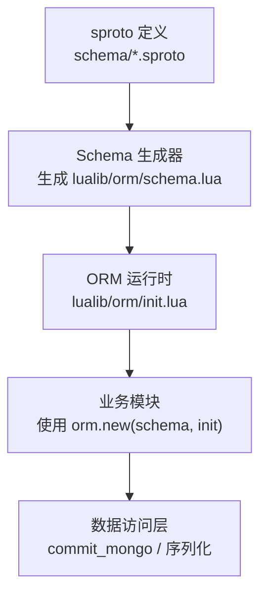
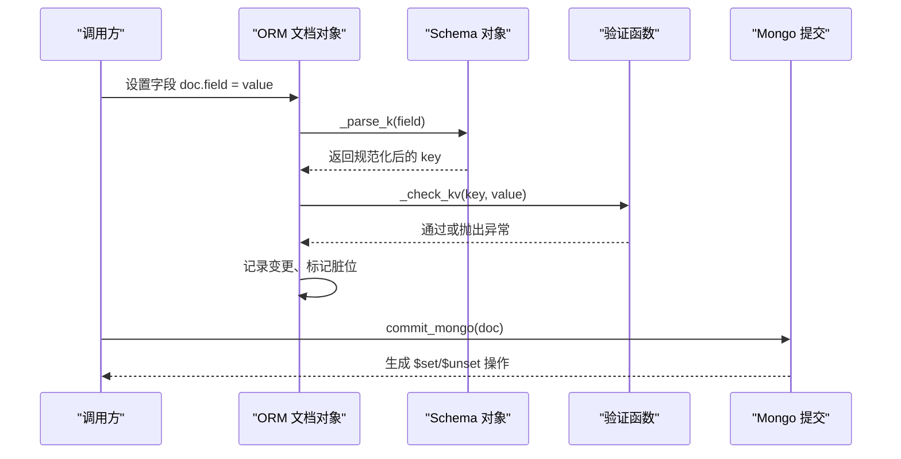
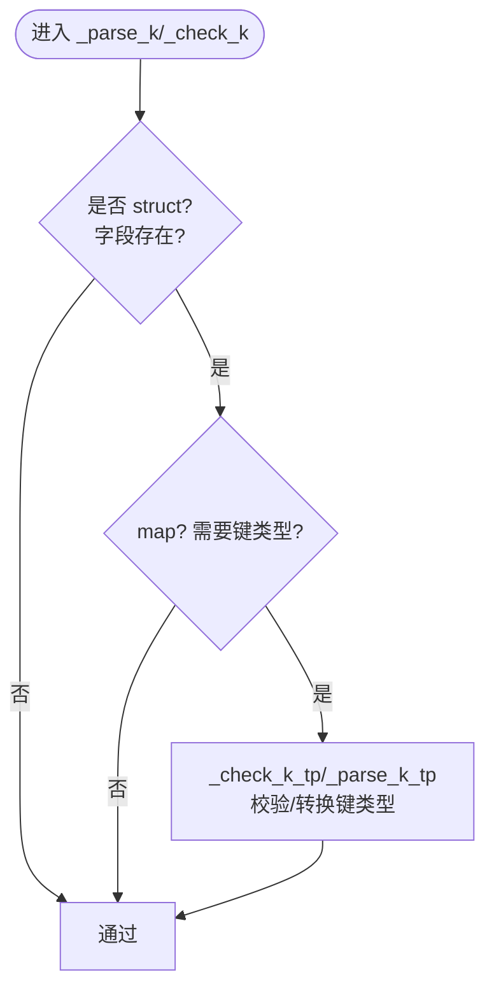
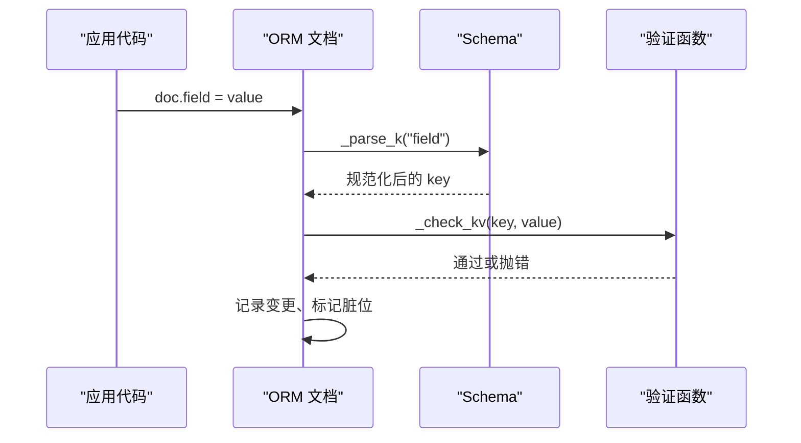
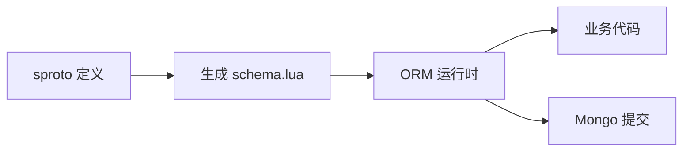
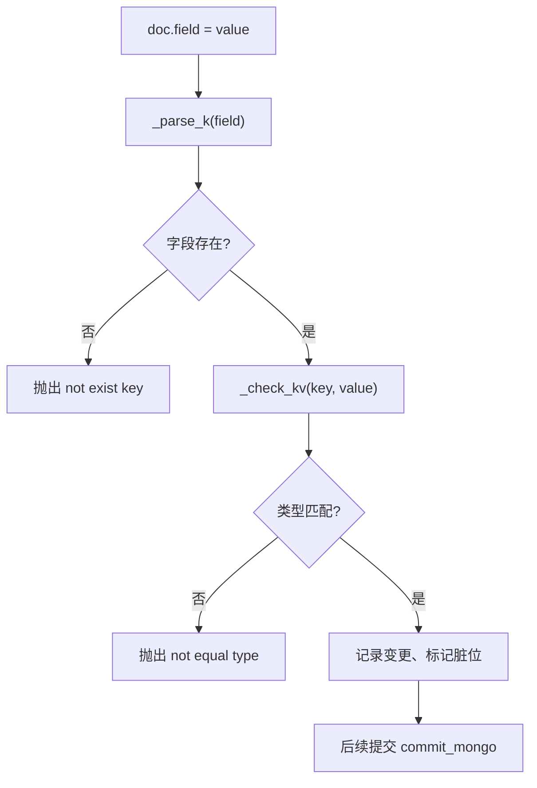

# 验证系统

<cite>
**本文引用的文件**
- [lualib/orm/schema.lua](file://lualib/orm/schema.lua)
- [lualib/orm/schema_define.lua](file://lualib/orm/schema_define.lua)
- [lualib/orm/init.lua](file://lualib/orm/init.lua)
- [schema/role.sproto](file://schema/role.sproto)
- [schema/bag.sproto](file://schema/bag.sproto)
- [schema/mail.sproto](file://schema/mail.sproto)
</cite>

## 目录
1. [简介](#简介)
2. [项目结构](#项目结构)
3. [核心组件](#核心组件)
4. [架构总览](#架构总览)
5. [详细组件分析](#详细组件分析)
6. [依赖关系分析](#依赖关系分析)
7. [性能考量](#性能考量)
8. [故障排查指南](#故障排查指南)
9. [结论](#结论)
10. [附录](#附录)

## 简介
本文件围绕系统的 Schema 验证机制展开，重点解释 _check_k、_check_kv、_parse_k 等核心验证方法的工作原理，覆盖字段存在性检查、类型校验、格式转换与错误处理。同时提供扩展自定义验证规则的最佳实践、性能优化建议与调试技巧，帮助开发者在保障数据一致性的前提下高效使用 ORM 与 Schema。

## 项目结构
该验证系统由三部分构成：
- Schema 定义：基于 sproto 的 .sproto 文件描述数据结构（如 role、bag、mail）。
- Schema 生成代码：根据 sproto 生成 Lua 表与验证函数（_parse_k、_check_k、_check_kv），并绑定到具体 schema 对象。
- ORM 运行时：创建文档对象、拦截赋值、执行验证、追踪脏标记、序列化提交。

图表来源
- [schema/role.sproto:1-24](file://schema/role.sproto#L1-L24)
- [schema/bag.sproto:1-16](file://schema/bag.sproto#L1-L16)
- [schema/mail.sproto:1-37](file://schema/mail.sproto#L1-L37)
- [lualib/orm/schema.lua:187-471](file://lualib/orm/schema.lua#L187-L471)
- [lualib/orm/init.lua:234-319](file://lualib/orm/init.lua#L234-L319)

章节来源
- [schema/role.sproto:1-24](file://schema/role.sproto#L1-L24)
- [schema/bag.sproto:1-16](file://schema/bag.sproto#L1-L16)
- [schema/mail.sproto:1-37](file://schema/mail.sproto#L1-L37)
- [lualib/orm/schema.lua:187-471](file://lualib/orm/schema.lua#L187-L471)
- [lualib/orm/init.lua:234-319](file://lualib/orm/init.lua#L234-L319)

## 核心组件
- Schema 元类型与基础类型：number、integer、string、boolean，用于值类型校验。
- 键解析与校验：_parse_k_tp、_check_k_tp、parse_k_func、check_k_func。
- 值校验：_check_v_tp。
- 复合结构：struct 与 map 的 schema 对象，挂载 _parse_k、_check_k、_check_kv。
- ORM 文档对象：创建、赋值拦截、脏标记、序列化提交。

章节来源
- [lualib/orm/schema.lua:8-142](file://lualib/orm/schema.lua#L8-L142)
- [lualib/orm/schema.lua:144-185](file://lualib/orm/schema.lua#L144-L185)
- [lualib/orm/init.lua:234-319](file://lualib/orm/init.lua#L234-L319)

## 架构总览
下图展示了从赋值到验证再到提交的完整流程，以及 _parse_k、_check_k、_check_kv 在其中的作用点。

图表来源
- [lualib/orm/init.lua:88-97](file://lualib/orm/init.lua#L88-L97)
- [lualib/orm/init.lua:54-71](file://lualib/orm/init.lua#L54-L71)
- [lualib/orm/init.lua:428-447](file://lualib/orm/init.lua#L428-L447)
- [lualib/orm/schema.lua:163-185](file://lualib/orm/schema.lua#L163-L185)

## 详细组件分析

### 键解析与校验：_parse_k、_check_k、_parse_k_tp、_check_k_tp
- 目标：确保 map 结构的键符合预期类型（integer 或 string），并在需要时进行规范化（例如将数字键转为整数）。
- 实现要点：
  - _parse_k_tp：对键进行类型检查与转换；若 need_tp 为 integer，则尝试转换为整数；若为 string，则强制字符串化；否则报错。
  - _check_k_tp：仅做类型检查，不修改键值。
  - parse_k_func/check_k_func：工厂函数，按 need_tp 生成对应的 _parse_k/_check_k 方法。
  - struct 的 _parse_k/_check_k：检查字段是否存在于 schema 中，不存在则报错。
- 典型场景：
  - map<integer, resource>：键必须为可整型化的 number。
  - map<string, string>：键必须为 string。
  - struct 字段访问：字段名必须在 schema 中声明。

图表来源
- [lualib/orm/schema.lua:40-87](file://lualib/orm/schema.lua#L40-L87)
- [lualib/orm/schema.lua:144-176](file://lualib/orm/schema.lua#L144-L176)

章节来源
- [lualib/orm/schema.lua:40-87](file://lualib/orm/schema.lua#L40-L87)
- [lualib/orm/schema.lua:144-176](file://lualib/orm/schema.lua#L144-L176)

### 值校验：_check_v_tp
- 目标：确保字段值类型与 schema 中声明的类型一致。
- 支持类型：
  - integer：必须是 number 且可整型化。
  - number：必须是 number。
  - string：必须是 string。
  - boolean：必须是 boolean。
  - 其他：当 need_tp 本身是一个 schema 对象（如 struct/map）时，要求 v 等于该 schema 对象（表示嵌套结构引用）。
- 行为：类型不符时抛出格式化错误信息，包含期望类型与实际类型。

章节来源
- [lualib/orm/schema.lua:89-142](file://lualib/orm/schema.lua#L89-L142)

### 组合校验：_check_kv
- 目标：对 map 的键和值同时进行校验。
- 行为：
  - 先调用 _check_k_tp 校验键类型。
  - 再调用 _check_v_tp 校验值类型。
  - 对于 struct，_check_kv 会查找字段 schema，并对值进行类型校验。
- 适用场景：map<integer, resource>、map<string, string>、struct 字段赋值。

章节来源
- [lualib/orm/schema.lua:156-185](file://lualib/orm/schema.lua#L156-L185)

### ORM 文档对象与赋值拦截
- 创建：orm.new(schema, init) 创建文档对象，内部使用 _new_doc 初始化阶段存储 __stage，并设置元表以拦截读写。
- 赋值拦截：__newindex 调用 doc_change，先通过 schema:_parse_k 规范化键，再判断是否为 table（嵌套结构）走递归创建，否则直接赋值并标记变更。
- 读取拦截：__index 通过 _check_k 校验字段存在性。
- 脏标记：mark_dirty 自底向上标记父节点，便于增量提交。
- 序列化：with_bson_encode_context 切换 pairs 行为，使 map 的 key 在 BSON 编码时为字符串。

图表来源
- [lualib/orm/init.lua:88-97](file://lualib/orm/init.lua#L88-L97)
- [lualib/orm/init.lua:54-71](file://lualib/orm/init.lua#L54-L71)
- [lualib/orm/init.lua:234-295](file://lualib/orm/init.lua#L234-L295)

章节来源
- [lualib/orm/init.lua:54-97](file://lualib/orm/init.lua#L54-L97)
- [lualib/orm/init.lua:234-319](file://lualib/orm/init.lua#L234-L319)

### 提交与增量更新：commit_mongo
- 功能：遍历文档树，收集变更，生成 $set/$unset 操作，减少不必要写入。
- 特性：
  - 支持数组与结构体的路径拼接。
  - 跳过默认值（is_skip_next）以减少冗余。
  - 清理脏标记，避免重复提交。

章节来源
- [lualib/orm/init.lua:348-447](file://lualib/orm/init.lua#L348-L447)

### Schema 结构与类型映射
- struct：具有明确字段集合，每个字段类型为基本类型或嵌套 schema。
- map：key 类型固定（integer 或 string），value 为指定 schema。
- 生成方式：由 sproto 定义驱动，生成 schema.lua 中的类型常量与 _parse_k/_check_k/_check_kv 绑定。

章节来源
- [lualib/orm/schema.lua:187-471](file://lualib/orm/schema.lua#L187-L471)
- [lualib/orm/schema_define.lua:1-131](file://lualib/orm/schema_define.lua#L1-L131)
- [schema/role.sproto:1-24](file://schema/role.sproto#L1-L24)
- [schema/bag.sproto:1-16](file://schema/bag.sproto#L1-L16)
- [schema/mail.sproto:1-37](file://schema/mail.sproto#L1-L37)

## 依赖关系分析
- schema.lua 依赖 orm.init 提供的 new 接口，并通过 setmetatable 将 _parse_k/_check_k/_check_kv 注入各 schema 对象。
- init.lua 依赖 schema.lua 暴露的 schema 对象，在赋值时调用其验证方法。
- sproto 文件作为 Schema 源，驱动 schema.lua 的生成，保证前后端协议一致性。

图表来源
- [schema/role.sproto:1-24](file://schema/role.sproto#L1-L24)
- [schema/bag.sproto:1-16](file://schema/bag.sproto#L1-L16)
- [schema/mail.sproto:1-37](file://schema/mail.sproto#L1-L37)
- [lualib/orm/schema.lua:187-471](file://lualib/orm/schema.lua#L187-L471)
- [lualib/orm/init.lua:234-319](file://lualib/orm/init.lua#L234-L319)

章节来源
- [lualib/orm/schema.lua:187-471](file://lualib/orm/schema.lua#L187-L471)
- [lualib/orm/init.lua:234-319](file://lualib/orm/init.lua#L234-L319)

## 性能考量
- 最小化无效写入：利用 dirty 标记与 commit_mongo 的增量更新，避免全量写回。
- 跳过默认值：bson_pairs 在序列化时跳过默认值，降低网络与存储开销。
- 键规范化：_parse_k_tp 仅在必要时进行类型转换，减少额外计算。
- 批量操作：尽量合并多次赋值后再提交，减少 commit_mongo 调用次数。
- 嵌套结构：合理设计 schema，避免过深的嵌套导致遍历成本过高。

[本节为通用性能指导，无需特定文件引用]

## 故障排查指南
常见错误及定位方法：
- 字段不存在：访问或赋值未声明字段时，_check_k 会抛出“not exist key”错误。可通过检查 schema 定义与字段名拼写。
- 键类型不符：map 的键类型不符合 need_tp（如期望 integer 却传入非数字），_check_k_tp 会抛出“not equal k type”错误。
- 值类型不符：字段值类型与 schema 不一致，_check_v_tp 会抛出“not equal v type”错误。
- 不支持的 need_tp：当 need_tp 既不是 integer/string，也不是支持的 schema 对象时，会抛出“not support need_tp type”。

调试建议：
- 在赋值前打印键与值，确认类型是否符合预期。
- 使用 orm.is_orm 与 orm.check_type 确认对象是否为 ORM 文档。
- 使用 orm.is_dirty 与 commit_mongo 返回值观察变更情况。
- 在 with_bson_encode_context 包裹序列化逻辑，确保 map key 正确转字符串。

章节来源
- [lualib/orm/schema.lua:40-87](file://lualib/orm/schema.lua#L40-L87)
- [lualib/orm/schema.lua:89-142](file://lualib/orm/schema.lua#L89-L142)
- [lualib/orm/schema.lua:163-185](file://lualib/orm/schema.lua#L163-L185)
- [lualib/orm/init.lua:234-319](file://lualib/orm/init.lua#L234-L319)
- [lualib/orm/init.lua:428-447](file://lualib/orm/init.lua#L428-L447)

## 结论
该验证系统通过 sproto 驱动的 Schema 生成与 ORM 运行时拦截，实现了严格的字段存在性与类型校验，并提供高效的增量提交能力。掌握 _parse_k、_check_k、_check_kv 的工作机制，有助于在设计数据结构与编写业务逻辑时避免数据不一致问题。结合性能优化与调试技巧，可在复杂系统中稳定运行。

[本节为总结性内容，无需特定文件引用]

## 附录

### 自定义验证规则的扩展方法与最佳实践
- 扩展点：
  - 在 schema 对象上添加自定义字段校验逻辑，可在 _check_kv 中插入额外检查（如范围、正则、业务约束）。
  - 对 map 的键进行更严格限制，可在 _check_k_tp/_parse_k_tp 基础上封装专用函数。
- 最佳实践：
  - 保持错误信息清晰，包含期望类型与实际值，便于快速定位问题。
  - 将通用校验逻辑抽取为工具函数，复用性强。
  - 在 ORM 赋值后统一触发业务校验，避免分散在各处。
  - 使用 with_bson_encode_context 确保序列化时的键类型一致。

章节来源
- [lualib/orm/schema.lua:144-185](file://lualib/orm/schema.lua#L144-L185)
- [lualib/orm/init.lua:224-232](file://lualib/orm/init.lua#L224-L232)

### 关键流程图：赋值与验证

图表来源
- [lualib/orm/init.lua:88-97](file://lualib/orm/init.lua#L88-L97)
- [lualib/orm/schema.lua:163-185](file://lualib/orm/schema.lua#L163-L185)