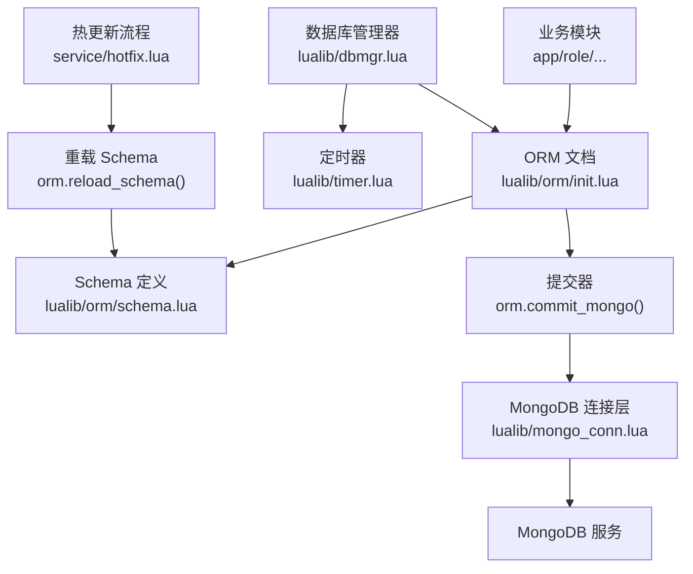
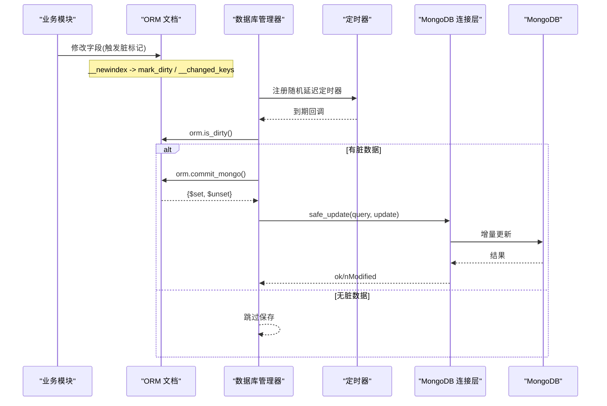
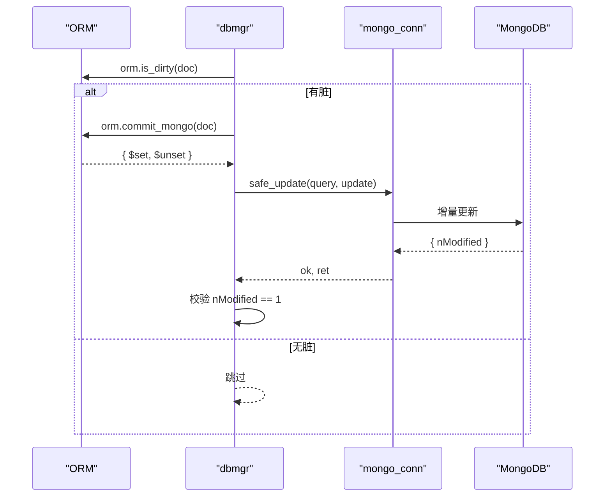
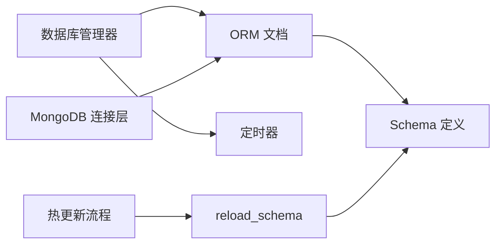

# 性能优化与最佳实践

<cite>
**本文引用的文件**
- [lualib/orm/init.lua](file://lualib/orm/init.lua)
- [lualib/orm/schema.lua](file://lualib/orm/schema.lua)
- [lualib/orm/schema_define.lua](file://lualib/orm/schema_define.lua)
- [lualib/dbmgr.lua](file://lualib/dbmgr.lua)
- [lualib/mongo_conn.lua](file://lualib/mongo_conn.lua)
- [lualib/timer.lua](file://lualib/timer.lua)
- [service/hotfix.lua](file://service/hotfix.lua)
</cite>

## 目录
1. [简介](#简介)
2. [项目结构](#项目结构)
3. [核心组件](#核心组件)
4. [架构总览](#架构总览)
5. [详细组件分析](#详细组件分析)
6. [依赖关系分析](#依赖关系分析)
7. [性能考量](#性能考量)
8. [故障排查指南](#故障排查指南)
9. [结论](#结论)
10. [附录](#附录)

## 简介
本文件围绕 ORM 框架的性能优化展开，重点覆盖脏数据追踪对性能的影响、内存使用优化、序列化优化技术；给出批量操作的最佳实践、避免循环引用、合理使用嵌套对象的方法；说明 orm.reload_schema() 的热更新机制与版本兼容性处理；并提供性能测试方法、监控指标与常见问题排查指南。内容基于仓库中 ORM、数据库管理、MongoDB 连接层、定时器与热更流程的实际实现进行总结与提炼。

## 项目结构
本项目在 lualib/orm 下实现了 ORM 的核心能力（文档模型、脏标记、提交到 MongoDB），在 lualib/dbmgr.lua 中负责加载/卸载数据、定时落盘与版本控制，在 lualib/mongo_conn.lua 中封装了 BSON 编码与连接路由，配合 lualib/timer.lua 的随机延迟定时器实现平滑落盘，service/hotfix.lua 提供热更新入口并触发 ORM schema 重载。

图表来源
- [lualib/orm/init.lua:234-295](file://lualib/orm/init.lua#L234-L295)
- [lualib/orm/schema.lua:187-471](file://lualib/orm/schema.lua#L187-L471)
- [lualib/dbmgr.lua:94-148](file://lualib/dbmgr.lua#L94-L148)
- [lualib/mongo_conn.lua:14-19](file://lualib/mongo_conn.lua#L14-L19)
- [lualib/timer.lua:247-253](file://lualib/timer.lua#L247-L253)
- [service/hotfix.lua:146-156](file://service/hotfix.lua#L146-L156)

章节来源
- [lualib/orm/init.lua:1-491](file://lualib/orm/init.lua#L1-L491)
- [lualib/orm/schema.lua:1-471](file://lualib/orm/schema.lua#L1-L471)
- [lualib/dbmgr.lua:1-219](file://lualib/dbmgr.lua#L1-L219)
- [lualib/mongo_conn.lua:1-152](file://lualib/mongo_conn.lua#L1-L152)
- [lualib/timer.lua:1-267](file://lualib/timer.lua#L1-L267)
- [service/hotfix.lua:146-156](file://service/hotfix.lua#L146-L156)

## 核心组件
- ORM 文档与脏追踪：通过元表拦截赋值，维护 __dirty、__all_dirty、__changed_keys，支持父链传播与子节点全量脏标记，减少不必要的写入。
- 序列化优化：在 BSON 序列化期间切换迭代器，跳过默认值与非原子类型，将 map key 转为字符串，降低网络负载与编码开销。
- 提交器：递归收集变更，生成 $set/$unset 增量，避免整表重写。
- 数据库管理器：加载时创建 ORM 文档，注册随机延迟定时器周期性保存；卸载时取消定时器并强制落盘；使用 _version 乐观锁防止并发覆盖。
- 连接层：统一 bson.encode 调用，并在 ORM 上下文中执行，确保 ORM 文档正确序列化。
- 定时器：最小堆实现的周期任务，支持随机首次延迟，避免雪崩。
- 热更新：hotfix 流程可触发 reload_orm_schema，运行时替换 schema 定义，保持运行期对象兼容。

章节来源
- [lualib/orm/init.lua:40-97](file://lualib/orm/init.lua#L40-L97)
- [lualib/orm/init.lua:178-232](file://lualib/orm/init.lua#L178-L232)
- [lualib/orm/init.lua:348-447](file://lualib/orm/init.lua#L348-L447)
- [lualib/dbmgr.lua:67-92](file://lualib/dbmgr.lua#L67-L92)
- [lualib/dbmgr.lua:94-148](file://lualib/dbmgr.lua#L94-L148)
- [lualib/mongo_conn.lua:14-19](file://lualib/mongo_conn.lua#L14-L19)
- [lualib/timer.lua:247-253](file://lualib/timer.lua#L247-L253)
- [service/hotfix.lua:146-156](file://service/hotfix.lua#L146-L156)

## 架构总览
下图展示了从业务修改到持久化的完整链路，以及热更新对 schema 的重载路径。

图表来源
- [lualib/orm/init.lua:40-97](file://lualib/orm/init.lua#L40-L97)
- [lualib/orm/init.lua:348-447](file://lualib/orm/init.lua#L348-L447)
- [lualib/dbmgr.lua:67-92](file://lualib/dbmgr.lua#L67-L92)
- [lualib/mongo_conn.lua:67-77](file://lualib/mongo_conn.lua#L67-L77)

## 详细组件分析

### 脏数据追踪与性能影响
- 设计要点
  - 每次赋值都会检查类型与 schema，记录变更键 __changed_keys，并设置当前节点及祖先节点的 __dirty，避免重复标记。
  - 嵌套对象赋值会克隆或复用已有 ORM 文档，设置 __parent 以建立父子关系，便于脏标记传播。
  - 数组插入/删除会调整元素 parent 引用，保证脏标记一致性。
- 性能影响
  - 优点：仅对实际变更的字段生成 $set/$unset，显著减少网络与存储压力。
  - 风险：频繁小粒度赋值会产生大量 __changed_keys 条目与父链遍历；应合并多次赋值或使用批量接口。
- 建议
  - 尽量一次性构造完整对象再赋值，减少中间状态。
  - 对高频小写场景，考虑在应用层聚合后再写入 ORM。

章节来源
- [lualib/orm/init.lua:40-97](file://lualib/orm/init.lua#L40-L97)
- [lualib/orm/init.lua:127-156](file://lualib/orm/init.lua#L127-L156)

### 内存使用优化
- 关键点
  - 初始化时拷贝 init 表并清空原表，避免外部引用导致意外共享。
  - 使用 __stage 作为内部存储，对外暴露受控访问，减少额外包装对象。
  - 序列化期间切换 pairs 迭代器，跳过默认值与非原子类型，降低临时对象创建。
  - 清理阶段 unset_all_dirty 递归清除脏标记，释放 __changed_keys 等临时结构。
- 建议
  - 避免持有大对象的全局引用，及时释放不再使用的 ORM 文档。
  - 谨慎使用 clone，仅在必要时复制，避免深层复制带来的内存峰值。

章节来源
- [lualib/orm/init.lua:234-295](file://lualib/orm/init.lua#L234-L295)
- [lualib/orm/init.lua:178-232](file://lualib/orm/init.lua#L178-L232)
- [lualib/orm/init.lua:297-346](file://lualib/orm/init.lua#L297-L346)

### 序列化优化技术
- 关键机制
  - with_bson_encode_context 在 BSON 编码期间切换迭代器为 bson_pairs，自动跳过默认值并将 map key 转为字符串。
  - is_skip_next 判断是否为原子类型或可被 BSON 直接处理的类型，非原子类型会被跳过以避免冗余。
- 收益
  - 减少无效字段写入，降低 BSON 体积与网络传输成本。
  - 避免 map key 类型不一致导致的编码失败。
- 建议
  - 所有涉及 ORM 文档的序列化都应通过 with_bson_encode_context 包裹，确保一致行为。

章节来源
- [lualib/orm/init.lua:178-232](file://lualib/orm/init.lua#L178-L232)
- [lualib/mongo_conn.lua:14-19](file://lualib/mongo_conn.lua#L14-L19)

### 批量操作最佳实践
- 现状
  - 提交器按脏键集合生成增量更新，天然支持多字段一次提交。
  - 数据库管理器使用乐观锁 _version，避免并发覆盖。
- 建议
  - 在业务层将多个相关字段的修改合并为一次 ORM 赋值序列，随后由定时器统一提交。
  - 对于跨文档的大批量更新，建议在应用层分批提交，避免单次更新过大。
  - 利用 dbmgr 的随机延迟定时器，避免集中落盘造成的抖动。

章节来源
- [lualib/orm/init.lua:348-447](file://lualib/orm/init.lua#L348-L447)
- [lualib/dbmgr.lua:67-92](file://lualib/dbmgr.lua#L67-L92)
- [lualib/timer.lua:247-253](file://lualib/timer.lua#L247-L253)

### 避免循环引用与嵌套对象使用
- 循环引用防护
  - totable 在复制时检测循环引用并报错，防止无限递归。
  - _clear_dirty 在清理时也检测环，抛出错误提示。
- 嵌套对象
  - 嵌套对象赋值会建立 __parent 关系，支持脏标记向上冒泡。
  - 嵌套对象在初始化时会递归构建 ORM 文档，注意深度过深可能带来栈与内存压力。
- 建议
  - 尽量避免深层嵌套，扁平化数据结构可降低复杂度。
  - 对复杂嵌套结构，分模块拆分，减少单对象规模。

章节来源
- [lualib/orm/init.lua:100-124](file://lualib/orm/init.lua#L100-L124)
- [lualib/orm/init.lua:297-346](file://lualib/orm/init.lua#L297-L346)

### orm.reload_schema() 热更新机制与版本兼容
- 机制
  - hotfix 流程可调用 reload_orm_schema，重新 require orm.schema 并通过 orm.reload_schema(old, new) 将新 schema 字段复制到旧 schema 对象上，保持运行期对象不变。
  - 该方式避免了重建已加载的 ORM 文档，提升热更效率。
- 兼容性
  - 新增字段：新 schema 中的字段会被复制到旧 schema，后续新建文档可使用新字段。
  - 删除字段：旧 schema 中不存在于新 schema 的字段会被移除，但已存在的 ORM 文档仍保留该字段值，读取时需做好兼容。
  - 类型变更：需谨慎，可能导致校验失败；建议在灰度环境验证。
- 建议
  - 热更前备份配置与 schema 版本，回滚策略明确。
  - 对关键字段变更采用渐进式迁移，先加后删。

章节来源
- [lualib/orm/init.lua:461-481](file://lualib/orm/init.lua#L461-L481)
- [service/hotfix.lua:146-156](file://service/hotfix.lua#L146-L156)

### 提交流程时序图

图表来源
- [lualib/dbmgr.lua:67-92](file://lualib/dbmgr.lua#L67-L92)
- [lualib/orm/init.lua:348-447](file://lualib/orm/init.lua#L348-L447)
- [lualib/mongo_conn.lua:67-77](file://lualib/mongo_conn.lua#L67-L77)

## 依赖关系分析
- ORM 依赖 schema 定义进行类型校验与字段解析。
- dbmgr 依赖 ORM 进行脏追踪与提交，依赖定时器进行周期落盘。
- mongo_conn 依赖 ORM 的 BSON 上下文，确保 ORM 文档正确序列化。
- hotfix 依赖 GM 命令触发 schema 重载，实现热更新。

图表来源
- [lualib/orm/init.lua:234-295](file://lualib/orm/init.lua#L234-L295)
- [lualib/dbmgr.lua:94-148](file://lualib/dbmgr.lua#L94-L148)
- [lualib/mongo_conn.lua:14-19](file://lualib/mongo_conn.lua#L14-L19)
- [service/hotfix.lua:146-156](file://service/hotfix.lua#L146-L156)

章节来源
- [lualib/orm/init.lua:1-491](file://lualib/orm/init.lua#L1-L491)
- [lualib/dbmgr.lua:1-219](file://lualib/dbmgr.lua#L1-L219)
- [lualib/mongo_conn.lua:1-152](file://lualib/mongo_conn.lua#L1-L152)
- [service/hotfix.lua:146-156](file://service/hotfix.lua#L146-L156)

## 性能考量
- 脏追踪
  - 优势：精准增量更新，减少网络与存储开销。
  - 注意：频繁小写会导致 __changed_keys 膨胀；建议合并写入。
- 序列化
  - 通过 with_bson_encode_context 跳过默认值与非原子类型，降低 BSON 体积。
  - 确保所有 ORM 文档序列化都使用该上下文，避免不一致。
- 落盘策略
  - 使用随机延迟定时器分散落盘高峰，避免数据库抖动。
  - 结合 _version 乐观锁，避免并发覆盖导致的重试与回滚。
- 内存
  - 避免深层嵌套与全局长生命周期引用。
  - 谨慎使用 clone，仅在必要时复制。
- 批量化
  - 将多个字段修改合并为一次 ORM 赋值序列，再由定时器统一提交。
  - 跨文档大批量更新建议分批提交，控制单次更新大小。

[本节为通用指导，不直接分析具体文件]

## 故障排查指南
- 常见问题
  - 循环引用错误：to table 或清理脏标记时发现环，需检查对象关系设计。
  - 未生效的更新：nModified 不为 1，可能是并发覆盖或查询条件不匹配，需检查 _version 与 query。
  - 序列化异常：map key 非字符串或非原子类型被跳过，需确认数据结构。
- 定位步骤
  - 查看日志：save failed/not modified、load failed 等日志定位问题。
  - 检查脏标记：is_dirty 与 commit_mongo 返回的 $set/$unset 是否合理。
  - 监控定时器：确认定时器是否被取消或重复注册。
- 工具与指标
  - 使用 GM 命令查看内存、进程统计、网络统计，辅助定位瓶颈。
  - 关注定时器过载告警，评估系统负载。

章节来源
- [lualib/orm/init.lua:100-124](file://lualib/orm/init.lua#L100-L124)
- [lualib/dbmgr.lua:53-92](file://lualib/dbmgr.lua#L53-L92)
- [lualib/timer.lua:170-208](file://lualib/timer.lua#L170-L208)

## 结论
该 ORM 框架通过精细的脏追踪、智能序列化与增量提交，有效降低了存储与网络开销；结合随机延迟定时器与乐观锁，提升了稳定性与吞吐。在实际项目中，应遵循批量写入、避免循环引用、合理嵌套的设计原则，并利用热更新机制安全演进 schema。通过合理的监控与排查手段，可快速定位并解决性能与稳定性问题。

[本节为总结性内容，不直接分析具体文件]

## 附录
- 性能测试方法
  - 构造典型读写场景，统计每秒提交次数、平均延迟、BSON 体积变化。
  - 对比不同嵌套深度与字段数量下的性能差异。
  - 模拟高并发写入，观察 nModified 失败率与重试情况。
- 监控指标
  - 定时器执行耗时与过载次数。
  - 数据库连接数与请求延迟。
  - 内存占用与 GC 频率。
- 调优经验
  - 合并写入、减少小粒度赋值。
  - 扁平化数据结构，降低嵌套深度。
  - 合理设置 db_save_interval，平衡实时性与负载。
  - 热更新前充分验证 schema 兼容性。

[本节为通用指导，不直接分析具体文件]