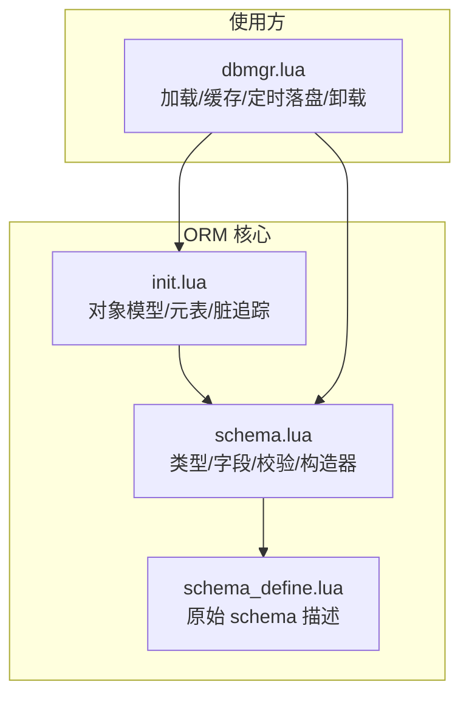
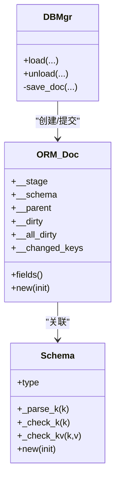
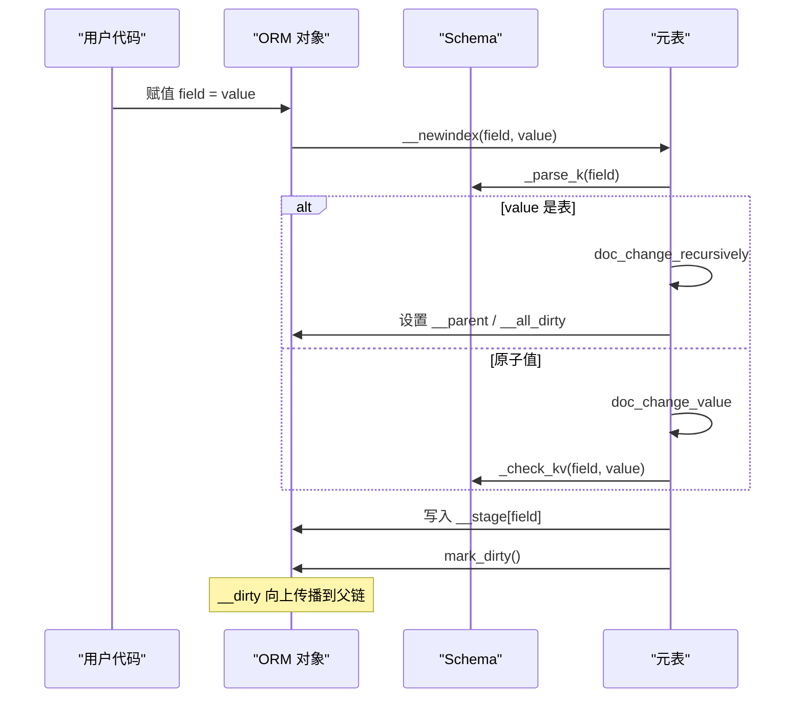
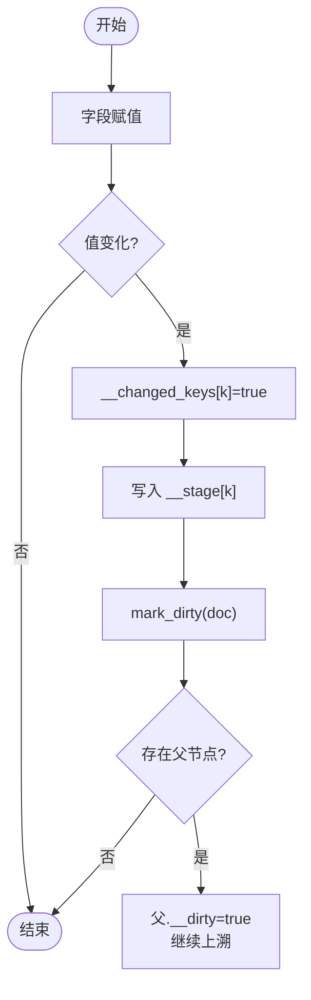
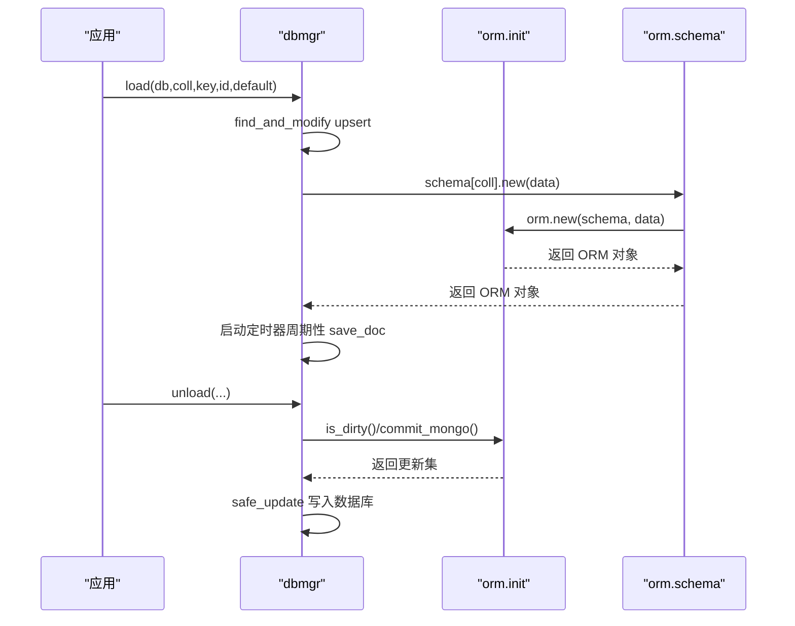
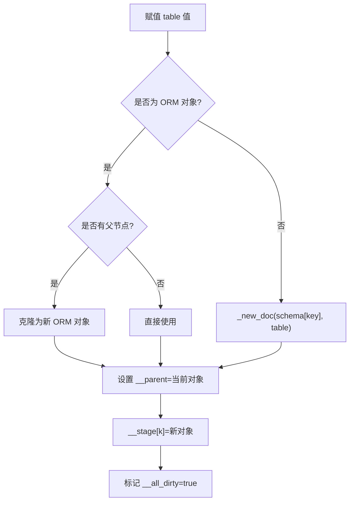
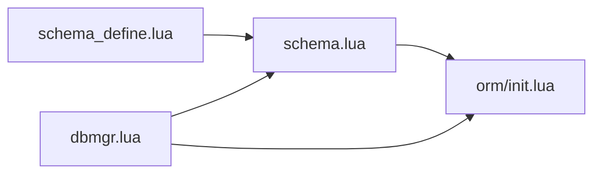

# 核心概念与原理

<cite>
**本文引用的文件**
- [lualib/orm/init.lua](file://lualib/orm/init.lua)
- [lualib/orm/schema.lua](file://lualib/orm/schema.lua)
- [lualib/orm/schema_define.lua](file://lualib/orm/schema_define.lua)
- [lualib/dbmgr.lua](file://lualib/dbmgr.lua)
</cite>

## 目录
1. [简介](#简介)
2. [项目结构](#项目结构)
3. [核心组件](#核心组件)
4. [架构总览](#架构总览)
5. [详细组件分析](#详细组件分析)
6. [依赖关系分析](#依赖关系分析)
7. [性能考量](#性能考量)
8. [故障排查指南](#故障排查指南)
9. [结论](#结论)
10. [附录](#附录)

## 简介
本章节面向 ORM 框架的核心概念与实现原理，重点解释：
- 对象模型与元表机制
- 脏数据追踪原理（__dirty、__all_dirty、__changed_keys）
- 状态管理机制与生命周期
- 文档对象的创建过程、嵌套对象处理机制
- ORM 对象与普通 Lua 表的区别及为何需要特殊元表设计
- 结合代码路径的完整示例说明

该 ORM 基于 Lua 元表机制，提供强类型 schema 校验、增量持久化（MongoDB 风格的 $set/$unset）、以及高效的脏标记传播。

## 项目结构
ORM 相关代码主要位于 lualib/orm 目录下，配合 schema 定义生成器产出具体数据结构；dbmgr 展示了 ORM 在业务中的加载、缓存、定时落盘与卸载流程。

图表来源
- [lualib/orm/init.lua:234-319](file://lualib/orm/init.lua#L234-L319)
- [lualib/orm/schema.lua:187-471](file://lualib/orm/schema.lua#L187-L471)
- [lualib/orm/schema_define.lua:1-131](file://lualib/orm/schema_define.lua#L1-L131)
- [lualib/dbmgr.lua:94-148](file://lualib/dbmgr.lua#L94-L148)

章节来源
- [lualib/orm/init.lua:234-319](file://lualib/orm/init.lua#L234-L319)
- [lualib/orm/schema.lua:187-471](file://lualib/orm/schema.lua#L187-L471)
- [lualib/orm/schema_define.lua:1-131](file://lualib/orm/schema_define.lua#L1-L131)
- [lualib/dbmgr.lua:94-148](file://lualib/dbmgr.lua#L94-L148)

## 核心组件
- ORM 对象模型与元表：通过 __index/__newindex 拦截读写，将变更写入内部 stage，并维护脏标记。
- Schema 系统：由 schema_define 生成 schema.lua，提供字段类型校验、键解析、构造器 new。
- 脏追踪与提交：__dirty、__all_dirty、__changed_keys 协同工作，commit_mongo 生成最小更新集。
- 生命周期管理：orm.new 创建、orm.commit_mongo 提交、orm.clone/totable 复制、orm.reload_schema 热更新。

章节来源
- [lualib/orm/init.lua:40-97](file://lualib/orm/init.lua#L40-L97)
- [lualib/orm/init.lua:234-319](file://lualib/orm/init.lua#L234-L319)
- [lualib/orm/init.lua:329-447](file://lualib/orm/init.lua#L329-L447)
- [lualib/orm/schema.lua:187-471](file://lualib/orm/schema.lua#L187-L471)

## 架构总览
ORM 以“文档对象”为中心，每个文档对象持有：
- __stage：当前值存储（受 schema 约束）
- __schema：所属 schema 定义
- __parent：父节点引用（用于脏标记向上冒泡）
- __dirty：是否有任何子节点或字段变更
- __all_dirty：整棵子树是否需要整体覆盖写
- __changed_keys：本轮已变更的键集合

图表来源
- [lualib/orm/init.lua:234-319](file://lualib/orm/init.lua#L234-L319)
- [lualib/orm/schema.lua:187-471](file://lualib/orm/schema.lua#L187-L471)
- [lualib/dbmgr.lua:94-148](file://lualib/dbmgr.lua#L94-L148)

## 详细组件分析

### 对象模型与元表机制
- 每个 ORM 对象是一个带元表的表，__index 指向 __stage，__newindex 拦截赋值，触发变更检测与脏标记。
- 序列化时通过 with_bson_encode_context 切换 pairs 行为，使 map 的 key 转为字符串，便于 BSON 编码。
- 数组型文档支持 __len、__insert、__remove，保持与 table API 一致。

关键流程（赋值与嵌套）：
- doc_change → doc_change_recursively/doc_change_value → mark_dirty
- 嵌套对象会被包装为 ORM 对象，设置 __parent，并标记 __all_dirty=true

图表来源
- [lualib/orm/init.lua:54-97](file://lualib/orm/init.lua#L54-L97)
- [lualib/orm/init.lua:234-295](file://lualib/orm/init.lua#L234-L295)

章节来源
- [lualib/orm/init.lua:54-97](file://lualib/orm/init.lua#L54-L97)
- [lualib/orm/init.lua:234-295](file://lualib/orm/init.lua#L234-L295)

### 脏数据追踪原理（__dirty、__all_dirty、__changed_keys）
- __dirty：任一字段或子对象变更即置 true，并在保存后清除。
- __all_dirty：当整个子树被替换或初始化时置 true，表示可整体覆盖写。
- __changed_keys：记录本轮变更的键集合，提交时据此生成 $set/$unset。

更新时机：
- 赋值时：doc_change_value 将键加入 __changed_keys，并调用 mark_dirty 向父链传播。
- 嵌套对象赋值：doc_change_recursively 设置 __parent 并标记 __all_dirty。
- 提交时：_commit_mongo 遍历 __changed_keys 和子对象，生成最小更新集，并清理脏标记。

图表来源
- [lualib/orm/init.lua:40-70](file://lualib/orm/init.lua#L40-L70)
- [lualib/orm/init.lua:73-97](file://lualib/orm/init.lua#L73-L97)

章节来源
- [lualib/orm/init.lua:40-97](file://lualib/orm/init.lua#L40-L97)

### 状态管理与生命周期
- 创建：orm.new(schema, init) → _new_doc 构建对象与元表，递归初始化嵌套对象，最后 _clear_dirty 清理初始状态的脏标记。
- 克隆：orm.clone(doc) 通过 totable 深拷贝再重建 ORM 对象，避免共享引用。
- 提交：orm.commit_mongo(doc) 生成 { $set, $unset } 的最小更新集，返回是否 dirty。
- 热更新：orm.reload_schema(old, new) 在不破坏现有对象的前提下替换 schema 定义。

图表来源
- [lualib/dbmgr.lua:94-148](file://lualib/dbmgr.lua#L94-L148)
- [lualib/dbmgr.lua:67-92](file://lualib/dbmgr.lua#L67-L92)
- [lualib/orm/init.lua:315-319](file://lualib/orm/init.lua#L315-L319)
- [lualib/orm/init.lua:428-447](file://lualib/orm/init.lua#L428-L447)

章节来源
- [lualib/orm/init.lua:315-319](file://lualib/orm/init.lua#L315-L319)
- [lualib/orm/init.lua:428-447](file://lualib/orm/init.lua#L428-L447)
- [lualib/dbmgr.lua:67-92](file://lualib/dbmgr.lua#L67-L92)
- [lualib/dbmgr.lua:94-148](file://lualib/dbmgr.lua#L94-L148)

### 嵌套对象处理机制
- 当赋值为表时，会依据 schema 将其转换为 ORM 对象，并建立父子关系（__parent）。
- 若原值是 ORM 对象且已有父节点，则先克隆以避免共享引用。
- 嵌套对象被标记 __all_dirty=true，以便在提交时进行整体覆盖写优化。

图表来源
- [lualib/orm/init.lua:73-97](file://lualib/orm/init.lua#L73-L97)
- [lualib/orm/init.lua:282-295](file://lualib/orm/init.lua#L282-L295)

章节来源
- [lualib/orm/init.lua:73-97](file://lualib/orm/init.lua#L73-L97)
- [lualib/orm/init.lua:282-295](file://lualib/orm/init.lua#L282-L295)

### ORM 对象与普通 Lua 表的区别
- 普通表无类型校验、无脏追踪、无法直接生成最小更新集。
- ORM 对象通过元表拦截读写，强制遵循 schema，自动追踪变更，并提供 commit_mongo 等高级能力。
- 通过 __metatable 隐藏真实元表，防止意外复制引用。

章节来源
- [lualib/orm/init.lua:260-280](file://lualib/orm/init.lua#L260-L280)
- [lualib/orm/init.lua:234-295](file://lualib/orm/init.lua#L234-L295)

### 代码级示例（路径指引）
- 创建 ORM 对象：参考 [orm.new:315-319](file://lualib/orm/init.lua#L315-L319)
- 字段赋值与嵌套：参考 [doc_change/doc_change_recursively:88-97](file://lualib/orm/init.lua#L88-L97)
- 脏标记传播：参考 [mark_dirty:40-52](file://lualib/orm/init.lua#L40-L52)
- 提交更新集：参考 [orm.commit_mongo:428-447](file://lualib/orm/init.lua#L428-L447)
- 序列化上下文切换：参考 [with_bson_encode_context:224-232](file://lualib/orm/init.lua#L224-L232)
- 使用方加载/落盘：参考 [dbmgr.load/save_doc:94-148](file://lualib/dbmgr.lua#L94-L148)

## 依赖关系分析
- orm.init 依赖 schema.lua 提供的类型与校验函数。
- schema.lua 由 schema_define.lua 生成，集中描述数据结构。
- dbmgr 作为使用方，负责 ORM 对象的加载、缓存、定时落盘与卸载。

图表来源
- [lualib/orm/schema_define.lua:1-131](file://lualib/orm/schema_define.lua#L1-L131)
- [lualib/orm/schema.lua:187-471](file://lualib/orm/schema.lua#L187-L471)
- [lualib/orm/init.lua:234-319](file://lualib/orm/init.lua#L234-L319)
- [lualib/dbmgr.lua:94-148](file://lualib/dbmgr.lua#L94-L148)

章节来源
- [lualib/orm/schema_define.lua:1-131](file://lualib/orm/schema_define.lua#L1-L131)
- [lualib/orm/schema.lua:187-471](file://lualib/orm/schema.lua#L187-L471)
- [lualib/orm/init.lua:234-319](file://lualib/orm/init.lua#L234-L319)
- [lualib/dbmgr.lua:94-148](file://lualib/dbmgr.lua#L94-L148)

## 性能考量
- 增量提交：仅对 __changed_keys 中键生成 $set/$unset，减少网络与存储开销。
- 子树覆盖优化：__all_dirty=true 时可直接整体覆盖写，避免逐字段比较。
- 脏标记上溯：mark_dirty 沿父链传播，确保根对象能及时感知变更。
- 序列化优化：with_bson_encode_context 下 map key 统一转字符串，提升 BSON 编码效率。
- 内存占用：__stage 与 __changed_keys 仅在变更时增长，提交后清理。

[本节为通用性能讨论，不直接分析具体文件]

## 故障排查指南
- 循环引用错误：在 _clear_dirty 中检测到环会报错，需检查数据模型是否误建环。
- 非 root 节点复用：赋值 ORM 对象时若已有父节点会断言失败，应先克隆或使用新实例。
- 类型不匹配：schema 校验严格，字段类型不符会抛出错误，需按 schema 定义修正。
- 未生效的更新：确认 orm.is_dirty 为真且 commit_mongo 返回有效更新集，再执行安全更新。

章节来源
- [lualib/orm/init.lua:297-313](file://lualib/orm/init.lua#L297-L313)
- [lualib/orm/init.lua:73-97](file://lualib/orm/init.lua#L73-L97)
- [lualib/orm/schema.lua:89-142](file://lualib/orm/schema.lua#L89-L142)
- [lualib/dbmgr.lua:67-92](file://lualib/dbmgr.lua#L67-L92)

## 结论
该 ORM 通过元表与 schema 实现了强类型、可追踪、可提交的文档对象模型。借助 __dirty、__all_dirty、__changed_keys 三态协作，既保证了变更的精确性，又提供了子树覆盖写的性能优化。配合 dbmgr 的加载与定时落盘机制，形成完整的“内存对象—增量持久化”闭环。

[本节为总结性内容，不直接分析具体文件]

## 附录
- 常用接口速查（路径）
  - 创建对象：[orm.new:315-319](file://lualib/orm/init.lua#L315-L319)
  - 判断 ORM：[orm.check_type/orm.is_orm:321-327](file://lualib/orm/init.lua#L321-L327)
  - 克隆对象：[orm.clone:453-455](file://lualib/orm/init.lua#L453-L455)
  - 提交更新：[orm.commit_mongo:428-447](file://lualib/orm/init.lua#L428-L447)
  - 序列化上下文：[orm.with_bson_encode_context:224-232](file://lualib/orm/init.lua#L224-L232)
  - Schema 构造器：见各 schema.*.new（例如 role.new）[schema.role.new:345-347](file://lualib/orm/schema.lua#L345-L347)
  - 使用方加载/落盘：[dbmgr.load/save_doc:94-148](file://lualib/dbmgr.lua#L94-L148)