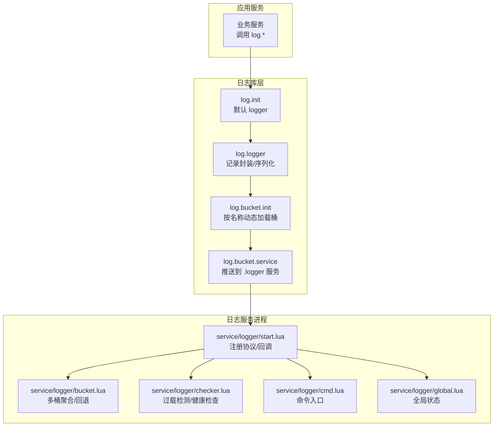
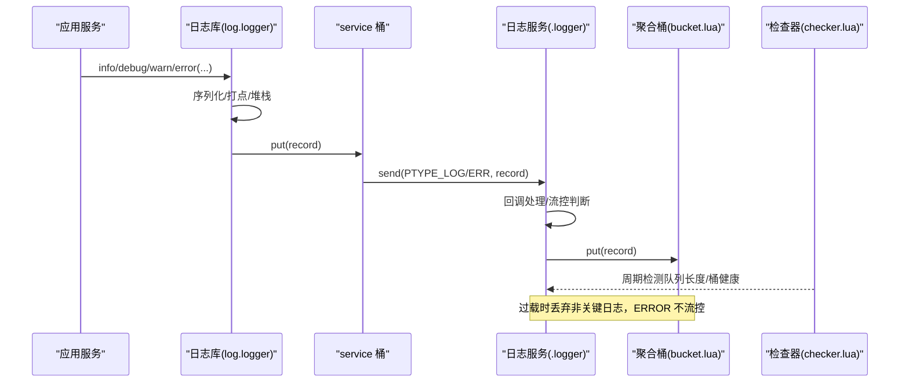
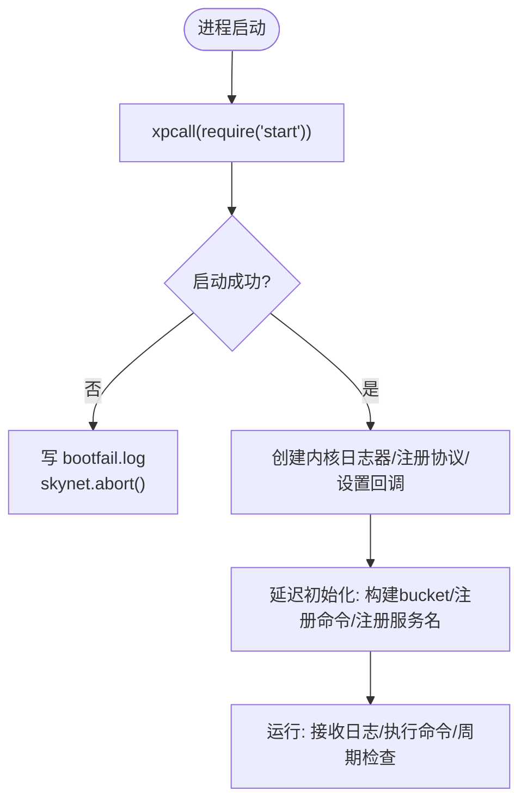
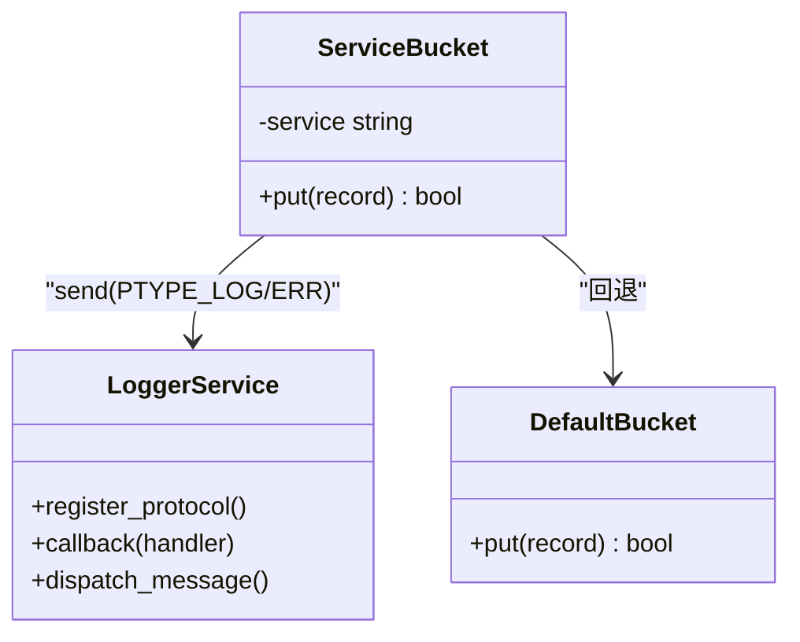
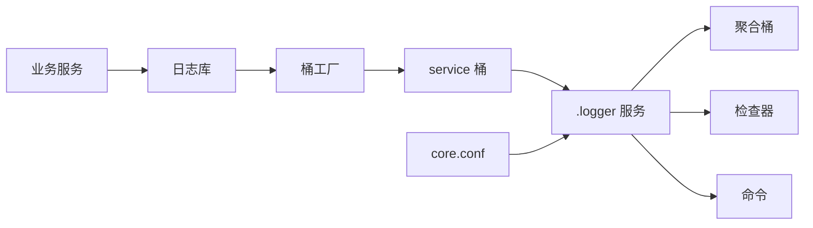

# 日志服务

<cite>
**本文引用的文件**
- [service/logger/main.lua](file://service/logger/main.lua)
- [service/logger/start.lua](file://service/logger/start.lua)
- [service/logger/cmd.lua](file://service/logger/cmd.lua)
- [service/logger/global.lua](file://service/logger/global.lua)
- [service/logger/bucket.lua](file://service/logger/bucket.lua)
- [service/logger/checker.lua](file://service/logger/checker.lua)
- [lualib/log/init.lua](file://lualib/log/init.lua)
- [lualib/log/logger.lua](file://lualib/log/logger.lua)
- [lualib/log/bucket/init.lua](file://lualib/log/bucket/init.lua)
- [lualib/log/bucket/service.lua](file://lualib/log/bucket/service.lua)
- [etc/core.conf.lua](file://etc/core.conf.lua)
- [etc/role1.conf.lua](file://etc/role1.conf.lua)
- [etc/account1.conf.lua](file://etc/account1.conf.lua)
</cite>

## 目录
1. [简介](#简介)
2. [项目结构](#项目结构)
3. [核心组件](#核心组件)
4. [架构总览](#架构总览)
5. [详细组件分析](#详细组件分析)
6. [依赖关系分析](#依赖关系分析)
7. [性能与容量规划](#性能与容量规划)
8. [部署与配置](#部署与配置)
9. [监控与告警](#监控与告警)
10. [故障诊断](#故障诊断)
11. [最佳实践](#最佳实践)
12. [结论](#结论)

## 简介
本技术文档围绕 SkyExt 框架中的“日志服务”展开，系统性说明其架构设计、进程间通信机制、命令接口、启动流程、配置管理、过载保护、错误恢复与运维要点。读者可据此理解如何在业务服务中通过统一日志库将结构化日志投递到独立的日志服务，并实现高吞吐、低侵入的日志采集与治理。

## 项目结构
日志相关代码主要分布在以下位置：
- 日志服务进程：service/logger/*（启动、命令、桶聚合、检查器）
- 通用日志库：lualib/log/*（日志门面、记录封装、桶路由）
- 配置文件：etc/*.conf.lua（服务路径、模块加载、日志服务名等）

图表来源
- [lualib/log/init.lua:1-58](file://lualib/log/init.lua#L1-L58)
- [lualib/log/logger.lua:1-120](file://lualib/log/logger.lua#L1-L120)
- [lualib/log/bucket/init.lua:1-31](file://lualib/log/bucket/init.lua#L1-L31)
- [lualib/log/bucket/service.lua:1-57](file://lualib/log/bucket/service.lua#L1-L57)
- [service/logger/start.lua:1-84](file://service/logger/start.lua#L1-L84)
- [service/logger/bucket.lua:1-74](file://service/logger/bucket.lua#L1-L74)
- [service/logger/checker.lua:1-46](file://service/logger/checker.lua#L1-L46)
- [service/logger/cmd.lua:1-21](file://service/logger/cmd.lua#L1-L21)
- [service/logger/global.lua:1-7](file://service/logger/global.lua#L1-L7)

章节来源
- [etc/core.conf.lua:1-30](file://etc/core.conf.lua#L1-L30)
- [etc/role1.conf.lua:1-4](file://etc/role1.conf.lua#L1-L4)
- [etc/account1.conf.lua:1-4](file://etc/account1.conf.lua#L1-L4)

## 核心组件
- 日志门面与记录封装：提供统一的 debug/info/warn/error 接口，负责时间戳、堆栈、结构化事件打包，并通过桶抽象投递。
- 桶路由：根据桶名称动态加载具体实现；在日志服务内使用 service 桶直接写入本地聚合桶，避免跨进程开销。
- 日志服务进程：注册系统文本协议与自定义日志协议，接收消息后进入聚合桶；提供重载、关闭、put 等命令；内置过载检测与健康检查。
- 配置与初始化：从配置中心读取日志级别、是否打印源码行、是否序列化 table 等；支持热重载。

章节来源
- [lualib/log/init.lua:1-58](file://lualib/log/init.lua#L1-L58)
- [lualib/log/logger.lua:1-291](file://lualib/log/logger.lua#L1-L291)
- [lualib/log/bucket/init.lua:1-31](file://lualib/log/bucket/init.lua#L1-L31)
- [lualib/log/bucket/service.lua:1-57](file://lualib/log/bucket/service.lua#L1-L57)
- [service/logger/start.lua:1-84](file://service/logger/start.lua#L1-L84)
- [service/logger/bucket.lua:1-74](file://service/logger/bucket.lua#L1-L74)
- [service/logger/cmd.lua:1-21](file://service/logger/cmd.lua#L1-L21)
- [service/logger/global.lua:1-7](file://service/logger/global.lua#L1-L7)

## 架构总览
日志服务采用“应用侧日志库 + 独立日志服务进程”的解耦架构。应用侧通过统一日志库生成结构化日志记录，由 service 桶转发至名为 .logger 的日志服务。日志服务内部维护聚合桶，支持多后端输出、过载保护、热重载与错误自愈。

图表来源
- [lualib/log/logger.lua:108-129](file://lualib/log/logger.lua#L108-L129)
- [lualib/log/bucket/service.lua:24-31](file://lualib/log/bucket/service.lua#L24-L31)
- [service/logger/start.lua:52-75](file://service/logger/start.lua#L52-L75)
- [service/logger/bucket.lua:8-28](file://service/logger/bucket.lua#L8-L28)
- [service/logger/checker.lua:14-37](file://service/logger/checker.lua#L14-L37)

## 详细组件分析

### 日志服务启动与生命周期
- 启动入口：main.lua 使用 xpcall 包裹 require("start")，捕获启动期异常并落盘 bootfail.log，随后 abort。
- 初始化流程：start.lua 创建内核级 logger 实例用于自身日志；注册 SYSTEM 与 text 协议以捕获 SIGHUP 与服务文本输出；设置底层回调以拦截 PTYPE_LOG/ERR；延迟初始化 bucket 与命令分发；注册 ".logger" 服务名。
- 重载与关闭：cmd.lua 暴露 put/close/reload；global.lua 维护全局 bucket 与过载标志；checker.lua 定时检测队列长度与桶健康，必要时触发重载或切换过载标志。

图表来源
- [service/logger/main.lua:1-18](file://service/logger/main.lua#L1-L18)
- [service/logger/start.lua:17-84](file://service/logger/start.lua#L17-L84)

章节来源
- [service/logger/main.lua:1-18](file://service/logger/main.lua#L1-L18)
- [service/logger/start.lua:1-84](file://service/logger/start.lua#L1-L84)
- [service/logger/cmd.lua:1-21](file://service/logger/cmd.lua#L1-L21)
- [service/logger/global.lua:1-7](file://service/logger/global.lua#L1-L7)
- [service/logger/checker.lua:1-46](file://service/logger/checker.lua#L1-L46)

### 进程间通信与协议
- 自定义协议：应用侧通过 ptype 注册的 PTYPE_LOG 与 PTYPE_LOG_ERR 将结构化记录发送至 .logger 服务。
- 服务发现：service 桶通过 skynet.localname(".logger") 定位日志服务地址；若未找到则返回 nil，回退到默认 console 桶。
- 文本协议：text 协议用于捕获服务标准输出中的错误信息，统一写入内核日志器。

图表来源
- [lualib/log/bucket/service.lua:1-57](file://lualib/log/bucket/service.lua#L1-L57)
- [service/logger/start.lua:24-75](file://service/logger/start.lua#L24-L75)

章节来源
- [lualib/log/bucket/service.lua:1-57](file://lualib/log/bucket/service.lua#L1-L57)
- [service/logger/start.lua:24-75](file://service/logger/start.lua#L24-L75)

### 命令接口
- put(record)：向当前聚合桶追加一条记录。
- close()：关闭所有桶资源，返回服务地址。
- reload()：触发所有桶的重载逻辑（如文件句柄重建）。

章节来源
- [service/logger/cmd.lua:1-21](file://service/logger/cmd.lua#L1-L21)

### 聚合桶与回退策略
- 多桶聚合：根据配置构造多个桶实例，任一成功即认为成功；全部失败则回退到默认桶（console）。
- 重载与关闭：对每个桶调用可选的 reload/close 钩子。
- 初始化失败：记录错误并终止初始化，便于快速定位配置问题。

章节来源
- [service/logger/bucket.lua:1-74](file://service/logger/bucket.lua#L1-L74)

### 过载保护与健康检查
- 队列长度阈值：当服务队列长度超过阈值时开启过载保护，丢弃非关键日志；低于恢复阈值时关闭保护。
- ERROR 豁免：ERROR/FATAL 级别日志不受流控影响，确保关键错误可被记录。
- 桶健康检查：周期性检测各桶的错误状态，必要时自动重载以恢复。

章节来源
- [service/logger/checker.lua:1-46](file://service/logger/checker.lua#L1-L46)
- [service/logger/start.lua:52-66](file://service/logger/start.lua#L52-L66)

### 日志库与记录封装
- 门面：log.init 提供默认 logger 实例及便捷方法，并在 init 阶段注入安全断言与错误函数。
- 记录封装：logger.lua 负责时间戳、源码行、结构化事件打包，并通过桶抽象投递；错误日志附带堆栈回溯。
- 桶选择：优先使用 service 桶（推送至 .logger），不可用时回退到默认 console 桶。

章节来源
- [lualib/log/init.lua:1-58](file://lualib/log/init.lua#L1-L58)
- [lualib/log/logger.lua:1-291](file://lualib/log/logger.lua#L1-L291)
- [lualib/log/bucket/init.lua:1-31](file://lualib/log/bucket/init.lua#L1-L31)

## 依赖关系分析
- 应用服务依赖日志库（log.*），日志库依赖桶抽象（log.bucket.*）。
- 日志服务依赖聚合桶（service/logger/bucket.lua）、检查器（checker.lua）、命令（cmd.lua）与全局状态（global.lua）。
- 配置通过 core.conf.lua 指定模块搜索路径与日志服务名，业务配置包含 core 配置。

图表来源
- [etc/core.conf.lua:1-30](file://etc/core.conf.lua#L1-L30)
- [lualib/log/bucket/init.lua:1-31](file://lualib/log/bucket/init.lua#L1-L31)
- [lualib/log/bucket/service.lua:1-57](file://lualib/log/bucket/service.lua#L1-L57)
- [service/logger/start.lua:1-84](file://service/logger/start.lua#L1-L84)

章节来源
- [etc/core.conf.lua:1-30](file://etc/core.conf.lua#L1-L30)
- [etc/role1.conf.lua:1-4](file://etc/role1.conf.lua#L1-L4)
- [etc/account1.conf.lua:1-4](file://etc/account1.conf.lua#L1-L4)

## 性能与容量规划
- 异步投递：日志记录通过 Skynet 消息异步投递，降低应用阻塞。
- 过载保护：基于队列长度阈值进行流控，避免内存 OOM；ERROR 级别不受限。
- 多桶并行：聚合桶尝试多个后端，任一成功即返回，提高可用性。
- 建议：
  - 合理设置 log_overload_mqlen 与恢复阈值（为阈值的 0.8 倍）。
  - 控制日志级别与字段数量，减少序列化与网络开销。
  - 定期评估磁盘 I/O 与后端写入能力，必要时拆分桶或扩容。

[本节为通用指导，无需特定文件引用]

## 部署与配置
- 服务名与路径：core.conf.lua 定义 luaservice/lua_path/cpath/snax 等路径，并声明日志服务名 logger。
- 业务服务配置：role1.conf.lua、account1.conf.lua 通过 include 引入 core.conf.lua，并指定 start 脚本与应用配置路径。
- 运行时参数：可通过配置项控制日志级别、是否打印源码行、是否序列化 table 等。

章节来源
- [etc/core.conf.lua:1-30](file://etc/core.conf.lua#L1-L30)
- [etc/role1.conf.lua:1-4](file://etc/role1.conf.lua#L1-L4)
- [etc/account1.conf.lua:1-4](file://etc/account1.conf.lua#L1-L4)

## 监控与告警
- 过载告警：checker.lua 在开启/关闭过载保护时记录日志，可作为监控指标来源。
- 文本错误捕获：text 协议会捕获包含 Error 的服务输出，统一写入内核日志器，便于集中检索。
- 建议：
  - 基于日志服务输出的过载开关日志建立告警规则。
  - 对 ERROR 日志建立高频告警通道。
  - 结合外部监控系统采集队列长度与桶健康状态。

章节来源
- [service/logger/checker.lua:14-37](file://service/logger/checker.lua#L14-L37)
- [service/logger/start.lua:36-50](file://service/logger/start.lua#L36-L50)

## 故障诊断
- 启动失败：main.lua 捕获异常并写入 bootfail.log，便于快速定位启动期错误。
- 桶初始化失败：聚合桶记录初始化失败的配置与错误信息，便于排查配置错误。
- 服务不可达：service 桶无法找到 .logger 时会回退到 console 桶，需检查服务名与加载路径。
- 过载持续：检查 log_overload_mqlen 设置是否过小，或下游写入瓶颈导致队列长期堆积。

章节来源
- [service/logger/main.lua:1-18](file://service/logger/main.lua#L1-L18)
- [service/logger/bucket.lua:30-44](file://service/logger/bucket.lua#L30-L44)
- [lualib/log/bucket/service.lua:33-53](file://lualib/log/bucket/service.lua#L33-L53)
- [service/logger/checker.lua:14-37](file://service/logger/checker.lua#L14-L37)

## 最佳实践
- 使用结构化日志：通过键值对传递上下文，便于检索与分析。
- 控制日志级别：生产环境默认 INFO/WARN，DEBUG 按需开启。
- 避免大对象：谨慎记录超大 table，必要时采样或摘要。
- 利用重载：配置变更后调用 reload 使新配置生效，无需重启服务。
- 关注过载：出现过载告警时优先降低日志量或优化下游写入。

[本节为通用指导，无需特定文件引用]

## 结论
SkyExt 日志服务通过“应用侧日志库 + 独立日志服务进程”的架构实现了高可用、可扩展的日志采集与治理。借助协议化投递、聚合桶与过载保护，系统在高压场景下仍能稳定运行。配合合理的配置与监控策略，可有效支撑大规模服务的可观测性需求。

[本节为总结性内容，无需特定文件引用]