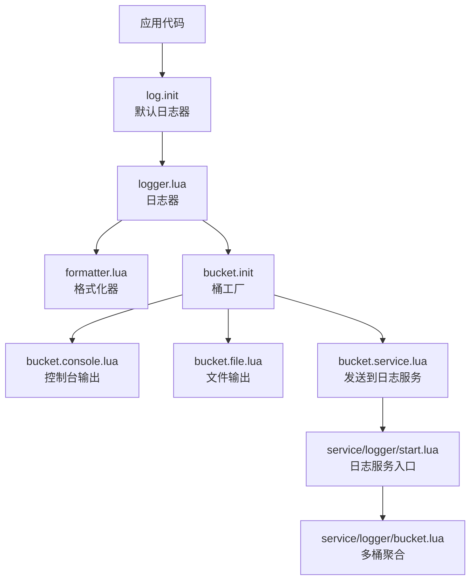
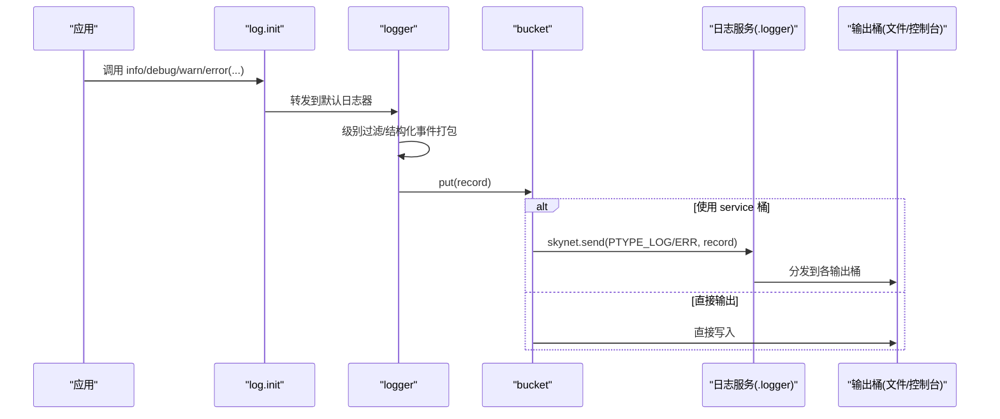
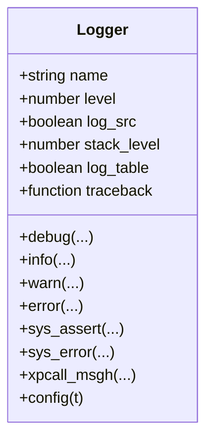
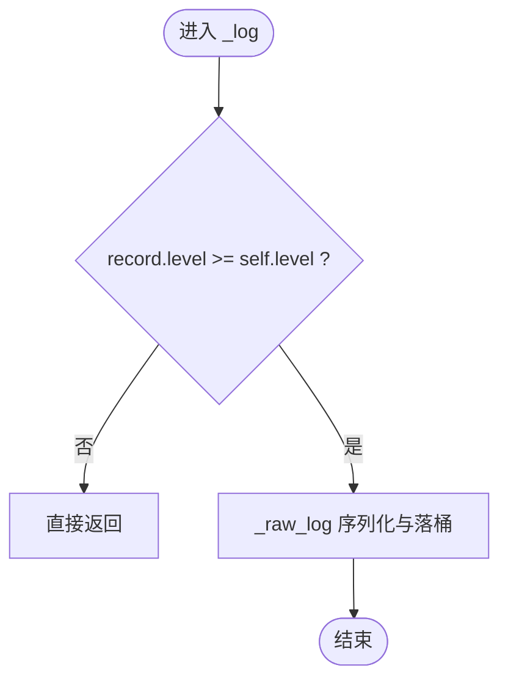
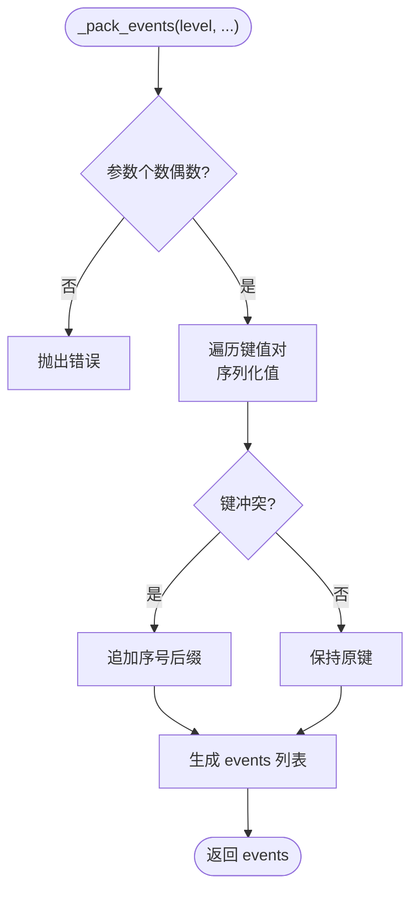
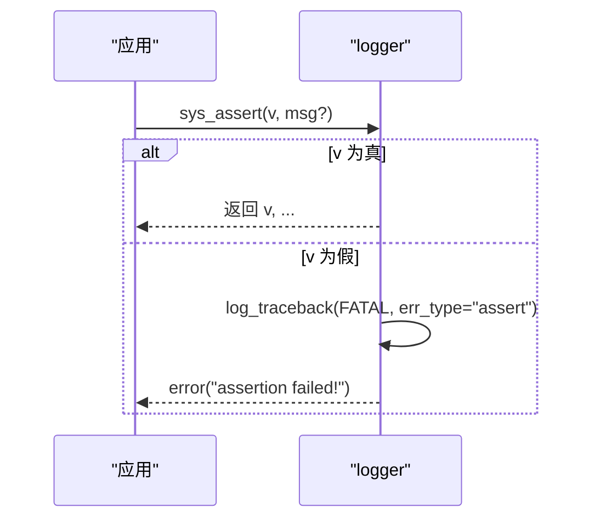
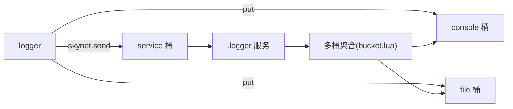
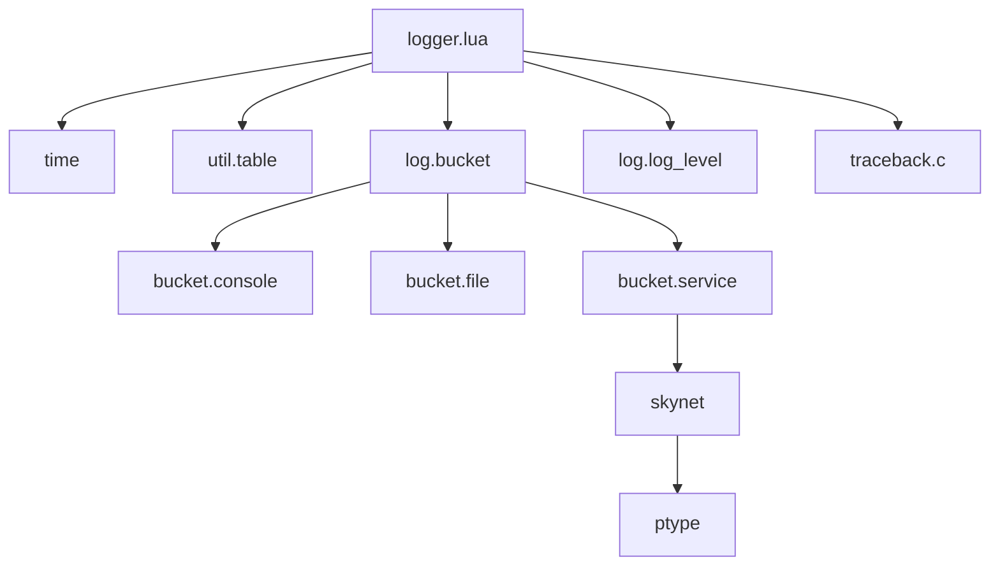

# 日志核心模块

<cite>
**本文引用的文件**
- [lualib/log/init.lua](file://lualib/log/init.lua)
- [lualib/log/logger.lua](file://lualib/log/logger.lua)
- [lualib/log/formatter.lua](file://lualib/log/formatter.lua)
- [lualib/log/log_level.lua](file://lualib/log/log_level.lua)
- [lualib/log/util.lua](file://lualib/log/util.lua)
- [lualib/log/bucket/init.lua](file://lualib/log/bucket/init.lua)
- [lualib/log/bucket/service.lua](file://lualib/log/bucket/service.lua)
- [lualib/log/bucket/console.lua](file://lualib/log/bucket/console.lua)
- [lualib/log/bucket/file.lua](file://lualib/log/bucket/file.lua)
- [service/logger/start.lua](file://service/logger/start.lua)
- [service/logger/main.lua](file://service/logger/main.lua)
- [service/logger/bucket.lua](file://service/logger/bucket.lua)
- [etc/core.conf.lua](file://etc/core.conf.lua)
</cite>

## 目录
1. [简介](#简介)
2. [项目结构](#项目结构)
3. [核心组件](#核心组件)
4. [架构总览](#架构总览)
5. [详细组件分析](#详细组件分析)
6. [依赖关系分析](#依赖关系分析)
7. [性能与内存管理](#性能与内存管理)
8. [故障排除指南](#故障排除指南)
9. [结论](#结论)
10. [附录：配置与使用示例](#附录配置与使用示例)

## 简介
本技术文档围绕 SkyExt 框架的日志核心模块，系统性阐述日志对象的生命周期、配置系统、错误处理机制、结构化日志支持、输出后端（控制台/文件/服务）以及线程安全与性能优化。文档提供从创建自定义日志器、配置日志输出到异常与断言处理的完整流程说明，并给出调试与排障建议。

## 项目结构
日志子系统由“日志门面 + 日志器 + 格式化器 + 输出桶 + 日志服务”组成：
- 门面层：统一入口，暴露默认日志器及初始化方法
- 日志器：负责级别过滤、结构化事件打包、堆栈追踪、错误封装
- 格式化器：将记录序列化为文本或 JSON
- 输出桶：抽象输出目标，支持控制台、文件、远程服务
- 日志服务：集中消费日志消息，执行流控与落盘

**图表来源**
- [lualib/log/init.lua:1-58](file://lualib/log/init.lua#L1-L58)
- [lualib/log/logger.lua:1-291](file://lualib/log/logger.lua#L1-L291)
- [lualib/log/formatter.lua:1-130](file://lualib/log/formatter.lua#L1-L130)
- [lualib/log/bucket/init.lua:1-31](file://lualib/log/bucket/init.lua#L1-L31)
- [lualib/log/bucket/console.lua:1-38](file://lualib/log/bucket/console.lua#L1-L38)
- [lualib/log/bucket/file.lua:1-254](file://lualib/log/bucket/file.lua#L1-L254)
- [lualib/log/bucket/service.lua:1-57](file://lualib/log/bucket/service.lua#L1-L57)
- [service/logger/start.lua:1-84](file://service/logger/start.lua#L1-L84)
- [service/logger/bucket.lua:1-74](file://service/logger/bucket.lua#L1-L74)

**章节来源**
- [lualib/log/init.lua:1-58](file://lualib/log/init.lua#L1-L58)
- [lualib/log/logger.lua:1-291](file://lualib/log/logger.lua#L1-L291)
- [lualib/log/formatter.lua:1-130](file://lualib/log/formatter.lua#L1-L130)
- [lualib/log/bucket/init.lua:1-31](file://lualib/log/bucket/init.lua#L1-L31)
- [lualib/log/bucket/console.lua:1-38](file://lualib/log/bucket/console.lua#L1-L38)
- [lualib/log/bucket/file.lua:1-254](file://lualib/log/bucket/file.lua#L1-L254)
- [lualib/log/bucket/service.lua:1-57](file://lualib/log/bucket/service.lua#L1-L57)
- [service/logger/start.lua:1-84](file://service/logger/start.lua#L1-L84)
- [service/logger/bucket.lua:1-74](file://service/logger/bucket.lua#L1-L74)

## 核心组件
- 日志门面（init）：提供默认日志器实例、全局 init、以及 debug/info/warn/error/sys_assert/sys_error/xpcall_msgh 等便捷接口
- 日志器（logger）：实现级别过滤、结构化事件打包、源位置获取、错误与断言包装、安全 pcall/xpcall 封装、回溯生成
- 格式化器（formatter）：支持 text/json 两种格式，带颜色与时间缓存优化
- 输出桶（bucket）：抽象 put(record)，支持 console/file/service 三种后端
- 日志服务（start/bucket）：注册协议、分发日志消息、过载丢弃、多桶聚合、SIGHUP 重载

**章节来源**
- [lualib/log/init.lua:1-58](file://lualib/log/init.lua#L1-L58)
- [lualib/log/logger.lua:1-291](file://lualib/log/logger.lua#L1-L291)
- [lualib/log/formatter.lua:1-130](file://lualib/log/formatter.lua#L1-L130)
- [lualib/log/bucket/init.lua:1-31](file://lualib/log/bucket/init.lua#L1-L31)
- [service/logger/start.lua:1-84](file://service/logger/start.lua#L1-L84)
- [service/logger/bucket.lua:1-74](file://service/logger/bucket.lua#L1-L74)

## 架构总览
日志调用链路如下：
- 应用调用 log.debug/info/warn/error 等
- logger 进行级别过滤与结构化事件组装
- 通过 bucket.put 写入具体后端
- 若启用 service 桶，则通过 Skynet 协议发送至 .logger 服务
- 日志服务根据级别选择不同协议，按策略投递至多个输出桶（文件/控制台等），并在过载时丢弃非关键日志

**图表来源**
- [lualib/log/init.lua:1-58](file://lualib/log/init.lua#L1-L58)
- [lualib/log/logger.lua:108-153](file://lualib/log/logger.lua#L108-L153)
- [lualib/log/bucket/service.lua:24-53](file://lualib/log/bucket/service.lua#L24-L53)
- [service/logger/start.lua:52-75](file://service/logger/start.lua#L52-L75)
- [service/logger/bucket.lua:8-28](file://service/logger/bucket.lua#L8-L28)

## 详细组件分析

### 日志器生命周期与配置
- 创建：M.new() 构建对象，设置 name、level、log_src、stack_level、traceback 等默认值
- 配置：config(t) 对字段进行类型校验与赋值，支持 level 枚举映射
- 销毁：无显式 close；在进程退出时由 Lua GC 回收资源
- 全局初始化：init() 读取配置并注入 assert/error/pcall/xpcall 为安全版本

**图表来源**
- [lualib/log/logger.lua:265-288](file://lualib/log/logger.lua#L265-L288)
- [lualib/log/logger.lua:249-263](file://lualib/log/logger.lua#L249-L263)
- [lualib/log/init.lua:41-55](file://lualib/log/init.lua#L41-L55)

**章节来源**
- [lualib/log/logger.lua:249-288](file://lualib/log/logger.lua#L249-L288)
- [lualib/log/init.lua:41-55](file://lualib/log/init.lua#L41-L55)

### 日志级别与过滤
- 级别定义：DEBUG/INFO/WARN/ERROR/FATAL，数值越小优先级越高
- 过滤逻辑：仅当记录级别不低于当前日志器 level 时才继续处理
- 范围过滤：util.parse_level 支持区间如 INFO-DEBUG，should_log 判断是否落入区间

**图表来源**
- [lualib/log/log_level.lua:1-11](file://lualib/log/log_level.lua#L1-L11)
- [lualib/log/logger.lua:119-129](file://lualib/log/logger.lua#L119-L129)
- [lualib/log/util.lua:9-22](file://lualib/log/util.lua#L9-L22)

**章节来源**
- [lualib/log/log_level.lua:1-11](file://lualib/log/log_level.lua#L1-L11)
- [lualib/log/logger.lua:119-129](file://lualib/log/logger.lua#L119-L129)
- [lualib/log/util.lua:9-22](file://lualib/log/util.lua#L9-L22)

### 结构化日志与事件打包
- 键值对参数必须成对传入，内部转换为 events 列表
- 保留固定字段 module/level/timestamp/line/msg，冲突键自动加后缀避免覆盖
- 表序列化：根据 log_table 开关与级别决定是否序列化 table

**图表来源**
- [lualib/log/logger.lua:78-106](file://lualib/log/logger.lua#L78-L106)

**章节来源**
- [lualib/log/logger.lua:70-117](file://lualib/log/logger.lua#L70-L117)

### 错误处理与断言
- sys_assert：失败时记录 FATAL 堆栈并抛出错误
- sys_error：记录指定级别的错误堆栈并抛出错误
- xpcall_msgh：以 FATAL 级别记录错误信息并返回
- safe_pcall/safe_xpcall：在错误处理上下文计数保护下调用，避免重复堆栈采集

**图表来源**
- [lualib/log/logger.lua:150-236](file://lualib/log/logger.lua#L150-L236)

**章节来源**
- [lualib/log/logger.lua:150-236](file://lualib/log/logger.lua#L150-L236)

### 输出后端与日志服务
- 控制台输出：text 格式，支持颜色，基于 io.stdout
- 文件输出：支持按行/大小/小时/天轮转，缓冲刷新策略可配
- 服务输出：通过 Skynet 协议发送，区分 ERROR 与非 ERROR 通道
- 日志服务：注册协议，按过载策略丢弃非关键日志，聚合多桶输出

**图表来源**
- [lualib/log/bucket/console.lua:13-34](file://lualib/log/bucket/console.lua#L13-L34)
- [lualib/log/bucket/file.lua:119-146](file://lualib/log/bucket/file.lua#L119-L146)
- [lualib/log/bucket/service.lua:24-53](file://lualib/log/bucket/service.lua#L24-L53)
- [service/logger/start.lua:52-75](file://service/logger/start.lua#L52-L75)
- [service/logger/bucket.lua:8-28](file://service/logger/bucket.lua#L8-L28)

**章节来源**
- [lualib/log/bucket/console.lua:1-38](file://lualib/log/bucket/console.lua#L1-L38)
- [lualib/log/bucket/file.lua:1-254](file://lualib/log/bucket/file.lua#L1-L254)
- [lualib/log/bucket/service.lua:1-57](file://lualib/log/bucket/service.lua#L1-L57)
- [service/logger/start.lua:1-84](file://service/logger/start.lua#L1-L84)
- [service/logger/bucket.lua:1-74](file://service/logger/bucket.lua#L1-L74)

### 格式化器
- text：默认样式，支持颜色，时间毫秒级精度
- json：使用 cjson.safe 编码，便于外部采集
- 颜色：ANSI 转义序列，可在终端显示高亮

**章节来源**
- [lualib/log/formatter.lua:1-130](file://lualib/log/formatter.lua#L1-L130)

## 依赖关系分析
- logger 依赖 time、util.table、log.bucket、log.log_level、traceback.c
- bucket.init 动态加载具体后端模块
- service 侧 start 依赖 config、cmd_api、global、ptype 等
- 配置文件 core.conf 指定日志服务名与路径

**图表来源**
- [lualib/log/logger.lua:1-6](file://lualib/log/logger.lua#L1-L6)
- [lualib/log/bucket/init.lua:5-21](file://lualib/log/bucket/init.lua#L5-L21)
- [lualib/log/bucket/service.lua:1-19](file://lualib/log/bucket/service.lua#L1-L19)
- [etc/core.conf.lua:28-29](file://etc/core.conf.lua#L28-L29)

**章节来源**
- [lualib/log/logger.lua:1-6](file://lualib/log/logger.lua#L1-L6)
- [lualib/log/bucket/init.lua:1-31](file://lualib/log/bucket/init.lua#L1-L31)
- [lualib/log/bucket/service.lua:1-57](file://lualib/log/bucket/service.lua#L1-L57)
- [etc/core.conf.lua:1-30](file://etc/core.conf.lua#L1-L30)

## 性能与内存管理
- 级别过滤前置：在 _log 中尽早返回，减少后续开销
- 时间缓存：formatter.format_time 缓存秒级时间字符串，降低格式化成本
- 表序列化按需：仅在 log_table=true 或低级别时序列化 table，避免昂贵转换
- 文件缓冲：file 桶支持 full/line 缓冲与 flush_period 批量刷新，减少系统调用
- 轮转策略：按行/大小/小时/天切分，控制单文件大小，避免磁盘压力
- 服务过载保护：日志服务在 global.log_overload 时丢弃非关键日志，保障核心业务
- 堆栈采集限制：traceback_c 限制深度、元素数量、字符串长度，防止过度分配
- 安全 pcall/xpcall：计数器保护，避免在错误处理上下文中重复采集堆栈

[本节为通用性能指导，不直接分析具体文件]

## 故障排除指南
- 启动失败兜底：service/logger/main.lua 捕获启动异常，写入 bootfail.log 并中止
- 日志服务未就绪：bucket.service 无法找到 .logger 服务时回退到默认桶
- 配置错误：logger.config 对字段类型严格校验，非法值会报错
- 文件写入失败：file 桶 flush_ok 标记用于检查错误；close 前强制 flush
- 颜色字符干扰：服务端 text 协议接收时会去除 ANSI 颜色码再记录
- 级别不生效：确认 log_level 与 util.should_log 区间配置正确

**章节来源**
- [service/logger/main.lua:1-18](file://service/logger/main.lua#L1-L18)
- [lualib/log/bucket/service.lua:33-53](file://lualib/log/bucket/service.lua#L33-L53)
- [lualib/log/logger.lua:249-263](file://lualib/log/logger.lua#L249-L263)
- [lualib/log/bucket/file.lua:143-159](file://lualib/log/bucket/file.lua#L143-L159)
- [service/logger/start.lua:36-50](file://service/logger/start.lua#L36-L50)

## 结论
SkyExt 日志核心模块通过清晰的层次划分与可扩展的后端设计，提供了高性能、可配置、易扩展的日志能力。其结构化事件、严格的类型校验、完善的错误与断言包装、以及服务端的过载保护，使其适用于大规模分布式场景。结合合理的级别与输出策略，可有效平衡可观测性与系统性能。

## 附录：配置与使用示例
- 创建自定义日志器
  - 使用 M.new() 创建新实例，并通过 config 设置 name、level、log_src、log_table、stack_level、traceback
  - 参考路径：[lualib/log/logger.lua:265-288](file://lualib/log/logger.lua#L265-L288)、[lualib/log/logger.lua:249-263](file://lualib/log/logger.lua#L249-L263)
- 配置日志输出
  - 控制台：使用 bucket.console，支持 format=text、color=true、level=INFO-DEBUG
  - 文件：使用 bucket.file，支持 split=line|size|hour|day、flush_period、format=json/text
  - 服务：使用 bucket.service，将日志发送至 .logger 服务
  - 参考路径：[lualib/log/bucket/console.lua:22-34](file://lualib/log/bucket/console.lua#L22-L34)、[lualib/log/bucket/file.lua:223-250](file://lualib/log/bucket/file.lua#L223-L250)、[lualib/log/bucket/service.lua:33-53](file://lualib/log/bucket/service.lua#L33-L53)
- 处理异常与断言
  - 使用 sys_assert 替代 assert，失败时记录堆栈并抛出
  - 使用 sys_error 记录错误堆栈并抛出
  - 使用 xpcall_msgh 作为 xpcall 的消息处理器，记录 FATAL 堆栈
  - 参考路径：[lualib/log/logger.lua:214-236](file://lualib/log/logger.lua#L214-L236)
- 性能调优建议
  - 合理设置 level 与 log_table，避免不必要的序列化
  - 文件输出开启 flush_period，减少频繁刷盘
  - 在服务端开启过载保护，丢弃非关键日志
  - 参考路径：[lualib/log/formatter.lua:37-51](file://lualib/log/formatter.lua#L37-L51)、[lualib/log/bucket/file.lua:119-146](file://lualib/log/bucket/file.lua#L119-L146)、[service/logger/start.lua:52-66](file://service/logger/start.lua#L52-L66)