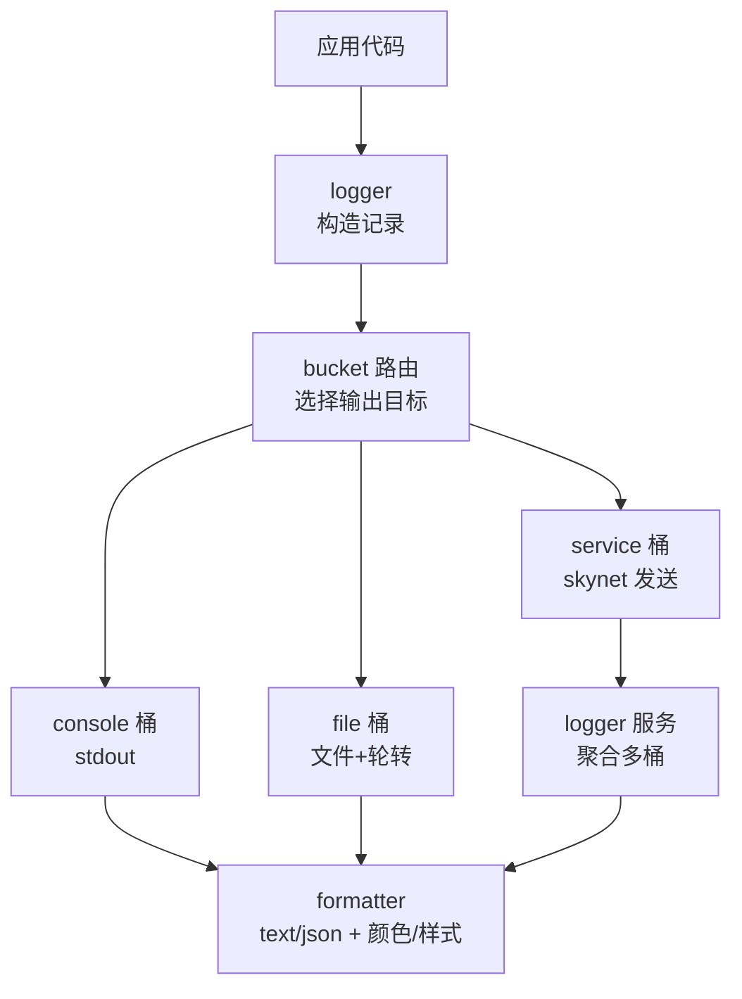
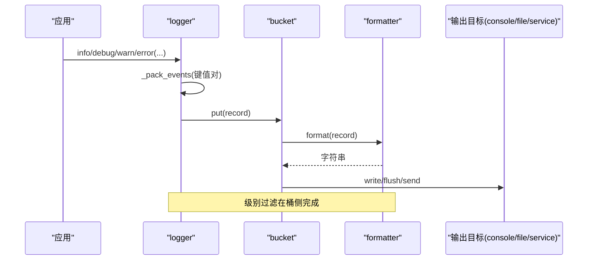
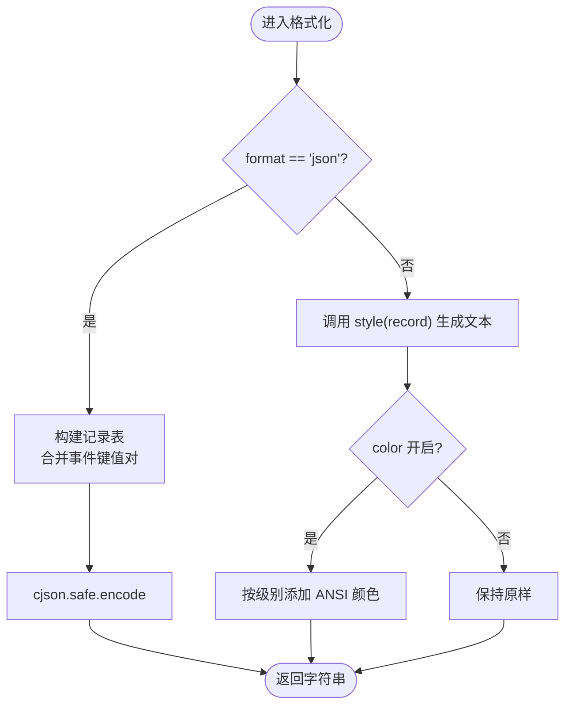
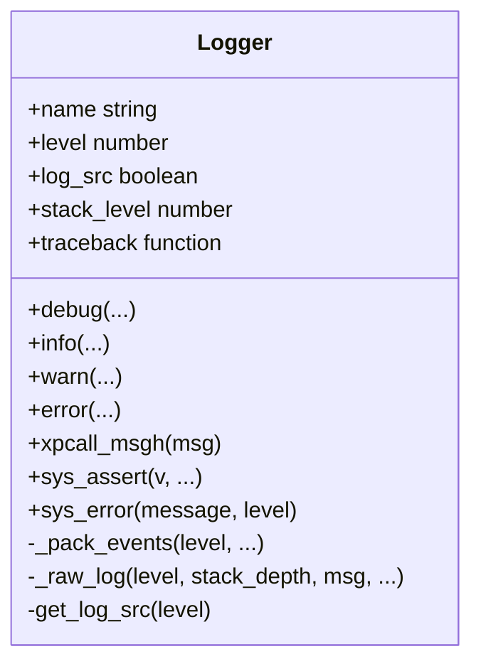
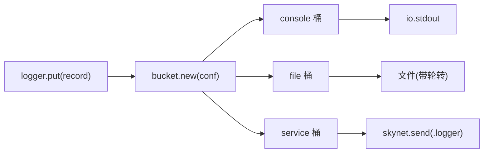
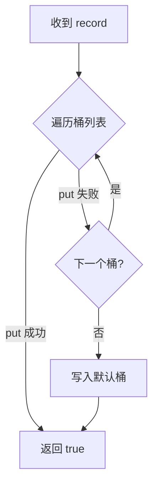
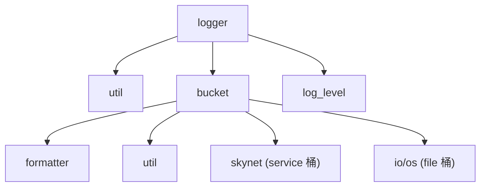

# 日志格式器

<cite>
**本文引用的文件**
- [formatter.lua](file://lualib/log/formatter.lua)
- [logger.lua](file://lualib/log/logger.lua)
- [init.lua](file://lualib/log/init.lua)
- [util.lua](file://lualib/log/util.lua)
- [log_level.lua](file://lualib/log/log_level.lua)
- [bucket_init.lua](file://lualib/log/bucket/init.lua)
- [bucket_service.lua](file://lualib/log/bucket/service.lua)
- [bucket_file.lua](file://lualib/log/bucket/file.lua)
- [bucket_console.lua](file://lualib/log/bucket/console.lua)
- [service_bucket.lua](file://service/logger/bucket.lua)
- [core.conf.lua](file://etc/core.conf.lua)
</cite>

## 目录
1. [简介](#简介)
2. [项目结构](#项目结构)
3. [核心组件](#核心组件)
4. [架构总览](#架构总览)
5. [详细组件分析](#详细组件分析)
6. [依赖关系分析](#依赖关系分析)
7. [性能考虑](#性能考虑)
8. [故障排查指南](#故障排查指南)
9. [结论](#结论)
10. [附录](#附录)

## 简介
本技术文档聚焦 SkyExt 框架的日志格式器，系统性阐述内置格式器的定义、模板语法、动态字段替换机制，以及自定义格式器的实现方式与扩展点。同时覆盖格式化性能优化、配置选项、最佳实践，并提供常见问题的解决方案与调优建议。读者无需深入源码即可理解如何正确使用和扩展日志格式能力。

## 项目结构
日志子系统由“记录生成”“格式化处理”“输出目标（桶）”三部分构成：
- 记录生成：logger 负责组装结构化记录（模块名、级别、时间戳、来源行、消息体、事件键值对）。
- 格式处理：formatter 提供 JSON 与文本两种内置格式，支持颜色与自定义样式函数。
- 输出目标：bucket 抽象不同后端（控制台、文件、服务转发），统一接收记录并调用 formatter 进行格式化后落盘或输出。

图表来源
- [logger.lua:38-117](file://lualib/log/logger.lua#L38-L117)
- [bucket_init.lua:5-28](file://lualib/log/bucket/init.lua#L5-L28)
- [bucket_console.lua:13-33](file://lualib/log/bucket/console.lua#L13-L33)
- [bucket_file.lua:119-146](file://lualib/log/bucket/file.lua#L119-L146)
- [bucket_service.lua:24-31](file://lualib/log/bucket/service.lua#L24-L31)
- [service_bucket.lua:8-28](file://service/logger/bucket.lua#L8-L28)

章节来源
- [logger.lua:38-117](file://lualib/log/logger.lua#L38-L117)
- [bucket_init.lua:5-28](file://lualib/log/bucket/init.lua#L5-L28)
- [bucket_console.lua:13-33](file://lualib/log/bucket/console.lua#L13-L33)
- [bucket_file.lua:119-146](file://lualib/log/bucket/file.lua#L119-L146)
- [bucket_service.lua:24-31](file://lualib/log/bucket/service.lua#L24-L31)
- [service_bucket.lua:8-28](file://service/logger/bucket.lua#L8-L28)

## 核心组件
- 日志级别与工具
  - 级别定义：DEBUG/INFO/WARN/ERROR/FATAL，数值越小优先级越高。
  - 级别解析与过滤：支持范围配置与是否打印判断。
- 记录生成器
  - 将结构化数据打包为记录对象，包含模块、级别、时间戳、来源行、消息、事件键值对。
  - 自动序列化表格类型参数，避免重复开销。
- 格式器
  - 内置 text 与 json 两种格式；text 支持颜色与自定义样式函数；json 使用 cjson.safe 编码。
  - 通过 get_formatter(format, color, style) 返回最终格式化函数。
- 输出桶
  - console：输出到标准输出，默认开启颜色。
  - file：写入文件，支持按行数/大小/小时/天轮转，支持 flush 周期控制。
  - service：通过 skynet 协议发送到 logger 服务，再由服务聚合到多个桶。
- 服务层聚合
  - logger 服务维护多个桶实例，任一失败回退到默认桶，保证可靠性。

章节来源
- [log_level.lua:1-11](file://lualib/log/log_level.lua#L1-L11)
- [util.lua:9-22](file://lualib/log/util.lua#L9-L22)
- [logger.lua:38-117](file://lualib/log/logger.lua#L38-L117)
- [formatter.lua:73-127](file://lualib/log/formatter.lua#L73-L127)
- [bucket_console.lua:13-33](file://lualib/log/bucket/console.lua#L13-L33)
- [bucket_file.lua:119-146](file://lualib/log/bucket/file.lua#L119-L146)
- [bucket_service.lua:24-31](file://lualib/log/bucket/service.lua#L24-L31)
- [service_bucket.lua:8-28](file://service/logger/bucket.lua#L8-L28)

## 架构总览
下图展示从业务调用到最终输出的完整流程，包括结构化事件打包、级别过滤、格式化与落盘/输出。

图表来源
- [logger.lua:77-117](file://lualib/log/logger.lua#L77-L117)
- [bucket_console.lua:13-33](file://lualib/log/bucket/console.lua#L13-L33)
- [bucket_file.lua:119-146](file://lualib/log/bucket/file.lua#L119-L146)
- [bucket_service.lua:24-31](file://lualib/log/bucket/service.lua#L24-L31)
- [formatter.lua:113-127](file://lualib/log/formatter.lua#L113-L127)

## 详细组件分析

### 格式器（formatter）
- 内置格式
  - JSON：将记录映射为固定字段（module、level、line、msg、time）及事件键值对，使用 cjson.safe 编码。
  - TEXT：默认样式包含时间、短级别、模块、行号、消息与事件拼接；可通过 style 函数自定义。
- 动态字段替换
  - 事件键值对作为动态字段注入记录，JSON 中直接展开，TEXT 中以 key:value 形式拼接。
- 颜色与样式
  - 根据级别映射 ANSI 颜色码；可在 text 模式下启用颜色开关。
- 获取格式化函数
  - get_formatter(format, color, style) 返回闭包，内部缓存 last_time/time_str 提升时间格式化性能。

图表来源
- [formatter.lua:58-78](file://lualib/log/formatter.lua#L58-L78)
- [formatter.lua:80-127](file://lualib/log/formatter.lua#L80-L127)

章节来源
- [formatter.lua:73-127](file://lualib/log/formatter.lua#L73-L127)

### 记录生成（logger）
- 结构化事件打包
  - 要求成对的键值参数；自动序列化 table 类型；保留 module/level/timestamp/line/msg 等保留字，冲突时追加序号后缀。
- 来源行定位
  - 通过 debug.getinfo 获取 source 与 currentline，支持关闭以节省开销。
- 级别过滤与异常保护
  - 在 _log 中先比较级别阈值，再 pcall 调用 _raw_log，失败兜底打印。
- 错误堆栈
  - error 级别自动附加 traceback；sys_assert/sys_error/xpcall_msgh 提供统一的错误上报入口。

图表来源
- [logger.lua:66-153](file://lualib/log/logger.lua#L66-L153)
- [logger.lua:238-287](file://lualib/log/logger.lua#L238-L287)

章节来源
- [logger.lua:77-153](file://lualib/log/logger.lua#L77-L153)
- [logger.lua:238-287](file://lualib/log/logger.lua#L238-L287)

### 输出桶（bucket）
- 路由与默认策略
  - bucket.new(name) 动态加载具体实现；若未找到则报错；提供 get_default() 回退到 console。
- Console 桶
  - 默认开启颜色；级别过滤在桶内完成；写入 stdout。
- File 桶
  - 支持 split=line|size|hour|day；支持 flush_period 批量刷盘；支持 format/color/style 配置；自动轮转文件名计数。
- Service 桶
  - 将记录通过 skynet.send 发送至 logger 服务；WARN 及以上走错误通道；若未运行 logger 服务则返回 nil，上层回退到默认桶。

图表来源
- [bucket_init.lua:5-28](file://lualib/log/bucket/init.lua#L5-L28)
- [bucket_console.lua:13-33](file://lualib/log/bucket/console.lua#L13-L33)
- [bucket_file.lua:119-146](file://lualib/log/bucket/file.lua#L119-L146)
- [bucket_service.lua:24-31](file://lualib/log/bucket/service.lua#L24-L31)

章节来源
- [bucket_init.lua:5-28](file://lualib/log/bucket/init.lua#L5-L28)
- [bucket_console.lua:13-33](file://lualib/log/bucket/console.lua#L13-L33)
- [bucket_file.lua:119-146](file://lualib/log/bucket/file.lua#L119-L146)
- [bucket_service.lua:24-31](file://lualib/log/bucket/service.lua#L24-L31)

### 服务层聚合（service/logger/bucket）
- 多桶并行写入
  - 初始化时创建多个桶实例；put 时依次尝试，任一成功即认为成功；全部失败回退到默认桶。
- 重载与关闭
  - 支持 reload/close 钩子，便于文件桶重开句柄或刷新配置。

图表来源
- [service_bucket.lua:8-28](file://service/logger/bucket.lua#L8-L28)

章节来源
- [service_bucket.lua:8-28](file://service/logger/bucket.lua#L8-L28)

### 配置与初始化
- 全局初始化
  - init 读取配置项设置日志级别、是否打印源码、是否序列化表格；并替换 assert/error/pcall/xpcall 为安全版本。
- 核心配置
  - core.conf 指定 logservice 与 logger 服务名，用于服务发现与路由。

章节来源
- [init.lua:41-55](file://lualib/log/init.lua#L41-L55)
- [core.conf.lua:28-30](file://etc/core.conf.lua#L28-L30)

## 依赖关系分析
- 模块耦合
  - logger 依赖 util.table、bucket、log_level、traceback.c。
  - formatter 依赖 time、log_level、cjson.safe。
  - 各桶依赖 formatter 与 util（级别解析与过滤）。
- 外部集成
  - service 桶通过 skynet 协议与 logger 服务通信。
  - file 桶使用 io 与 os.date 进行文件操作与时间判断。

图表来源
- [logger.lua:1-6](file://lualib/log/logger.lua#L1-L6)
- [formatter.lua:1-3](file://lualib/log/formatter.lua#L1-L3)
- [bucket_service.lua:1-5](file://lualib/log/bucket/service.lua#L1-L5)
- [bucket_file.lua:1-5](file://lualib/log/bucket/file.lua#L1-L5)

章节来源
- [logger.lua:1-6](file://lualib/log/logger.lua#L1-L6)
- [formatter.lua:1-3](file://lualib/log/formatter.lua#L1-L3)
- [bucket_service.lua:1-5](file://lualib/log/bucket/service.lua#L1-L5)
- [bucket_file.lua:1-5](file://lualib/log/bucket/file.lua#L1-L5)

## 性能考虑
- 时间格式化缓存
  - formatter 在同一秒内复用上次格式化结果，减少重复计算。
- 表格序列化
  - logger 仅在 log_table=true 或级别低于 INFO 时对 table 进行序列化，降低常规日志开销。
- 级别前置过滤
  - logger 与桶均进行级别判断，避免不必要的格式化与 I/O。
- 批量刷盘
  - file 桶支持 flush_period，累积多条后再 flush，减少系统调用次数。
- 颜色与样式
  - 颜色仅影响终端可读性，建议在开发环境开启，生产环境按需关闭以减少额外字符串拼接。
- JSON 编码
  - 使用 cjson.safe 保证安全性；对于高频 JSON 日志，建议评估事件数量与嵌套深度，必要时裁剪字段。

[本节为通用性能指导，不直接分析具体文件]

## 故障排查指南
- 未知日志级别
  - 现象：text 模式抛出“日志级别不存在”。
  - 原因：传入的级别不在预定义集合中。
  - 解决：确保使用 log_level 定义的级别常量。
- 事件键值对奇偶校验
  - 现象：调用日志接口时报错“参数个数必须为偶数”。
  - 原因：结构化事件必须以键值对形式传入。
  - 解决：检查调用处是否为成对参数。
- 服务桶不可用
  - 现象：service 桶返回 nil，日志回退到默认桶。
  - 原因：未启动 logger 服务或未注册 .logger 名称。
  - 解决：确认 core.conf 中 logger 服务已正确启动并可被定位。
- 文件轮转异常
  - 现象：文件未按预期分割。
  - 原因：split 配置错误或 maxsize/maxline 单位不正确。
  - 解决：检查 split 类型与对应参数；maxsize 支持 K/M/G/T/P 单位。
- 颜色输出乱码
  - 现象：终端显示 ANSI 控制序列。
  - 原因：终端不支持颜色或 color 配置不当。
  - 解决：关闭 color 或在支持颜色的终端运行。

章节来源
- [formatter.lua:95-110](file://lualib/log/formatter.lua#L95-L110)
- [logger.lua:77-84](file://lualib/log/logger.lua#L77-L84)
- [bucket_service.lua:33-53](file://lualib/log/bucket/service.lua#L33-L53)
- [bucket_file.lua:168-206](file://lualib/log/bucket/file.lua#L168-L206)

## 结论
SkyExt 日志格式器通过清晰的职责划分与可扩展的设计，提供了高性能、可配置的日志格式化能力。内置 text/json 格式满足大多数场景，结合桶机制可实现多目标输出与可靠投递。通过合理的配置与优化策略，可在开发与生产环境中获得良好的可观测性与稳定性。

[本节为总结性内容，不直接分析具体文件]

## 附录

### 使用示例（路径指引）
- 使用内置 text 格式（含颜色）
  - 参考：[bucket_console.lua:22-33](file://lualib/log/bucket/console.lua#L22-L33)
- 使用内置 json 格式
  - 参考：[formatter.lua:75-78](file://lualib/log/formatter.lua#L75-L78)
- 自定义 text 样式函数
  - 参考：[formatter.lua:80-99](file://lualib/log/formatter.lua#L80-L99)
- 文件输出与轮转配置
  - 参考：[bucket_file.lua:208-250](file://lualib/log/bucket/file.lua#L208-L250)
- 服务化输出与聚合
  - 参考：[bucket_service.lua:24-53](file://lualib/log/bucket/service.lua#L24-L53)、[service_bucket.lua:8-28](file://service/logger/bucket.lua#L8-L28)

### 配置选项速查
- 通用
  - name：桶类型（console/file/service）
  - level：日志级别范围（如 INFO-DEBUG）
  - format：text 或 json
  - color：是否启用颜色（text 模式）
  - style：自定义样式函数（text 模式）
- 文件桶特有
  - filename：输出文件路径
  - split：line/size/hour/day
  - maxline：按行数分割阈值
  - maxsize：按大小分割阈值（支持 K/M/G/T/P）
  - flush_period：批量刷盘条数

章节来源
- [bucket_console.lua:22-33](file://lualib/log/bucket/console.lua#L22-L33)
- [bucket_file.lua:208-250](file://lualib/log/bucket/file.lua#L208-L250)
- [util.lua:9-22](file://lualib/log/util.lua#L9-L22)

### 最佳实践
- 生产环境建议
  - 使用 json 格式以便集中采集与分析。
  - 合理设置 flush_period，平衡延迟与 I/O 压力。
  - 关闭 color，减少无关字符。
  - 限制事件字段数量与嵌套深度，避免过大负载。
- 开发调试
  - 开启 color 与 text 格式，便于快速定位问题。
  - 适当提高日志级别范围，捕获更多上下文。
- 扩展建议
  - 新增桶类型时遵循统一接口 put/reload/close。
  - 在桶内完成级别过滤，避免重复计算。
  - 谨慎引入第三方库，优先使用轻量实现。

[本节为通用实践指导，不直接分析具体文件]