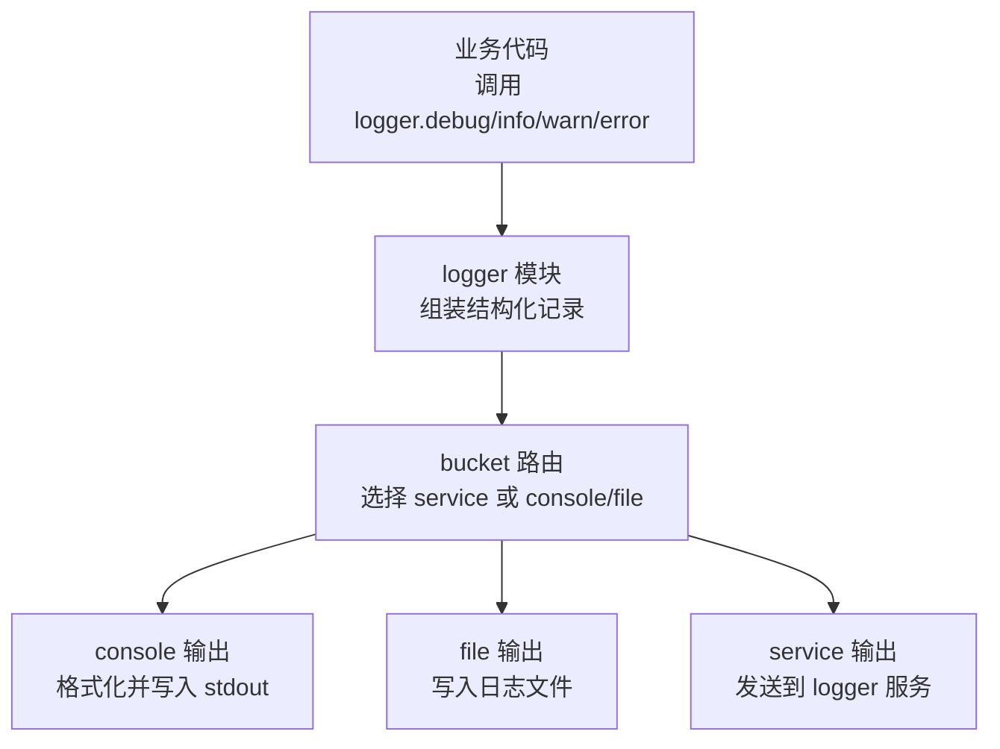
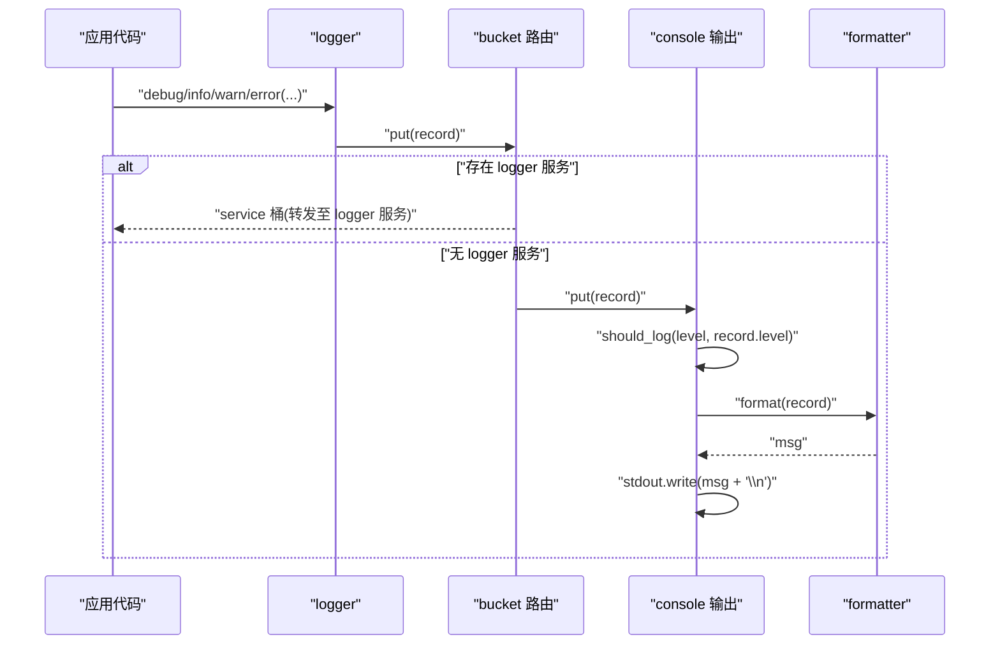
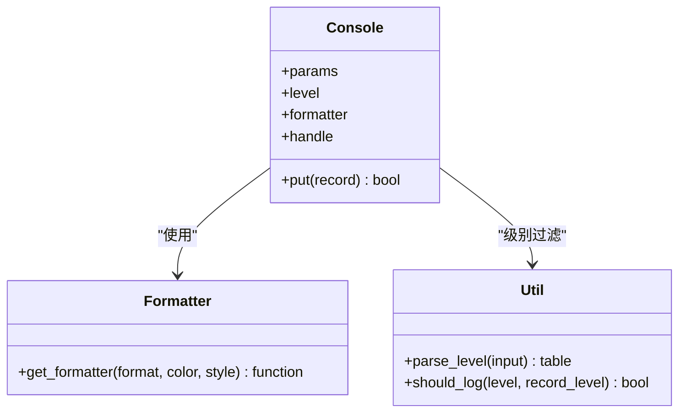
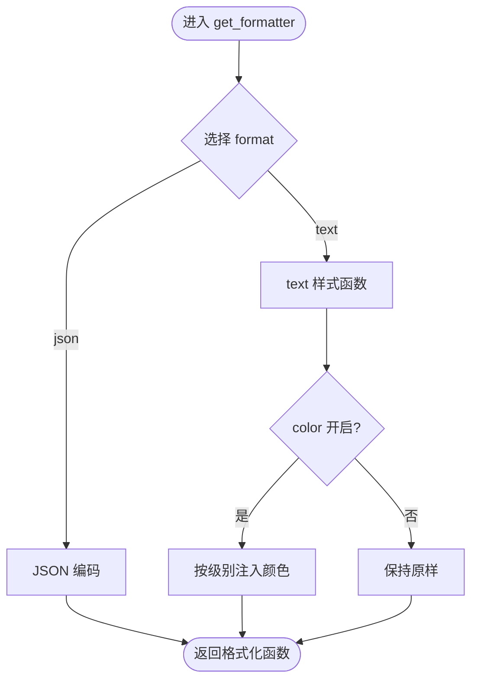
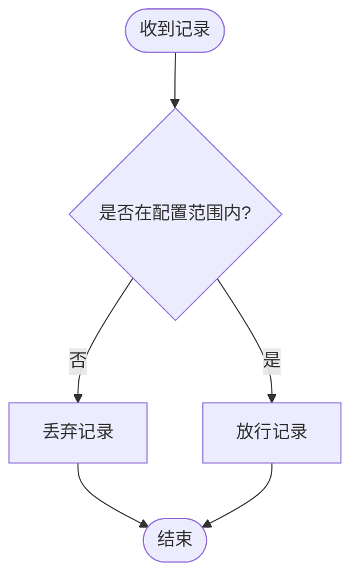
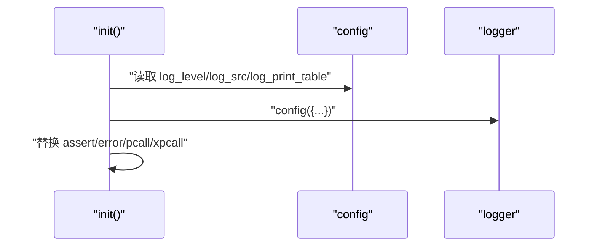
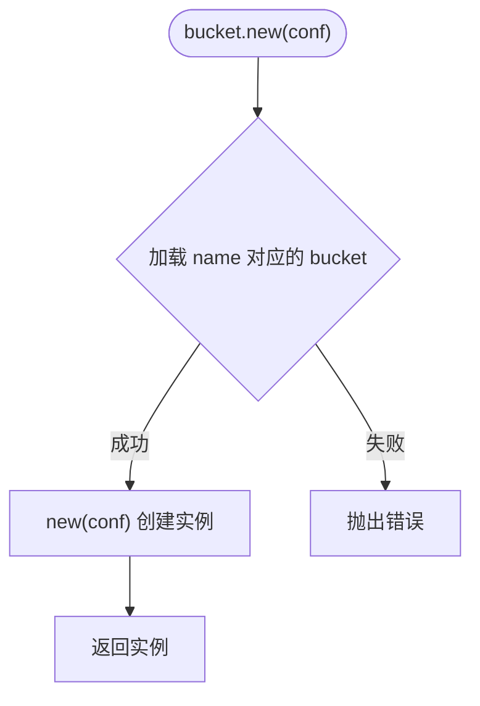
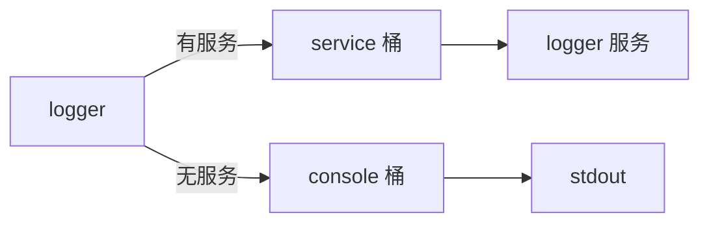
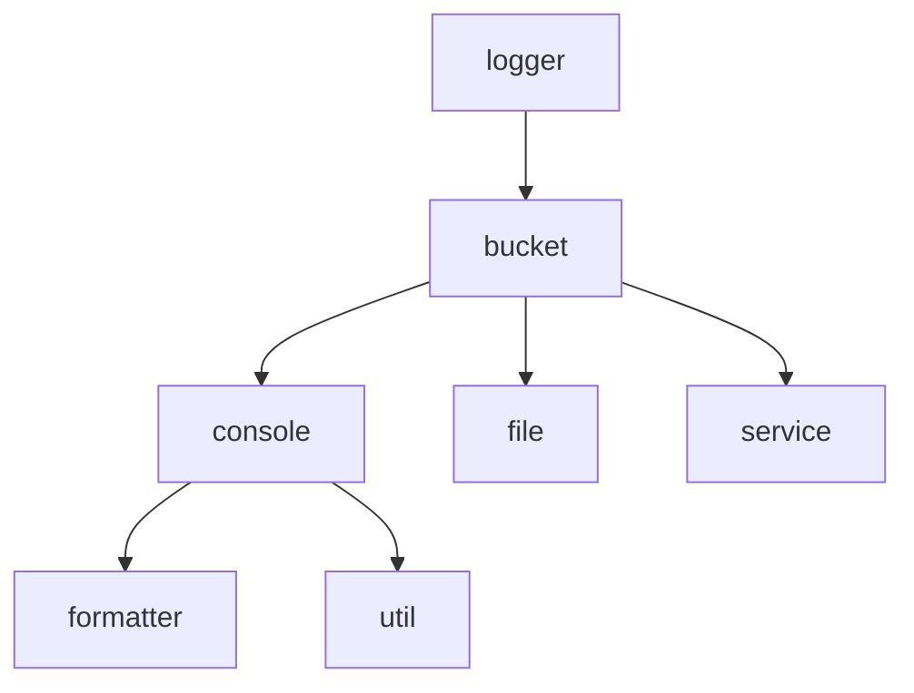

# 控制台输出

<cite>
**本文引用的文件**
- [lualib/log/bucket/console.lua](file://lualib/log/bucket/console.lua)
- [lualib/log/formatter.lua](file://lualib/log/formatter.lua)
- [lualib/log/util.lua](file://lualib/log/util.lua)
- [lualib/log/log_level.lua](file://lualib/log/log_level.lua)
- [lualib/log/bucket/init.lua](file://lualib/log/bucket/init.lua)
- [lualib/log/bucket/service.lua](file://lualib/log/bucket/service.lua)
- [lualib/log/logger.lua](file://lualib/log/logger.lua)
- [lualib/log/init.lua](file://lualib/log/init.lua)
- [service/logger/start.lua](file://service/logger/start.lua)
- [etc/app/common.app.lua](file://etc/app/common.app.lua)
- [etc/app/account1.app.lua](file://etc/app/account1.app.lua)
- [etc/app/role1.app.lua](file://etc/app/role1.app.lua)
</cite>

## 目录
1. [简介](#简介)
2. [项目结构](#项目结构)
3. [核心组件](#核心组件)
4. [架构总览](#架构总览)
5. [详细组件分析](#详细组件分析)
6. [依赖关系分析](#依赖关系分析)
7. [性能考量](#性能考量)
8. [故障排查指南](#故障排查指南)
9. [结论](#结论)
10. [附录](#附录)

## 简介
本文档聚焦 SkyExt 框架的“控制台输出”能力，系统阐述其实现原理、配置项与使用方法。内容涵盖：
- 控制台输出的工作原理与在日志系统中的位置
- 如何配置输出格式、颜色、级别过滤等特性
- 开发环境与生产环境的差异化配置建议
- 与其他输出目标（如文件、集中式日志服务）的组合使用方式
- 性能特性、限制与常见问题排查

## 项目结构
SkyExt 的日志子系统采用“记录 -> 桶（bucket）-> 具体输出目标”的分层设计。控制台输出作为其中一个 bucket 实现，负责将格式化后的日志写入标准输出。

图表来源
- [lualib/log/logger.lua:38-49](file://lualib/log/logger.lua#L38-L49)
- [lualib/log/bucket/init.lua:5-27](file://lualib/log/bucket/init.lua#L5-L27)
- [lualib/log/bucket/console.lua:13-34](file://lualib/log/bucket/console.lua#L13-L34)
- [lualib/log/bucket/service.lua:24-53](file://lualib/log/bucket/service.lua#L24-L53)

章节来源
- [lualib/log/logger.lua:38-49](file://lualib/log/logger.lua#L38-L49)
- [lualib/log/bucket/init.lua:5-27](file://lualib/log/bucket/init.lua#L5-L27)

## 核心组件
- 日志记录器（logger）：负责收集上下文信息（模块名、时间戳、行号、消息、事件键值对），并通过 bucket 分发到各输出目标。
- 桶（bucket）：抽象输出目标，支持动态加载不同实现（console、file、service）。
- 控制台输出（console）：基于标准输出进行打印，支持格式、颜色、级别过滤。
- 格式化器（formatter）：提供 text/json 等格式，支持 ANSI 颜色与自定义样式函数。
- 工具（util）：提供级别解析与是否应记录的判断逻辑。
- 级别定义（log_level）：定义 DEBUG/INFO/WARN/ERROR/FATAL 的优先级。

章节来源
- [lualib/log/logger.lua:66-129](file://lualib/log/logger.lua#L66-L129)
- [lualib/log/bucket/init.lua:1-31](file://lualib/log/bucket/init.lua#L1-L31)
- [lualib/log/bucket/console.lua:1-37](file://lualib/log/bucket/console.lua#L1-L37)
- [lualib/log/formatter.lua:1-129](file://lualib/log/formatter.lua#L1-L129)
- [lualib/log/util.lua:1-24](file://lualib/log/util.lua#L1-L24)
- [lualib/log/log_level.lua:1-11](file://lualib/log/log_level.lua#L1-L11)

## 架构总览
控制台输出在整体日志链路中的角色如下：
- 业务代码通过 logger 接口产生结构化日志记录
- logger 将记录交给 bucket；若存在 logger 服务则优先走 service 桶，否则回退到默认桶（console）
- console 桶根据配置的级别过滤、格式化后写入标准输出

图表来源
- [lualib/log/logger.lua:38-49](file://lualib/log/logger.lua#L38-L49)
- [lualib/log/bucket/init.lua:5-27](file://lualib/log/bucket/init.lua#L5-L27)
- [lualib/log/bucket/console.lua:13-34](file://lualib/log/bucket/console.lua#L13-L34)
- [lualib/log/formatter.lua:113-127](file://lualib/log/formatter.lua#L113-L127)

## 详细组件分析

### 控制台输出（console）
- 职责：接收结构化记录，依据级别过滤，格式化后写入标准输出。
- 关键行为：
  - 级别过滤：使用 util.should_log 判断是否输出
  - 格式化：通过 formatter.get_formatter 生成文本或 JSON，并可启用 ANSI 颜色
  - 输出：调用 io.stdout 写入一行日志

图表来源
- [lualib/log/bucket/console.lua:10-34](file://lualib/log/bucket/console.lua#L10-L34)
- [lualib/log/formatter.lua:113-127](file://lualib/log/formatter.lua#L113-L127)
- [lualib/log/util.lua:9-22](file://lualib/log/util.lua#L9-L22)

章节来源
- [lualib/log/bucket/console.lua:1-37](file://lualib/log/bucket/console.lua#L1-L37)

### 格式化器（formatter）
- 支持格式：
  - text：人类可读文本，支持 ANSI 颜色与自定义样式函数
  - json：结构化 JSON 输出，便于采集与分析
- 颜色机制：按日志级别注入 ANSI 转义序列，可全局开关
- 时间优化：同一秒内复用时间字符串，减少重复格式化开销

图表来源
- [lualib/log/formatter.lua:75-127](file://lualib/log/formatter.lua#L75-L127)

章节来源
- [lualib/log/formatter.lua:1-129](file://lualib/log/formatter.lua#L1-L129)

### 级别与过滤（log_level 与 util）
- 级别优先级：FATAL < ERROR < WARN < INFO < DEBUG
- 范围过滤：支持形如 “INFO-WARN” 的范围设置，仅输出该范围内的记录
- 过滤函数：should_log 用于快速判定是否丢弃某条记录

图表来源
- [lualib/log/log_level.lua:1-11](file://lualib/log/log_level.lua#L1-L11)
- [lualib/log/util.lua:9-22](file://lualib/log/util.lua#L9-L22)

章节来源
- [lualib/log/log_level.lua:1-11](file://lualib/log/log_level.lua#L1-L11)
- [lualib/log/util.lua:1-24](file://lualib/log/util.lua#L1-L24)

### 日志记录器（logger）与初始化
- 记录构造：封装模块名、时间戳、行号、消息与事件键值对
- 错误处理：safe_pcall/safe_xpcall 包装，避免日志异常影响主流程
- 初始化：从配置读取 log_level、log_src、log_print_table 等，并替换 assert/error/pcall/xpcall 为安全版本

图表来源
- [lualib/log/init.lua:41-55](file://lualib/log/init.lua#L41-L55)
- [lualib/log/logger.lua:249-287](file://lualib/log/logger.lua#L249-L287)

章节来源
- [lualib/log/init.lua:1-58](file://lualib/log/init.lua#L1-L58)
- [lualib/log/logger.lua:108-153](file://lualib/log/logger.lua#L108-L153)

### 桶路由与默认回退
- 动态加载：根据 name 字段加载对应 bucket 模块（console/file/service）
- 默认回退：当未配置或无法创建 service 桶时，回退到 console 桶
- 服务集成：若存在 logger 服务，优先将日志发送至服务统一处理

图表来源
- [lualib/log/bucket/init.lua:5-27](file://lualib/log/bucket/init.lua#L5-L27)

章节来源
- [lualib/log/bucket/init.lua:1-31](file://lualib/log/bucket/init.lua#L1-L31)

### 与 logger 服务的组合
- 当 logger 服务运行时，service 桶会将日志通过协议发送至服务，由服务统一落盘或转发
- 控制台输出通常用于本地调试或容器化环境下的实时查看

图表来源
- [lualib/log/bucket/service.lua:24-53](file://lualib/log/bucket/service.lua#L24-L53)
- [lualib/log/bucket/init.lua:24-27](file://lualib/log/bucket/init.lua#L24-L27)

章节来源
- [lualib/log/bucket/service.lua:1-57](file://lualib/log/bucket/service.lua#L1-L57)

## 依赖关系分析
- logger 依赖 bucket 路由，再依赖具体输出实现（console/file/service）
- console 依赖 formatter 与 util，完成格式化与级别过滤
- 配置文件通过 log_config 声明多个输出目标，支持同时输出到文件与控制台

图表来源
- [lualib/log/logger.lua:38-49](file://lualib/log/logger.lua#L38-L49)
- [lualib/log/bucket/init.lua:5-27](file://lualib/log/bucket/init.lua#L5-L27)
- [lualib/log/bucket/console.lua:1-37](file://lualib/log/bucket/console.lua#L1-L37)

章节来源
- [lualib/log/logger.lua:38-49](file://lualib/log/logger.lua#L38-L49)
- [lualib/log/bucket/init.lua:5-27](file://lualib/log/bucket/init.lua#L5-L27)

## 性能考量
- 级别过滤前置：在 console.put 中先做 should_log 判断，避免不必要的格式化与 I/O
- 时间缓存：formatter 在同一秒内复用时间字符串，降低重复格式化成本
- 颜色开销：ANSI 颜色仅在启用时注入，生产环境可关闭以减少额外字符
- 并发与阻塞：stdout 写入为同步操作，高吞吐场景下可能成为瓶颈；建议结合文件输出或集中式日志服务
- 过载保护：logger 服务侧具备过载检测与丢弃策略，减轻下游压力

章节来源
- [lualib/log/bucket/console.lua:13-19](file://lualib/log/bucket/console.lua#L13-L19)
- [lualib/log/formatter.lua:37-51](file://lualib/log/formatter.lua#L37-L51)
- [service/logger/start.lua:52-66](file://service/logger/start.lua#L52-L66)

## 故障排查指南
- 控制台无输出
  - 检查 log_config 是否包含 name = "console" 的输出目标
  - 确认级别过滤范围是否正确（例如 INFO-WARN）
  - 确认 formatter 的 format 与 color 参数是否符合预期
- 颜色显示异常
  - 某些终端不支持 ANSI 颜色，可在配置中关闭 color
- 日志丢失
  - 在高负载环境下，确认是否启用了 logger 服务以及过载策略
  - 检查 stdout 是否被重定向或捕获

章节来源
- [etc/app/common.app.lua:1-19](file://etc/app/common.app.lua#L1-L19)
- [lualib/log/bucket/console.lua:22-34](file://lualib/log/bucket/console.lua#L22-L34)
- [lualib/log/formatter.lua:113-127](file://lualib/log/formatter.lua#L113-L127)
- [service/logger/start.lua:52-66](file://service/logger/start.lua#L52-L66)

## 结论
SkyExt 的控制台输出以轻量、灵活的方式提供本地调试与实时监控能力。通过统一的 bucket 抽象与 formatter 扩展点，开发者可以便捷地组合多种输出目标，并根据环境差异调整格式、颜色与级别过滤。在生产环境中，建议结合文件输出与集中式日志服务，以获得更好的性能与可观测性。

## 附录

### 配置选项说明（控制台相关）
- name：输出目标名称，控制台为 "console"
- level：日志级别范围，支持形如 "INFO-WARN" 的区间
- format：输出格式，支持 "text" 与 "json"
- color：是否启用 ANSI 颜色
- style：自定义样式函数（text 格式有效）

章节来源
- [lualib/log/bucket/console.lua:22-34](file://lualib/log/bucket/console.lua#L22-L34)
- [lualib/log/formatter.lua:113-127](file://lualib/log/formatter.lua#L113-L127)
- [lualib/log/util.lua:9-22](file://lualib/log/util.lua#L9-L22)

### 在不同场景下的使用示例（路径引用）
- 开发环境：同时启用 file 与 console，开启 color，级别设为 DEBUG
  - 参考配置路径：[etc/app/common.app.lua:1-19](file://etc/app/common.app.lua#L1-L19)
- 生产环境：仅启用 file 与 service，关闭 color，级别设为 INFO 或更高
  - 参考配置路径：[etc/app/account1.app.lua:1-21](file://etc/app/account1.app.lua#L1-L21)、[etc/app/role1.app.lua:16-26](file://etc/app/role1.app.lua#L16-L26)

章节来源
- [etc/app/common.app.lua:1-19](file://etc/app/common.app.lua#L1-L19)
- [etc/app/account1.app.lua:1-21](file://etc/app/account1.app.lua#L1-L21)
- [etc/app/role1.app.lua:16-26](file://etc/app/role1.app.lua#L16-L26)