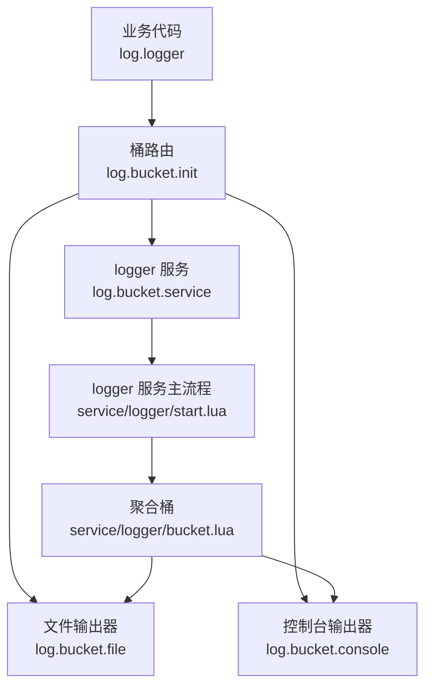
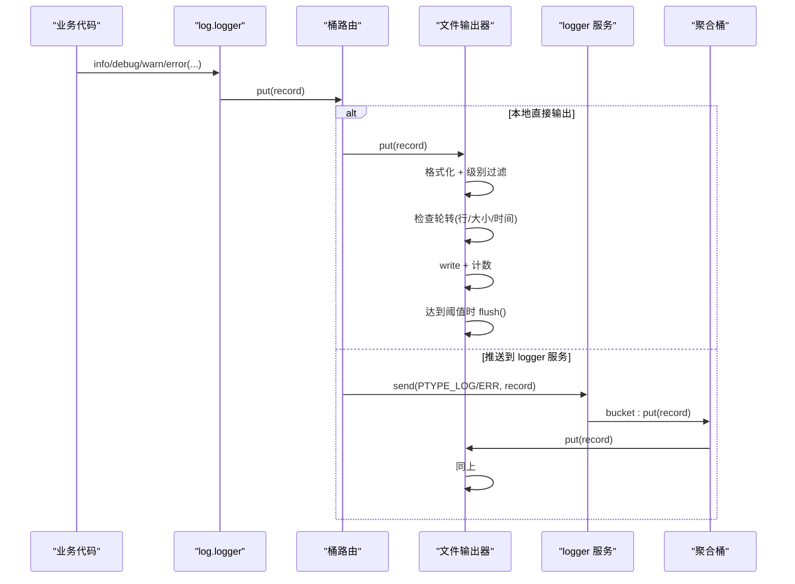
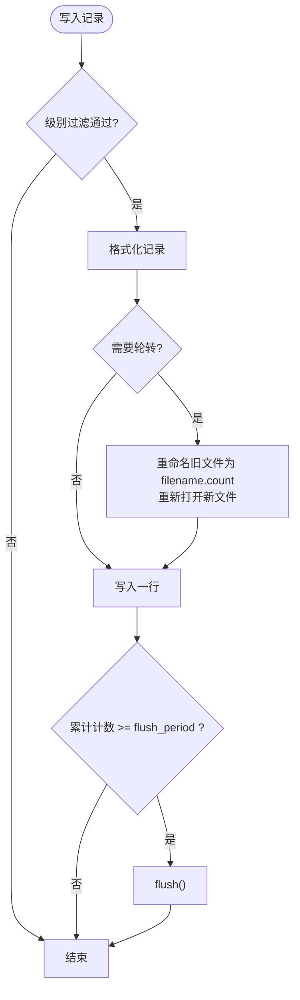
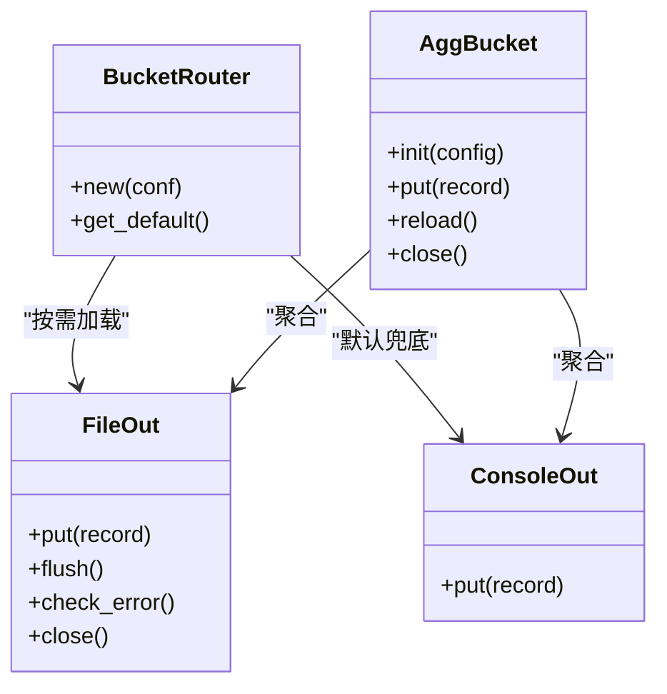
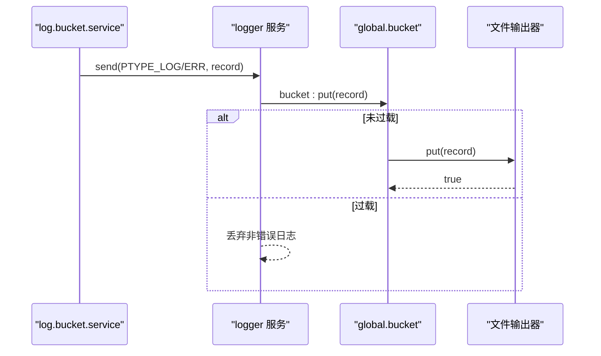
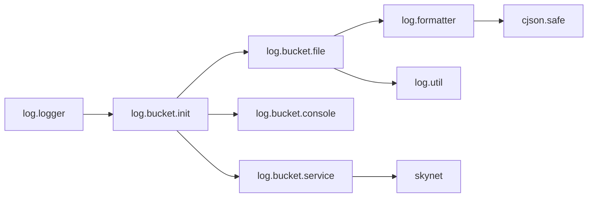

# 文件输出

<cite>
**本文引用的文件**
- [lualib/log/init.lua](file://lualib/log/init.lua)
- [lualib/log/logger.lua](file://lualib/log/logger.lua)
- [lualib/log/bucket/init.lua](file://lualib/log/bucket/init.lua)
- [lualib/log/bucket/file.lua](file://lualib/log/bucket/file.lua)
- [lualib/log/bucket/console.lua](file://lualib/log/bucket/console.lua)
- [lualib/log/bucket/service.lua](file://lualib/log/bucket/service.lua)
- [service/logger/start.lua](file://service/logger/start.lua)
- [service/logger/main.lua](file://service/logger/main.lua)
- [service/logger/bucket.lua](file://service/logger/bucket.lua)
- [lualib/log/formatter.lua](file://lualib/log/formatter.lua)
- [lualib/log/util.lua](file://lualib/log/util.lua)
- [etc/app/common.app.lua](file://etc/app/common.app.lua)
- [etc/app/role1.app.lua](file://etc/app/role1.app.lua)
- [etc/core.conf.lua](file://etc/core.conf.lua)
</cite>

## 目录
1. [简介](#简介)
2. [项目结构](#项目结构)
3. [核心组件](#核心组件)
4. [架构总览](#架构总览)
5. [详细组件分析](#详细组件分析)
6. [依赖关系分析](#依赖关系分析)
7. [性能考量](#性能考量)
8. [故障排查指南](#故障排查指南)
9. [结论](#结论)
10. [附录：配置与示例](#附录配置与示例)

## 简介
本章节面向 SkyExt 框架的文件日志输出能力，系统性说明其异步写入机制、文件轮转策略与磁盘空间管理；详解文件路径配置、命名规则、压缩策略等高级特性；提供多文件输出、按时间轮转、按大小轮转等场景的配置指引；并总结性能优化技巧、错误处理机制、监控指标以及日志清理与备份方案。

## 项目结构
SkyExt 的日志子系统由“调用方 -> 桶路由 -> 具体输出器”的分层组成：
- 调用方通过 log.logger 统一接口记录结构化日志，并将记录投递到桶（bucket）。
- 桶负责将记录分发到一个或多个具体输出器（如文件、控制台、远程服务）。
- 文件输出器实现落盘、格式化、轮转与刷盘策略。
- logger 服务集中接收日志消息，进行过载保护与路由。

图表来源
- [lualib/log/logger.lua:108-129](file://lualib/log/logger.lua#L108-L129)
- [lualib/log/bucket/init.lua:5-22](file://lualib/log/bucket/init.lua#L5-L22)
- [lualib/log/bucket/file.lua:119-141](file://lualib/log/bucket/file.lua#L119-L141)
- [lualib/log/bucket/console.lua:13-19](file://lualib/log/bucket/console.lua#L13-L19)
- [lualib/log/bucket/service.lua:24-31](file://lualib/log/bucket/service.lua#L24-L31)
- [service/logger/start.lua:52-73](file://service/logger/start.lua#L52-L73)
- [service/logger/bucket.lua:8-28](file://service/logger/bucket.lua#L8-L28)

章节来源
- [lualib/log/init.lua:1-58](file://lualib/log/init.lua#L1-L58)
- [lualib/log/logger.lua:1-291](file://lualib/log/logger.lua#L1-L291)
- [lualib/log/bucket/init.lua:1-31](file://lualib/log/bucket/init.lua#L1-L31)
- [lualib/log/bucket/file.lua:1-254](file://lualib/log/bucket/file.lua#L1-L254)
- [lualib/log/bucket/console.lua:1-37](file://lualib/log/bucket/console.lua#L1-L37)
- [lualib/log/bucket/service.lua:1-57](file://lualib/log/bucket/service.lua#L1-L57)
- [service/logger/start.lua:1-84](file://service/logger/start.lua#L1-L84)
- [service/logger/bucket.lua:1-74](file://service/logger/bucket.lua#L1-L74)

## 核心组件
- 日志门面与对象：提供 debug/info/warn/error 等接口，封装结构化事件打包、堆栈回溯、级别过滤与异常安全。
- 桶路由：根据名称动态加载具体输出器，支持默认兜底。
- 文件输出器：实现文本/JSON 格式化、按行/按大小/按小时或天轮转、缓冲与刷盘、错误检测。
- 控制台输出器：标准输出彩色或纯文本日志。
- 服务桥接：将日志消息发送到 logger 服务，区分普通与错误通道。
- 聚合桶：在 logger 服务内聚合多个输出器，支持重载与关闭。

章节来源
- [lualib/log/logger.lua:66-129](file://lualib/log/logger.lua#L66-L129)
- [lualib/log/bucket/init.lua:1-31](file://lualib/log/bucket/init.lua#L1-L31)
- [lualib/log/bucket/file.lua:17-159](file://lualib/log/bucket/file.lua#L17-L159)
- [lualib/log/bucket/console.lua:1-37](file://lualib/log/bucket/console.lua#L1-L37)
- [lualib/log/bucket/service.lua:1-57](file://lualib/log/bucket/service.lua#L1-L57)
- [service/logger/bucket.lua:1-74](file://service/logger/bucket.lua#L1-L74)

## 架构总览
下图展示从业务代码到文件落盘的完整链路，包括异步化、轮转与刷盘的关键点。

图表来源
- [lualib/log/logger.lua:108-129](file://lualib/log/logger.lua#L108-L129)
- [lualib/log/bucket/init.lua:5-22](file://lualib/log/bucket/init.lua#L5-L22)
- [lualib/log/bucket/service.lua:24-31](file://lualib/log/bucket/service.lua#L24-L31)
- [service/logger/start.lua:52-73](file://service/logger/start.lua#L52-L73)
- [service/logger/bucket.lua:8-28](file://service/logger/bucket.lua#L8-L28)
- [lualib/log/bucket/file.lua:119-141](file://lualib/log/bucket/file.lua#L119-L141)

## 详细组件分析

### 文件输出器（按行/按大小/按时间轮转）
- 轮转策略
  - 按行：维护行计数器，超过阈值后触发轮转。
  - 按大小：累计写入字节数，超过阈值后触发轮转。
  - 按时间：按小时或天切换，基于系统时间比较。
- 文件命名与轮转
  - 当前文件为配置的 filename。
  - 轮转后的文件命名为 filename.count（count 自增），避免覆盖。
  - 启动时若已有历史文件且存在轮转策略，会先执行一次切分以对齐状态。
- 缓冲与刷盘
  - 支持 line 缓冲或全量缓冲（full buffer），全量缓冲大小由 flush_period * 单行估算长度决定。
  - 达到 flush_period 条数时主动 flush，降低系统调用次数。
- 错误检测
  - 每次 flush 结果被记录，可通过 check_error 判断是否出现 IO 错误。
- 格式化
  - 支持 text/json 两种格式，text 支持自定义 style 函数与 ANSI 颜色。

图表来源
- [lualib/log/bucket/file.lua:31-75](file://lualib/log/bucket/file.lua#L31-L75)
- [lualib/log/bucket/file.lua:77-117](file://lualib/log/bucket/file.lua#L77-L117)
- [lualib/log/bucket/file.lua:119-146](file://lualib/log/bucket/file.lua#L119-L146)
- [lualib/log/bucket/file.lua:161-206](file://lualib/log/bucket/file.lua#L161-L206)
- [lualib/log/bucket/file.lua:223-250](file://lualib/log/bucket/file.lua#L223-L250)

章节来源
- [lualib/log/bucket/file.lua:1-254](file://lualib/log/bucket/file.lua#L1-L254)

### 桶路由与聚合桶
- 桶路由
  - 根据 name 动态 require 对应模块（如 file、console、service）。
  - 提供默认兜底桶（console），确保即使配置失败也能输出。
- 聚合桶（logger 服务内）
  - 初始化时创建多个输出器实例。
  - 任一输出成功即认为本次投递成功；全部失败则回退到默认桶。
  - 支持 reload/close 生命周期管理。

图表来源
- [lualib/log/bucket/init.lua:5-22](file://lualib/log/bucket/init.lua#L5-L22)
- [service/logger/bucket.lua:8-28](file://service/logger/bucket.lua#L8-L28)
- [lualib/log/bucket/file.lua:119-159](file://lualib/log/bucket/file.lua#L119-L159)
- [lualib/log/bucket/console.lua:13-19](file://lualib/log/bucket/console.lua#L13-L19)

章节来源
- [lualib/log/bucket/init.lua:1-31](file://lualib/log/bucket/init.lua#L1-L31)
- [service/logger/bucket.lua:1-74](file://service/logger/bucket.lua#L1-L74)

### 日志服务桥接与过载保护
- 协议注册：定义 PTYPE_LOG 与 PTYPE_LOG_ERR 两个通道。
- 路由逻辑：ERROR 及以上不进入流控，直接投递；其他级别在过载时丢弃。
- 服务发现：通过 .logger 全局名定位 logger 服务地址。
- 启动失败兜底：当 logger 服务启动失败时，将错误信息写入 bootfail.log 并中止进程。

图表来源
- [lualib/log/bucket/service.lua:9-31](file://lualib/log/bucket/service.lua#L9-L31)
- [service/logger/start.lua:52-73](file://service/logger/start.lua#L52-L73)
- [service/logger/main.lua:1-18](file://service/logger/main.lua#L1-L18)

章节来源
- [lualib/log/bucket/service.lua:1-57](file://lualib/log/bucket/service.lua#L1-L57)
- [service/logger/start.lua:1-84](file://service/logger/start.lua#L1-L84)
- [service/logger/main.lua:1-18](file://service/logger/main.lua#L1-L18)

### 格式化与颜色
- 文本格式：包含时间戳、级别、模块、行号、消息及结构化事件键值对。
- JSON 格式：使用 cjson.safe 编码，便于外部采集。
- 颜色：可选开启 ANSI 颜色码，便于终端阅读。

章节来源
- [lualib/log/formatter.lua:1-130](file://lualib/log/formatter.lua#L1-L130)

## 依赖关系分析
- 调用链耦合
  - log.logger 依赖 log.bucket 抽象，解耦具体输出实现。
  - 文件输出器依赖 formatter 与 util（级别解析与过滤）。
  - 服务桥接依赖 skynet 协议与 ptype。
- 外部依赖
  - skynet 运行时用于服务通信与系统回调。
  - cjson 用于 JSON 序列化。
  - io 库用于文件读写与缓冲控制。

图表来源
- [lualib/log/logger.lua:1-6](file://lualib/log/logger.lua#L1-L6)
- [lualib/log/bucket/init.lua:5-22](file://lualib/log/bucket/init.lua#L5-L22)
- [lualib/log/bucket/file.lua:1-7](file://lualib/log/bucket/file.lua#L1-L7)
- [lualib/log/bucket/service.lua:1-19](file://lualib/log/bucket/service.lua#L1-L19)
- [lualib/log/formatter.lua:58-78](file://lualib/log/formatter.lua#L58-L78)

章节来源
- [lualib/log/logger.lua:1-291](file://lualib/log/logger.lua#L1-L291)
- [lualib/log/bucket/init.lua:1-31](file://lualib/log/bucket/init.lua#L1-L31)
- [lualib/log/bucket/file.lua:1-254](file://lualib/log/bucket/file.lua#L1-L254)
- [lualib/log/bucket/service.lua:1-57](file://lualib/log/bucket/service.lua#L1-L57)
- [lualib/log/formatter.lua:1-130](file://lualib/log/formatter.lua#L1-L130)

## 性能考量
- 异步与批量化
  - 通过 flush_period 批量刷盘，减少 fsync 次数，提升吞吐。
  - 使用 full 缓冲模式可进一步降低系统调用开销。
- 级别过滤
  - 在写入前进行级别范围过滤，避免无用日志占用 I/O。
- 轮转时机
  - 按大小轮转时，累计字节数仅在增量大于零时更新，避免重复计算。
- 过载保护
  - 在 logger 服务侧对非错误日志进行丢弃，保障核心服务稳定性。
- 格式化成本
  - JSON 序列化有额外 CPU 开销，高吞吐场景建议优先使用 text。

[本节为通用性能指导，无需特定文件引用]

## 故障排查指南
- 启动失败日志
  - 当 logger 服务启动失败时，错误信息会被写入 bootfail.log，便于快速定位。
- 写入错误检测
  - 文件输出器记录最近一次 flush 结果，可通过 check_error 判断是否存在 IO 错误。
- 级别与配置校验
  - 日志级别范围需满足 lower <= upper，否则抛出异常。
  - 必填参数 filename 缺失时会报错。
- 颜色与终端
  - 启用 color 会在文本中插入 ANSI 控制序列，某些环境可能显示异常，可关闭 color。

章节来源
- [service/logger/main.lua:1-18](file://service/logger/main.lua#L1-L18)
- [lualib/log/bucket/file.lua:143-150](file://lualib/log/bucket/file.lua#L143-L150)
- [lualib/log/util.lua:9-22](file://lualib/log/util.lua#L9-L22)
- [lualib/log/bucket/file.lua:223-225](file://lualib/log/bucket/file.lua#L223-L225)
- [lualib/log/formatter.lua:102-110](file://lualib/log/formatter.lua#L102-L110)

## 结论
SkyExt 的文件日志输出具备完善的异步化、轮转与缓冲机制，支持按行、按大小、按时间多种轮转策略，并提供 JSON/text 格式化与颜色输出。通过 logger 服务的聚合桶与过载保护，系统在高压下仍能保持稳定。结合合理的 flush_period、级别过滤与轮转阈值，可在保证可观测性的同时最大化性能。

[本节为总结性内容，无需特定文件引用]

## 附录：配置与示例
- 多文件输出
  - 在应用配置中定义多个 log_config 条目，分别指向不同文件名，即可实现多文件输出。
  - 参考：[etc/app/role1.app.lua:16-26](file://etc/app/role1.app.lua#L16-L26)
- 按时间轮转
  - 设置 split=hour 或 split=day，配合 filename 指定输出路径。
  - 参考：[etc/app/common.app.lua:16-19](file://etc/app/common.app.lua#L16-L19)
- 按大小轮转
  - 设置 split=size 与 maxsize（例如 100M），文件超过阈值自动轮转。
  - 参考：[etc/app/common.app.lua:10-15](file://etc/app/common.app.lua#L10-L15)
- 按行数轮转
  - 设置 split=line 与 maxline，达到行数阈值后轮转。
  - 参考：[etc/app/common.app.lua:10-15](file://etc/app/common.app.lua#L10-L15)
- 日志级别范围
  - 使用 level=INFO-DEBUG 形式限定输出级别范围。
  - 参考：[lualib/log/util.lua:9-18](file://lualib/log/util.lua#L9-L18)
- 启动失败日志路径
  - 通过 bootfaillogpath 配置启动失败日志位置。
  - 参考：[etc/app/common.app.lua:2](file://etc/app/common.app.lua#L2)
- 服务入口与路径
  - core.conf 中定义日志服务名与服务搜索路径。
  - 参考：[etc/core.conf.lua:28-30](file://etc/core.conf.lua#L28-L30)

章节来源
- [etc/app/role1.app.lua:16-26](file://etc/app/role1.app.lua#L16-L26)
- [etc/app/common.app.lua:1-19](file://etc/app/common.app.lua#L1-L19)
- [lualib/log/util.lua:9-18](file://lualib/log/util.lua#L9-L18)
- [etc/core.conf.lua:28-30](file://etc/core.conf.lua#L28-L30)