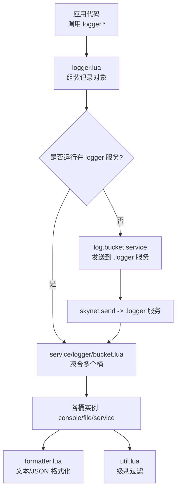
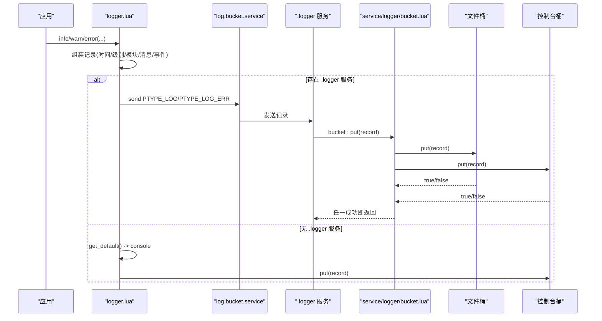
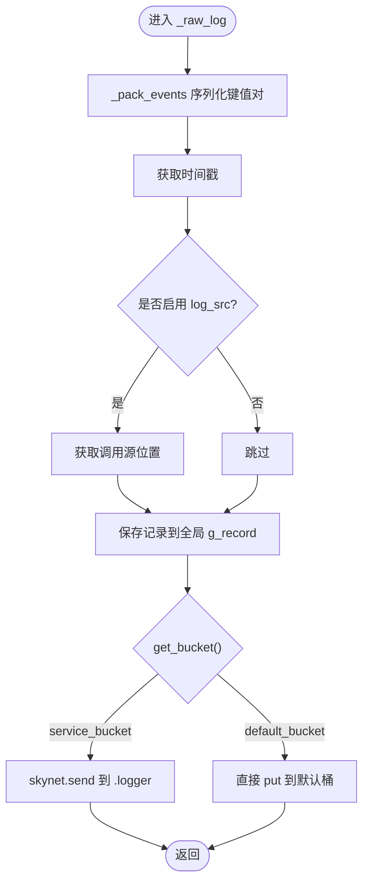
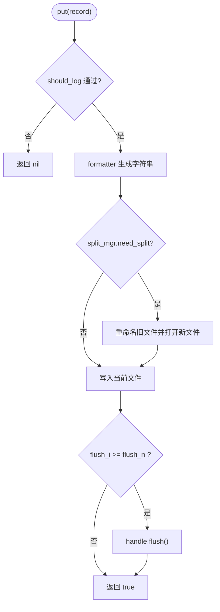
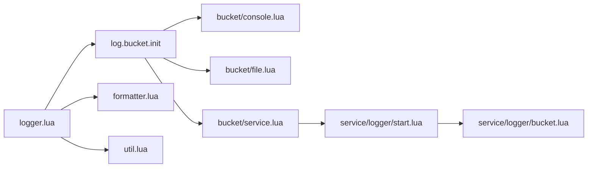

# 日志桶系统

<cite>
**本文引用的文件**
- [lualib/log/bucket/init.lua](file://lualib/log/bucket/init.lua)
- [lualib/log/bucket/console.lua](file://lualib/log/bucket/console.lua)
- [lualib/log/bucket/file.lua](file://lualib/log/bucket/file.lua)
- [lualib/log/bucket/service.lua](file://lualib/log/bucket/service.lua)
- [service/logger/bucket.lua](file://service/logger/bucket.lua)
- [lualib/log/logger.lua](file://lualib/log/logger.lua)
- [lualib/log/formatter.lua](file://lualib/log/formatter.lua)
- [lualib/log/util.lua](file://lualib/log/util.lua)
- [service/logger/start.lua](file://service/logger/start.lua)
- [etc/app/common.app.lua](file://etc/app/common.app.lua)
- [etc/app/role1.app.lua](file://etc/app/role1.app.lua)
</cite>

## 目录
1. [简介](#简介)
2. [项目结构](#项目结构)
3. [核心组件](#核心组件)
4. [架构总览](#架构总览)
5. [详细组件分析](#详细组件分析)
6. [依赖关系分析](#依赖关系分析)
7. [性能与内存管理](#性能与内存管理)
8. [故障排查指南](#故障排查指南)
9. [结论](#结论)
10. [附录：配置与示例](#附录配置与示例)

## 简介
本技术文档围绕 SkyExt 框架的“日志桶系统”展开，系统性阐述其设计原理、异步写入机制、多目标输出能力（控制台、文件、服务间通信），并给出自定义输出目标、日志轮转、批量写入优化等实践方法。同时覆盖性能特性、内存管理、错误处理与监控指标，以及日志收集、分析与存储的高级实现建议。

## 项目结构
日志桶系统由“日志记录器”、“日志桶工厂与分发”、“具体输出目标（控制台/文件/服务）”和“日志服务（可选）”组成，配合格式化器与工具模块完成结构化日志的生成与输出。

图表来源
- [lualib/log/logger.lua:25-49](file://lualib/log/logger.lua#L25-L49)
- [lualib/log/bucket/service.lua:24-31](file://lualib/log/bucket/service.lua#L24-L31)
- [service/logger/bucket.lua:8-28](file://service/logger/bucket.lua#L8-L28)
- [lualib/log/formatter.lua:75-127](file://lualib/log/formatter.lua#L75-L127)
- [lualib/log/util.lua:9-22](file://lualib/log/util.lua#L9-L22)

章节来源
- [lualib/log/logger.lua:25-49](file://lualib/log/logger.lua#L25-L49)
- [lualib/log/bucket/init.lua:5-22](file://lualib/log/bucket/init.lua#L5-L22)
- [service/logger/start.lua:68-75](file://service/logger/start.lua#L68-L75)

## 核心组件
- 日志记录器（logger.lua）：负责组装结构化日志记录、级别过滤、堆栈追踪、异常包装，并将记录投递到合适的桶。
- 日志桶工厂（bucket/init.lua）：根据 name 动态加载具体桶实现；提供默认桶（console）。
- 控制台桶（bucket/console.lua）：将格式化后的日志写入标准输出，支持颜色与样式。
- 文件桶（bucket/file.lua）：支持按行、按大小、按小时/天进行日志轮转，支持缓冲刷新策略。
- 服务桶（bucket/service.lua）：通过 skynet 协议将日志推送到独立的 logger 服务，区分普通日志与错误日志通道。
- 服务内聚合桶（service/logger/bucket.lua）：聚合多个桶实例，任一成功即认为成功，否则回退到默认桶。
- 格式化器（formatter.lua）：提供 JSON 与文本两种格式，支持颜色与自定义样式函数。
- 工具模块（util.lua）：解析日志级别范围与判断是否需要输出。

章节来源
- [lualib/log/logger.lua:70-129](file://lualib/log/logger.lua#L70-L129)
- [lualib/log/bucket/init.lua:5-22](file://lualib/log/bucket/init.lua#L5-L22)
- [lualib/log/bucket/console.lua:13-34](file://lualib/log/bucket/console.lua#L13-L34)
- [lualib/log/bucket/file.lua:119-146](file://lualib/log/bucket/file.lua#L119-L146)
- [lualib/log/bucket/service.lua:24-53](file://lualib/log/bucket/service.lua#L24-L53)
- [service/logger/bucket.lua:8-70](file://service/logger/bucket.lua#L8-L70)
- [lualib/log/formatter.lua:75-127](file://lualib/log/formatter.lua#L75-L127)
- [lualib/log/util.lua:9-22](file://lualib/log/util.lua#L9-L22)

## 架构总览
日志从应用层进入 logger，构造结构化记录后交由桶系统。若当前进程存在 logger 服务，则优先使用服务桶转发至 .logger 服务；否则直接本地输出。服务内的聚合桶会并行投递到所有配置的桶（如文件、控制台、其他服务），只要有一个成功即视为成功，失败时回退到默认桶保证不丢日志。

图表来源
- [lualib/log/logger.lua:25-49](file://lualib/log/logger.lua#L25-L49)
- [lualib/log/bucket/service.lua:24-31](file://lualib/log/bucket/service.lua#L24-L31)
- [service/logger/start.lua:52-66](file://service/logger/start.lua#L52-L66)
- [service/logger/bucket.lua:8-28](file://service/logger/bucket.lua#L8-L28)

## 详细组件分析

### 日志记录器（logger.lua）
- 职责：组装结构化记录、级别过滤、异常包装、堆栈追踪、选择桶并投递。
- 关键点：
  - 优先尝试 service_bucket（当运行在 logger 服务或可路由到 .logger 服务时），否则回退到默认桶。
  - 记录对象包含 module、level、timestamp、line、msg、events。
  - 对 error/fatal 等场景附加堆栈信息，便于定位问题。
  - 提供 safe_pcall/safe_xpcall 以在错误上下文中避免重复堆栈采集。

图表来源
- [lualib/log/logger.lua:70-129](file://lualib/log/logger.lua#L70-L129)
- [lualib/log/logger.lua:25-49](file://lualib/log/logger.lua#L25-L49)

章节来源
- [lualib/log/logger.lua:70-129](file://lualib/log/logger.lua#L70-L129)
- [lualib/log/logger.lua:25-49](file://lualib/log/logger.lua#L25-L49)

### 控制台桶（console.lua）
- 职责：将格式化后的日志写入标准输出，支持颜色与样式。
- 关键点：
  - 基于 util.should_log 进行级别过滤。
  - 使用 formatter.get_formatter 生成最终字符串。
  - 通过 io.stdout 写入，适合开发调试。

章节来源
- [lualib/log/bucket/console.lua:13-34](file://lualib/log/bucket/console.lua#L13-L34)
- [lualib/log/formatter.lua:113-127](file://lualib/log/formatter.lua#L113-L127)
- [lualib/log/util.lua:20-22](file://lualib/log/util.lua#L20-L22)

### 文件桶（file.lua）
- 职责：将日志写入文件，支持多种轮转策略与缓冲刷新。
- 轮转策略：
  - line：按行数轮转，超过 maxline 切换新文件。
  - size：按文件大小轮转，超过 maxsize 切换新文件。
  - hour/day：按时间切分，跨小时/日自动切换。
- 刷新策略：
  - flush_period：每 N 条日志刷盘一次，提升吞吐。
  - setvbuf：根据 flush_period 设置全缓冲或行缓冲。
- 错误处理：
  - check_error 检测 flush_ok 状态。
  - split 过程中重命名旧文件并打开新文件，保持连续写入。

图表来源
- [lualib/log/bucket/file.lua:119-146](file://lualib/log/bucket/file.lua#L119-L146)
- [lualib/log/bucket/file.lua:31-75](file://lualib/log/bucket/file.lua#L31-L75)
- [lualib/log/bucket/file.lua:77-117](file://lualib/log/bucket/file.lua#L77-L117)

章节来源
- [lualib/log/bucket/file.lua:119-146](file://lualib/log/bucket/file.lua#L119-L146)
- [lualib/log/bucket/file.lua:168-206](file://lualib/log/bucket/file.lua#L168-L206)
- [lualib/log/bucket/file.lua:223-250](file://lualib/log/bucket/file.lua#L223-L250)

### 服务桶（bucket/service.lua）
- 职责：将日志通过 skynet 协议发送到 .logger 服务，区分普通日志与错误日志通道。
- 关键点：
  - 注册 PTYPE_LOG 与 PTYPE_LOG_ERR 协议。
  - 当 record.level <= WARN 时走错误通道，否则走普通通道。
  - 若当前即为 .logger 服务，则返回其内部 bucket 实例，避免自环。

章节来源
- [lualib/log/bucket/service.lua:9-19](file://lualib/log/bucket/service.lua#L9-L19)
- [lualib/log/bucket/service.lua:24-53](file://lualib/log/bucket/service.lua#L24-L53)

### 服务内聚合桶（service/logger/bucket.lua）
- 职责：聚合多个桶实例，并行投递，任一成功即认为成功；全部失败时回退到默认桶。
- 关键点：
  - init 阶段创建各桶实例，失败时记录错误。
  - reload/close 透传到子桶，支持热重载与优雅关闭。

章节来源
- [service/logger/bucket.lua:8-70](file://service/logger/bucket.lua#L8-L70)

### 日志服务（service/logger/start.lua）
- 职责：启动 .logger 服务，注册协议回调，接收日志并交给聚合桶处理。
- 关键点：
  - 捕获 SYSTEM 信号触发 bucket.reload。
  - text 协议用于捕获内核文本输出，记录为日志。
  - 过载保护：当 global.log_overload 为真时丢弃普通日志，保留错误日志。

章节来源
- [service/logger/start.lua:23-50](file://service/logger/start.lua#L23-L50)
- [service/logger/start.lua:52-66](file://service/logger/start.lua#L52-L66)
- [service/logger/start.lua:68-75](file://service/logger/start.lua#L68-L75)

## 依赖关系分析
- logger.lua 依赖 log.bucket 与 log.formatter、log.util。
- bucket/init.lua 动态加载具体桶实现（console/file/service）。
- file.lua 依赖 time、log.util、log.formatter。
- service/logger/start.lua 依赖 config、cmd_api、global、bucket、logger、ptype。
- 配置文件通过 log_config 数组定义多个桶实例，形成多目标输出。

图表来源
- [lualib/log/logger.lua:1-6](file://lualib/log/logger.lua#L1-L6)
- [lualib/log/bucket/init.lua:5-22](file://lualib/log/bucket/init.lua#L5-L22)
- [lualib/log/bucket/file.lua:1-8](file://lualib/log/bucket/file.lua#L1-L8)
- [lualib/log/bucket/service.lua:1-19](file://lualib/log/bucket/service.lua#L1-L19)
- [service/logger/start.lua:1-10](file://service/logger/start.lua#L1-L10)
- [service/logger/bucket.lua:1-7](file://service/logger/bucket.lua#L1-L7)

章节来源
- [lualib/log/logger.lua:1-6](file://lualib/log/logger.lua#L1-L6)
- [lualib/log/bucket/init.lua:5-22](file://lualib/log/bucket/init.lua#L5-L22)
- [service/logger/start.lua:68-75](file://service/logger/start.lua#L68-L75)

## 性能与内存管理
- 级别过滤：在写入前通过 should_log 快速过滤低优先级日志，减少格式化与 IO。
- 缓冲策略：文件桶支持 flush_period，结合 setvbuf 降低系统调用次数，提高吞吐。
- 复用记录对象：logger.lua 使用全局 g_record 复用记录表，减少分配。
- 服务化：通过 .logger 服务集中处理日志，避免业务线程阻塞；支持过载保护丢弃普通日志。
- 轮转优化：文件桶在轮转时仅重命名与重新打开文件，避免数据丢失。
- 内存管理：
  - 控制 events 表大小与序列化深度（traceback 限制）。
  - 合理设置 flush_period 与 maxsize/maxline，平衡持久化与内存占用。
- 监控指标建议：
  - 统计每个桶的 put 成功/失败次数。
  - 统计轮转次数与文件大小变化。
  - 记录 .logger 服务队列长度与丢弃率（过载时）。

[本节为通用性能指导，不直接分析具体文件]

## 故障排查指南
- 无法找到桶名称：检查 log_config 中 name 是否正确，确保对应模块存在。
- 文件写入失败：检查路径权限与磁盘空间；关注 check_error 返回值。
- 日志未输出：确认级别范围配置正确，should_log 是否放行。
- 服务不可达：确认 .logger 服务已启动且注册名正确；检查 skynet.localname 结果。
- 启动失败日志：查看 bootfaillogpath 指定的文件，定位初始化错误。

章节来源
- [lualib/log/bucket/init.lua:5-22](file://lualib/log/bucket/init.lua#L5-L22)
- [lualib/log/bucket/file.lua:143-150](file://lualib/log/bucket/file.lua#L143-L150)
- [lualib/log/util.lua:9-22](file://lualib/log/util.lua#L9-L22)
- [lualib/log/bucket/service.lua:33-53](file://lualib/log/bucket/service.lua#L33-L53)
- [service/logger/main.lua:1-18](file://service/logger/main.lua#L1-L18)

## 结论
SkyExt 的日志桶系统通过“记录器 + 桶工厂 + 多目标输出 + 服务化聚合”的设计，实现了高可用、可扩展、高性能的日志体系。其灵活的轮转策略、缓冲刷新与服务化传输，使得在不同部署环境下都能获得良好的日志体验。结合合理的配置与监控，可有效支撑生产环境的日志收集、分析与存储需求。

[本节为总结性内容，不直接分析具体文件]

## 附录：配置与示例
- 多目标输出配置：
  - 在 app 配置中定义 log_config 数组，分别指定 file 与 console 桶。
  - 示例参考 role1.app.lua 与 common.app.lua。
- 日志轮转配置：
  - 文件桶支持 split=size/line/hour/day，并配套 maxsize/maxline 参数。
  - 示例参考 common.app.lua 中的默认配置。
- 批量写入优化：
  - 设置 flush_period > 0，减少频繁刷盘。
  - 结合 setvbuf 策略，提升写入吞吐。
- 自定义输出目标：
  - 在 lualib/log/bucket 下新增模块，实现 new(params) 与 put(record) 接口。
  - 在 log_config 中添加 name 指向新模块，即可被聚合桶调度。
- 服务间通信：
  - 使用 name="service" 的桶，将日志发送到 .logger 服务。
  - 在服务端通过 PTYPE_LOG/PTYPE_LOG_ERR 区分普通与错误日志。

章节来源
- [etc/app/role1.app.lua:16-26](file://etc/app/role1.app.lua#L16-L26)
- [etc/app/common.app.lua:1-19](file://etc/app/common.app.lua#L1-L19)
- [lualib/log/bucket/file.lua:223-250](file://lualib/log/bucket/file.lua#L223-L250)
- [lualib/log/bucket/service.lua:24-53](file://lualib/log/bucket/service.lua#L24-L53)