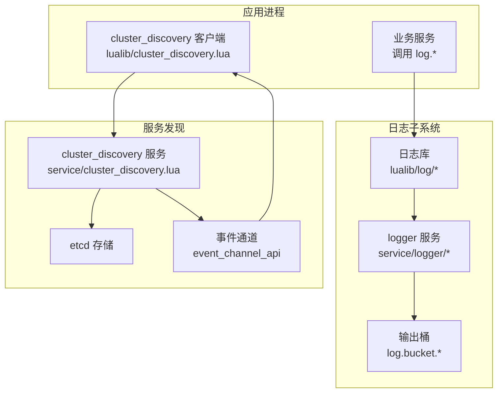
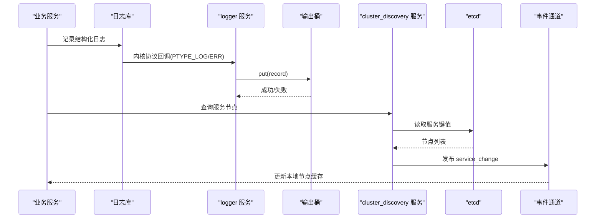
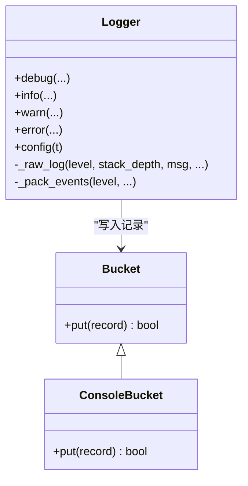
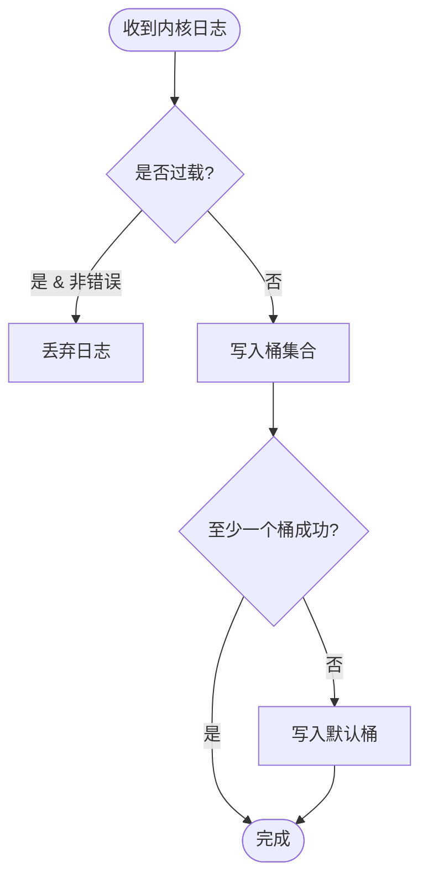
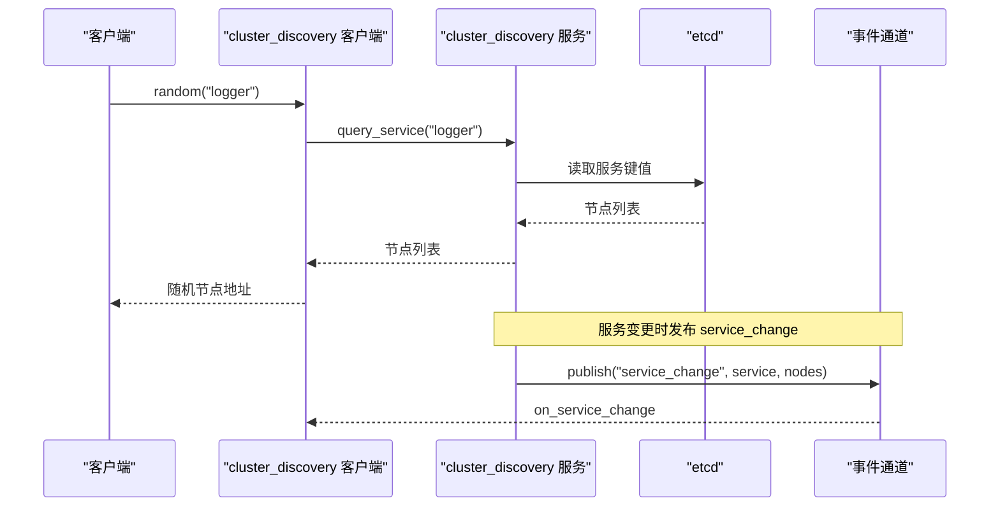
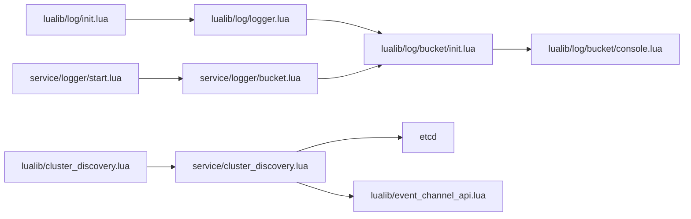

# 服务间通信

<cite>
**本文引用的文件**
- [service/logger/main.lua](file://service/logger/main.lua)
- [service/logger/start.lua](file://service/logger/start.lua)
- [service/logger/bucket.lua](file://service/logger/bucket.lua)
- [lualib/log/init.lua](file://lualib/log/init.lua)
- [lualib/log/logger.lua](file://lualib/log/logger.lua)
- [lualib/log/bucket/init.lua](file://lualib/log/bucket/init.lua)
- [lualib/log/formatter.lua](file://lualib/log/formatter.lua)
- [lualib/log/util.lua](file://lualib/log/util.lua)
- [lualib/cluster_discovery.lua](file://lualib/cluster_discovery.lua)
- [service/cluster_discovery.lua](file://service/cluster_discovery.lua)
- [lualib/event_channel_api.lua](file://lualib/event_channel_api.lua)
- [etc/core.conf.lua](file://etc/core.conf.lua)
- [etc/role1.conf.lua](file://etc/role1.conf.lua)
</cite>

## 目录
1. [简介](#简介)
2. [项目结构](#项目结构)
3. [核心组件](#核心组件)
4. [架构总览](#架构总览)
5. [详细组件分析](#详细组件分析)
6. [依赖关系分析](#依赖关系分析)
7. [性能与可扩展性](#性能与可扩展性)
8. [故障恢复与高可用](#故障恢复与高可用)
9. [配置与服务路由指南](#配置与服务路由指南)
10. [分布式日志收集实践](#分布式日志收集实践)
11. [问题排查](#问题排查)
12. [结论](#结论)

## 简介
本文档围绕 SkyExt 框架的服务间日志通信能力，系统阐述基于 Skynet 的日志收集架构、消息传递机制以及与 etcd 集成的服务发现。内容涵盖：
- 如何配置日志服务、设置服务路由
- 如何在微服务中统一收集、聚合、过滤和转发日志
- 服务间通信的性能考虑、故障恢复与负载均衡策略
- 通过事件通道实现服务变更通知，支撑动态路由与弹性伸缩

## 项目结构
SkyExt 将日志子系统与集群服务发现解耦：
- 日志库位于 lualib/log，提供结构化日志、格式化、级别控制与输出桶（bucket）抽象
- 日志服务位于 service/logger，负责接收内核日志、过载保护、多桶分发与热重载
- 服务发现位于 service/cluster_discovery，基于 etcd 维护节点与服务实例信息，并通过事件通道广播变更
- 客户端侧通过 lualib/cluster_discovery 获取服务节点列表并支持随机选择

图表来源
- [service/logger/start.lua:52-75](file://service/logger/start.lua#L52-L75)
- [lualib/log/logger.lua:25-48](file://lualib/log/logger.lua#L25-L48)
- [service/cluster_discovery.lua:646-667](file://service/cluster_discovery.lua#L646-L667)
- [lualib/event_channel_api.lua:47-55](file://lualib/event_channel_api.lua#L47-L55)

章节来源
- [etc/core.conf.lua:1-30](file://etc/core.conf.lua#L1-L30)
- [etc/role1.conf.lua:1-4](file://etc/role1.conf.lua#L1-L4)

## 核心组件
- 日志库（lualib/log）：提供结构化日志记录、级别过滤、堆栈回溯、JSON/文本格式化，以及“桶”抽象以对接不同后端
- 日志服务（service/logger）：注册内核协议拦截日志、过载保护、多桶并发写入、SIGHUP 热重载
- 服务发现（service/cluster_discovery + lualib/cluster_discovery）：基于 etcd 维护节点和服务实例，发布订阅服务变更事件，提供随机节点选择
- 事件通道（lualib/event_channel_api）：轻量多播通道，用于服务变更等事件推送

章节来源
- [lualib/log/init.lua:1-58](file://lualib/log/init.lua#L1-L58)
- [lualib/log/logger.lua:1-291](file://lualib/log/logger.lua#L1-L291)
- [service/logger/start.lua:1-84](file://service/logger/start.lua#L1-L84)
- [service/cluster_discovery.lua:1-668](file://service/cluster_discovery.lua#L1-L668)
- [lualib/cluster_discovery.lua:1-95](file://lualib/cluster_discovery.lua#L1-L95)
- [lualib/event_channel_api.lua:1-58](file://lualib/event_channel_api.lua#L1-L58)

## 架构总览
日志采集链路：
- 业务服务通过 log.* API 记录结构化日志
- 日志库将记录封装为事件，投递到“桶”；在 logger 服务内，所有日志通过内核协议回调集中汇聚
- 日志服务根据配置创建多个桶（如 console、file、service），按规则分发写入
- 当服务过载时，非错误日志可被丢弃以保证稳定性

服务发现链路：
- cluster_discovery 服务通过 etcd 管理节点租约与服务键值
- 节点心跳与租约续期保证存活检测
- 服务注册/注销后，通过事件通道广播 service_change，客户端缓存节点列表并支持随机选择

图表来源
- [service/logger/start.lua:52-75](file://service/logger/start.lua#L52-L75)
- [lualib/log/logger.lua:25-48](file://lualib/log/logger.lua#L25-L48)
- [service/cluster_discovery.lua:488-512](file://service/cluster_discovery.lua#L488-L512)
- [service/cluster_discovery.lua:587-619](file://service/cluster_discovery.lua#L587-L619)
- [lualib/event_channel_api.lua:47-55](file://lualib/event_channel_api.lua#L47-L55)

## 详细组件分析

### 日志库与结构化日志
- 结构化事件：日志记录包含 module、level、timestamp、line、msg 及自定义 events 键值对
- 级别过滤：支持上下界级别范围，未达级别的日志直接丢弃
- 堆栈回溯：error/fatal 自动附加堆栈，避免重复打印
- 桶抽象：默认使用 console 输出；在 logger 服务内可通过 service bucket 转发到远端或持久化

图表来源
- [lualib/log/logger.lua:66-148](file://lualib/log/logger.lua#L66-L148)
- [lualib/log/bucket/init.lua:5-22](file://lualib/log/bucket/init.lua#L5-L22)
- [lualib/log/bucket/console.lua:13-34](file://lualib/log/bucket/console.lua#L13-L34)

章节来源
- [lualib/log/logger.lua:1-291](file://lualib/log/logger.lua#L1-L291)
- [lualib/log/util.lua:9-22](file://lualib/log/util.lua#L9-L22)
- [lualib/log/formatter.lua:58-100](file://lualib/log/formatter.lua#L58-L100)

### 日志服务与内核协议
- 内核协议回调：拦截 PTYPE_LOG 与 PTYPE_LOG_ERR，统一进入日志服务
- 过载保护：全局过载标志生效时丢弃普通日志，错误日志不流控
- 多桶分发：根据配置初始化多个桶，任一成功即认为成功；失败回退到默认桶
- SIGHUP 热重载：reload 触发各桶重载逻辑

图表来源
- [service/logger/start.lua:52-66](file://service/logger/start.lua#L52-L66)
- [service/logger/bucket.lua:8-28](file://service/logger/bucket.lua#L8-L28)

章节来源
- [service/logger/start.lua:1-84](file://service/logger/start.lua#L1-L84)
- [service/logger/bucket.lua:1-74](file://service/logger/bucket.lua#L1-L74)

### 服务发现与事件通道
- 节点管理：基于 etcd 租约与心跳，维护节点地址与版本
- 服务注册：每个服务在每个节点上以 /skynet/service/{service}/{node} 键发布实例信息
- 监听与同步：watchdir 监听变化，更新本地 map 并 reload skynet.cluster
- 事件广播：通过 event_channel_api 发布 service_change，客户端订阅并更新缓存
- 客户端接口：random(nodes) 随机选择一个节点；nodes(service) 返回全部节点

图表来源
- [lualib/cluster_discovery.lua:61-76](file://lualib/cluster_discovery.lua#L61-L76)
- [service/cluster_discovery.lua:488-512](file://service/cluster_discovery.lua#L488-L512)
- [service/cluster_discovery.lua:587-619](file://service/cluster_discovery.lua#L587-L619)
- [lualib/event_channel_api.lua:29-49](file://lualib/event_channel_api.lua#L29-L49)

章节来源
- [service/cluster_discovery.lua:1-668](file://service/cluster_discovery.lua#L1-L668)
- [lualib/cluster_discovery.lua:1-95](file://lualib/cluster_discovery.lua#L1-L95)
- [lualib/event_channel_api.lua:1-58](file://lualib/event_channel_api.lua#L1-L58)

## 依赖关系分析
- 日志库依赖时间、工具表、日志级别、回溯模块与桶抽象
- 日志服务依赖配置、命令分发、全局状态与桶集合
- 服务发现依赖 etcd、定时器、事件通道与集群模块
- 客户端依赖事件通道与队列锁，确保并发安全

图表来源
- [lualib/log/init.lua:1-58](file://lualib/log/init.lua#L1-L58)
- [lualib/log/logger.lua:1-291](file://lualib/log/logger.lua#L1-L291)
- [lualib/log/bucket/init.lua:1-31](file://lualib/log/bucket/init.lua#L1-L31)
- [service/logger/start.lua:1-84](file://service/logger/start.lua#L1-L84)
- [service/logger/bucket.lua:1-74](file://service/logger/bucket.lua#L1-L74)
- [lualib/cluster_discovery.lua:1-95](file://lualib/cluster_discovery.lua#L1-L95)
- [service/cluster_discovery.lua:1-668](file://service/cluster_discovery.lua#L1-L668)
- [lualib/event_channel_api.lua:1-58](file://lualib/event_channel_api.lua#L1-L58)

章节来源
- [lualib/log/logger.lua:1-291](file://lualib/log/logger.lua#L1-L291)
- [service/logger/start.lua:1-84](file://service/logger/start.lua#L1-L84)
- [service/cluster_discovery.lua:1-668](file://service/cluster_discovery.lua#L1-L668)

## 性能与可扩展性
- 日志写入路径短且异步：内核协议回调直接入桶，减少阻塞
- 过载保护：在日志过载时丢弃非错误日志，保障核心功能稳定
- 多桶并行：同一记录尝试多个桶，任一成功即返回，提高吞吐
- 事件通道广播：服务变更采用多播，避免轮询开销
- 随机负载：客户端随机选择节点，天然具备简单负载均衡能力

[本节为通用性能建议，无需特定文件引用]

## 故障恢复与高可用
- 租约与心跳：etcd 租约过期自动清理失效节点，心跳失败重置并重新申请
- 重试与容错：watch 循环带 sleep，异常捕获后继续；首次查询失败有兜底
- 冲突处理：节点地址冲突时主动撤销旧租约，避免脑裂
- 日志服务启动保护：主入口使用 xpcall 捕获启动错误并写入 bootfail.log，防止静默失败

章节来源
- [service/cluster_discovery.lua:46-73](file://service/cluster_discovery.lua#L46-L73)
- [service/cluster_discovery.lua:117-155](file://service/cluster_discovery.lua#L117-L155)
- [service/cluster_discovery.lua:419-427](file://service/cluster_discovery.lua#L419-L427)
- [service/logger/main.lua:1-18](file://service/logger/main.lua#L1-L18)

## 配置与服务路由指南
- 基础配置
  - 在 core.conf 中指定日志服务名与加载路径，确保 logger 服务可被正确启动
  - 在应用配置中引入 core.conf，并设置 start 入口
- 日志服务配置
  - 通过 config.get_table("log_config") 定义多个桶，每个桶指定 name、level、format 等参数
  - 支持 console、file、service 等多种输出后端
- 服务发现配置
  - 配置 etcd 连接信息与节点名称、监听端口
  - 在业务服务启动后，向 cluster_discovery 注册自身服务名，以便其他服务发现
- 服务路由
  - 使用 cluster_discovery.random("目标服务名") 获取随机节点地址进行 RPC
  - 订阅 service_change 事件，动态刷新本地节点缓存

章节来源
- [etc/core.conf.lua:1-30](file://etc/core.conf.lua#L1-L30)
- [etc/role1.conf.lua:1-4](file://etc/role1.conf.lua#L1-L4)
- [service/logger/start.lua:68-73](file://service/logger/start.lua#L68-L73)
- [lualib/cluster_discovery.lua:10-20](file://lualib/cluster_discovery.lua#L10-L20)
- [service/cluster_discovery.lua:622-644](file://service/cluster_discovery.lua#L622-L644)

## 分布式日志收集实践
- 统一入口：所有服务通过 log.* 记录结构化日志，便于后续解析与聚合
- 集中汇聚：logger 服务作为中心节点，接收内核日志并分发给多个桶
- 过滤与格式化：
  - 级别过滤：仅输出达到阈值的日志
  - 格式器：支持 JSON 与文本格式，便于接入 ELK/Loki 等系统
- 转发与持久化：
  - file 桶：落盘持久化
  - service 桶：可将日志转发至远端日志服务或消息队列
- 示例流程（概念说明）：
  - 业务服务记录 info/warn/error 日志
  - 日志服务根据配置将日志写入本地文件与远端服务
  - 监控告警系统消费远端日志，触发告警

[本节为概念性流程说明，不直接映射具体代码片段]

## 问题排查
- 启动失败无日志
  - 检查 logger 主入口是否正确捕获异常并写入 bootfail.log
- 日志未输出
  - 确认 log_level 与级别范围配置正确
  - 检查桶初始化是否成功，失败会回退到默认桶
- 服务无法发现
  - 检查 etcd 连通性与租约续期
  - 查看 service_change 事件是否发布与订阅
- 过载导致日志丢失
  - 确认过载标志位逻辑，必要时调整阈值或扩容

章节来源
- [service/logger/main.lua:1-18](file://service/logger/main.lua#L1-L18)
- [lualib/log/util.lua:9-22](file://lualib/log/util.lua#L9-L22)
- [service/logger/start.lua:52-66](file://service/logger/start.lua#L52-L66)
- [service/cluster_discovery.lua:46-73](file://service/cluster_discovery.lua#L46-L73)

## 结论
SkyExt 通过“日志库 + 日志服务 + 服务发现 + 事件通道”的组合，实现了：
- 结构化、可过滤、可格式化的日志记录
- 集中式日志汇聚与多后端输出
- 基于 etcd 的高可用服务发现与动态路由
- 事件驱动的节点变更通知与弹性扩展

该架构在保证性能与稳定性的同时，提供了良好的可扩展性与可观测性，适合在微服务环境中统一收集与管理日志。