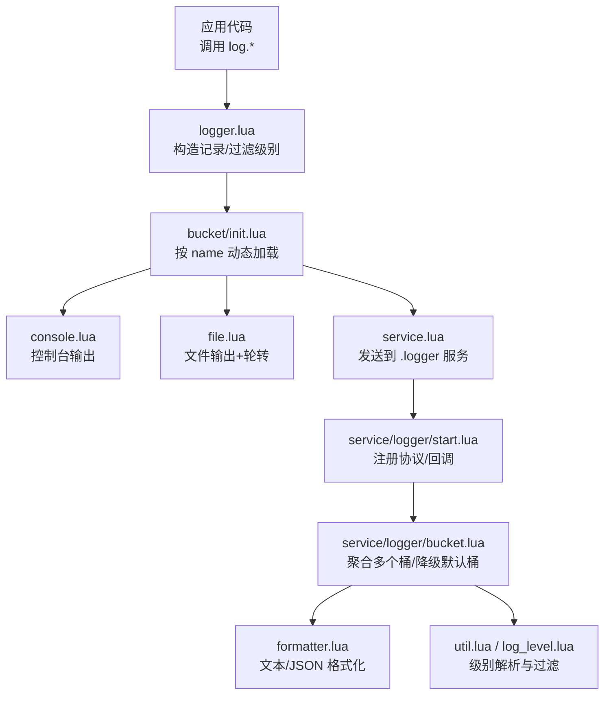
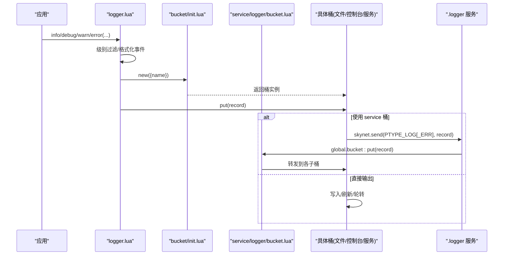
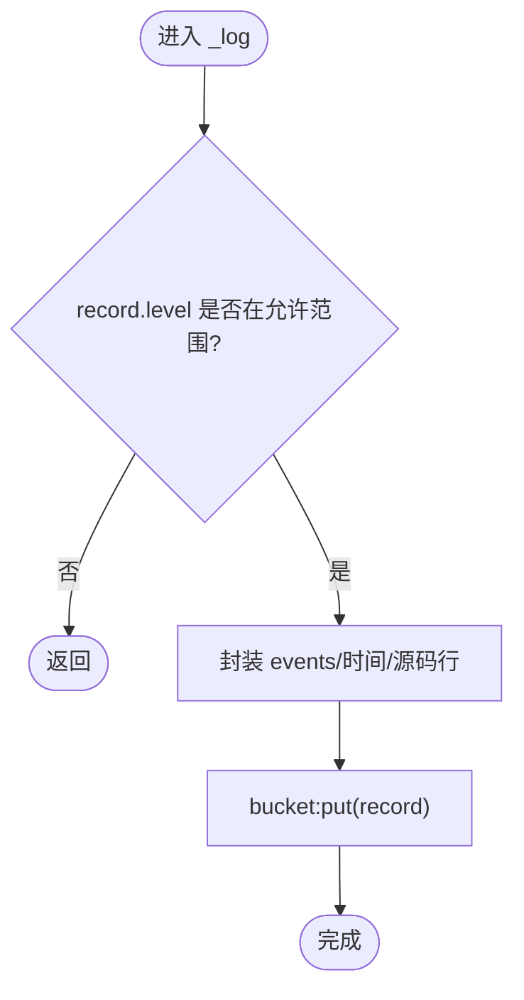
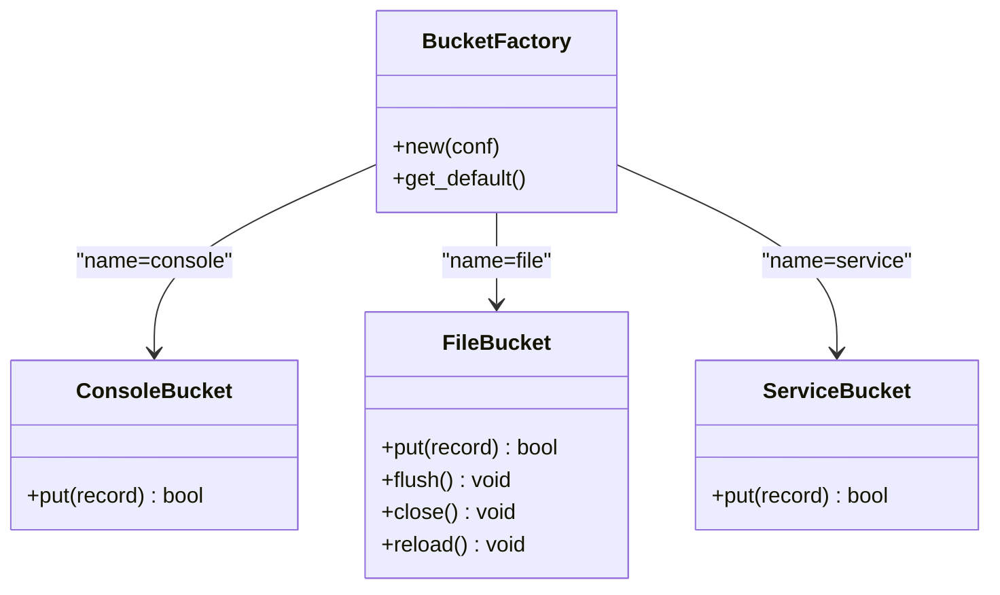
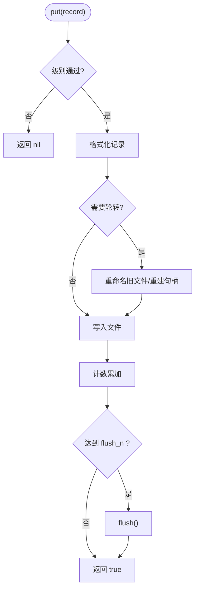
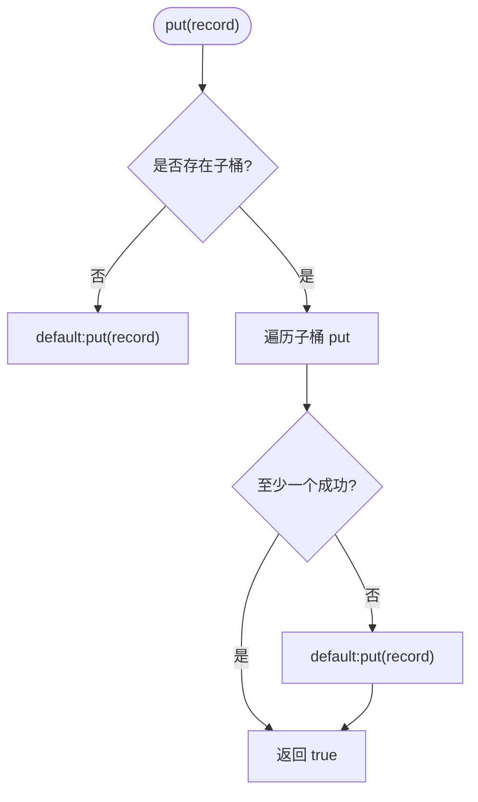
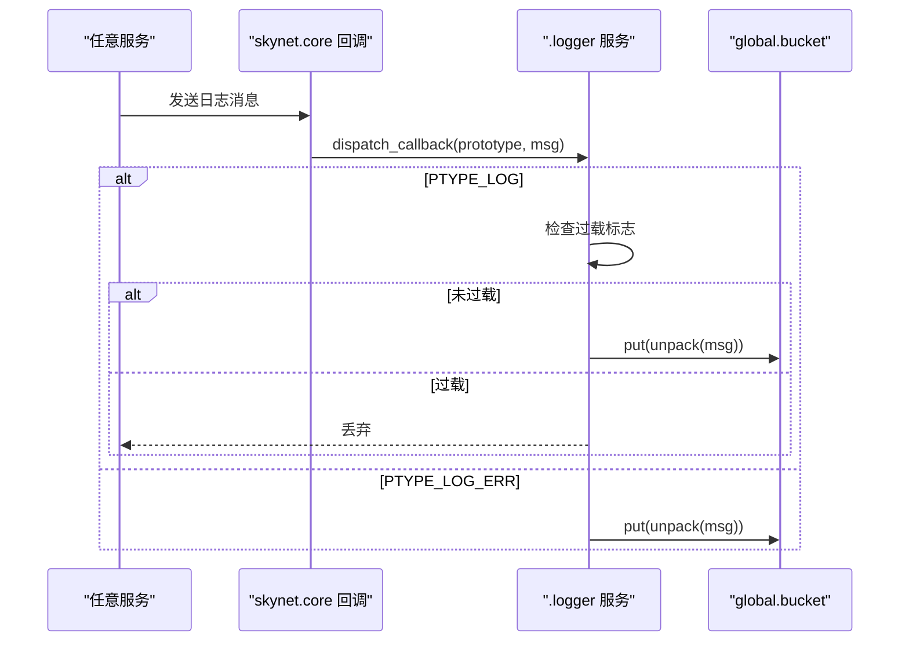
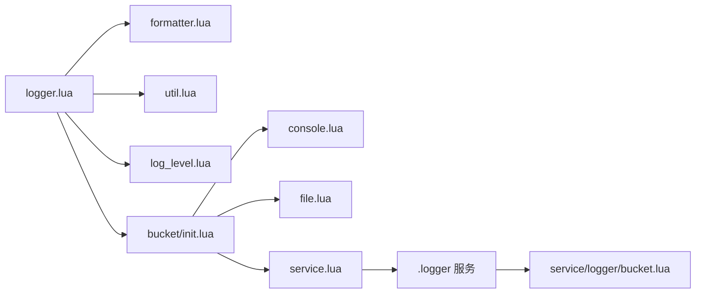

# 自定义输出目标

<cite>
**本文引用的文件**
- [lualib/log/init.lua](file://lualib/log/init.lua)
- [lualib/log/logger.lua](file://lualib/log/logger.lua)
- [lualib/log/bucket/init.lua](file://lualib/log/bucket/init.lua)
- [lualib/log/bucket/console.lua](file://lualib/log/bucket/console.lua)
- [lualib/log/bucket/file.lua](file://lualib/log/bucket/file.lua)
- [lualib/log/bucket/service.lua](file://lualib/log/bucket/service.lua)
- [service/logger/start.lua](file://service/logger/start.lua)
- [service/logger/bucket.lua](file://service/logger/bucket.lua)
- [lualib/log/formatter.lua](file://lualib/log/formatter.lua)
- [lualib/log/util.lua](file://lualib/log/util.lua)
- [lualib/log/log_level.lua](file://lualib/log/log_level.lua)
- [etc/core.conf.lua](file://etc/core.conf.lua)
- [etc/app/role1.app.lua](file://etc/app/role1.app.lua)
</cite>

## 目录
1. [简介](#简介)
2. [项目结构](#项目结构)
3. [核心组件](#核心组件)
4. [架构总览](#架构总览)
5. [详细组件分析](#详细组件分析)
6. [依赖关系分析](#依赖关系分析)
7. [性能考量](#性能考量)
8. [故障排查指南](#故障排查指南)
9. [结论](#结论)
10. [附录：实现自定义输出目标的完整步骤与示例](#附录：实现自定义输出目标的完整步骤与示例)

## 简介
本指南面向希望在 SkyExt 框架中开发“自定义日志输出目标”的开发者。文档围绕日志桶（Bucket）接口规范、生命周期管理、扩展机制展开，详细说明如何实现初始化、写入、关闭等关键方法，并提供数据库输出、HTTP 推送、消息队列集成等常见场景的实现思路。同时涵盖测试方法、性能调优、错误处理、重试机制与资源管理的最佳实践。

## 项目结构
SkyExt 的日志子系统由以下部分组成：
- 日志门面与记录封装：提供统一 API 并构造结构化日志记录
- 桶（Bucket）抽象与分发：根据配置动态加载具体输出目标，支持多目标并行投递
- 内置输出目标：控制台、文件（含轮转）、服务（推送到 logger 服务）
- 格式化器：文本与 JSON 格式，支持颜色与自定义样式
- 日志服务：集中接收、流控、重载与命令处理

图表来源
- [lualib/log/logger.lua:108-129](file://lualib/log/logger.lua#L108-L129)
- [lualib/log/bucket/init.lua:5-22](file://lualib/log/bucket/init.lua#L5-L22)
- [lualib/log/bucket/console.lua:13-19](file://lualib/log/bucket/console.lua#L13-L19)
- [lualib/log/bucket/file.lua:119-146](file://lualib/log/bucket/file.lua#L119-L146)
- [lualib/log/bucket/service.lua:24-31](file://lualib/log/bucket/service.lua#L24-L31)
- [service/logger/start.lua:52-75](file://service/logger/start.lua#L52-L75)
- [service/logger/bucket.lua:8-28](file://service/logger/bucket.lua#L8-L28)
- [lualib/log/formatter.lua:113-127](file://lualib/log/formatter.lua#L113-L127)
- [lualib/log/util.lua:9-22](file://lualib/log/util.lua#L9-L22)
- [lualib/log/log_level.lua:1-11](file://lualib/log/log_level.lua#L1-L11)

章节来源
- [lualib/log/init.lua:41-55](file://lualib/log/init.lua#L41-L55)
- [etc/core.conf.lua:28-30](file://etc/core.conf.lua#L28-L30)
- [etc/app/role1.app.lua:16-26](file://etc/app/role1.app.lua#L16-L26)

## 核心组件
- 日志门面与对象
  - 提供 debug/info/warn/error 等方法，内部将参数打包为结构化事件，并通过桶写入
  - 支持级别过滤、源码行号采集、回溯栈收集、安全 pcall/xpcall 包装
- 桶（Bucket）抽象
  - 通过名称动态 require 具体模块，实例化后统一以 put(record) 写入
  - 支持默认桶兜底；服务侧聚合桶，任一失败可回退到默认桶
- 内置输出目标
  - console：标准输出，支持文本/JSON 与颜色
  - file：文件输出，支持按行/大小/小时/天轮转，缓冲刷新策略
  - service：通过 skynet 协议发送到 .logger 服务，区分普通与错误通道
- 格式化器
  - 文本与 JSON 两种格式，支持颜色与自定义样式函数
- 工具与级别
  - 级别范围解析、是否打印判断

章节来源
- [lualib/log/logger.lua:66-129](file://lualib/log/logger.lua#L66-L129)
- [lualib/log/bucket/init.lua:5-22](file://lualib/log/bucket/init.lua#L5-L22)
- [lualib/log/bucket/console.lua:22-34](file://lualib/log/bucket/console.lua#L22-L34)
- [lualib/log/bucket/file.lua:223-250](file://lualib/log/bucket/file.lua#L223-L250)
- [lualib/log/bucket/service.lua:33-53](file://lualib/log/bucket/service.lua#L33-L53)
- [lualib/log/formatter.lua:75-127](file://lualib/log/formatter.lua#L75-L127)
- [lualib/log/util.lua:9-22](file://lualib/log/util.lua#L9-L22)
- [lualib/log/log_level.lua:1-11](file://lualib/log/log_level.lua#L1-L11)

## 架构总览
日志从应用层进入 logger，构造结构化记录后交由 bucket 分发。若存在 logger 服务，则通过 service 桶异步发送；否则直接落盘或输出到控制台。服务侧聚合多个桶，支持热重载与过载保护。

图表来源
- [lualib/log/logger.lua:108-129](file://lualib/log/logger.lua#L108-L129)
- [lualib/log/bucket/init.lua:5-22](file://lualib/log/bucket/init.lua#L5-L22)
- [lualib/log/bucket/service.lua:24-31](file://lualib/log/bucket/service.lua#L24-L31)
- [service/logger/start.lua:52-75](file://service/logger/start.lua#L52-L75)
- [service/logger/bucket.lua:8-28](file://service/logger/bucket.lua#L8-L28)

## 详细组件分析

### 日志记录与级别过滤
- 记录封装：将 module、level、timestamp、line、msg、events 组装为记录表
- 级别过滤：基于配置的 level 范围进行快速丢弃，减少后续开销
- 异常保护：外层 pcall 捕获异常，避免日志系统影响业务

图表来源
- [lualib/log/logger.lua:119-129](file://lualib/log/logger.lua#L119-L129)
- [lualib/log/util.lua:20-22](file://lualib/log/util.lua#L20-L22)

章节来源
- [lualib/log/logger.lua:77-129](file://lualib/log/logger.lua#L77-L129)
- [lualib/log/util.lua:9-22](file://lualib/log/util.lua#L9-L22)

### 桶（Bucket）抽象与动态加载
- 通过 name 动态 require 具体模块，缓存已加载模块
- 实例化时调用模块的 new(conf)，返回可 put 的对象
- 提供默认桶（console），用于兜底

图表来源
- [lualib/log/bucket/init.lua:5-22](file://lualib/log/bucket/init.lua#L5-L22)
- [lualib/log/bucket/console.lua:22-34](file://lualib/log/bucket/console.lua#L22-L34)
- [lualib/log/bucket/file.lua:223-250](file://lualib/log/bucket/file.lua#L223-L250)
- [lualib/log/bucket/service.lua:33-53](file://lualib/log/bucket/service.lua#L33-L53)

章节来源
- [lualib/log/bucket/init.lua:5-22](file://lualib/log/bucket/init.lua#L5-L22)

### 文件输出目标（含轮转与刷新）
- 支持按行/大小/小时/天轮转，自动重命名并重建句柄
- 支持批量 flush 控制，降低磁盘 IO
- close 确保 flush 后再释放资源

图表来源
- [lualib/log/bucket/file.lua:119-146](file://lualib/log/bucket/file.lua#L119-L146)
- [lualib/log/bucket/file.lua:77-116](file://lualib/log/bucket/file.lua#L77-L116)
- [lualib/log/bucket/file.lua:168-206](file://lualib/log/bucket/file.lua#L168-L206)

章节来源
- [lualib/log/bucket/file.lua:119-146](file://lualib/log/bucket/file.lua#L119-L146)
- [lualib/log/bucket/file.lua:168-206](file://lualib/log/bucket/file.lua#L168-L206)

### 服务侧聚合桶与降级策略
- 聚合多个子桶，任一成功即认为本次写入成功
- 全部失败时降级到默认桶（console），保证日志不丢失
- 支持 reload/close 透传

图表来源
- [service/logger/bucket.lua:8-28](file://service/logger/bucket.lua#L8-L28)
- [service/logger/bucket.lua:55-61](file://service/logger/bucket.lua#L55-L61)

章节来源
- [service/logger/bucket.lua:8-28](file://service/logger/bucket.lua#L8-L28)
- [service/logger/bucket.lua:55-61](file://service/logger/bucket.lua#L55-L61)

### 服务（.logger）消息路由与过载保护
- 注册 SYSTEM、text、日志协议，统一分发
- 对普通日志启用过载保护（丢弃），错误日志不丢弃
- 启动时创建全局 bucket，支持 SIGHUP 重载

图表来源
- [service/logger/start.lua:52-75](file://service/logger/start.lua#L52-L75)
- [service/logger/start.lua:24-50](file://service/logger/start.lua#L24-L50)

章节来源
- [service/logger/start.lua:52-75](file://service/logger/start.lua#L52-L75)

## 依赖关系分析
- logger.lua 依赖 formatter、util、log_level、traceback.c、bucket
- bucket/init.lua 负责按需加载具体桶模块
- service.lua 依赖 skynet、ptype，向 .logger 服务发送消息
- service/logger/start.lua 依赖 config、cmd_api、global、bucket、logger
- 配置文件 role1.app.lua 定义 log_config，指定多个输出目标

图表来源
- [lualib/log/logger.lua:1-5](file://lualib/log/logger.lua#L1-L5)
- [lualib/log/bucket/init.lua:5-22](file://lualib/log/bucket/init.lua#L5-L22)
- [lualib/log/bucket/service.lua:1-19](file://lualib/log/bucket/service.lua#L1-L19)
- [service/logger/start.lua:1-10](file://service/logger/start.lua#L1-L10)

章节来源
- [etc/app/role1.app.lua:16-26](file://etc/app/role1.app.lua#L16-L26)
- [etc/core.conf.lua:28-30](file://etc/core.conf.lua#L28-L30)

## 性能考量
- 级别过滤前置：在 logger 层尽早丢弃低优先级日志，减少序列化与 IO
- 批量刷盘：file 桶支持 flush_period，降低频繁 flush 带来的系统调用开销
- 轮转策略：按大小/行/时间切分，避免单文件过大导致 IO 抖动
- 服务侧过载保护：当 .logger 服务过载时丢弃普通日志，保障核心链路稳定
- 格式化缓存：formatter 中对时间字符串进行缓存，减少重复计算
- 建议
  - 生产环境开启 JSON 格式以便集中采集
  - 合理设置 flush_period，平衡实时性与吞吐
  - 对高频路径使用 INFO 及以上级别，DEBUG 仅用于诊断

[本节为通用性能建议，无需特定文件引用]

## 故障排查指南
- 启动失败兜底：logger 服务启动失败会写 bootfail.log 并中止进程，便于定位
- 桶初始化失败：service/logger/bucket.lua 在 init 阶段记录失败信息并跳过该桶
- 写入失败降级：聚合桶在全部子桶失败时回退到默认桶，避免日志完全丢失
- 错误堆栈：error/fatal 会附带 traceback，配合 safe_pcall/safe_xpcall 可在异常上下文中正确获取堆栈
- 常见问题
  - 未配置 log_config：不会创建任何输出目标，需检查应用配置
  - 文件路径权限不足：确认 logs 目录可写
  - 服务名冲突：确保 .logger 服务已启动且未被覆盖

章节来源
- [service/logger/main.lua:1-18](file://service/logger/main.lua#L1-L18)
- [service/logger/bucket.lua:30-45](file://service/logger/bucket.lua#L30-L45)
- [service/logger/bucket.lua:8-28](file://service/logger/bucket.lua#L8-L28)
- [lualib/log/logger.lua:150-236](file://lualib/log/logger.lua#L150-L236)

## 结论
SkyExt 的日志子系统通过清晰的桶抽象与服务化设计，实现了高内聚、可扩展的日志输出能力。开发者只需遵循 put 接口与必要的生命周期方法，即可快速接入数据库、HTTP、消息队列等后端。结合级别过滤、批量刷盘、轮转与过载保护，可在不同负载下获得稳定高效的日志体验。

[本节为总结性内容，无需特定文件引用]

## 附录：实现自定义输出目标的完整步骤与示例

### 接口规范与生命周期
- 必须实现的方法
  - new(params): 接收配置表，返回桶实例
  - put(record): 写入一条结构化记录，返回布尔表示是否成功
- 可选方法
  - reload(): 热重载配置或连接
  - close(): 释放资源（如连接、句柄）
- 行为约定
  - 级别过滤可由桶自行实现，也可依赖上层过滤
  - 失败应返回 false，聚合桶会尝试其他桶或降级到默认桶
  - 资源必须在 close 中释放，避免泄漏

章节来源
- [lualib/log/bucket/init.lua:5-22](file://lualib/log/bucket/init.lua#L5-L22)
- [service/logger/bucket.lua:55-61](file://service/logger/bucket.lua#L55-L61)

### 初始化与配置
- 在应用配置中声明 log_config 数组，每项包含 name 与 params
- 常见字段
  - name: 桶模块名（如 file、console、service、your_module）
  - level: 级别范围，如 "INFO-DEBUG"
  - format/style/color: 格式化相关（适用于支持格式化的桶）
  - 业务专属参数：如数据库连接串、HTTP 端点、队列名称等

章节来源
- [etc/app/role1.app.lua:16-26](file://etc/app/role1.app.lua#L16-L26)
- [lualib/log/bucket/file.lua:223-250](file://lualib/log/bucket/file.lua#L223-L250)

### 写入逻辑与错误处理
- 读取 record 中的 module、level、timestamp、line、msg、events
- 根据级别决定是否丢弃
- 写入后端前可进行限流、去重、采样等
- 错误处理
  - 网络/IO 错误：记录本地失败计数，必要时触发告警
  - 超时/拒绝：实现指数退避重试，限制最大重试次数
  - 数据校验失败：丢弃并记录原因，避免污染下游

章节来源
- [lualib/log/bucket/console.lua:13-19](file://lualib/log/bucket/console.lua#L13-L19)
- [lualib/log/bucket/file.lua:119-146](file://lualib/log/bucket/file.lua#L119-L146)

### 关闭与资源管理
- 在 close 中 flush 缓冲区、关闭连接、释放句柄
- 确保幂等：多次调用 close 不应报错
- 与聚合桶协作：服务侧会在合适时机调用 close

章节来源
- [lualib/log/bucket/file.lua:152-159](file://lualib/log/bucket/file.lua#L152-L159)
- [service/logger/bucket.lua:55-61](file://service/logger/bucket.lua#L55-L61)

### 常见场景示例（概念性说明）
- 数据库输出
  - new(params): 建立连接池，预编译语句
  - put(record): 批量插入，失败重试，超限采样
  - reload(): 重新加载连接参数
  - close(): 关闭连接池
- HTTP 推送
  - new(params): 初始化 HTTP 客户端与重试策略
  - put(record): 序列化记录为 JSON，POST 到远端
  - 错误处理：4xx/5xx 分类处理，指数退避
  - close(): 释放客户端资源
- 消息队列集成
  - new(params): 连接 MQ，订阅/生产者初始化
  - put(record): 序列化并发送，支持持久化与重试
  - 背压：队列满时采样或丢弃低优先级日志
  - close(): 断开连接，清理状态

[本节为概念性指导，不直接分析具体文件]

### 测试方法
- 单元测试
  - 模拟 put 的多种输入与边界条件（空记录、超大 events、非法级别）
  - 验证 close 的幂等性与资源释放
- 集成测试
  - 启动 .logger 服务，注入自定义桶，验证端到端写入
  - 模拟网络/IO 失败，验证重试与降级行为
- 性能测试
  - 高并发压测，观察丢日志率、延迟分布、CPU/内存占用
  - 调整 flush_period、batch_size、采样率等参数对比效果

[本节为通用测试建议，无需特定文件引用]

### 性能调优与最佳实践
- 级别控制：生产默认 INFO，仅在问题定位时临时提升
- 批量写入：合并多条记录，减少系统调用与网络请求
- 采样策略：对高频事件进行采样，保留关键上下文
- 异步化：尽量非阻塞写入，避免影响主流程
- 监控指标：记录写入成功率、平均延迟、丢弃数量
- 资源上限：限制连接数、队列长度、内存缓冲

[本节为通用优化建议，无需特定文件引用]