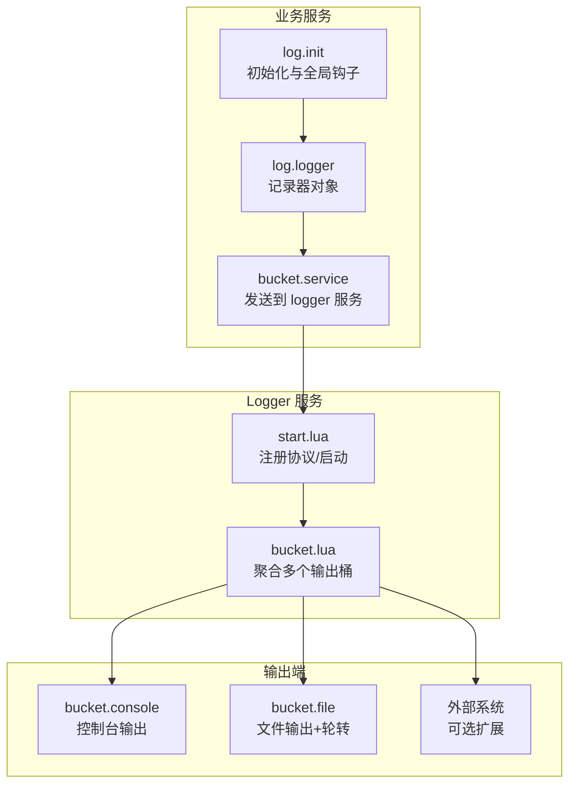
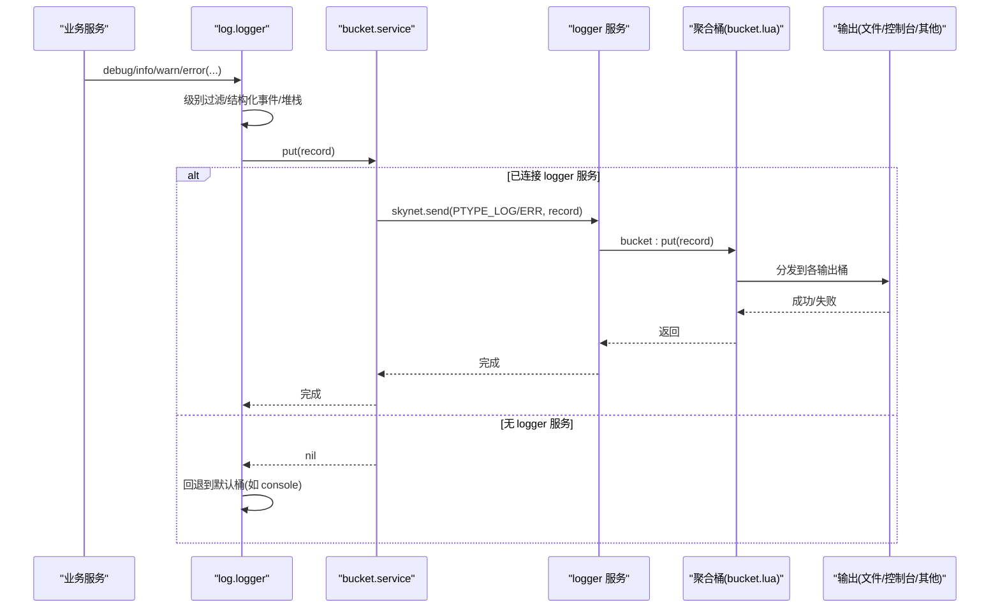
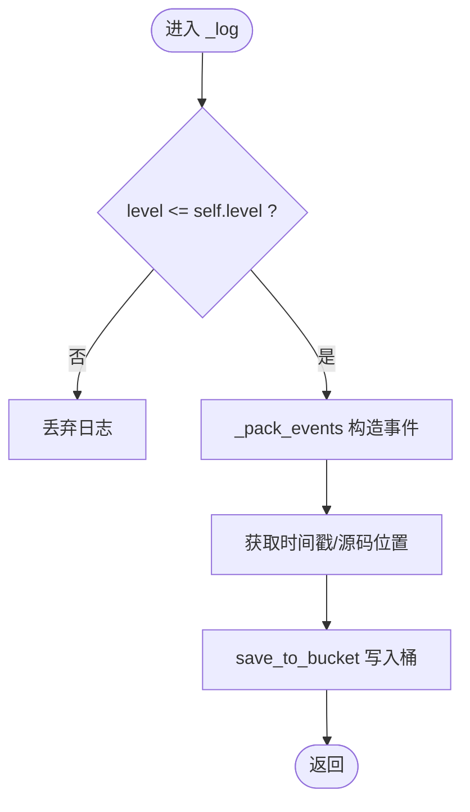
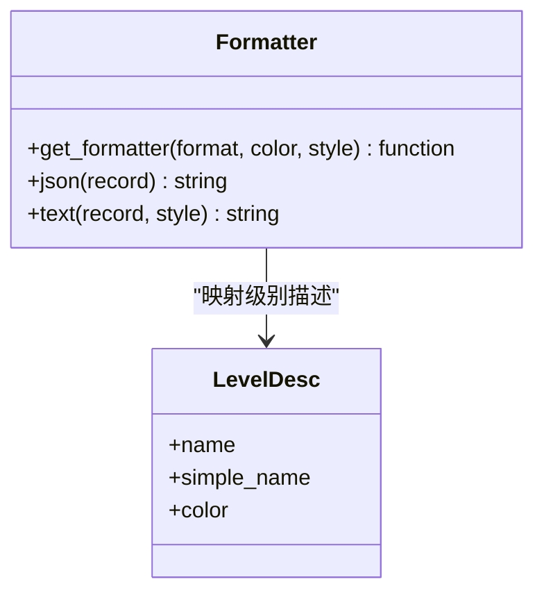
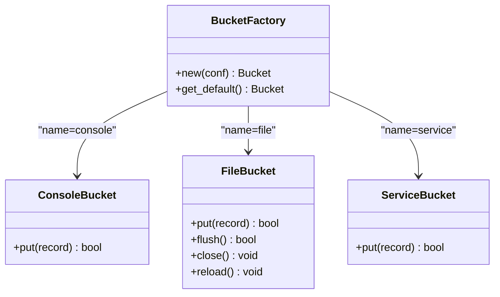
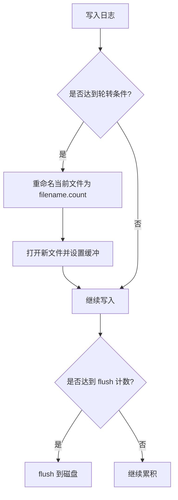
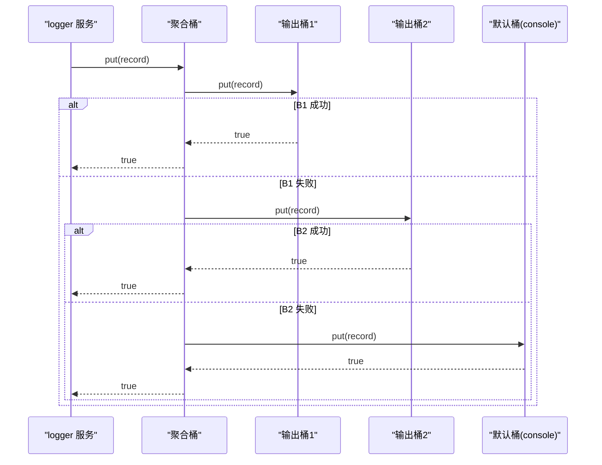
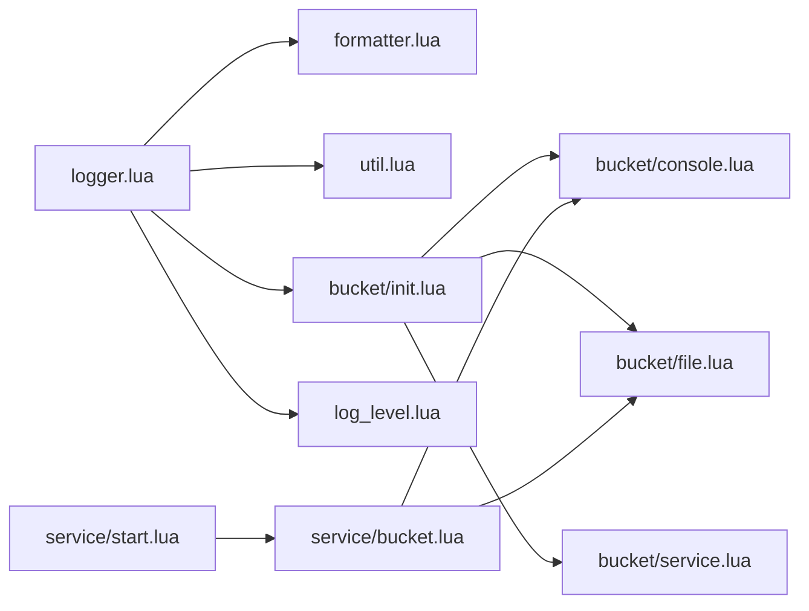

# 日志系统

<cite>
**本文引用的文件**
- [lualib/log/init.lua](file://lualib/log/init.lua)
- [lualib/log/logger.lua](file://lualib/log/logger.lua)
- [lualib/log/formatter.lua](file://lualib/log/formatter.lua)
- [lualib/log/log_level.lua](file://lualib/log/log_level.lua)
- [lualib/log/util.lua](file://lualib/log/util.lua)
- [lualib/log/bucket/init.lua](file://lualib/log/bucket/init.lua)
- [lualib/log/bucket/console.lua](file://lualib/log/bucket/console.lua)
- [lualib/log/bucket/file.lua](file://lualib/log/bucket/file.lua)
- [lualib/log/bucket/service.lua](file://lualib/log/bucket/service.lua)
- [service/logger/main.lua](file://service/logger/main.lua)
- [service/logger/start.lua](file://service/logger/start.lua)
- [service/logger/bucket.lua](file://service/logger/bucket.lua)
- [etc/app/common.app.lua](file://etc/app/common.app.lua)
</cite>

## 目录
1. [简介](#简介)
2. [项目结构](#项目结构)
3. [核心组件](#核心组件)
4. [架构总览](#架构总览)
5. [详细组件分析](#详细组件分析)
6. [依赖关系分析](#依赖关系分析)
7. [性能考量](#性能考量)
8. [故障排除指南](#故障排除指南)
9. [结论](#结论)
10. [附录：配置与使用示例](#附录配置与使用示例)

## 简介
本技术文档系统性阐述 SkyExt 框架的日志子系统，覆盖架构设计、多输出目标（控制台、文件、远程服务）、日志级别管理、结构化事件、异步写入机制、日志轮转与压缩、格式定制、性能优化、存储策略、收集分析与运维排障。文档面向不同技术背景的读者，提供从高层概览到代码级细节的渐进式说明，并附带可操作的配置与使用指引。

## 项目结构
日志系统由“客户端侧”和“服务端侧”两部分组成：
- 客户端侧（业务服务）：通过 lualib/log 暴露统一接口，负责日志记录、格式化、级别过滤与投递。
- 服务端侧（logger 服务）：集中接收各服务的日志消息，按配置路由到多个输出桶（console/file/自定义），并提供重载、关闭等生命周期管理。

图示来源
- [lualib/log/init.lua:1-58](file://lualib/log/init.lua#L1-L58)
- [lualib/log/logger.lua:1-291](file://lualib/log/logger.lua#L1-L291)
- [lualib/log/bucket/service.lua:1-57](file://lualib/log/bucket/service.lua#L1-L57)
- [service/logger/start.lua:1-84](file://service/logger/start.lua#L1-L84)
- [service/logger/bucket.lua:1-74](file://service/logger/bucket.lua#L1-L74)
- [lualib/log/bucket/console.lua:1-38](file://lualib/log/bucket/console.lua#L1-L38)
- [lualib/log/bucket/file.lua:1-254](file://lualib/log/bucket/file.lua#L1-L254)

章节来源
- [lualib/log/init.lua:1-58](file://lualib/log/init.lua#L1-L58)
- [lualib/log/logger.lua:1-291](file://lualib/log/logger.lua#L1-L291)
- [service/logger/start.lua:1-84](file://service/logger/start.lua#L1-L84)
- [service/logger/bucket.lua:1-74](file://service/logger/bucket.lua#L1-L74)
- [lualib/log/bucket/console.lua:1-38](file://lualib/log/bucket/console.lua#L1-L38)
- [lualib/log/bucket/file.lua:1-254](file://lualib/log/bucket/file.lua#L1-L254)

## 核心组件
- 日志入口与初始化：提供默认 logger 实例、全局方法代理、以及应用启动时的配置注入与断言/错误钩子替换。
- 记录器对象：封装日志级别过滤、结构化事件打包、堆栈追踪、安全 pcall/xpcall 包装、错误上报与系统级断言/错误。
- 格式化器：支持 text/json 两种格式，文本格式支持 ANSI 颜色与自定义样式函数；时间戳缓存优化。
- 输出桶（Bucket）：抽象输出目标，动态加载具体实现（console/file/service）。
- 文件输出：支持按行/大小/小时/天进行轮转，缓冲刷新策略，路径重命名与句柄重载。
- 服务输出：通过 skynet 协议将日志推送到 logger 服务，区分普通日志与错误日志通道。
- 服务侧聚合桶：维护多个输出桶实例，任一成功即认为投递成功，否则回退到默认桶；支持 reload/close。

章节来源
- [lualib/log/init.lua:1-58](file://lualib/log/init.lua#L1-L58)
- [lualib/log/logger.lua:1-291](file://lualib/log/logger.lua#L1-L291)
- [lualib/log/formatter.lua:1-130](file://lualib/log/formatter.lua#L1-L130)
- [lualib/log/bucket/init.lua:1-31](file://lualib/log/bucket/init.lua#L1-L31)
- [lualib/log/bucket/file.lua:1-254](file://lualib/log/bucket/file.lua#L1-L254)
- [lualib/log/bucket/service.lua:1-57](file://lualib/log/bucket/service.lua#L1-L57)
- [service/logger/bucket.lua:1-74](file://service/logger/bucket.lua#L1-L74)

## 架构总览
日志系统采用“客户端记录 + 服务端聚合”的解耦架构：
- 客户端侧：调用 logger 接口生成结构化记录，交由 bucket 投递。优先尝试 service 桶（远程服务），失败则回退到本地默认桶（如 console）。
- 服务端侧：logger 服务注册协议回调，接收日志消息，根据过载策略丢弃或转发至聚合桶，再由聚合桶分发到具体输出。

图示来源
- [lualib/log/logger.lua:108-148](file://lualib/log/logger.lua#L108-L148)
- [lualib/log/bucket/service.lua:24-53](file://lualib/log/bucket/service.lua#L24-L53)
- [service/logger/start.lua:52-75](file://service/logger/start.lua#L52-L75)
- [service/logger/bucket.lua:8-28](file://service/logger/bucket.lua#L8-L28)

## 详细组件分析

### 记录器与级别管理
- 级别定义：DEBUG/INFO/WARN/ERROR/FATAL，数值越小优先级越高。
- 级别过滤：记录前比较当前 logger.level 与记录级别，低于阈值直接丢弃。
- 结构化事件：以键值对形式附加到记录中，保留模块名、级别、时间戳、行号、消息体等基础字段。
- 堆栈追踪：error 级别自动附加 traceback；safe_pcall/safe_xpcall 在异常处理上下文中避免重复致命日志。
- 系统级断言/错误：sys_assert/sys_error 在首次获取回溯时记录 FATAL 日志，再抛出异常。

图示来源
- [lualib/log/logger.lua:119-129](file://lualib/log/logger.lua#L119-L129)
- [lualib/log/logger.lua:78-117](file://lualib/log/logger.lua#L78-L117)
- [lualib/log/log_level.lua:1-11](file://lualib/log/log_level.lua#L1-L11)

章节来源
- [lualib/log/logger.lua:119-153](file://lualib/log/logger.lua#L119-L153)
- [lualib/log/log_level.lua:1-11](file://lualib/log/log_level.lua#L1-L11)

### 格式化器与输出格式
- JSON 格式：将记录转为 JSON 字符串，便于后续采集与分析。
- Text 格式：默认样式包含时间、级别简写、模块、行号、消息与事件；支持 ANSI 颜色高亮；可通过 style 函数自定义渲染。
- 时间戳缓存：同一秒内复用格式化结果，减少重复计算。

图示来源
- [lualib/log/formatter.lua:27-127](file://lualib/log/formatter.lua#L27-L127)

章节来源
- [lualib/log/formatter.lua:1-130](file://lualib/log/formatter.lua#L1-L130)

### 输出桶与多目标路由
- 桶工厂：根据 name 动态加载对应实现（console/file/service），并缓存模块。
- 控制台输出：基于 io.stdout，支持级别范围过滤、JSON/Text 格式与颜色。
- 文件输出：支持多种轮转策略（行/大小/小时/天），缓冲刷新控制，路径重命名与句柄重载。
- 服务输出：通过 skynet 协议发送日志到 logger 服务，区分普通与错误通道。

图示来源
- [lualib/log/bucket/init.lua:1-31](file://lualib/log/bucket/init.lua#L1-L31)
- [lualib/log/bucket/console.lua:1-38](file://lualib/log/bucket/console.lua#L1-L38)
- [lualib/log/bucket/file.lua:1-254](file://lualib/log/bucket/file.lua#L1-L254)
- [lualib/log/bucket/service.lua:1-57](file://lualib/log/bucket/service.lua#L1-L57)

章节来源
- [lualib/log/bucket/init.lua:1-31](file://lualib/log/bucket/init.lua#L1-L31)
- [lualib/log/bucket/console.lua:1-38](file://lualib/log/bucket/console.lua#L1-L38)
- [lualib/log/bucket/file.lua:1-254](file://lualib/log/bucket/file.lua#L1-L254)
- [lualib/log/bucket/service.lua:1-57](file://lualib/log/bucket/service.lua#L1-L57)

### 文件轮转与压缩
- 轮转策略：
  - line：按行数触发轮转。
  - size：按累计字节数触发轮转，支持 K/M/G/T/P 单位。
  - hour/day：按时间边界触发轮转。
- 文件名规则：原文件名后追加序号（如 app.log.1），避免覆盖。
- 刷新策略：可配置 flush_period，批量写入后统一 flush，降低系统调用开销。
- 压缩：当前实现未内置压缩；可在外部通过定时任务对历史文件进行压缩归档。

图示来源
- [lualib/log/bucket/file.lua:31-146](file://lualib/log/bucket/file.lua#L31-L146)
- [lualib/log/bucket/file.lua:168-250](file://lualib/log/bucket/file.lua#L168-L250)

章节来源
- [lualib/log/bucket/file.lua:31-146](file://lualib/log/bucket/file.lua#L31-L146)
- [lualib/log/bucket/file.lua:168-250](file://lualib/log/bucket/file.lua#L168-L250)

### 服务侧聚合与过载保护
- 聚合桶：维护多个输出桶，任一成功即视为成功；若全部失败，回退到默认桶（如 console）。
- 过载保护：当全局 log_overload 为真时，丢弃普通日志；错误日志不受流控影响，确保关键问题可被捕获。
- 信号处理：SIGHUP 触发聚合桶 reload，支持热重载输出配置。

图示来源
- [service/logger/bucket.lua:8-28](file://service/logger/bucket.lua#L8-L28)
- [service/logger/start.lua:52-66](file://service/logger/start.lua#L52-L66)

章节来源
- [service/logger/bucket.lua:8-28](file://service/logger/bucket.lua#L8-L28)
- [service/logger/start.lua:52-66](file://service/logger/start.lua#L52-L66)

### 初始化与全局钩子
- 应用启动时读取配置（log_level、log_src、log_print_table），初始化默认 logger。
- 替换全局 assert/error/pcall/xpcall，使异常路径也能产生结构化日志，提升可观测性。

章节来源
- [lualib/log/init.lua:41-55](file://lualib/log/init.lua#L41-L55)
- [lualib/log/logger.lua:180-236](file://lualib/log/logger.lua#L180-L236)

## 依赖关系分析
- 模块耦合：
  - logger 依赖 formatter、util、bucket、log_level、traceback_c。
  - bucket 动态加载具体实现，降低耦合度。
  - 服务侧 start 依赖 config、cmd_api、global、bucket、logger、ptype。
- 外部依赖：
  - skynet 用于服务间通信与协议注册。
  - cjson.safe 用于 JSON 序列化。
  - time 模块用于时间格式化与当前时间获取。

图示来源
- [lualib/log/logger.lua:1-6](file://lualib/log/logger.lua#L1-L6)
- [lualib/log/bucket/init.lua:1-31](file://lualib/log/bucket/init.lua#L1-L31)
- [service/logger/start.lua:1-10](file://service/logger/start.lua#L1-L10)
- [service/logger/bucket.lua:1-10](file://service/logger/bucket.lua#L1-L10)

章节来源
- [lualib/log/logger.lua:1-6](file://lualib/log/logger.lua#L1-L6)
- [lualib/log/bucket/init.lua:1-31](file://lualib/log/bucket/init.lua#L1-L31)
- [service/logger/start.lua:1-10](file://service/logger/start.lua#L1-L10)
- [service/logger/bucket.lua:1-10](file://service/logger/bucket.lua#L1-L10)

## 性能考量
- 级别过滤前置：在记录早期进行级别判断，避免不必要的格式化与 IO。
- 结构化事件：减少字符串拼接开销，便于下游高效解析。
- 时间戳缓存：同一秒内复用时间字符串，降低格式化成本。
- 文件缓冲：支持按条数批量 flush，减少系统调用次数。
- 过载保护：在高负载下丢弃非关键日志，保障核心链路稳定。
- 建议：
  - 生产环境建议开启 JSON 格式，配合日志采集系统进行集中分析。
  - 合理设置 flush_period 与轮转阈值，平衡延迟与磁盘 I/O。
  - 对高频 DEBUG 日志进行开关控制，避免影响性能。

[本节为通用性能指导，不直接分析具体文件]

## 故障排除指南
- 启动失败日志：
  - 若 logger 服务启动失败，会将错误信息写入 bootfaillogpath 指定文件，便于定位。
- 无法连接到 logger 服务：
  - 客户端会回退到默认桶（如 console），检查服务名 .logger 是否可用。
- 文件写入失败：
  - 检查文件权限、磁盘空间与路径有效性；关注 flush_ok 状态。
- 日志丢失：
  - 检查是否处于过载状态（log_overload 为真）；确认聚合桶至少一个输出成功。
- 颜色干扰：
  - 文本格式的颜色字符可能在某些终端显示异常，可通过关闭 color 或切换 JSON 格式解决。

章节来源
- [service/logger/main.lua:1-18](file://service/logger/main.lua#L1-L18)
- [service/logger/start.lua:68-84](file://service/logger/start.lua#L68-L84)
- [lualib/log/bucket/file.lua:143-159](file://lualib/log/bucket/file.lua#L143-L159)
- [service/logger/start.lua:52-66](file://service/logger/start.lua#L52-L66)

## 结论
SkyExt 日志系统通过“客户端记录 + 服务端聚合”的架构实现了高内聚、低耦合的可观测能力。其支持多输出目标、结构化事件、灵活格式化、多级级别过滤、文件轮转与过载保护，满足调试、监控、审计等多场景需求。结合合理的配置与运维策略，可在保证性能的同时获得高质量的日志数据。

[本节为总结性内容，不直接分析具体文件]

## 附录：配置与使用示例
- 基本配置（common.app.lua）：
  - 设置日志级别、是否打印源码位置、是否打印 table、日志输出目标（文件、控制台）。
  - 文件输出支持 split=size/line/hour/day，并配置 maxsize/maxline 等参数。
- 使用方式：
  - 在业务代码中引入日志模块，调用 debug/info/warn/error 等方法记录日志。
  - 通过结构化事件附加上下文信息，便于检索与分析。
- 高级特性：
  - 自定义文本格式样式函数，调整输出布局。
  - 通过 SIGHUP 信号触发日志配置重载。
  - 在生产环境启用 JSON 格式，配合日志采集平台进行分析。

章节来源
- [etc/app/common.app.lua:1-20](file://etc/app/common.app.lua#L1-L20)
- [lualib/log/init.lua:41-55](file://lualib/log/init.lua#L41-L55)
- [lualib/log/formatter.lua:112-127](file://lualib/log/formatter.lua#L112-L127)
- [service/logger/start.lua:23-34](file://service/logger/start.lua#L23-L34)