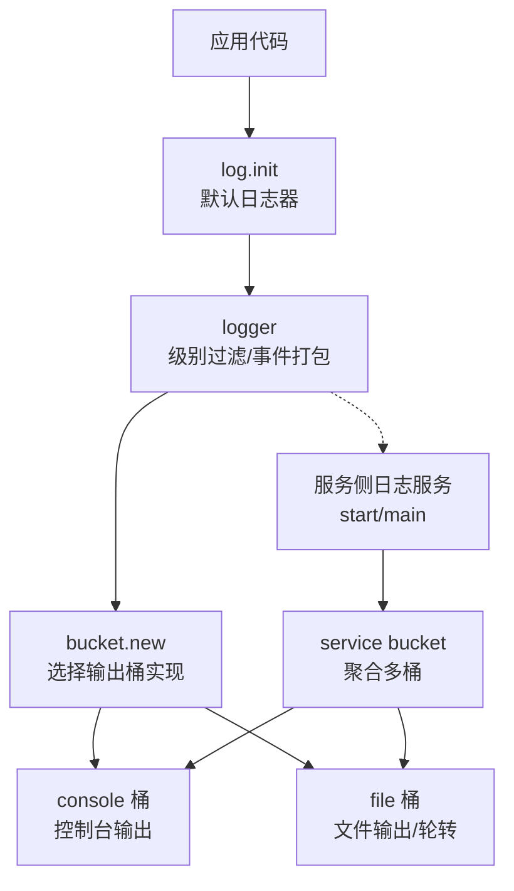
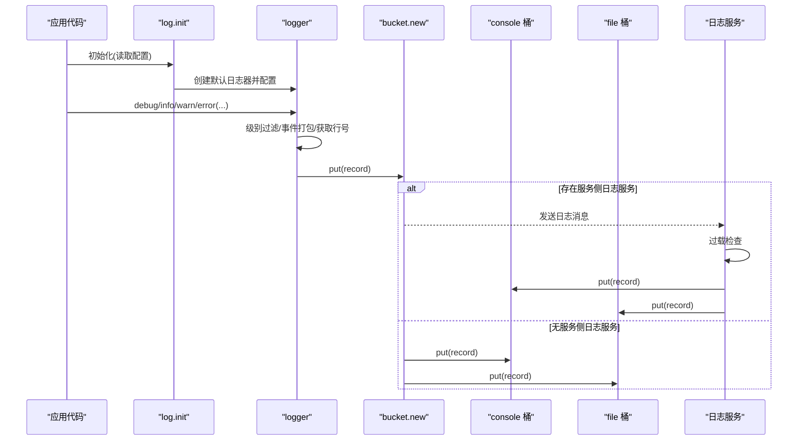
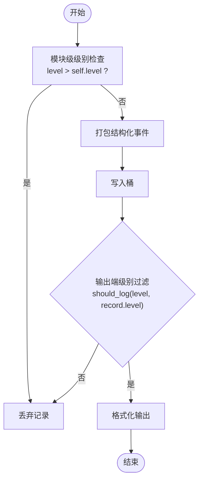
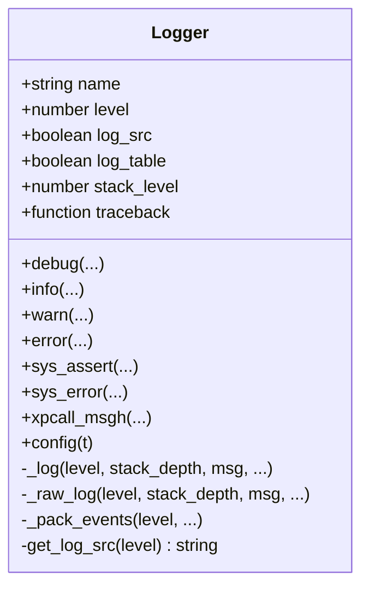
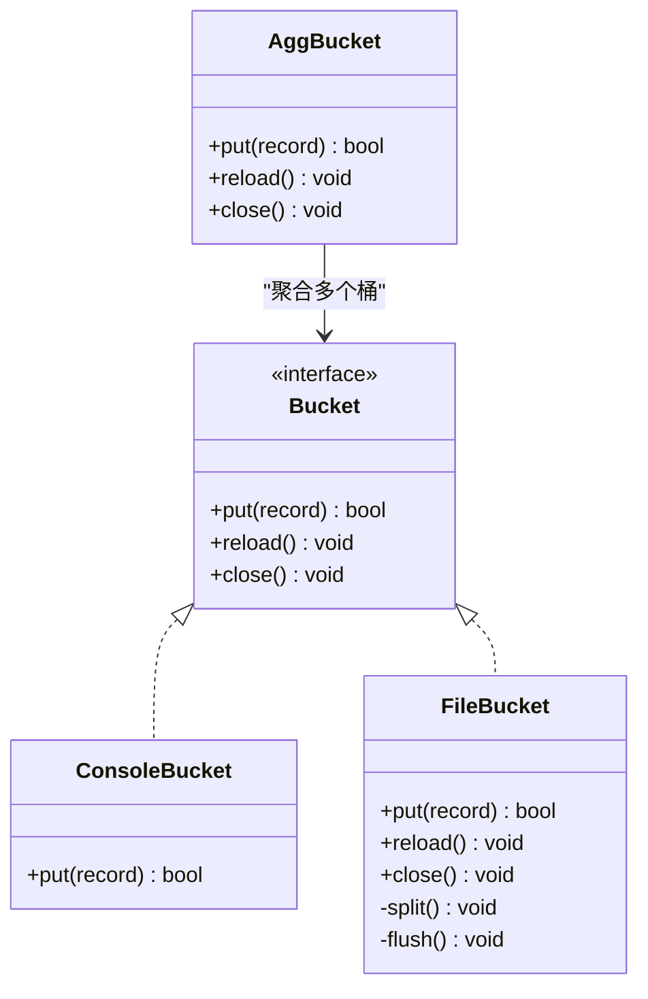
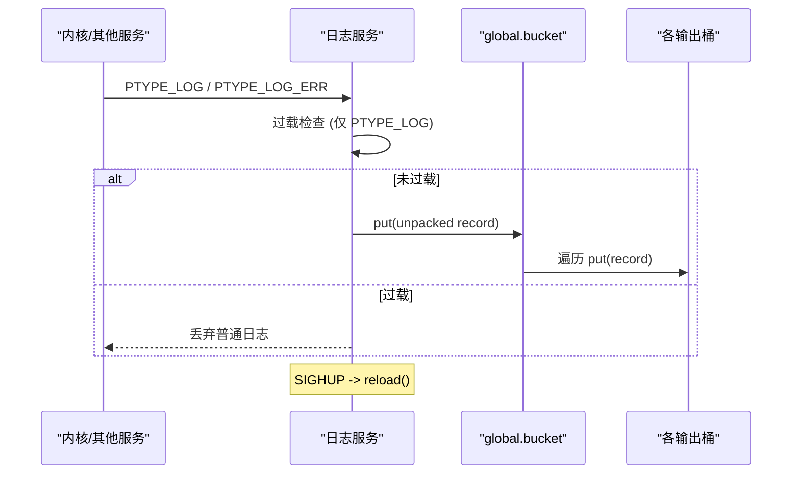
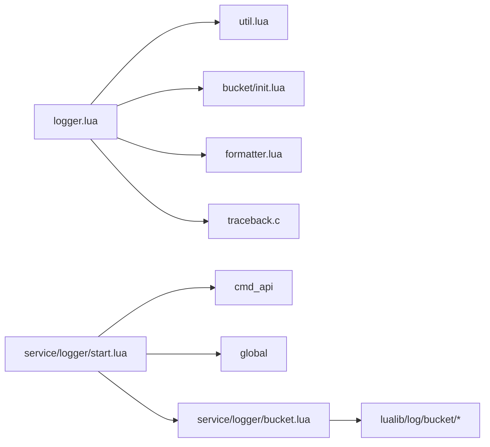

# 日志级别管理

<cite>
**本文引用的文件**
- [lualib/log/init.lua](file://lualib/log/init.lua)
- [lualib/log/logger.lua](file://lualib/log/logger.lua)
- [lualib/log/log_level.lua](file://lualib/log/log_level.lua)
- [lualib/log/util.lua](file://lualib/log/util.lua)
- [lualib/log/formatter.lua](file://lualib/log/formatter.lua)
- [lualib/log/bucket/init.lua](file://lualib/log/bucket/init.lua)
- [lualib/log/bucket/console.lua](file://lualib/log/bucket/console.lua)
- [lualib/log/bucket/file.lua](file://lualib/log/bucket/file.lua)
- [service/logger/main.lua](file://service/logger/main.lua)
- [service/logger/start.lua](file://service/logger/start.lua)
- [service/logger/cmd.lua](file://service/logger/cmd.lua)
- [service/logger/bucket.lua](file://service/logger/bucket.lua)
- [etc/core.conf.lua](file://etc/core.conf.lua)
</cite>

## 目录
1. [简介](#简介)
2. [项目结构](#项目结构)
3. [核心组件](#核心组件)
4. [架构总览](#架构总览)
5. [详细组件分析](#详细组件分析)
6. [依赖关系分析](#依赖关系分析)
7. [性能考量](#性能考量)
8. [故障排查指南](#故障排查指南)
9. [结论](#结论)
10. [附录](#附录)

## 简介
本技术文档围绕 SkyExt 框架的日志级别管理系统，系统阐述日志级别的定义、继承与覆盖规则、过滤机制、动态调整策略以及在不同场景下的最佳实践。重点说明：
- 日志级别模型与优先级
- 模块级与输出端（桶）级双重过滤
- 运行时动态调整日志级别与策略
- 对性能的影响与优化建议
- 常见问题定位与解决方案

## 项目结构
SkyExt 的日志子系统由“应用侧 logger”和“服务侧日志服务”两部分组成：
- 应用侧：提供统一的日志 API、级别控制、结构化事件封装、堆栈追踪等能力，并将日志记录投递到“桶”（bucket）。
- 服务侧：独立的日志服务负责接收日志消息、按配置路由到多个输出桶（控制台、文件等），并支持重载与过载保护。

图表来源
- [lualib/log/init.lua:1-58](file://lualib/log/init.lua#L1-L58)
- [lualib/log/logger.lua:1-130](file://lualib/log/logger.lua#L1-L130)
- [lualib/log/bucket/init.lua:1-31](file://lualib/log/bucket/init.lua#L1-L31)
- [lualib/log/bucket/console.lua:1-38](file://lualib/log/bucket/console.lua#L1-L38)
- [lualib/log/bucket/file.lua:1-254](file://lualib/log/bucket/file.lua#L1-L254)
- [service/logger/start.lua:1-84](file://service/logger/start.lua#L1-L84)
- [service/logger/bucket.lua:1-74](file://service/logger/bucket.lua#L1-L74)

章节来源
- [lualib/log/init.lua:1-58](file://lualib/log/init.lua#L1-L58)
- [service/logger/start.lua:1-84](file://service/logger/start.lua#L1-L84)

## 核心组件
- 日志级别定义：集中维护级别常量与优先级，用于比较与范围解析。
- 日志器（logger）：封装日志写入流程，包含级别过滤、结构化事件打包、源位置获取、错误上下文捕获与堆栈追踪。
- 工具函数（util）：提供日志级别范围解析与是否输出的判定逻辑。
- 格式化器（formatter）：将记录转换为文本或 JSON 格式。
- 桶（bucket）：抽象输出目标，支持控制台、文件等多种后端；服务侧提供聚合桶以同时写入多个后端。
- 日志服务（service/logger）：注册协议、处理日志消息、过载保护、热重载。

章节来源
- [lualib/log/log_level.lua:1-11](file://lualib/log/log_level.lua#L1-L11)
- [lualib/log/logger.lua:1-291](file://lualib/log/logger.lua#L1-L291)
- [lualib/log/util.lua:1-25](file://lualib/log/util.lua#L1-L25)
- [lualib/log/formatter.lua:53-100](file://lualib/log/formatter.lua#L53-L100)
- [lualib/log/bucket/init.lua:1-31](file://lualib/log/bucket/init.lua#L1-L31)
- [service/logger/start.lua:1-84](file://service/logger/start.lua#L1-L84)

## 架构总览
下图展示了从应用调用到最终落盘的完整链路，包括级别过滤、事件打包、桶路由与服务侧过载保护。

图表来源
- [lualib/log/init.lua:41-55](file://lualib/log/init.lua#L41-L55)
- [lualib/log/logger.lua:108-129](file://lualib/log/logger.lua#L108-L129)
- [lualib/log/bucket/init.lua:5-22](file://lualib/log/bucket/init.lua#L5-L22)
- [service/logger/start.lua:52-66](file://service/logger/start.lua#L52-L66)

## 详细组件分析

### 日志级别模型与继承/覆盖规则
- 级别定义与优先级：
  - 定义了 DEBUG、INFO、WARN、ERROR、FATAL 五个级别，数值越小优先级越高。
- 级别范围解析与判定：
  - 支持形如 “INFO-DEBUG” 的范围配置，解析为上下界，并在 should_log 中判断记录是否应输出。
- 继承与覆盖：
  - 模块级（logger）设置 level 作为全局阈值，高于该阈值的记录直接丢弃。
  - 输出端（桶）可独立设置 level 范围，形成“模块级 + 输出端级”的双重过滤。
  - 当任一过滤器拒绝时，记录不会输出；只有两级都通过才会进入格式化与落盘。

图表来源
- [lualib/log/logger.lua:119-129](file://lualib/log/logger.lua#L119-L129)
- [lualib/log/util.lua:9-22](file://lualib/log/util.lua#L9-L22)
- [lualib/log/bucket/console.lua:13-19](file://lualib/log/bucket/console.lua#L13-L19)
- [lualib/log/bucket/file.lua:119-140](file://lualib/log/bucket/file.lua#L119-L140)

章节来源
- [lualib/log/log_level.lua:1-11](file://lualib/log/log_level.lua#L1-L11)
- [lualib/log/util.lua:1-25](file://lualib/log/util.lua#L1-L25)
- [lualib/log/logger.lua:119-129](file://lualib/log/logger.lua#L119-L129)
- [lualib/log/bucket/console.lua:13-19](file://lualib/log/bucket/console.lua#L13-L19)
- [lualib/log/bucket/file.lua:119-140](file://lualib/log/bucket/file.lua#L119-L140)

### 日志器（logger）：过滤、事件与错误上下文
- 级别过滤：在 _log 中根据当前 logger.level 进行快速短路，避免不必要的序列化与 I/O。
- 结构化事件：_pack_events 将键值对参数包装为 events，并对 table 类型进行安全序列化（受 log_table 控制）。
- 源位置：可选开启 log_src，通过 get_log_src 获取调用源文件与行号，规避尾调用导致的行号异常。
- 错误上下文：safe_pcall/safe_xpcall 计数用于识别是否在错误处理上下文中，避免重复堆栈；error 路径自动附加 traceback。
- 配置约束：config 方法对字段进行类型校验，确保 level、log_src、log_table、stack_level、traceback 等字段合法。

图表来源
- [lualib/log/logger.lua:66-153](file://lualib/log/logger.lua#L66-L153)
- [lualib/log/logger.lua:214-236](file://lualib/log/logger.lua#L214-L236)
- [lualib/log/logger.lua:249-288](file://lualib/log/logger.lua#L249-L288)

章节来源
- [lualib/log/logger.lua:108-153](file://lualib/log/logger.lua#L108-L153)
- [lualib/log/logger.lua:180-236](file://lualib/log/logger.lua#L180-L236)
- [lualib/log/logger.lua:249-288](file://lualib/log/logger.lua#L249-L288)

### 桶（bucket）：输出后端与聚合
- 统一接口：所有桶实现 put(record) 方法，内部进行级别过滤与格式化后输出。
- 控制台桶：输出到标准输出，支持颜色与自定义样式。
- 文件桶：支持按行数、大小、小时、天进行轮转；支持 flush_period 批量刷盘；支持 JSON/text 格式。
- 聚合桶：服务侧 bucket 可同时向多个子桶写入，任一成功即认为成功；否则回退到默认桶（控制台）。

图表来源
- [lualib/log/bucket/console.lua:13-34](file://lualib/log/bucket/console.lua#L13-L34)
- [lualib/log/bucket/file.lua:77-159](file://lualib/log/bucket/file.lua#L77-L159)
- [service/logger/bucket.lua:8-28](file://service/logger/bucket.lua#L8-L28)

章节来源
- [lualib/log/bucket/init.lua:5-22](file://lualib/log/bucket/init.lua#L5-L22)
- [lualib/log/bucket/console.lua:13-34](file://lualib/log/bucket/console.lua#L13-L34)
- [lualib/log/bucket/file.lua:119-159](file://lualib/log/bucket/file.lua#L119-L159)
- [service/logger/bucket.lua:8-28](file://service/logger/bucket.lua#L8-L28)

### 服务侧日志服务：协议、过载保护与热重载
- 协议注册：注册 SYSTEM 与 text 协议，SIGHUP 信号触发 bucket.reload，text 协议转发至 kernel_logger。
- 日志分发回调：对 PTYPE_LOG 执行过载检查（global.log_overload），若过载则丢弃普通日志；PTYPE_LOG_ERR 不执行流控。
- 启动流程：加载配置构建 global.bucket，注册 .logger 地址，延迟初始化以避免启动失败无法记录问题。
- 命令接口：提供 put/close/reload 命令，便于外部控制日志服务行为。

图表来源
- [service/logger/start.lua:23-50](file://service/logger/start.lua#L23-L50)
- [service/logger/start.lua:52-66](file://service/logger/start.lua#L52-L66)
- [service/logger/start.lua:68-84](file://service/logger/start.lua#L68-L84)
- [service/logger/cmd.lua:6-18](file://service/logger/cmd.lua#L6-L18)

章节来源
- [service/logger/start.lua:23-84](file://service/logger/start.lua#L23-L84)
- [service/logger/cmd.lua:6-18](file://service/logger/cmd.lua#L6-L18)

### 配置与初始化
- 应用侧初始化：log.init 从配置读取 log_level、log_src、log_print_table，并注入 assert/error/pcall/xpcall 的安全版本。
- 服务侧配置：core.conf 指定日志服务名与路径；服务启动时读取 log_config 构建聚合桶。
- 推荐配置项：
  - 模块级 level：控制最小输出级别（例如 INFO）。
  - 桶级 level：控制具体输出目标的级别范围（例如 console 使用 DEBUG，file 使用 INFO-WARN）。
  - 文件桶 split：按 line/size/hour/day 轮转，配合 maxline/maxsize/dateext。
  - flush_period：批量刷盘以减少系统调用开销。

章节来源
- [lualib/log/init.lua:41-55](file://lualib/log/init.lua#L41-L55)
- [etc/core.conf.lua:28-30](file://etc/core.conf.lua#L28-L30)
- [service/logger/start.lua:68-71](file://service/logger/start.lua#L68-L71)

## 依赖关系分析
- 模块耦合：
  - logger 依赖 util（级别解析）、bucket（输出）、formatter（格式化）、traceback_c（堆栈）。
  - 服务侧 start 依赖 cmd_api、cmd、global、bucket、ptype 等。
- 外部依赖：
  - skynet 协议与调度。
  - cjson.safe（JSON 编码）。
  - io 文件操作。
- 潜在循环依赖：
  - 通过 service 与 lualib 分层隔离，未见明显循环引用。

图表来源
- [lualib/log/logger.lua:1-6](file://lualib/log/logger.lua#L1-L6)
- [service/logger/start.lua:1-10](file://service/logger/start.lua#L1-L10)
- [service/logger/bucket.lua:1-7](file://service/logger/bucket.lua#L1-L7)

章节来源
- [lualib/log/logger.lua:1-6](file://lualib/log/logger.lua#L1-L6)
- [service/logger/start.lua:1-10](file://service/logger/start.lua#L1-L10)
- [service/logger/bucket.lua:1-7](file://service/logger/bucket.lua#L1-L7)

## 性能考量
- 级别过滤优先：在 logger._log 中进行快速短路，避免高频率低级别日志带来的序列化与 I/O 开销。
- 结构化事件序列化：table 序列化仅在 log_table=true 或级别低于 INFO 时启用，减少常规日志成本。
- 堆栈追踪：error 路径附带 traceback，但仅在必要时生成；可通过调整 stack_level 控制深度。
- 文件刷盘：file 桶支持 flush_period，批量写盘降低系统调用次数；合理设置可减少磁盘抖动。
- 轮转策略：按 size/line/time 轮转避免单文件过大；注意轮转时的重命名与句柄切换开销。
- 服务侧过载保护：在日志服务层对普通日志进行丢弃，保障核心业务稳定性。

[本节为通用性能指导，不直接分析具体文件]

## 故障排查指南
- 启动失败无法记录日志：
  - 日志服务主入口使用 xpcall 包裹启动逻辑，失败时将错误写入 bootfail.log 并中止服务。
- 日志未输出：
  - 检查模块级 level 与桶级 level 范围是否匹配；确认 should_log 判定逻辑。
  - 确认服务侧是否处于过载状态（PTYPE_LOG 被丢弃）。
- 行号异常：
  - 检查 log_src 开关与 get_log_src 的调用层级；避免尾调用导致行号抓取到 C 函数。
- 文件写入失败：
  - 检查 file 桶的 flush_ok 标志与 handle 状态；必要时调用 close/reload 恢复。
- 动态调整策略：
  - 通过服务侧命令接口 reload 重新加载桶配置；或在应用侧调用 logger.config 修改级别。

章节来源
- [service/logger/main.lua:1-18](file://service/logger/main.lua#L1-L18)
- [lualib/log/util.lua:20-22](file://lualib/log/util.lua#L20-L22)
- [service/logger/start.lua:52-66](file://service/logger/start.lua#L52-L66)
- [lualib/log/logger.lua:51-64](file://lualib/log/logger.lua#L51-L64)
- [lualib/log/bucket/file.lua:143-159](file://lualib/log/bucket/file.lua#L143-L159)
- [service/logger/cmd.lua:6-18](file://service/logger/cmd.lua#L6-L18)

## 结论
SkyExt 的日志级别管理采用“模块级 + 输出端级”双重过滤，结合结构化事件、堆栈追踪与多种输出后端，提供了灵活且高性能的日志能力。通过合理的级别配置、桶策略与服务侧过载保护，可在不同运行环境下平衡可观测性与性能。建议在开发阶段使用较细粒度级别，生产环境按需收紧，并结合文件轮转与批量刷盘优化 I/O 压力。

[本节为总结性内容，不直接分析具体文件]

## 附录

### 常用配置示例（路径参考）
- 应用侧初始化与级别读取：
  - [lualib/log/init.lua:41-55](file://lualib/log/init.lua#L41-L55)
- 服务侧日志服务启动与配置：
  - [service/logger/start.lua:68-84](file://service/logger/start.lua#L68-L84)
- 核心配置路径与日志服务名：
  - [etc/core.conf.lua:28-30](file://etc/core.conf.lua#L28-L30)

### 关键实现片段路径
- 级别定义与范围解析：
  - [lualib/log/log_level.lua:1-11](file://lualib/log/log_level.lua#L1-L11)
  - [lualib/log/util.lua:9-22](file://lualib/log/util.lua#L9-L22)
- 日志器核心流程：
  - [lualib/log/logger.lua:108-153](file://lualib/log/logger.lua#L108-L153)
  - [lualib/log/logger.lua:214-236](file://lualib/log/logger.lua#L214-L236)
  - [lualib/log/logger.lua:249-288](file://lualib/log/logger.lua#L249-L288)
- 桶实现与聚合：
  - [lualib/log/bucket/console.lua:13-34](file://lualib/log/bucket/console.lua#L13-L34)
  - [lualib/log/bucket/file.lua:119-159](file://lualib/log/bucket/file.lua#L119-L159)
  - [service/logger/bucket.lua:8-28](file://service/logger/bucket.lua#L8-L28)
- 服务侧协议与过载保护：
  - [service/logger/start.lua:23-66](file://service/logger/start.lua#L23-L66)