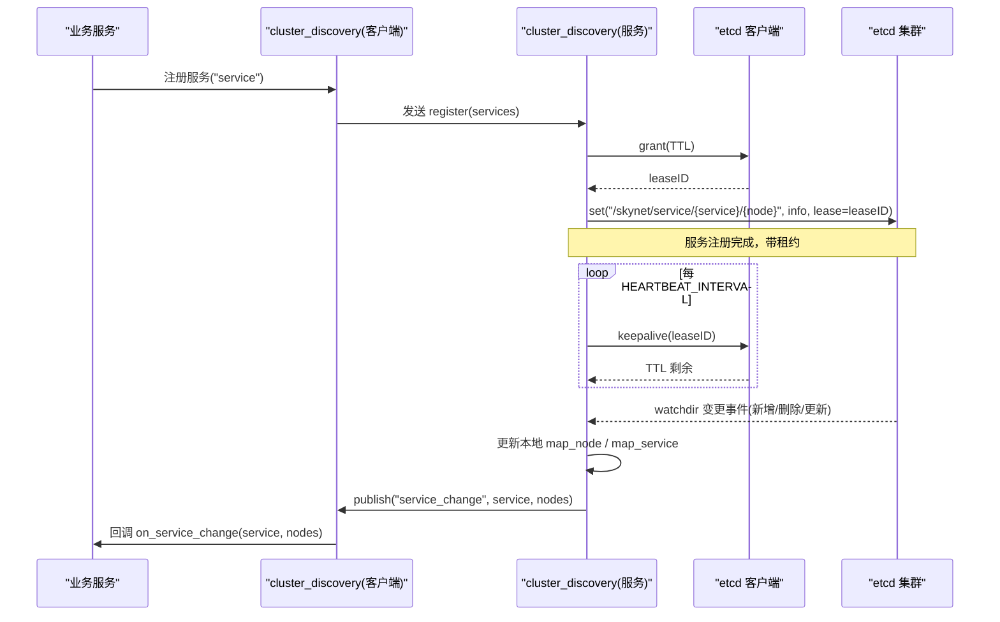
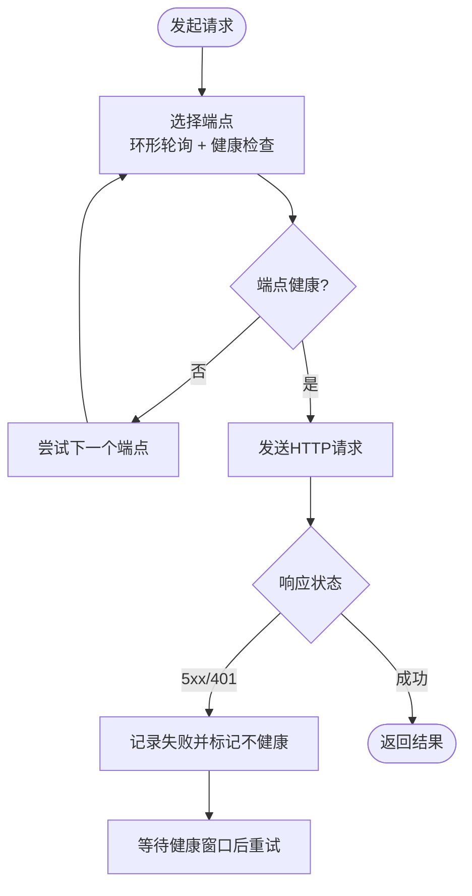
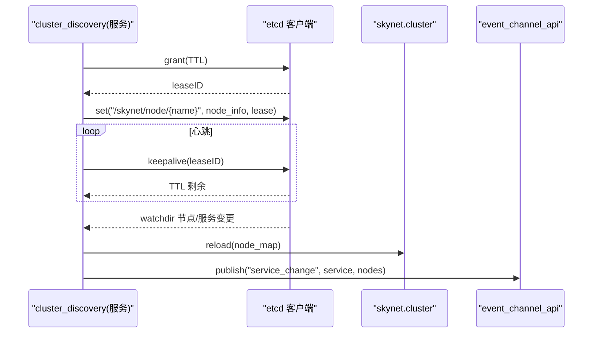
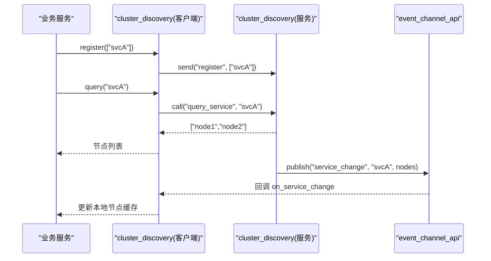
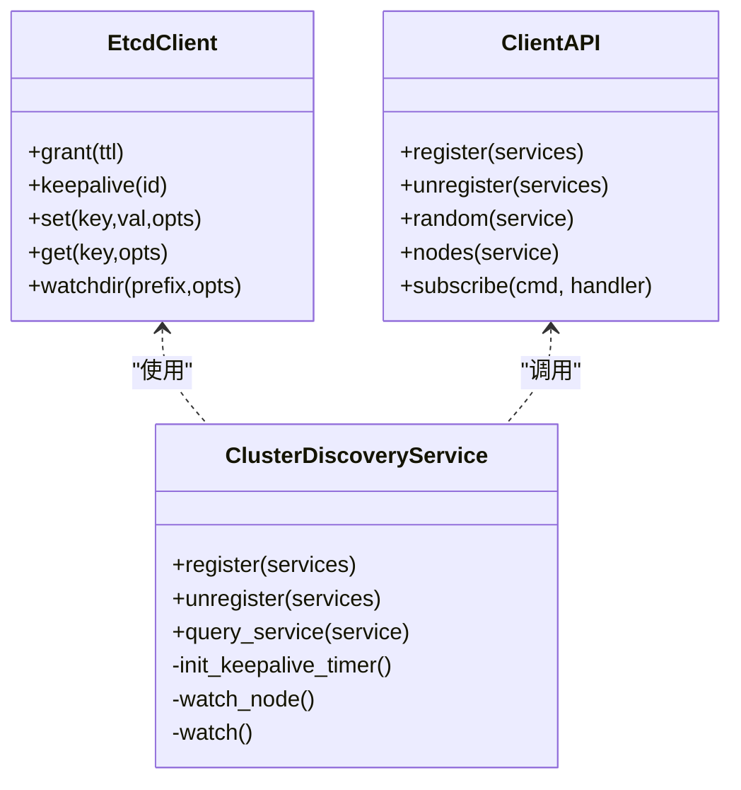
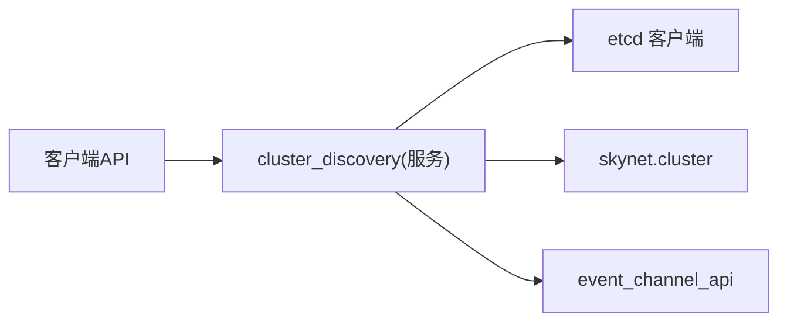

# 服务发现与治理

<cite>
**本文引用的文件**
- [lualib/etcd.lua](file://lualib/etcd.lua)
- [service/cluster_discovery.lua](file://service/cluster_discovery.lua)
- [lualib/cluster_discovery.lua](file://lualib/cluster_discovery.lua)
- [lualib/event_channel_api.lua](file://lualib/event_channel_api.lua)
- [etc/app/common.app.lua](file://etc/app/common.app.lua)
- [README.md](file://README.md)
- [test/test_etcd/main.lua](file://test/test_etcd/main.lua)
</cite>

## 目录
1. [简介](#简介)
2. [项目结构](#项目结构)
3. [核心组件](#核心组件)
4. [架构总览](#架构总览)
5. [详细组件分析](#详细组件分析)
6. [依赖关系分析](#依赖关系分析)
7. [性能考量](#性能考量)
8. [故障诊断指南](#故障诊断指南)
9. [结论](#结论)
10. [附录：使用示例与最佳实践](#附录使用示例与最佳实践)

## 简介
本技术文档聚焦 SkyExt 框架的“服务发现与治理”模块，围绕基于 etcd 的服务注册、发现、负载均衡、健康检查、实例生命周期管理、故障自动转移、配置动态更新等能力展开。文档同时提供完整的代码级流程图与时序图，帮助读者理解从服务启动到客户端调用再到故障恢复的全链路机制，并给出高可用配置、网络分区处理、性能优化与最佳实践建议。

## 项目结构
SkyExt 将服务发现与治理拆分为三层：
- 底层 etcd 客户端封装：负责 HTTP API 访问、鉴权、端点选择与健康探测、租约与 Watch 流式监听。
- 集群服务发现服务：以独立 Skynet 服务运行，维护节点与服务在 etcd 中的键值，实现心跳保活、变更监听、本地缓存与事件广播。
- 上层发现接口：为业务模块提供统一的注册/注销/查询/订阅接口，屏蔽底层细节。

```mermaid
graph TB
subgraph "应用进程"
A["业务服务"]
B["cluster_discovery(客户端API)"]
C["cluster_discovery(服务)"]
end
subgraph "存储与协调"
D["etcd 集群"]
end
A --> B
B --> C
C < --> D
```

图表来源
- [service/cluster_discovery.lua:1-668](file://service/cluster_discovery.lua#L1-L668)
- [lualib/cluster_discovery.lua:1-95](file://lualib/cluster_discovery.lua#L1-L95)
- [lualib/etcd.lua:1-250](file://lualib/etcd.lua#L1-L250)

章节来源
- [README.md:1-276](file://README.md#L1-L276)

## 核心组件
- etcd 客户端（lualib/etcd.lua）
  - 功能：HTTP 请求封装、JWT 认证、多端点轮询与失败隔离、租约申请/续期/撤销、KV 读写、范围查询、事务、Watch 流式监听。
  - 关键特性：环形负载均衡、健康检查窗口、工作端点缓存、超时与重试控制。
- 集群服务发现服务（service/cluster_discovery.lua）
  - 功能：节点注册/更新/注销、服务注册/更新/注销、心跳保活、节点与服务变更监听、本地缓存、事件发布。
  - 关键特性：基于 revision 的一致性校验、按服务维度维护节点集合、通过 skynet.cluster 刷新路由表。
- 客户端发现接口（lualib/cluster_discovery.lua）
  - 功能：注册/注销服务、查询服务节点、随机挑选节点、订阅服务变更事件。
  - 关键特性：懒初始化、并发安全队列锁、事件通道订阅。
- 事件通道（lualib/event_channel_api.lua）
  - 功能：基于 Skynet Multicast 的事件发布/订阅，用于服务变更通知。

章节来源
- [lualib/etcd.lua:1-250](file://lualib/etcd.lua#L1-L250)
- [service/cluster_discovery.lua:1-668](file://service/cluster_discovery.lua#L1-L668)
- [lualib/cluster_discovery.lua:1-95](file://lualib/cluster_discovery.lua#L1-L95)
- [lualib/event_channel_api.lua:1-57](file://lualib/event_channel_api.lua#L1-L57)

## 架构总览
下图展示了服务注册、心跳保活、变更监听与客户端发现的端到端流程。



图表来源
- [service/cluster_discovery.lua:46-73](file://service/cluster_discovery.lua#L46-L73)
- [service/cluster_discovery.lua:178-213](file://service/cluster_discovery.lua#L178-L213)
- [service/cluster_discovery.lua:374-417](file://service/cluster_discovery.lua#L374-L417)
- [service/cluster_discovery.lua:587-619](file://service/cluster_discovery.lua#L587-L619)
- [lualib/cluster_discovery.lua:78-92](file://lualib/cluster_discovery.lua#L78-L92)
- [lualib/event_channel_api.lua:28-49](file://lualib/event_channel_api.lua#L28-L49)

## 详细组件分析

### etcd 客户端：负载均衡与健康检查
- 端点选择与健康检查
  - 支持多端点配置，内部采用环形轮询选择下一个端点。
  - 对每个端点维护失败过期时间窗口，窗口内视为不健康，避免频繁重试失败节点。
  - 工作端点缓存，减少重复选择开销；失败时清空缓存，下次重新选择。
- 鉴权与令牌刷新
  - 支持 JWT 认证，自动刷新 token，避免频繁认证风暴。
- 租约与 Watch
  - 提供 grant/keepalive/revoke 接口，配合 KV 操作实现服务实例的生命周期管理。
  - 提供 watchdir 流式监听，用于实时感知键值变化。



图表来源
- [lualib/etcd.lua:154-209](file://lualib/etcd.lua#L154-L209)
- [lualib/etcd.lua:211-241](file://lualib/etcd.lua#L211-L241)

章节来源
- [lualib/etcd.lua:154-241](file://lualib/etcd.lua#L154-L241)

### 集群服务发现服务：节点与服务生命周期
- 节点生命周期
  - 启动时申请租约，周期性 keepalive 续期；若续期失败则重置本地 revision，重新注册。
  - 首次注册节点信息，后续通过 mod 原子更新，确保一致性。
  - 地址冲突检测：若已有同地址节点存在且租约不同，主动撤销旧租约再注册。
- 服务生命周期
  - 注册服务时写入 /skynet/service/{service}/{node}，附带节点 revision，便于下游校验。
  - 注销服务时删除对应键，清理本地同步状态。
- 变更监听与一致性
  - 节点与服务均通过 watchdir 监听 etcd 变更，基于 revision 增量更新本地缓存。
  - 节点变更会触发 skynet.cluster.reload，使路由表与拓扑保持一致。
- 事件广播
  - 服务变更时通过 event_channel_api.publish 广播 service_change 事件，供客户端订阅。



图表来源
- [service/cluster_discovery.lua:46-73](file://service/cluster_discovery.lua#L46-L73)
- [service/cluster_discovery.lua:98-176](file://service/cluster_discovery.lua#L98-L176)
- [service/cluster_discovery.lua:374-417](file://service/cluster_discovery.lua#L374-L417)
- [service/cluster_discovery.lua:587-619](file://service/cluster_discovery.lua#L587-L619)

章节来源
- [service/cluster_discovery.lua:46-176](file://service/cluster_discovery.lua#L46-L176)
- [service/cluster_discovery.lua:374-417](file://service/cluster_discovery.lua#L374-L417)
- [service/cluster_discovery.lua:587-619](file://service/cluster_discovery.lua#L587-L619)

### 客户端发现接口：注册/查询/负载均衡
- 注册与注销
  - 通过 skynet.send 向 cluster_discovery 服务发送 register/unregister 命令，由服务侧统一与 etcd 交互。
- 查询与随机挑选
  - 首次查询会触发懒初始化，拉取当前服务的所有节点列表。
  - 提供 random 方法，从节点列表中随机选择一个节点，适合简单负载均衡场景。
- 事件订阅
  - 通过 event_channel_api.subscribe 订阅 service_change 事件，当服务节点集合变化时获得回调。



图表来源
- [lualib/cluster_discovery.lua:10-20](file://lualib/cluster_discovery.lua#L10-L20)
- [lualib/cluster_discovery.lua:61-76](file://lualib/cluster_discovery.lua#L61-L76)
- [lualib/cluster_discovery.lua:78-92](file://lualib/cluster_discovery.lua#L78-L92)
- [service/cluster_discovery.lua:622-644](file://service/cluster_discovery.lua#L622-L644)

章节来源
- [lualib/cluster_discovery.lua:10-92](file://lualib/cluster_discovery.lua#L10-L92)
- [service/cluster_discovery.lua:622-644](file://service/cluster_discovery.lua#L622-L644)

### 服务间通信与负载均衡策略
- 节点发现与路由
  - 服务发现服务维护节点映射，并通过 skynet.cluster.reload 更新全局路由表，使得上层可通过服务名进行跨节点通信。
- 客户端负载均衡
  - 客户端层提供随机选择策略，适用于无状态服务的简单均衡。
  - 对于更复杂的均衡需求（如加权、亲和性），可在客户端扩展选择器，结合节点元信息进行决策。



图表来源
- [lualib/etcd.lua:253-353](file://lualib/etcd.lua#L253-L353)
- [service/cluster_discovery.lua:248-266](file://service/cluster_discovery.lua#L248-L266)
- [lualib/cluster_discovery.lua:10-92](file://lualib/cluster_discovery.lua#L10-L92)

章节来源
- [lualib/etcd.lua:253-353](file://lualib/etcd.lua#L253-L353)
- [service/cluster_discovery.lua:248-266](file://service/cluster_discovery.lua#L248-L266)
- [lualib/cluster_discovery.lua:10-92](file://lualib/cluster_discovery.lua#L10-L92)

## 依赖关系分析
- 组件耦合
  - cluster_discovery(服务) 强依赖 etcd 客户端与 skynet.cluster；通过 event_channel_api 解耦事件传播。
  - 客户端 API 仅依赖 cluster_discovery(服务) 与 event_channel_api，保持轻量。
- 外部依赖
  - etcd 集群：提供 KV 存储、租约、Watch 能力。
  - skynet.cluster：提供服务路由与拓扑刷新。
- 潜在循环依赖
  - 未发现循环依赖；事件通道单向发布，客户端订阅，服务侧不反向依赖客户端。



图表来源
- [lualib/cluster_discovery.lua:1-95](file://lualib/cluster_discovery.lua#L1-L95)
- [service/cluster_discovery.lua:1-668](file://service/cluster_discovery.lua#L1-L668)
- [lualib/etcd.lua:1-250](file://lualib/etcd.lua#L1-L250)
- [lualib/event_channel_api.lua:1-57](file://lualib/event_channel_api.lua#L1-L57)

章节来源
- [lualib/cluster_discovery.lua:1-95](file://lualib/cluster_discovery.lua#L1-L95)
- [service/cluster_discovery.lua:1-668](file://service/cluster_discovery.lua#L1-L668)
- [lualib/etcd.lua:1-250](file://lualib/etcd.lua#L1-L250)
- [lualib/event_channel_api.lua:1-57](file://lualib/event_channel_api.lua#L1-L57)

## 性能考量
- etcd 客户端
  - 多端点环形轮询降低单点压力；健康检查窗口避免雪崩重试。
  - JWT 令牌缓存与抖动刷新，减少认证风暴。
  - 超时配置合理（默认 1s），避免阻塞主循环。
- 服务发现服务
  - 心跳间隔为租约 TTL 的三分之一，兼顾及时性与负载。
  - 基于 revision 的增量更新，避免全量重算。
  - 事件广播使用 Multicast，降低消息分发成本。
- 客户端
  - 懒初始化与队列锁保证并发安全与资源复用。
  - 随机选择策略 O(1)，适合无状态服务。

[本节为通用指导，无需具体文件引用]

## 故障诊断指南
- 常见问题定位
  - 服务未注册：检查 etcd 中 /skynet/service/{service}/{node} 是否存在，确认租约是否有效。
  - 节点不可用：查看 etcd 客户端日志中的健康检查与失败记录，确认是否进入不健康窗口。
  - 心跳失败：关注 keepalive 返回值与 TTL 剩余，必要时重启服务或检查网络连通性。
  - 版本冲突：若出现 mod_revision 过旧，说明数据陈旧，需重新拉取最新 revision。
- 诊断步骤
  - 使用测试脚本验证 etcd 连通性与基本操作。
  - 查看服务日志中的 watch 事件与 revision 更新记录。
  - 核对 etcd 配置与多端点列表，确保至少一个端点可达。

章节来源
- [test/test_etcd/main.lua:1-53](file://test/test_etcd/main.lua#L1-L53)
- [lualib/etcd.lua:170-209](file://lualib/etcd.lua#L170-L209)
- [service/cluster_discovery.lua:587-619](file://service/cluster_discovery.lua#L587-L619)

## 结论
SkyExt 的服务发现与治理模块以 etcd 为核心，实现了健壮的节点与服务生命周期管理、基于 revision 的一致性更新、事件驱动的动态扩缩容与故障转移。客户端 API 简洁易用，支持注册、查询与事件订阅，满足游戏服务器对高可用与低延迟的要求。通过合理的健康检查、心跳与负载均衡策略，系统在网络波动或服务异常时仍能保持稳定。

[本节为总结性内容，无需具体文件引用]

## 附录：使用示例与最佳实践

### 服务注册与发现（代码路径参考）
- 注册服务
  - 客户端调用：[lualib/cluster_discovery.lua:10-14](file://lualib/cluster_discovery.lua#L10-L14)
  - 服务端处理：[service/cluster_discovery.lua:622-630](file://service/cluster_discovery.lua#L622-L630)
  - etcd 写入：[service/cluster_discovery.lua:178-193](file://service/cluster_discovery.lua#L178-L193)
- 发现节点
  - 客户端查询：[lualib/cluster_discovery.lua:61-76](file://lualib/cluster_discovery.lua#L61-L76)
  - 服务端查询：[service/cluster_discovery.lua:641-644](file://service/cluster_discovery.lua#L641-L644)
  - etcd 读取：[service/cluster_discovery.lua:488-512](file://service/cluster_discovery.lua#L488-L512)

### 客户端负载均衡（代码路径参考）
- 随机选择：[lualib/cluster_discovery.lua:61-70](file://lualib/cluster_discovery.lua#L61-L70)
- etcd 端点选择与健康检查：[lualib/etcd.lua:154-209](file://lualib/etcd.lua#L154-L209)

### 服务间通信（代码路径参考）
- 节点变更刷新路由：[service/cluster_discovery.lua:348-371](file://service/cluster_discovery.lua#L348-L371)
- 事件发布与订阅：[service/cluster_discovery.lua:578-585](file://service/cluster_discovery.lua#L578-L585)、[lualib/event_channel_api.lua:28-49](file://lualib/event_channel_api.lua#L28-L49)

### 高可用配置与网络分区处理
- etcd 多端点配置：[etc/app/common.app.lua:21-29](file://etc/app/common.app.lua#L21-L29)
- 健康检查窗口与失败隔离：[lualib/etcd.lua:167-184](file://lualib/etcd.lua#L167-L184)
- 心跳与租约：[service/cluster_discovery.lua:46-73](file://service/cluster_discovery.lua#L46-L73)

### 性能优化建议
- 调整心跳间隔与 TTL，平衡及时性与负载。
- 合理设置 etcd 客户端超时与连接数。
- 在客户端层实现更精细的负载均衡策略（如加权、亲和性）。

### 最佳实践
- 始终使用带租约的服务注册，确保异常退出时自动清理。
- 使用 revision 校验避免脏写与竞态条件。
- 通过事件通道解耦服务变更与业务逻辑，提升可维护性。
- 监控 etcd 健康与心跳状态，建立告警机制。

[本节为实践指导，无需具体文件引用]