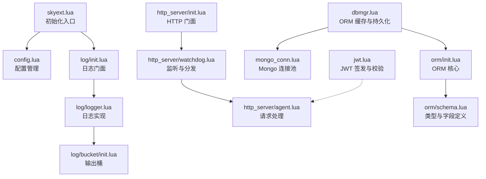
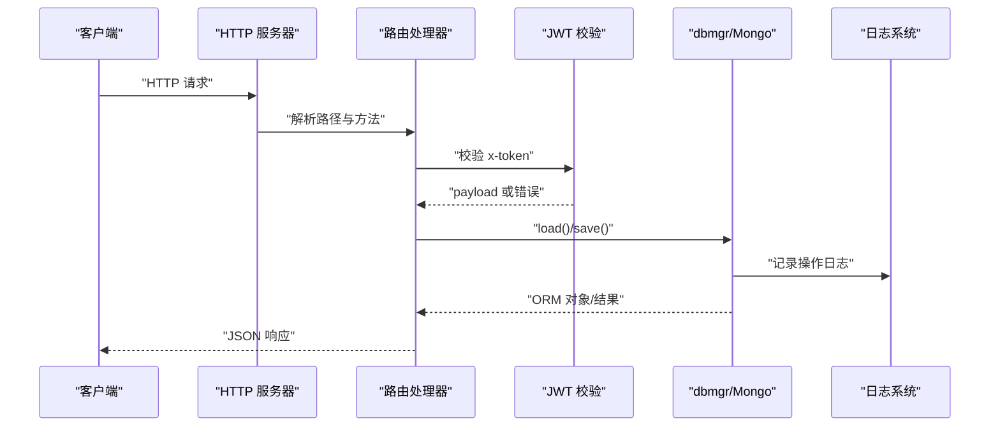
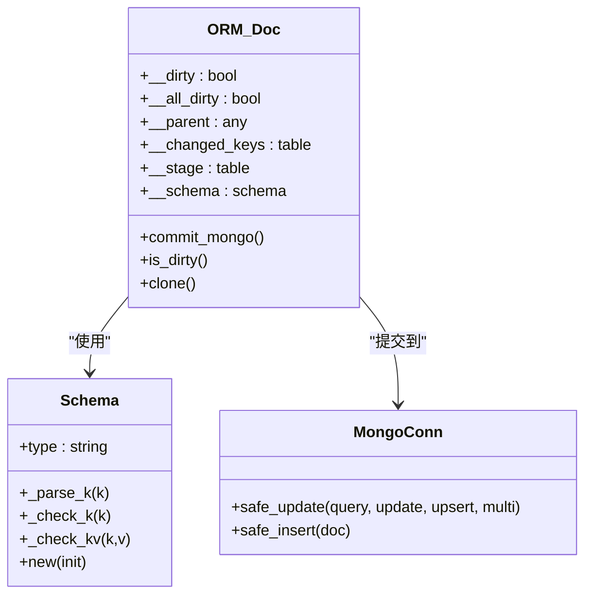
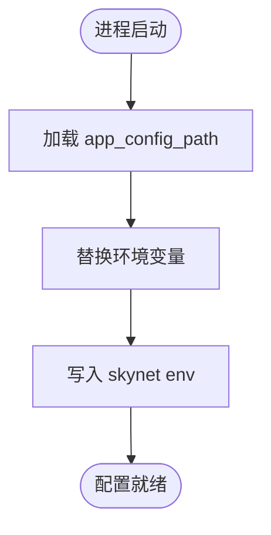
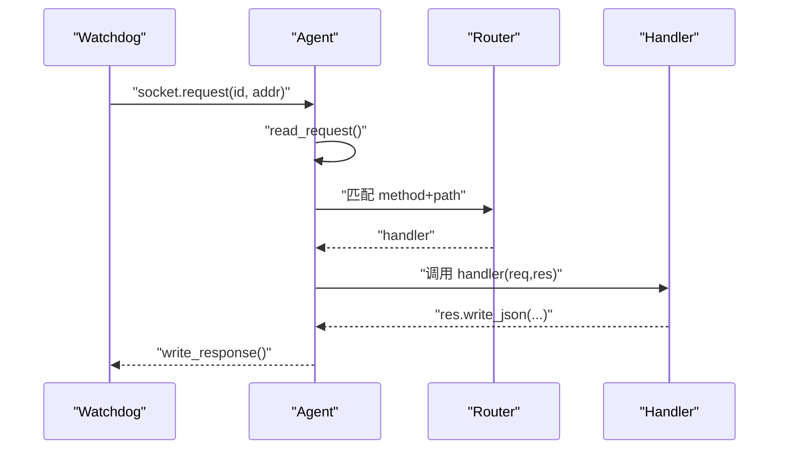
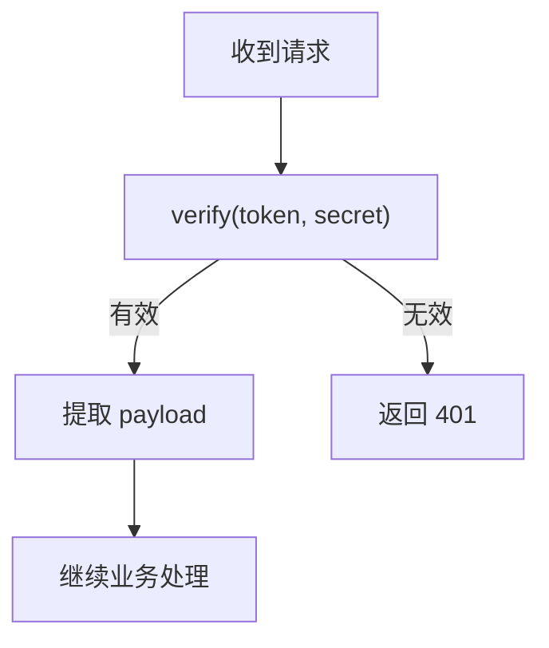
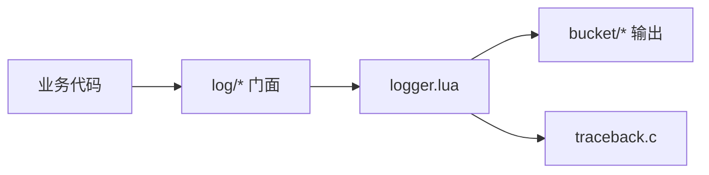
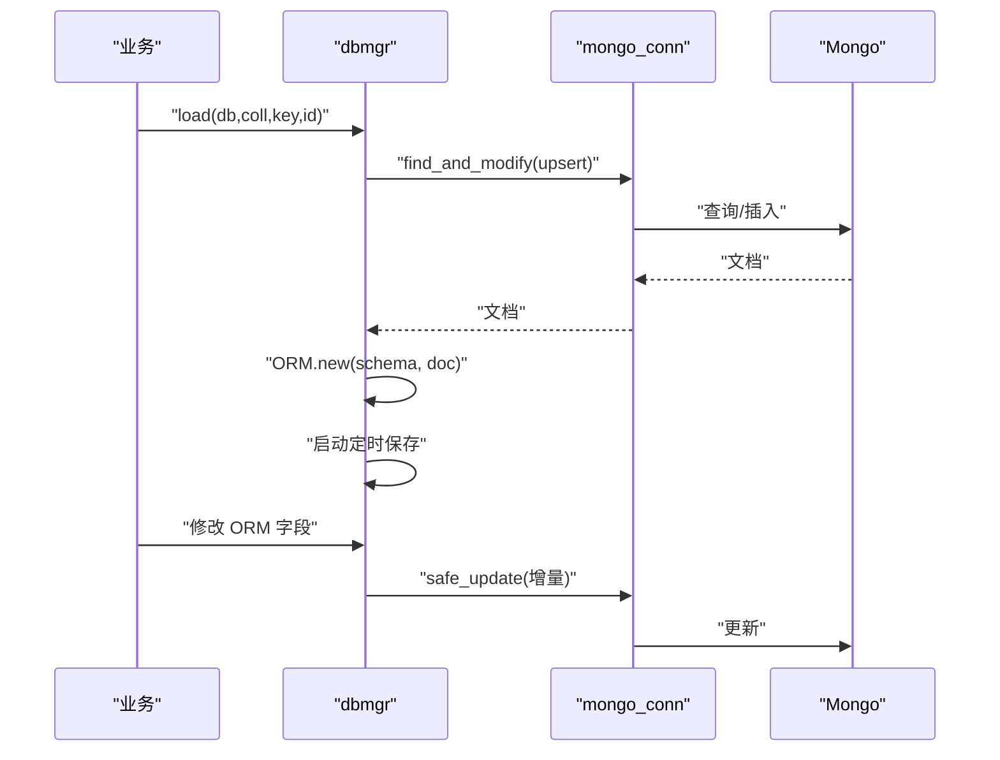
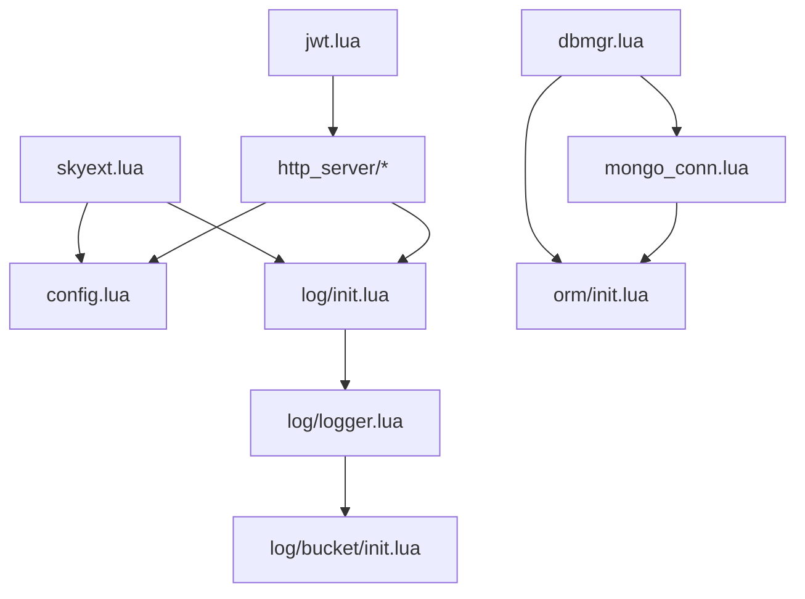

# 核心模块

<cite>
**本文引用的文件**
- [lualib/skyext.lua](file://lualib/skyext.lua)
- [lualib/config.lua](file://lualib/config.lua)
- [lualib/log/init.lua](file://lualib/log/init.lua)
- [lualib/log/logger.lua](file://lualib/log/logger.lua)
- [lualib/log/bucket/init.lua](file://lualib/log/bucket/init.lua)
- [lualib/orm/init.lua](file://lualib/orm/init.lua)
- [lualib/orm/schema.lua](file://lualib/orm/schema.lua)
- [lualib/mongo_conn.lua](file://lualib/mongo_conn.lua)
- [lualib/dbmgr.lua](file://lualib/dbmgr.lua)
- [lualib/http_server/init.lua](file://lualib/http_server/init.lua)
- [lualib/http_server/watchdog.lua](file://lualib/http_server/watchdog.lua)
- [lualib/http_server/agent.lua](file://lualib/http_server/agent.lua)
- [lualib/jwt.lua](file://lualib/jwt.lua)
- [etc/core.conf.lua](file://etc/core.conf.lua)
</cite>

## 目录
1. [简介](#简介)
2. [项目结构](#项目结构)
3. [核心组件](#核心组件)
4. [架构总览](#架构总览)
5. [详细组件分析](#详细组件分析)
6. [依赖关系分析](#依赖关系分析)
7. [性能考虑](#性能考虑)
8. [故障排查指南](#故障排查指南)
9. [结论](#结论)
10. [附录：API 参考与配置选项](#附录api-参考与配置选项)

## 简介
本技术文档围绕 SkyExt 框架的核心模块，系统性阐述 ORM 数据模型、配置管理、HTTP 服务器、JWT 认证与日志系统的实现原理、模块间依赖与集成方式，并提供 API 参考、配置项说明、使用示例、性能优化建议与最佳实践。读者无需深入底层即可理解并高效使用这些模块。

## 项目结构
SkyExt 将核心能力以可复用的 Lua 模块形式组织在 lualib 下，并通过服务化（watchdog/agent）与工具库（config、log、mongo_conn、dbmgr）组合出完整的数据访问与 HTTP 服务能力。启动时由 skyext 统一初始化配置与日志，随后各子系统按需加载。

图表来源
- [lualib/skyext.lua:61-80](file://lualib/skyext.lua#L61-L80)
- [lualib/config.lua:120-142](file://lualib/config.lua#L120-L142)
- [lualib/log/init.lua:41-55](file://lualib/log/init.lua#L41-L55)
- [lualib/log/logger.lua:265-288](file://lualib/log/logger.lua#L265-L288)
- [lualib/log/bucket/init.lua:5-22](file://lualib/log/bucket/init.lua#L5-L22)
- [lualib/http_server/init.lua:8-20](file://lualib/http_server/init.lua#L8-L20)
- [lualib/http_server/watchdog.lua:13-43](file://lualib/http_server/watchdog.lua#L13-L43)
- [lualib/http_server/agent.lua:31-118](file://lualib/http_server/agent.lua#L31-L118)
- [lualib/dbmgr.lua:94-148](file://lualib/dbmgr.lua#L94-L148)
- [lualib/mongo_conn.lua:146-149](file://lualib/mongo_conn.lua#L146-L149)
- [lualib/orm/init.lua:315-319](file://lualib/orm/init.lua#L315-L319)
- [lualib/orm/schema.lua:187-471](file://lualib/orm/schema.lua#L187-L471)
- [lualib/jwt.lua:18-67](file://lualib/jwt.lua#L18-L67)

章节来源
- [lualib/skyext.lua:61-80](file://lualib/skyext.lua#L61-L80)
- [etc/core.conf.lua:1-30](file://etc/core.conf.lua#L1-L30)

## 核心组件
- 配置管理：集中读取应用配置与环境变量，提供类型安全的获取接口，支持 include 嵌套与表序列化。
- 日志系统：结构化日志、错误堆栈捕获、多级别过滤、可插拔输出桶（console/file/service）。
- ORM 框架：基于 schema 的类型校验、脏标记与增量更新、BSON 编码上下文、Mongo 提交。
- HTTP 服务器：watchdog 监听端口，agent 解析请求、路由分发、响应封装，支持 JSON/文件/CORS。
- JWT 认证：HS256/HS512 签名与校验，支持 nbf/iat/exp 时间窗口验证。
- 数据库访问：dbmgr 负责 ORM 对象缓存、定时落盘与版本控制；mongo_conn 提供连接池与 BSON 编解码。

章节来源
- [lualib/config.lua:6-72](file://lualib/config.lua#L6-L72)
- [lualib/log/init.lua:9-55](file://lualib/log/init.lua#L9-L55)
- [lualib/orm/init.lua:315-447](file://lualib/orm/init.lua#L315-L447)
- [lualib/http_server/init.lua:8-20](file://lualib/http_server/init.lua#L8-L20)
- [lualib/jwt.lua:18-100](file://lualib/jwt.lua#L18-L100)
- [lualib/dbmgr.lua:94-198](file://lualib/dbmgr.lua#L94-L198)
- [lualib/mongo_conn.lua:44-77](file://lualib/mongo_conn.lua#L44-L77)

## 架构总览
下图展示从 HTTP 请求到数据持久化的端到端流程，涵盖路由、认证、ORM 读写与日志记录。

图表来源
- [lualib/http_server/agent.lua:31-118](file://lualib/http_server/agent.lua#L31-L118)
- [lualib/jwt.lua:18-67](file://lualib/jwt.lua#L18-L67)
- [lualib/dbmgr.lua:94-148](file://lualib/dbmgr.lua#L94-L148)
- [lualib/log/logger.lua:119-129](file://lualib/log/logger.lua#L119-L129)

## 详细组件分析

### ORM 框架
- 设计要点
  - 基于 schema 的强类型约束，键名解析与值类型检查在赋值时完成。
  - 通过 __newindex 拦截变更，维护 __stage、__changed_keys、__dirty 等状态，实现增量更新。
  - 提供 with_bson_encode_context 在 BSON 序列化时将非字符串 key 转为字符串，兼容 MongoDB。
  - commit_mongo 生成 $set/$unset 增量指令，减少网络与存储开销。
- 数据结构与复杂度
  - 脏标记传播为树形结构，最坏 O(n) 遍历子节点清理/合并。
  - 提交过程按 changed_keys 与子文档 dirty 标志递归聚合，整体近似 O(k + m)，k 为变更键数，m 为受影响子节点数。
- 依赖链
  - orm.init 依赖 schema 定义；dbmgr 调用 orm.commit_mongo；mongo_conn 在 safe_update/safe_insert 中结合 ORM 的 BSON 上下文进行编码。
- 错误处理
  - 非法键/类型抛出错误；循环引用检测；版本冲突通过 _version 乐观锁保护。
- 性能与优化
  - 仅提交变更字段；批量写入建议使用 bulkWrite（TODO 已在 dbmgr 注释中标注）。
  - 合理设置 db_save_interval 与随机延迟避免写风暴。

图表来源
- [lualib/orm/init.lua:234-295](file://lualib/orm/init.lua#L234-L295)
- [lualib/orm/init.lua:428-447](file://lualib/orm/init.lua#L428-L447)
- [lualib/orm/schema.lua:187-471](file://lualib/orm/schema.lua#L187-L471)
- [lualib/mongo_conn.lua:67-77](file://lualib/mongo_conn.lua#L67-L77)

章节来源
- [lualib/orm/init.lua:16-232](file://lualib/orm/init.lua#L16-L232)
- [lualib/orm/init.lua:315-447](file://lualib/orm/init.lua#L315-L447)
- [lualib/orm/schema.lua:187-471](file://lualib/orm/schema.lua#L187-L471)

### 配置管理系统
- 工作机制
  - init 阶段读取 app_config_path，加载配置文件，支持 include 嵌套与环境变量替换。
  - 将配置项序列化为字符串后写入 skynet env，供全局 get/get_number/get_boolean/get_table 读取。
- 关键特性
  - 类型安全：get_number/boolean 自动转换；get_table 支持动态加载 Lua 表。
  - 防重复加载：app_config_loaded 标志位保证只加载一次。
- 使用建议
  - 将敏感配置放入环境变量；复杂配置拆分为多个文件并通过 include 引用。

图表来源
- [lualib/config.lua:88-118](file://lualib/config.lua#L88-L118)
- [lualib/config.lua:120-142](file://lualib/config.lua#L120-L142)

章节来源
- [lualib/config.lua:6-72](file://lualib/config.lua#L6-L72)
- [lualib/config.lua:88-142](file://lualib/config.lua#L88-L142)

### HTTP 服务器
- 架构
  - watchdog 负责监听端口与轮询分发请求至多个 agent。
  - agent 解析 HTTP 请求，构建 req/res 对象，查找路由并执行处理器。
  - 支持 CORS、JSON、静态文件响应；可配置请求体大小。
- 路由注册
  - 外部通过 http_server.register_router(router_name) 向所有 agent 广播路由表。
- 典型流程

图表来源
- [lualib/http_server/watchdog.lua:13-43](file://lualib/http_server/watchdog.lua#L13-L43)
- [lualib/http_server/agent.lua:31-118](file://lualib/http_server/agent.lua#L31-L118)
- [lualib/http_server/init.lua:8-20](file://lualib/http_server/init.lua#L8-L20)

章节来源
- [lualib/http_server/init.lua:8-20](file://lualib/http_server/init.lua#L8-L20)
- [lualib/http_server/watchdog.lua:13-43](file://lualib/http_server/watchdog.lua#L13-L43)
- [lualib/http_server/agent.lua:31-118](file://lualib/http_server/agent.lua#L31-L118)

### JWT 认证
- 功能
  - sign(payload, secret, alg, exp_secs) 生成 token，默认 HS256，支持 HS512。
  - verify(token, secret) 校验签名与时间窗口（nbf/iat/exp）。
- 集成建议
  - 在 HTTP 路由入口处校验 x-token，失败返回 401；成功将 payload 注入上下文供后续业务使用。
  - 注意服务端与客户端时钟同步，避免 iat/exp 误判。

图表来源
- [lualib/jwt.lua:18-67](file://lualib/jwt.lua#L18-L67)
- [lualib/jwt.lua:70-100](file://lualib/jwt.lua#L70-L100)

章节来源
- [lualib/jwt.lua:18-100](file://lualib/jwt.lua#L18-L100)

### 日志系统
- 架构
  - log/init 暴露统一门面，内部创建默认 logger，并在 init 时根据配置初始化。
  - logger 将日志打包为事件，投递到 bucket（console/file/service），支持结构化字段。
  - 覆盖 assert/error/pcall/xpcall，确保异常堆栈被记录。
- 配置项
  - level、log_src、log_table、stack_level、traceback 函数等。
- 使用建议
  - 生产环境提高 level 并关闭 log_src；对大对象使用结构化字段而非直接打印。

图表来源
- [lualib/log/init.lua:41-55](file://lualib/log/init.lua#L41-L55)
- [lualib/log/logger.lua:265-288](file://lualib/log/logger.lua#L265-L288)
- [lualib/log/bucket/init.lua:5-22](file://lualib/log/bucket/init.lua#L5-L22)

章节来源
- [lualib/log/init.lua:9-55](file://lualib/log/init.lua#L9-L55)
- [lualib/log/logger.lua:77-129](file://lualib/log/logger.lua#L77-L129)
- [lualib/log/bucket/init.lua:5-22](file://lualib/log/bucket/init.lua#L5-L22)

### 数据库访问（dbmgr + mongo_conn）
- 职责
  - dbmgr：ORM 对象缓存、定时落盘、版本控制、unload 时强制保存。
  - mongo_conn：连接池、集合代理、BSON 编解码与 ORM 上下文集成。
- 数据流
  - load 时 find_and_modify 上锁式加载，包装为 ORM 对象并启动定时器；save_doc 基于脏标记生成增量更新。
- 并发与一致性
  - 使用 _version 乐观锁防止并发覆盖；unload 前取消定时器并落盘。

图表来源
- [lualib/dbmgr.lua:94-148](file://lualib/dbmgr.lua#L94-L148)
- [lualib/dbmgr.lua:67-92](file://lualib/dbmgr.lua#L67-L92)
- [lualib/mongo_conn.lua:44-77](file://lualib/mongo_conn.lua#L44-L77)

章节来源
- [lualib/dbmgr.lua:94-198](file://lualib/dbmgr.lua#L94-L198)
- [lualib/mongo_conn.lua:14-19](file://lualib/mongo_conn.lua#L14-L19)
- [lualib/mongo_conn.lua:44-77](file://lualib/mongo_conn.lua#L44-L77)

## 依赖关系分析
- 启动期依赖
  - skyext 先加载 config 与 log，再交由各模块使用。
- 运行时依赖
  - HTTP 层依赖 config（请求体大小）、log（错误追踪）、router（业务逻辑）。
  - dbmgr 依赖 mongo_conn、orm、timer、config。
  - mongo_conn 依赖 bson、queue、config、log、orm。
  - jwt 依赖 crypto、cjson、time。
- 潜在耦合点
  - ORM 与 BSON 编码器通过 with_bson_encode_context 解耦；dbmgr 通过 schema 名称绑定 ORM 类型。
  - 日志系统通过 bucket 抽象屏蔽后端差异。

图表来源
- [lualib/skyext.lua:61-80](file://lualib/skyext.lua#L61-L80)
- [lualib/http_server/init.lua:8-20](file://lualib/http_server/init.lua#L8-L20)
- [lualib/dbmgr.lua:94-148](file://lualib/dbmgr.lua#L94-L148)
- [lualib/mongo_conn.lua:14-19](file://lualib/mongo_conn.lua#L14-L19)
- [lualib/jwt.lua:18-67](file://lualib/jwt.lua#L18-L67)

章节来源
- [lualib/skyext.lua:61-80](file://lualib/skyext.lua#L61-L80)
- [lualib/http_server/init.lua:8-20](file://lualib/http_server/init.lua#L8-L20)
- [lualib/dbmgr.lua:94-148](file://lualib/dbmgr.lua#L94-L148)
- [lualib/mongo_conn.lua:14-19](file://lualib/mongo_conn.lua#L14-L19)
- [lualib/jwt.lua:18-67](file://lualib/jwt.lua#L18-L67)

## 性能考虑
- ORM
  - 利用脏标记与增量更新，避免全量写入；谨慎使用深层嵌套结构，减少提交时的递归成本。
  - 使用 with_bson_encode_context 仅在需要时开启，避免额外开销。
- 数据库
  - 合理设置 db_save_interval 与随机延迟，降低写放大与抖动；卸载时务必 cancel 定时器并保存。
  - 使用 projection 限制返回字段，减少内存占用。
- HTTP
  - 调整 agent_count 与请求体大小；对静态资源考虑缓存策略（当前 TODO）。
  - 合理使用 CORS 头，避免不必要的预检请求。
- 日志
  - 生产环境提高日志级别，关闭 log_src；对大对象采用结构化字段，避免深度序列化。

[本节为通用指导，不直接分析具体文件]

## 故障排查指南
- 配置加载失败
  - 检查 app_config_path 是否存在且可读；确认 include 路径与变量替换正确。
  - 参考：[lualib/config.lua:88-118](file://lualib/config.lua#L88-L118)、[lualib/config.lua:120-142](file://lualib/config.lua#L120-L142)
- 日志未输出或格式异常
  - 检查 log_level 与 log_table 配置；确认 bucket 名称有效。
  - 参考：[lualib/log/init.lua:41-55](file://lualib/log/init.lua#L41-L55)、[lualib/log/bucket/init.lua:5-22](file://lualib/log/bucket/init.lua#L5-L22)
- HTTP 路由 404/405
  - 确认 register_router 已调用且 router 模块导出方法映射正确；检查请求方法与路径。
  - 参考：[lualib/http_server/agent.lua:63-75](file://lualib/http_server/agent.lua#L63-L75)、[lualib/http_server/watchdog.lua:35-39](file://lualib/http_server/watchdog.lua#L35-L39)
- JWT 校验失败
  - 检查算法是否受支持、secret 一致、时间戳是否漂移；关注 nbf/iat/exp。
  - 参考：[lualib/jwt.lua:18-67](file://lualib/jwt.lua#L18-L67)
- 数据保存失败或版本冲突
  - 查看 _version 变化与 safe_update 返回值；必要时重试或回滚。
  - 参考：[lualib/dbmgr.lua:67-92](file://lualib/dbmgr.lua#L67-L92)、[lualib/dbmgr.lua:150-198](file://lualib/dbmgr.lua#L150-L198)

章节来源
- [lualib/config.lua:88-142](file://lualib/config.lua#L88-L142)
- [lualib/log/init.lua:41-55](file://lualib/log/init.lua#L41-L55)
- [lualib/log/bucket/init.lua:5-22](file://lualib/log/bucket/init.lua#L5-L22)
- [lualib/http_server/agent.lua:63-75](file://lualib/http_server/agent.lua#L63-L75)
- [lualib/http_server/watchdog.lua:35-39](file://lualib/http_server/watchdog.lua#L35-L39)
- [lualib/jwt.lua:18-67](file://lualib/jwt.lua#L18-L67)
- [lualib/dbmgr.lua:67-92](file://lualib/dbmgr.lua#L67-L92)
- [lualib/dbmgr.lua:150-198](file://lualib/dbmgr.lua#L150-L198)

## 结论
SkyExt 通过模块化设计将 ORM、配置、HTTP、JWT 与日志有机整合，形成高内聚、低耦合的核心能力。借助 schema 驱动的 ORM、增量提交与乐观锁，系统在数据一致性与性能之间取得平衡；HTTP 层以 watchdog/agent 模式实现水平扩展；日志系统提供结构化与可插拔输出。遵循本文的最佳实践与配置建议，可在生产环境中稳定高效地运行。

[本节为总结性内容，不直接分析具体文件]

## 附录：API 参考与配置选项

### 配置管理（config）
- 主要接口
  - get(key): 获取原始字符串
  - get_boolean(key): 布尔转换
  - get_number(key): 数值转换
  - get_table(key): 动态加载 Lua 表
  - init(): 初始化并加载应用配置
- 配置来源
  - 环境变量与 app_config_path 指向的配置文件（支持 include）
- 参考
  - [lualib/config.lua:6-72](file://lualib/config.lua#L6-L72)
  - [lualib/config.lua:88-142](file://lualib/config.lua#L88-L142)

### 日志系统（log）
- 主要接口
  - debug/info/warn/error(...)
  - config({...})
  - sys_assert/sys_error/xpcall_msgh(...)
- 配置项
  - level、log_src、log_table、stack_level、traceback
- 参考
  - [lualib/log/init.lua:9-55](file://lualib/log/init.lua#L9-L55)
  - [lualib/log/logger.lua:249-288](file://lualib/log/logger.lua#L249-L288)

### ORM（orm）
- 主要接口
  - new(schema, init): 创建 ORM 文档
  - is_dirty(doc): 是否脏
  - commit_mongo(doc): 生成 $set/$unset 增量
  - clone(doc): 克隆文档
  - with_bson_encode_context(f, ...): BSON 编码上下文
  - reload_schema(old, new): 热重载 schema
- 参考
  - [lualib/orm/init.lua:315-447](file://lualib/orm/init.lua#L315-L447)
  - [lualib/orm/init.lua:213-232](file://lualib/orm/init.lua#L213-L232)
  - [lualib/orm/init.lua:461-481](file://lualib/orm/init.lua#L461-L481)

### HTTP 服务器（http_server）
- 主要接口
  - start(conf): 启动 watchdog，conf 包含 host/port/agent_count
  - register_router(router_name): 注册路由模块
- Agent 能力
  - req.parse_query()/req.read_json()
  - res.write/write_json/write_file
- 参考
  - [lualib/http_server/init.lua:8-20](file://lualib/http_server/init.lua#L8-L20)
  - [lualib/http_server/watchdog.lua:13-43](file://lualib/http_server/watchdog.lua#L13-L43)
  - [lualib/http_server/agent.lua:31-118](file://lualib/http_server/agent.lua#L31-L118)

### JWT（jwt）
- 主要接口
  - sign(payload, secret, alg?, exp_secs?): 生成 token
  - verify(token, secret): 校验 token
- 参考
  - [lualib/jwt.lua:18-67](file://lualib/jwt.lua#L18-L67)
  - [lualib/jwt.lua:70-100](file://lualib/jwt.lua#L70-L100)

### 数据库访问（dbmgr + mongo_conn）
- dbmgr
  - load(dbname, dbcoll, key, unique_id, default?): 加载并缓存 ORM 文档
  - unload(dbname, dbcoll, key, unique_id): 卸载并保存
- mongo_conn
  - get_collection(name, coll): 获取集合代理
  - collection:safe_update/query/update/insert: 原子操作
- 参考
  - [lualib/dbmgr.lua:94-198](file://lualib/dbmgr.lua#L94-L198)
  - [lualib/mongo_conn.lua:44-77](file://lualib/mongo_conn.lua#L44-L77)
  - [lualib/mongo_conn.lua:146-149](file://lualib/mongo_conn.lua#L146-L149)

### 常用配置项（来自 core.conf 与模块默认）
- 核心
  - root、luaservice、lua_path、lua_cpath、thread、bootstrap、harbor、logservice、logger
- HTTP
  - http_request_body_size（agent 默认 1MB）
  - http_server.start conf: host、port、agent_count
- 日志
  - log_level、log_src、log_print_table
- 数据库
  - db_save_interval（默认 3 分钟）
  - mongo_config（连接数、集合配置）
- 参考
  - [etc/core.conf.lua:1-30](file://etc/core.conf.lua#L1-L30)
  - [lualib/http_server/agent.lua:20-21](file://lualib/http_server/agent.lua#L20-L21)
  - [lualib/dbmgr.lua:14-15](file://lualib/dbmgr.lua#L14-L15)
  - [lualib/log/init.lua:41-47](file://lualib/log/init.lua#L41-L47)