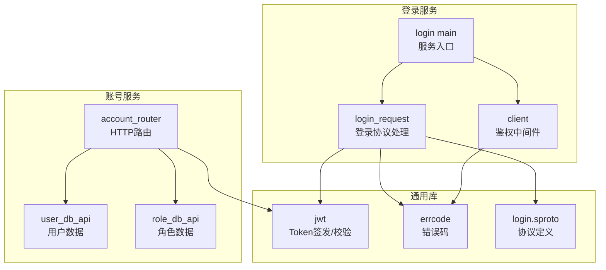
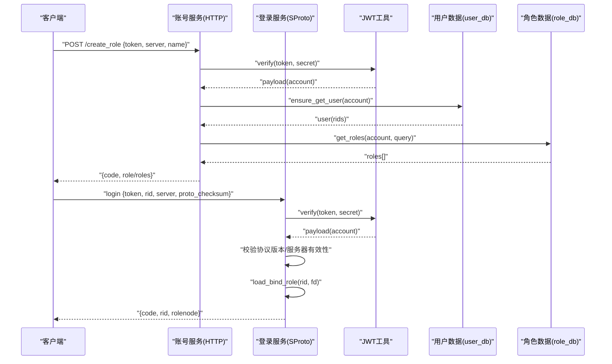
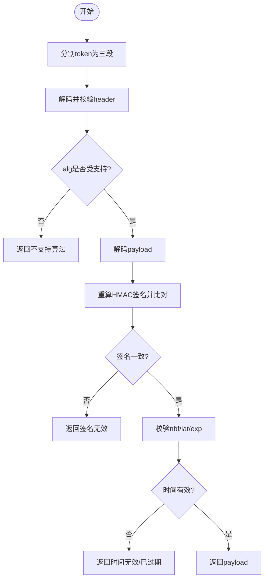
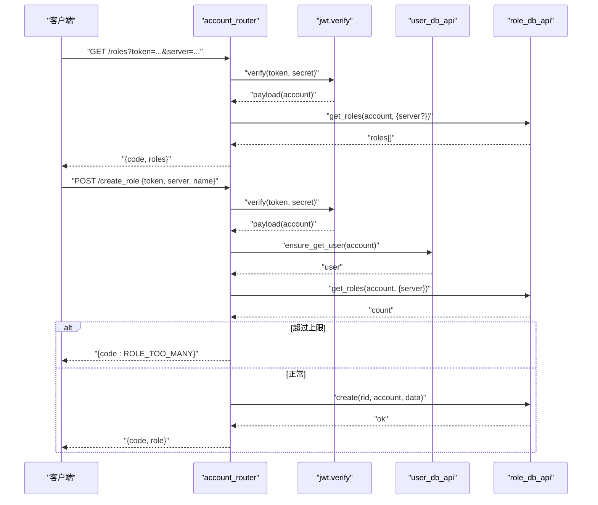
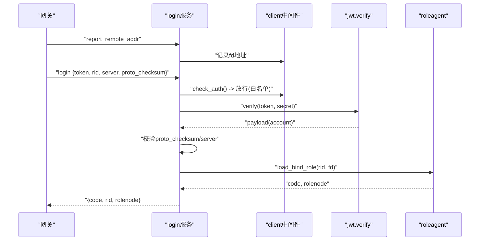
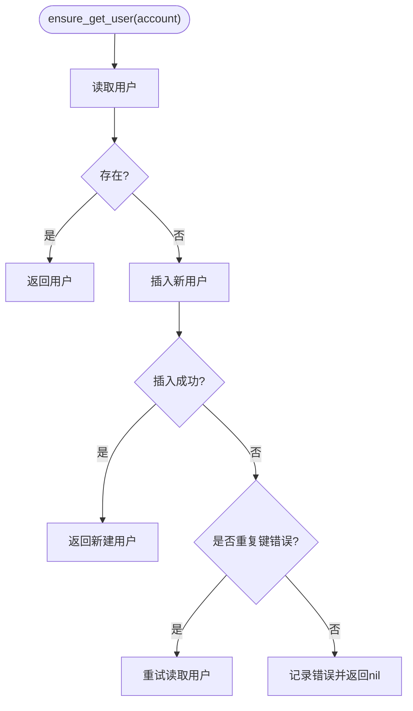
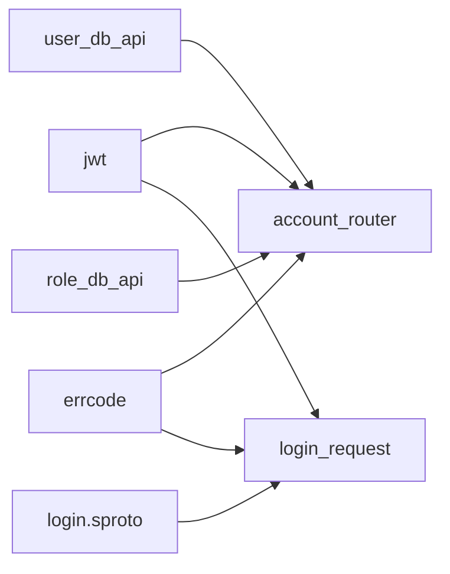

# 认证系统

<cite>
**本文引用的文件**
- [lualib/jwt.lua](file://lualib/jwt.lua)
- [app/account/lualib/account_router.lua](file://app/account/lualib/account_router.lua)
- [app/role/login/main.lua](file://app/role/login/main.lua)
- [app/role/login/client.lua](file://app/role/login/client.lua)
- [app/role/login/login_request.lua](file://app/role/login/login_request.lua)
- [proto/login.sproto](file://proto/login.sproto)
- [lualib/user_db_api.lua](file://lualib/user_db_api.lua)
- [lualib/role_db_api.lua](file://lualib/role_db_api.lua)
- [lualib/errcode.lua](file://lualib/errcode.lua)
- [test/test_jwt/main.lua](file://test/test_jwt/main.lua)
- [etc/core.conf.lua](file://etc/core.conf.lua)
</cite>

## 目录
1. [简介](#简介)
2. [项目结构](#项目结构)
3. [核心组件](#核心组件)
4. [架构总览](#架构总览)
5. [详细组件分析](#详细组件分析)
6. [依赖关系分析](#依赖关系分析)
7. [性能考虑](#性能考虑)
8. [故障排查指南](#故障排查指南)
9. [结论](#结论)
10. [附录](#附录)

## 简介
本技术文档围绕 SkyExt 框架的认证系统，系统性说明 JWT Token 的生成与校验、用户登录流程、权限控制策略、会话状态管理、以及扩展与最佳实践。重点覆盖以下能力：
- JWT 签名算法支持（HS256/HS512）、签发与验证、时间窗口校验（iat/nbf/exp）
- 账号服务 HTTP 路由对 Token 的校验与角色列表查询、角色创建
- 游戏服登录网关对客户端请求的鉴权中间件与登录协议处理
- 数据库层用户与角色数据访问（MongoDB），并发安全与错误码统一
- 安全性与高可用考量：Token 过期处理、协议一致性校验、并发登录控制思路、可扩展第三方认证集成方案

## 项目结构
认证相关代码主要分布在以下模块：
- JWT 工具库：提供 Token 签发与校验
- 账号服务：HTTP 接口负责基于 Token 的角色查询与创建
- 登录服务：SProto 协议处理客户端登录、鉴权中间件、绑定角色节点
- 数据访问层：用户与角色的 MongoDB 操作封装
- 协议定义：登录/登出等消息结构

图表来源
- [app/account/lualib/account_router.lua:1-143](file://app/account/lualib/account_router.lua#L1-L143)
- [app/role/login/login_request.lua:1-113](file://app/role/login/login_request.lua#L1-L113)
- [app/role/login/client.lua:1-76](file://app/role/login/client.lua#L1-L76)
- [lualib/jwt.lua:1-102](file://lualib/jwt.lua#L1-L102)
- [lualib/user_db_api.lua:1-90](file://lualib/user_db_api.lua#L1-L90)
- [lualib/role_db_api.lua:1-54](file://lualib/role_db_api.lua#L1-L54)
- [proto/login.sproto:1-26](file://proto/login.sproto#L1-L26)
- [lualib/errcode.lua:1-29](file://lualib/errcode.lua#L1-L29)

章节来源
- [etc/core.conf.lua:1-30](file://etc/core.conf.lua#L1-L30)

## 核心组件
- JWT 工具：提供 Token 签发与校验，支持 HS256/HS512，自动注入 iat/exp，并校验 nbf/iat/exp 时间窗口
- 账号服务路由：基于 Token 校验后读取角色列表或创建新角色，返回目标游戏节点信息
- 登录服务：
  - 中间件：对未认证的请求进行拦截，仅允许登录与上报地址等白名单请求通过
  - 登录处理：校验 Token、协议版本一致性、服务器有效性，加载并绑定角色到当前 fd
- 数据访问层：用户与角色数据的增删查改，包含并发创建的安全处理
- 错误码：统一的业务错误码，便于前端/客户端识别与提示

章节来源
- [lualib/jwt.lua:17-100](file://lualib/jwt.lua#L17-L100)
- [app/account/lualib/account_router.lua:20-140](file://app/account/lualib/account_router.lua#L20-L140)
- [app/role/login/client.lua:18-73](file://app/role/login/client.lua#L18-L73)
- [app/role/login/login_request.lua:17-110](file://app/role/login/login_request.lua#L17-L110)
- [lualib/user_db_api.lua:12-80](file://lualib/user_db_api.lua#L12-L80)
- [lualib/role_db_api.lua:12-54](file://lualib/role_db_api.lua#L12-L54)
- [lualib/errcode.lua:3-14](file://lualib/errcode.lua#L3-L14)

## 架构总览
下图展示了从客户端到账号服务与登录服务的完整认证链路，包括 Token 校验、角色查询/创建、登录绑定等关键步骤。

图表来源
- [app/account/lualib/account_router.lua:24-140](file://app/account/lualib/account_router.lua#L24-L140)
- [app/role/login/login_request.lua:58-105](file://app/role/login/login_request.lua#L58-L105)
- [lualib/jwt.lua:17-100](file://lualib/jwt.lua#L17-L100)
- [lualib/user_db_api.lua:60-80](file://lualib/user_db_api.lua#L60-L80)
- [lualib/role_db_api.lua:12-42](file://lualib/role_db_api.lua#L12-L42)

## 详细组件分析

### JWT 工具（Token 签发与校验）
- 支持的算法：HS256、HS512
- 签发流程：
  - 构造 header（typ=JWT，alg=HS256/HS512）
  - 注入 iat（签发时间），可选 exp（过期时间）
  - Base64URL 编码 header/payload，计算 HMAC 签名并拼接成 token
- 校验流程：
  - 分割三段（header.payload.signature）
  - 解码并校验 typ、alg
  - 使用相同密钥重新计算签名比对
  - 校验 nbf（生效时间）、iat（签发时间）、exp（过期时间）
- 测试用例：HS256/HS512 的 verify 成功路径

图表来源
- [lualib/jwt.lua:17-100](file://lualib/jwt.lua#L17-L100)

章节来源
- [lualib/jwt.lua:17-100](file://lualib/jwt.lua#L17-L100)
- [test/test_jwt/main.lua:1-22](file://test/test_jwt/main.lua#L1-L22)

### 账号服务（HTTP 路由）
- GET /roles：校验 Token 后按 account 查询角色列表，并可按 server 过滤；计算每个角色对应的游戏节点
- POST /create_role：校验 Token 后确保用户存在，检查角色数量上限，创建新角色并返回其所在节点
- 错误处理：统一使用 errcode 返回 TOKEN_ERROR、SERVER_NOT_EXIST、ROLE_TOO_MANY、DB_ERROR 等

图表来源
- [app/account/lualib/account_router.lua:24-140](file://app/account/lualib/account_router.lua#L24-L140)
- [lualib/user_db_api.lua:60-80](file://lualib/user_db_api.lua#L60-L80)
- [lualib/role_db_api.lua:12-42](file://lualib/role_db_api.lua#L12-L42)
- [lualib/errcode.lua:3-14](file://lualib/errcode.lua#L3-L14)

章节来源
- [app/account/lualib/account_router.lua:24-140](file://app/account/lualib/account_router.lua#L24-L140)
- [lualib/errcode.lua:3-14](file://lualib/errcode.lua#L3-L14)

### 登录服务（SProto 登录流程与鉴权中间件）
- 中间件：
  - 白名单放行：login.login、login.report_remote_addr
  - 其他请求需已认证（client.auth=true），否则拒绝
  - 登录超时：未在规定时间内完成认证将关闭连接
- 登录处理：
  - 校验 Token，获取 account
  - 可选协议版本一致性校验（proto_checksum）
  - 校验 server 是否存在于配置映射
  - 加载并绑定角色到当前 fd，成功后解绑 login 服务，后续消息转发至 roleagent

图表来源
- [app/role/login/client.lua:18-73](file://app/role/login/client.lua#L18-L73)
- [app/role/login/login_request.lua:17-110](file://app/role/login/login_request.lua#L17-L110)
- [proto/login.sproto:9-22](file://proto/login.sproto#L9-L22)

章节来源
- [app/role/login/main.lua:15-35](file://app/role/login/main.lua#L15-L35)
- [app/role/login/client.lua:18-73](file://app/role/login/client.lua#L18-L73)
- [app/role/login/login_request.lua:58-110](file://app/role/login/login_request.lua#L58-L110)
- [proto/login.sproto:9-22](file://proto/login.sproto#L9-L22)

### 数据访问层（用户与角色）
- 用户数据：
  - ensure_get_user：先读后建，并发冲突时重试读取，避免重复创建
  - add_rid/remove_rid：维护用户与角色关联
- 角色数据：
  - get_roles：根据 account 的 rids 查询角色列表，支持单/多角色优化
  - has_role：校验角色归属与服务器匹配

图表来源
- [lualib/user_db_api.lua:60-80](file://lualib/user_db_api.lua#L60-L80)
- [lualib/role_db_api.lua:12-42](file://lualib/role_db_api.lua#L12-L42)
- [lualib/errcode.lua:14-14](file://lualib/errcode.lua#L14-L14)

章节来源
- [lualib/user_db_api.lua:12-80](file://lualib/user_db_api.lua#L12-L80)
- [lualib/role_db_api.lua:12-54](file://lualib/role_db_api.lua#L12-L54)
- [lualib/errcode.lua:14-14](file://lualib/errcode.lua#L14-L14)

## 依赖关系分析
- 账号服务依赖 JWT、用户/角色数据 API、错误码
- 登录服务依赖 JWT、错误码、协议定义
- 数据访问层依赖 MongoDB 连接与配置
- 全局配置由 core.conf 指定服务加载路径与基础环境

图表来源
- [app/account/lualib/account_router.lua:1-143](file://app/account/lualib/account_router.lua#L1-L143)
- [app/role/login/login_request.lua:1-113](file://app/role/login/login_request.lua#L1-L113)
- [lualib/jwt.lua:1-102](file://lualib/jwt.lua#L1-L102)
- [lualib/user_db_api.lua:1-90](file://lualib/user_db_api.lua#L1-L90)
- [lualib/role_db_api.lua:1-54](file://lualib/role_db_api.lua#L1-L54)
- [lualib/errcode.lua:1-29](file://lualib/errcode.lua#L1-L29)
- [proto/login.sproto:1-26](file://proto/login.sproto#L1-L26)

章节来源
- [etc/core.conf.lua:1-30](file://etc/core.conf.lua#L1-L30)

## 性能考虑
- JWT 校验开销低，建议在高频路径中复用密钥与算法表
- 账号服务角色查询在单角色场景下走 find_one 优化路径，减少网络往返
- 登录中间件设置登录超时，避免空闲连接占用资源
- 数据层使用投影字段减少数据传输量

[本节为通用指导，不直接分析具体文件]

## 故障排查指南
- Token 错误：
  - 现象：账号服务或登录服务返回 TOKEN_ERROR
  - 排查：确认 secret 一致、Token 格式正确、时间字段有效
  - 参考：[lualib/jwt.lua:17-67](file://lualib/jwt.lua#L17-L67)、[lualib/errcode.lua:10-10](file://lualib/errcode.lua#L10-L10)
- 协议不一致：
  - 现象：登录返回 PROTO_CHECKSUM
  - 排查：核对客户端与服务端 sproto 版本
  - 参考：[app/role/login/login_request.lua:68-85](file://app/role/login/login_request.lua#L68-L85)
- 服务器不存在：
  - 现象：返回 SERVER_NOT_EXIST
  - 排查：检查 server2game 配置映射
  - 参考：[app/account/lualib/account_router.lua:40-47](file://app/account/lualib/account_router.lua#L40-L47)、[app/role/login/login_request.lua:96-102](file://app/role/login/login_request.lua#L96-L102)
- 角色数量超限：
  - 现象：返回 ROLE_TOO_MANY
  - 排查：检查 max_role_count 配置与已有角色数
  - 参考：[app/account/lualib/account_router.lua:88-94](file://app/account/lualib/account_router.lua#L88-L94)
- 数据库错误：
  - 现象：返回 DB_ERROR 或 Mongo 重复键错误
  - 排查：查看 ensure_get_user 并发处理与日志
  - 参考：[lualib/user_db_api.lua:60-80](file://lualib/user_db_api.lua#L60-L80)、[lualib/errcode.lua:14-14](file://lualib/errcode.lua#L14-L14)

章节来源
- [lualib/jwt.lua:17-67](file://lualib/jwt.lua#L17-L67)
- [app/role/login/login_request.lua:68-102](file://app/role/login/login_request.lua#L68-L102)
- [app/account/lualib/account_router.lua:40-94](file://app/account/lualib/account_router.lua#L40-L94)
- [lualib/user_db_api.lua:60-80](file://lualib/user_db_api.lua#L60-L80)
- [lualib/errcode.lua:10-14](file://lualib/errcode.lua#L10-L14)

## 结论
SkyExt 的认证系统以 JWT 为核心，结合账号服务与登录服务的分层设计，实现了安全的无状态认证与高效的登录绑定流程。通过统一的错误码与协议版本校验，提升了系统的健壮性与可维护性。建议在生产环境中：
- 严格管理 JWT 密钥，定期轮换
- 合理设置 Token 过期时间与刷新策略
- 启用协议版本一致性校验，防止客户端与服务端不兼容
- 结合外部认证服务实现多因素认证与会话管理

[本节为总结性内容，不直接分析具体文件]

## 附录

### 如何集成第三方认证服务
- 在账号服务新增第三方登录回调接口，接收第三方令牌或授权码
- 调用第三方 API 换取用户标识，生成内部 JWT（携带 account、角色信息等）
- 在登录服务保持现有 Token 校验逻辑不变，仅变更 Token 签发来源
- 注意：第三方认证结果应落库并建立与本地用户的映射关系

[本节为概念性指导，不直接分析具体文件]

### 如何实现多因素认证（MFA）
- 在账号服务登录流程中增加第二因子校验（如短信验证码、TOTP）
- 在生成的 JWT payload 中附加 MFA 标记或短期会话 ID
- 登录服务在敏感操作前要求二次校验（例如转账、修改密码）

[本节为概念性指导，不直接分析具体文件]

### 如何管理用户会话状态
- 使用 JWT 作为无状态凭证，服务端不保存会话
- 如需强制下线或限制并发登录，可在数据库中添加“活跃会话”标记或黑名单
- 登录服务在绑定角色时检查是否已在其他节点在线，必要时拒绝或踢出

[本节为概念性指导，不直接分析具体文件]

### 代码示例路径（用于快速定位实现）
- JWT 签发与校验：[lualib/jwt.lua:17-100](file://lualib/jwt.lua#L17-L100)
- 账号服务角色查询与创建：[app/account/lualib/account_router.lua:24-140](file://app/account/lualib/account_router.lua#L24-L140)
- 登录服务中间件与登录处理：[app/role/login/client.lua:18-73](file://app/role/login/client.lua#L18-L73)、[app/role/login/login_request.lua:58-110](file://app/role/login/login_request.lua#L58-L110)
- 用户与角色数据访问：[lualib/user_db_api.lua:60-80](file://lualib/user_db_api.lua#L60-L80)、[lualib/role_db_api.lua:12-42](file://lualib/role_db_api.lua#L12-L42)
- 错误码定义：[lualib/errcode.lua:3-14](file://lualib/errcode.lua#L3-L14)
- 登录协议定义：[proto/login.sproto:9-22](file://proto/login.sproto#L9-L22)