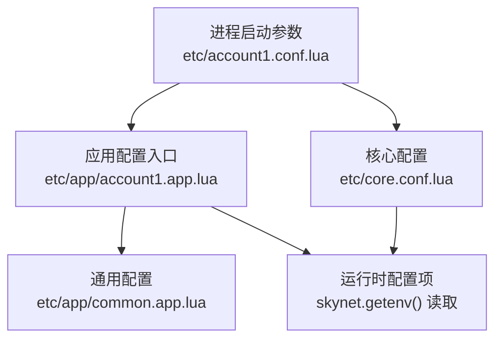
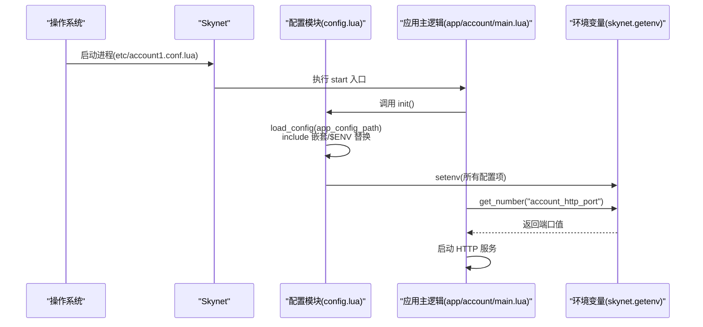
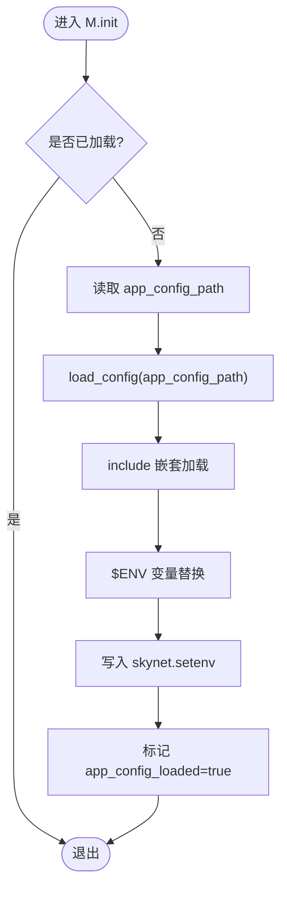
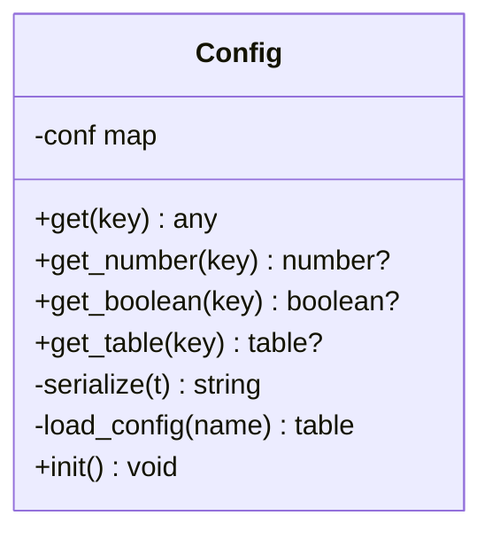
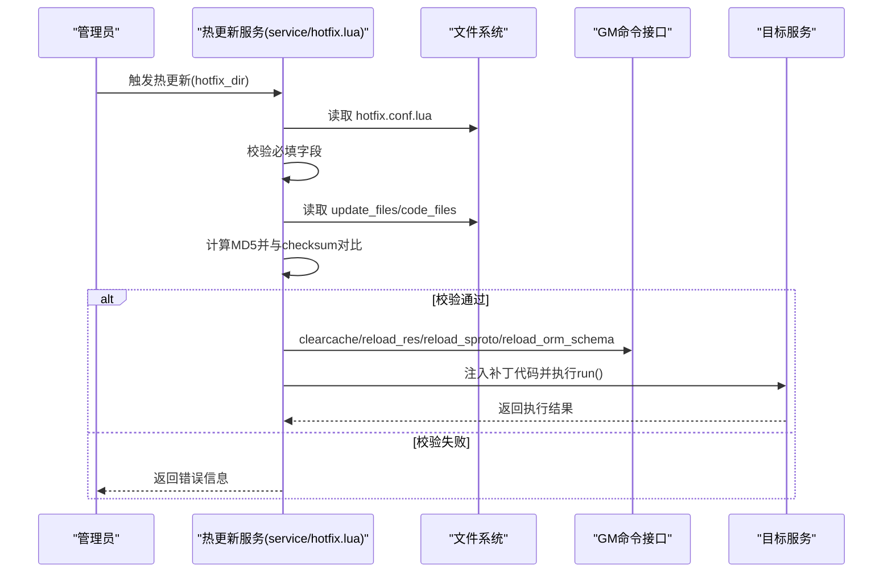
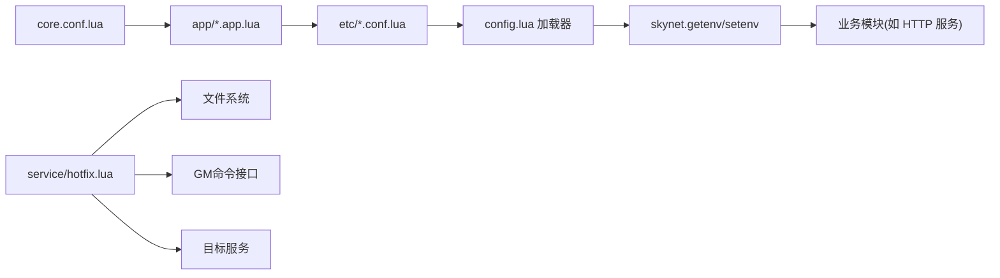

# 配置管理系统

<cite>
**本文引用的文件**
- [lualib/config.lua](file://lualib/config.lua)
- [etc/core.conf.lua](file://etc/core.conf.lua)
- [etc/account1.conf.lua](file://etc/account1.conf.lua)
- [etc/role1.conf.lua](file://etc/role1.conf.lua)
- [etc/app/common.app.lua](file://etc/app/common.app.lua)
- [etc/app/account1.app.lua](file://etc/app/account1.app.lua)
- [etc/app/role1.app.lua](file://etc/app/role1.app.lua)
- [app/account/main.lua](file://app/account/main.lua)
- [service/hotfix.lua](file://service/hotfix.lua)
- [hotfix/20260120-patch1/hotfix.conf.lua](file://hotfix/20260120-patch1/hotfix.conf.lua)
- [lualib/log/logger.lua](file://lualib/log/logger.lua)
</cite>

## 目录
1. [简介](#简介)
2. [项目结构](#项目结构)
3. [核心组件](#核心组件)
4. [架构总览](#架构总览)
5. [详细组件分析](#详细组件分析)
6. [依赖关系分析](#依赖关系分析)
7. [性能考虑](#性能考虑)
8. [故障排除指南](#故障排除指南)
9. [结论](#结论)
10. [附录](#附录)

## 简介
本技术文档围绕 SkyExt 框架的配置管理系统，系统性阐述配置的层级结构、加载机制、环境变量注入、配置热更新与校验、默认值处理、类型约束与验证机制，以及与日志、热更等模块的集成方式。文档同时提供不同环境下的配置组织示例、动态加载与变更处理流程、安全性与性能考量，以及最佳实践与排错建议，帮助读者快速掌握并正确使用该配置体系。

## 项目结构
SkyExt 的配置系统采用“核心配置 + 应用配置 + 服务实例配置”的分层组织方式：
- 核心配置 core.conf.lua：定义路径、线程数、启动入口、预加载等基础运行参数。
- 应用配置 app/*.app.lua：按业务域（如 account、role）拆分，包含通用配置 common.app.lua 与服务特有配置。
- 服务实例配置 etc/*.conf.lua：每个进程/服务实例一个配置文件，指定 app_config_path、start 入口，并通过 include 引入 core.conf.lua 与具体 app 配置。

图表来源
- [etc/account1.conf.lua:1-4](file://etc/account1.conf.lua#L1-L4)
- [etc/app/account1.app.lua:1-21](file://etc/app/account1.app.lua#L1-L21)
- [etc/app/common.app.lua:1-100](file://etc/app/common.app.lua#L1-L100)
- [etc/core.conf.lua:1-30](file://etc/core.conf.lua#L1-L30)

章节来源
- [etc/account1.conf.lua:1-4](file://etc/account1.conf.lua#L1-L4)
- [etc/role1.conf.lua:1-4](file://etc/role1.conf.lua#L1-L4)
- [etc/core.conf.lua:1-30](file://etc/core.conf.lua#L1-L30)
- [etc/app/account1.app.lua:1-21](file://etc/app/account1.app.lua#L1-L21)
- [etc/app/role1.app.lua:1-30](file://etc/app/role1.app.lua#L1-L30)
- [etc/app/common.app.lua:1-100](file://etc/app/common.app.lua#L1-L100)

## 核心组件
- 配置加载器与缓存（config.lua）
  - 提供 get/get_number/get_boolean/get_table 等统一访问接口，内部维护本地缓存 conf，避免重复解析。
  - 支持从 skynet.getenv 获取配置；get_table 可将字符串形式的 Lua 表表达式安全解析为 table。
  - 通过 load_config 实现 include 嵌套与 $ENV 变量替换，最终将结果写入 skynet.setenv，供全局读取。
- 核心运行配置（core.conf.lua）
  - 设置 luaservice/lua_path/lua_cpath、线程数、bootstrap、harbor、logservice 等基础运行参数。
- 应用配置（app/*.app.lua）
  - 按服务划分，包含日志、数据库连接、sproto、JWT、HTTP 端口等配置项。
  - 通过 include "common.app.lua" 复用通用配置，减少重复。
- 服务实例配置（etc/*.conf.lua）
  - 指定 app_config_path、start 入口，include core.conf.lua，形成“实例级”配置。
- 配置热更新（service/hotfix.lua）
  - 读取 hotfix.conf.lua，校验 checksum，按需清理缓存、重载资源/协议/ORM schema，并注入补丁代码。
- 配置验证（logger 模块）
  - 使用 config_constraint 对日志配置进行字段类型校验，确保配置结构正确。

章节来源
- [lualib/config.lua:1-144](file://lualib/config.lua#L1-L144)
- [etc/core.conf.lua:1-30](file://etc/core.conf.lua#L1-L30)
- [etc/app/common.app.lua:1-100](file://etc/app/common.app.lua#L1-L100)
- [etc/app/account1.app.lua:1-21](file://etc/app/account1.app.lua#L1-L21)
- [etc/app/role1.app.lua:1-30](file://etc/app/role1.app.lua#L1-L30)
- [service/hotfix.lua:1-378](file://service/hotfix.lua#L1-L378)
- [lualib/log/logger.lua:238-290](file://lualib/log/logger.lua#L238-L290)

## 架构总览
配置系统的整体流程如下：
- 进程启动时，由 Skynet 加载 etc/*.conf.lua，其中包含 app_config_path 和 start 入口。
- 应用主逻辑调用 config.init()，根据 app_config_path 加载对应 app 配置，支持 include 嵌套与环境变量替换。
- 加载完成后，将配置项序列化后写入 skynet.setenv，后续通过 config.get* 系列接口读取。
- 业务模块（如 HTTP 服务）通过 config.get_number 获取端口、并发等参数。
- 热更新流程独立于常规配置加载，通过 service/hotfix.lua 在运行时校验并应用补丁。

图表来源
- [lualib/config.lua:88-142](file://lualib/config.lua#L88-L142)
- [app/account/main.lua:1-25](file://app/account/main.lua#L1-L25)

章节来源
- [lualib/config.lua:88-142](file://lualib/config.lua#L88-L142)
- [app/account/main.lua:1-25](file://app/account/main.lua#L1-L25)

## 详细组件分析

### 配置加载与缓存（config.lua）
- 加载机制
  - load_config 以 result 表作为上下文，支持 include(filename) 递归加载，路径解析基于 package.config 分隔符。
  - 环境变量注入：通过 string.gsub 将 %$([%w_%d]+)] 占位符替换为 os.getenv(name)，缺失时报错。
  - 安全性：load 时使用 t 模式表作为环境，限制可访问的全局变量范围。
- 缓存策略
  - 首次读取后写入本地 conf 表，后续直接返回，降低 IO 与解析开销。
  - get_table 支持将字符串形式的 Lua 表表达式解析为 table，便于复杂配置传递。
- 初始化流程
  - init() 检查 app_config_loaded 标志，防止重复加载；读取 app_config_path 并加载；将结果写入 skynet.setenv。

图表来源
- [lualib/config.lua:88-142](file://lualib/config.lua#L88-L142)

章节来源
- [lualib/config.lua:1-144](file://lualib/config.lua#L1-L144)

### 核心配置与应用配置（core.conf.lua 与 app/*.app.lua）
- core.conf.lua
  - 定义 luaservice、lua_path、lua_cpath、thread、bootstrap、harbor、logservice 等基础运行参数。
  - 这些参数影响服务发现、模块加载路径、日志服务等，属于系统级配置。
- app 配置
  - common.app.lua：集中定义日志、etcd、mongo、sproto、JWT、HTTP 请求体大小等通用配置。
  - account1.app.lua / role1.app.lua：服务特有配置（端口、并发、机器 ID 等），并通过 include "common.app.lua" 复用。
- 实例配置
  - etc/account1.conf.lua / etc/role1.conf.lua：指定 app_config_path、start 入口，include core.conf.lua。

章节来源
- [etc/core.conf.lua:1-30](file://etc/core.conf.lua#L1-L30)
- [etc/app/common.app.lua:1-100](file://etc/app/common.app.lua#L1-L100)
- [etc/app/account1.app.lua:1-21](file://etc/app/account1.app.lua#L1-L21)
- [etc/app/role1.app.lua:1-30](file://etc/app/role1.app.lua#L1-L30)
- [etc/account1.conf.lua:1-4](file://etc/account1.conf.lua#L1-L4)
- [etc/role1.conf.lua:1-4](file://etc/role1.conf.lua#L1-L4)

### 配置读取与类型转换（config.get*）
- get(key)：返回字符串或 nil，命中本地缓存则直接返回。
- get_number(key)：尝试 tonumber 转换，失败或未找到返回 nil。
- get_boolean(key)：仅当值为 "true" 时转为 true，否则 false。
- get_table(key)：若为字符串，使用 load 解析为 Lua 表，错误时抛出异常。

图表来源
- [lualib/config.lua:6-72](file://lualib/config.lua#L6-L72)
- [lualib/config.lua:74-142](file://lualib/config.lua#L74-L142)

章节来源
- [lualib/config.lua:6-72](file://lualib/config.lua#L6-L72)

### 业务集成示例（HTTP 服务启动）
- app/account/main.lua 中通过 config.get_number 读取 account_http_port 与 account_agent_count，并启动 http_server。
- 体现了配置驱动的服务启动模式：配置项决定端口、并发等关键参数。

章节来源
- [app/account/main.lua:1-25](file://app/account/main.lua#L1-L25)

### 配置热更新与校验（service/hotfix.lua）
- 热更新配置 hotfix.conf.lua
  - 必需字段：desc、checksum、gitsha_base、gitsha_update、time。
  - 可选开关：update_files、reload_res、reload_sproto、reload_orm_schema、clearcache、code_files。
- 校验流程
  - 读取 update_files 与 code_files 内容，拼接后计算 MD5，与 checksum 比对。
  - 校验通过后，依次执行 clearcache、reload_res、reload_sproto、reload_orm_schema、inject_code_files。
- 补丁注入
  - 解析 patcher.targets，定位目标服务地址，通过 skynet.call 注入 RUN 指令执行补丁 run()。

图表来源
- [service/hotfix.lua:36-108](file://service/hotfix.lua#L36-L108)
- [service/hotfix.lua:110-188](file://service/hotfix.lua#L110-L188)
- [service/hotfix.lua:190-227](file://service/hotfix.lua#L190-L227)
- [service/hotfix.lua:296-378](file://service/hotfix.lua#L296-L378)
- [hotfix/20260120-patch1/hotfix.conf.lua:1-21](file://hotfix/20260120-patch1/hotfix.conf.lua#L1-L21)

章节来源
- [service/hotfix.lua:36-108](file://service/hotfix.lua#L36-L108)
- [service/hotfix.lua:110-188](file://service/hotfix.lua#L110-L188)
- [service/hotfix.lua:190-227](file://service/hotfix.lua#L190-L227)
- [service/hotfix.lua:296-378](file://service/hotfix.lua#L296-L378)
- [hotfix/20260120-patch1/hotfix.conf.lua:1-21](file://hotfix/20260120-patch1/hotfix.conf.lua#L1-L21)

### 配置验证机制（logger 模块）
- logger 模块通过 config_constraint 定义字段类型约束，支持枚举映射与基本类型校验。
- 在配置阶段对传入的表进行逐项校验，类型不匹配时抛出错误，确保日志配置的正确性。

章节来源
- [lualib/log/logger.lua:238-290](file://lualib/log/logger.lua#L238-L290)

## 依赖关系分析
- 配置加载依赖 Skynet 的环境变量机制（getenv/setenv）。
- 应用配置依赖 include 机制与环境变量替换，形成“核心 + 通用 + 实例”的层次化组合。
- 热更新依赖文件系统、MD5 校验、GM 命令接口与目标服务的 debug 通道。
- 日志模块依赖配置校验，保证日志行为的可控性与一致性。

图表来源
- [etc/core.conf.lua:1-30](file://etc/core.conf.lua#L1-L30)
- [etc/app/account1.app.lua:1-21](file://etc/app/account1.app.lua#L1-L21)
- [etc/account1.conf.lua:1-4](file://etc/account1.conf.lua#L1-L4)
- [lualib/config.lua:88-142](file://lualib/config.lua#L88-L142)
- [service/hotfix.lua:36-108](file://service/hotfix.lua#L36-L108)

章节来源
- [etc/core.conf.lua:1-30](file://etc/core.conf.lua#L1-L30)
- [etc/app/account1.app.lua:1-21](file://etc/app/account1.app.lua#L1-L21)
- [etc/account1.conf.lua:1-4](file://etc/account1.conf.lua#L1-L4)
- [lualib/config.lua:88-142](file://lualib/config.lua#L88-L142)
- [service/hotfix.lua:36-108](file://service/hotfix.lua#L36-L108)

## 性能考虑
- 配置缓存：config.get* 系列函数对已读取的配置进行本地缓存，避免重复解析与 IO。
- 序列化开销：get_table 使用 load 解析字符串表，建议在必要时使用，避免频繁大对象解析。
- 环境变量数量：大量配置项会增加 setenv/getenv 的负担，建议合理分组与按需加载。
- 热更新步骤：clearcache、reload_res、reload_sproto、reload_orm_schema 可能带来短暂抖动，应分批执行并在低峰期操作。
- include 嵌套深度：过深的 include 链会影响加载时间，建议保持扁平化结构。

[本节为通用指导，无需特定文件引用]

## 故障排除指南
- 配置加载失败
  - 现象：init() 报错“load app config failed”。
  - 排查：检查 app_config_path 是否正确；确认 include 路径与 $ENV 变量是否存在；查看 load_config 中的断言错误。
  - 参考：[lualib/config.lua:120-142](file://lualib/config.lua#L120-L142)
- 环境变量缺失
  - 现象：$ENV 替换失败，抛出“os.getenv() failed”。
  - 排查：确保环境变量已设置；或在配置中提供默认值。
  - 参考：[lualib/config.lua:90-92](file://lualib/config.lua#L90-L92)
- 类型不匹配
  - 现象：get_number/get_boolean 返回 nil 或不符合预期。
  - 排查：确认配置值为数字或布尔字符串；必要时使用 get_table 解析复杂结构。
  - 参考：[lualib/config.lua:20-53](file://lualib/config.lua#L20-L53)
- 热更新校验失败
  - 现象：checksum 不匹配，热更新中止。
  - 排查：核对 update_files 与 code_files 内容与 checksum 一致；重新生成 checksum。
  - 参考：[service/hotfix.lua:71-108](file://service/hotfix.lua#L71-L108)
- 日志配置错误
  - 现象：logger 配置校验失败，抛出类型错误。
  - 排查：对照 config_constraint 检查字段类型与取值范围。
  - 参考：[lualib/log/logger.lua:238-263](file://lualib/log/logger.lua#L238-L263)

章节来源
- [lualib/config.lua:90-92](file://lualib/config.lua#L90-L92)
- [lualib/config.lua:120-142](file://lualib/config.lua#L120-L142)
- [lualib/config.lua:20-53](file://lualib/config.lua#L20-L53)
- [service/hotfix.lua:71-108](file://service/hotfix.lua#L71-L108)
- [lualib/log/logger.lua:238-263](file://lualib/log/logger.lua#L238-L263)

## 结论
SkyExt 的配置管理系统通过分层配置、环境变量注入、统一读取接口与缓存机制，提供了灵活且高效的配置管理能力。结合热更新与配置校验，能够在保证稳定性的前提下实现动态调整与快速迭代。遵循本文的最佳实践与排错建议，可有效提升配置管理的可靠性与维护性。

[本节为总结性内容，无需特定文件引用]

## 附录
- 配置项定义与默认值
  - 核心运行参数：thread、bootstrap、harbor、logservice、luaservice、lua_path、lua_cpath。
  - 应用通用配置：日志、etcd、mongo、sproto、JWT、HTTP 请求体大小、角色数量上限等。
  - 服务实例配置：端口、并发、机器 ID、登录超时、离线卸载间隔等。
- 配置示例
  - 账户服务：etc/account1.conf.lua 指定 app_config_path 与 start，include core.conf.lua；etc/app/account1.app.lua 定义 HTTP 端口与 agent 数量，并 include common.app.lua。
  - 角色服务：etc/role1.conf.lua 类似结构，定义集群、网关、agent 数量与日志配置。
- 动态加载与变更
  - 通过 config.init() 完成一次性加载；后续通过 config.get* 读取。
  - 热更新通过 service/hotfix.lua 在运行时校验并应用补丁，支持清理缓存与重载资源/协议/ORM schema。
- 安全性与性能
  - 使用 load 的 t 模式限制全局访问；checksum 校验保障补丁完整性；缓存减少重复解析。
- 与其他模块集成
  - 日志模块通过配置约束确保日志行为可控；热更新通过 GM 命令接口协调各子系统重载。

[本节为补充说明，无需特定文件引用]