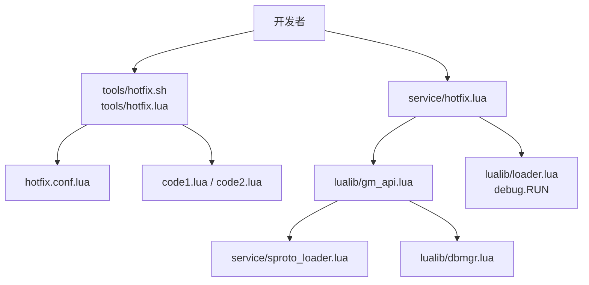
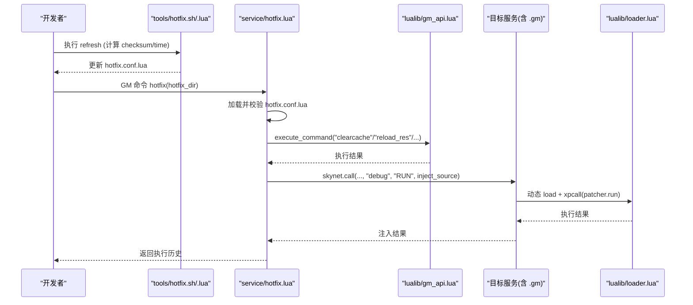
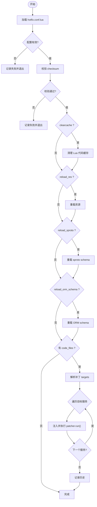
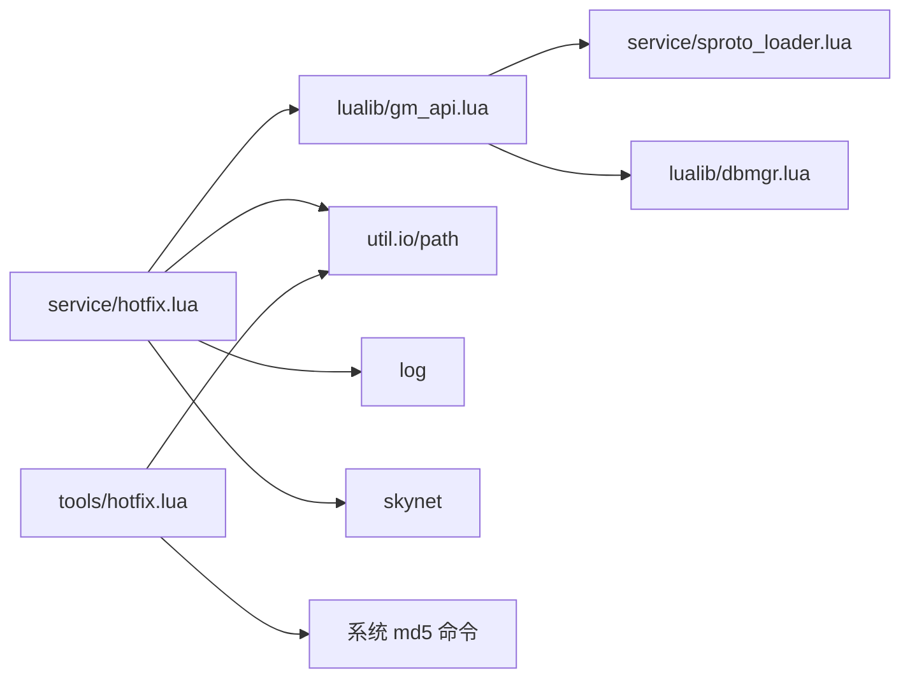

# 热更新系统

<cite>
**本文引用的文件**
- [service/hotfix.lua](file://service/hotfix.lua)
- [tools/hotfix.lua](file://tools/hotfix.lua)
- [tools/hotfix.sh](file://tools/hotfix.sh)
- [hotfix/20260120-patch1/hotfix.conf.lua](file://hotfix/20260120-patch1/hotfix.conf.lua)
- [hotfix/20260120-patch1/code1.lua](file://hotfix/20260120-patch1/code1.lua)
- [hotfix/20260120-patch1/code2.lua](file://hotfix/20260120-patch1/code2.lua)
- [lualib/gm_api.lua](file://lualib/gm_api.lua)
- [service/sproto_loader.lua](file://service/sproto_loader.lua)
- [lualib/dbmgr.lua](file://lualib/dbmgr.lua)
- [lualib/loader.lua](file://lualib/loader.lua)
</cite>

## 目录
1. [简介](#简介)
2. [项目结构](#项目结构)
3. [核心组件](#核心组件)
4. [架构总览](#架构总览)
5. [详细组件分析](#详细组件分析)
6. [依赖关系分析](#依赖关系分析)
7. [性能考虑](#性能考虑)
8. [故障排查指南](#故障排查指南)
9. [结论](#结论)
10. [附录](#附录)

## 简介
本文件系统性地文档化 SkyExt 框架的热更新能力，覆盖实现原理（代码补丁机制、版本与校验管理、回滚策略）、工具链使用（补丁生成、校验与应用流程）、配置文件 hotfix.conf.lua 的字段说明、端到端工作流示例（从代码修改到线上部署），以及安全、性能与故障恢复建议。目标是帮助开发者在生产环境安全、可控地执行热更新。

## 项目结构
热更新相关的关键位置：
- 服务端热更新服务：service/hotfix.lua
- 客户端工具：tools/hotfix.lua、tools/hotfix.sh
- 补丁包目录：hotfix/<版本号>-patchN/，包含 hotfix.conf.lua 与 code*.lua
- GM 指令与重载能力：lualib/gm_api.lua、service/sproto_loader.lua、lualib/dbmgr.lua
- 服务加载器：lualib/loader.lua（提供 debug.RUN 注入点）

图表来源
- [service/hotfix.lua:1-456](file://service/hotfix.lua#L1-L456)
- [tools/hotfix.lua:1-256](file://tools/hotfix.lua#L1-L256)
- [tools/hotfix.sh:1-7](file://tools/hotfix.sh#L1-L7)
- [hotfix/20260120-patch1/hotfix.conf.lua:1-21](file://hotfix/20260120-patch1/hotfix.conf.lua#L1-L21)
- [lualib/gm_api.lua:1-144](file://lualib/gm_api.lua#L1-L144)
- [service/sproto_loader.lua:1-86](file://service/sproto_loader.lua#L1-L86)
- [lualib/dbmgr.lua:202-218](file://lualib/dbmgr.lua#L202-L218)
- [lualib/loader.lua:1-72](file://lualib/loader.lua#L1-L72)

章节来源
- [service/hotfix.lua:1-456](file://service/hotfix.lua#L1-L456)
- [tools/hotfix.lua:1-256](file://tools/hotfix.lua#L1-L256)
- [tools/hotfix.sh:1-7](file://tools/hotfix.sh#L1-L7)
- [hotfix/20260120-patch1/hotfix.conf.lua:1-21](file://hotfix/20260120-patch1/hotfix.conf.lua#L1-L21)

## 核心组件
- 热更新服务 service/hotfix.lua
  - 负责加载并校验热更配置、计算并验证 checksum、按需清理缓存、重载资源/协议/schema、解析并注入补丁代码到目标服务。
  - 暴露 GM 命令 hotfix 与 hotfix_history，用于触发执行与查看历史。
- 工具 tools/hotfix.lua/sh
  - 提供 refresh 子命令，自动读取 hotfix.conf.lua，汇总 update_files 与 code_files 内容，计算 MD5 并回填 time/checksum。
- 补丁定义 hotfix.conf.lua
  - 声明本次热更的描述、校验值、Git 提交信息、时间戳、需要更新的源文件列表、是否重载资源/协议/schema、是否需要清理 Lua 代码缓存，以及要注入的目标服务与补丁代码文件。
- 补丁代码 code*.lua
  - 每个文件返回一个表，包含 targets（目标服务名数组）和 run()（实际补丁逻辑）。
- 重载能力
  - sproto 重载：service/sproto_loader.lua 暴露 reload_sproto_schema。
  - ORM schema 重载：lualib/dbmgr.lua 暴露 reload_orm_schema。
  - 资源重载：通过 gm_api.execute_command("reload_res", {}) 调用。
- 注入通道
  - 通过 lualib/loader.lua 提供的 debug.RUN 接口，将补丁代码字符串动态 load 并在目标服务内执行 patcher.run()。

章节来源
- [service/hotfix.lua:1-456](file://service/hotfix.lua#L1-L456)
- [tools/hotfix.lua:1-256](file://tools/hotfix.lua#L1-L256)
- [hotfix/20260120-patch1/hotfix.conf.lua:1-21](file://hotfix/20260120-patch1/hotfix.conf.lua#L1-L21)
- [hotfix/20260120-patch1/code1.lua:1-11](file://hotfix/20260120-patch1/code1.lua#L1-L11)
- [hotfix/20260120-patch1/code2.lua:1-11](file://hotfix/20260120-patch1/code2.lua#L1-L11)
- [service/sproto_loader.lua:1-86](file://service/sproto_loader.lua#L1-L86)
- [lualib/dbmgr.lua:202-218](file://lualib/dbmgr.lua#L202-L218)
- [lualib/gm_api.lua:1-144](file://lualib/gm_api.lua#L1-L144)
- [lualib/loader.lua:1-72](file://lualib/loader.lua#L1-L72)

## 架构总览
热更新的整体流程如下：
- 开发阶段：在 hotfix/<version>-patchN 下编写 hotfix.conf.lua 与 code*.lua。
- 构建阶段：使用 tools/hotfix.sh refresh 计算 checksum 并更新时间戳。
- 发布阶段：将补丁目录同步至线上服务器。
- 运行阶段：在服务端通过 GM 命令触发 service/hotfix.lua 执行热更新。
- 执行阶段：按配置顺序完成校验、缓存清理、资源/协议/schema 重载、代码注入等步骤，并记录历史。

图表来源
- [tools/hotfix.lua:153-230](file://tools/hotfix.lua#L153-L230)
- [service/hotfix.lua:291-416](file://service/hotfix.lua#L291-L416)
- [lualib/gm_api.lua:116-141](file://lualib/gm_api.lua#L116-L141)
- [lualib/loader.lua:1-72](file://lualib/loader.lua#L1-L72)

## 详细组件分析

### 热更新服务 service/hotfix.lua
职责
- 加载热更配置并校验必填字段。
- 校验 checksum：合并 update_files 与 code_files 的内容后计算 MD5，与配置中的 checksum 对比。
- 可选操作：清理 Lua 代码缓存、重载资源、重载 sproto schema、重载 ORM schema。
- 解析补丁代码：读取 code*.lua，要求返回 table，且包含 targets（服务名数组）。
- 注入执行：对每个目标服务，构造注入脚本并通过 debug.RUN 调用 patcher.run()。
- 历史记录：记录每次热更的步骤、成功与否、元数据，支持查询最近 N 条。

关键流程
- 执行入口：execute_hotfix(hotfix_dir)
- 配置加载：load_hotfix_config(hotfix_dir)
- 校验：verify_checksum(config, hotfix_dir, root_dir)
- 重载：clear_lua_cache、reload_res、reload_sproto、reload_orm_schema
- 注入：inject_code_files -> parse_patcher_targets -> inject_to_service
- 历史：g_hotfix_history（最多保留 MAX_HISTORY 条）

错误处理
- 各步骤失败均记录 steps，最终根据步骤结果判定整体成功与否。
- 注入失败会记录具体文件与服务名，便于定位。

图表来源
- [service/hotfix.lua:36-108](file://service/hotfix.lua#L36-L108)
- [service/hotfix.lua:110-156](file://service/hotfix.lua#L110-L156)
- [service/hotfix.lua:158-289](file://service/hotfix.lua#L158-L289)
- [service/hotfix.lua:291-416](file://service/hotfix.lua#L291-L416)

章节来源
- [service/hotfix.lua:1-456](file://service/hotfix.lua#L1-L456)

### 工具 tools/hotfix.lua/sh
职责
- 提供 refresh 子命令：读取 hotfix.conf.lua，汇总 update_files 与 code_files 内容，计算 MD5，并回填 time 与 checksum。
- 兼容 Linux/macOS 的 md5sum/md5 命令。
- 通过 tools/run.lua 启动，封装为 shell 脚本便于调用。

使用方式
- ./tools/hotfix.sh refresh <hotfix_dir>
- ./tools/hotfix.sh -h 查看帮助

注意
- 若系统中无 md5sum/md5 命令，将无法计算 checksum。
- 仅更新配置文件中的 time 与 checksum，不改动其他字段。

章节来源
- [tools/hotfix.lua:1-256](file://tools/hotfix.lua#L1-L256)
- [tools/hotfix.sh:1-7](file://tools/hotfix.sh#L1-L7)

### 配置文件 hotfix.conf.lua
字段说明
- desc: 本次热更描述
- checksum: 所有参与校验文件的拼接内容的 MD5
- gitsha_base: 基础分支/提交的 Git SHA
- gitsha_update: 本次变更的 Git SHA
- time: 生成时间
- update_files: 需要被替换或重新加载的源文件相对路径（相对于工程根目录）
- reload_res: 是否重载策划配置表
- reload_sproto: 是否重载 sproto 协议
- reload_orm_schema: 是否重载 ORM schema
- clearcache: 是否清理 Lua 代码缓存
- code_files: 要注入执行的补丁代码文件名（位于 hotfix 目录下）

校验规则
- 服务端会读取 update_files 与 code_files 的所有内容，拼接后计算 MD5，与 checksum 比对。
- 任一文件缺失或内容不一致都会导致校验失败。

章节来源
- [hotfix/20260120-patch1/hotfix.conf.lua:1-21](file://hotfix/20260120-patch1/hotfix.conf.lua#L1-L21)
- [service/hotfix.lua:71-108](file://service/hotfix.lua#L71-L108)

### 补丁代码 code*.lua
约定
- 每个文件必须返回一个 table。
- table 必须包含 targets：目标服务名数组（如 ".gm"）。
- table 必须包含 run()：补丁执行函数，返回执行结果。

执行机制
- 服务端将补丁代码以字符串形式注入目标服务，通过 debug.RUN 动态 load 并用 xpcall 包裹执行，确保异常可捕获并记录堆栈。

章节来源
- [hotfix/20260120-patch1/code1.lua:1-11](file://hotfix/20260120-patch1/code1.lua#L1-L11)
- [hotfix/20260120-patch1/code2.lua:1-11](file://hotfix/20260120-patch1/code2.lua#L1-L11)
- [service/hotfix.lua:190-227](file://service/hotfix.lua#L190-L227)

### 重载能力与钩子
- 资源重载：通过 gm_api.execute_command("reload_res", {}) 触发。
- sproto 重载：service/sproto_loader.lua 暴露 reload_sproto_schema，内部基于 MD5 判断是否需要重新加载。
- ORM schema 重载：lualib/dbmgr.lua 暴露 reload_orm_schema，调用 orm.reload_schema。
- 代码缓存清理：通过 gm_api.execute_command("clearcache", {}) 触发。

章节来源
- [lualib/gm_api.lua:116-141](file://lualib/gm_api.lua#L116-L141)
- [service/sproto_loader.lua:68-80](file://service/sproto_loader.lua#L68-L80)
- [lualib/dbmgr.lua:202-218](file://lualib/dbmgr.lua#L202-L218)
- [service/hotfix.lua:110-156](file://service/hotfix.lua#L110-L156)

### 注入通道与调试接口
- 注入入口：skynet.call(service_addr, "debug", "RUN", inject_source, filename)
- 注入脚本模板：动态 load 补丁代码，xpcall 执行 patcher.run()，捕获错误并记录堆栈。
- 目标服务需暴露 debug.RUN 处理器（由 loader 或服务自身提供）。

章节来源
- [service/hotfix.lua:190-227](file://service/hotfix.lua#L190-L227)
- [lualib/loader.lua:1-72](file://lualib/loader.lua#L1-L72)

## 依赖关系分析
- service/hotfix.lua 依赖：
  - gm_api：统一执行 GM 指令（clearcache/reload_res/reload_sproto_schema/reload_orm_schema）
  - util.io/util.path：文件读写与路径拼接
  - log：日志记录
  - skynet：服务发现与消息调用
- tools/hotfix.lua 依赖：
  - util.io/util.path：文件读写与路径拼接
  - 系统命令：md5sum 或 md5
- 重载能力依赖：
  - service/sproto_loader.lua：sproto schema 重载
  - lualib/dbmgr.lua：ORM schema 重载
  - GM 指令注册中心：lualib/gm_api.lua

图表来源
- [service/hotfix.lua:1-456](file://service/hotfix.lua#L1-L456)
- [lualib/gm_api.lua:1-144](file://lualib/gm_api.lua#L1-L144)
- [service/sproto_loader.lua:1-86](file://service/sproto_loader.lua#L1-L86)
- [lualib/dbmgr.lua:202-218](file://lualib/dbmgr.lua#L202-L218)
- [tools/hotfix.lua:1-256](file://tools/hotfix.lua#L1-L256)

章节来源
- [service/hotfix.lua:1-456](file://service/hotfix.lua#L1-L456)
- [lualib/gm_api.lua:1-144](file://lualib/gm_api.lua#L1-L144)
- [service/sproto_loader.lua:1-86](file://service/sproto_loader.lua#L1-L86)
- [lualib/dbmgr.lua:202-218](file://lualib/dbmgr.lua#L202-L218)
- [tools/hotfix.lua:1-256](file://tools/hotfix.lua#L1-L256)

## 性能考虑
- 校验成本：checksum 计算涉及读取所有 update_files 与 code_files 并拼接，文件数量与大小会影响耗时。建议在补丁粒度上控制文件大小与数量。
- 重载开销：reload_res、reload_sproto、reload_orm_schema 可能触发全局状态重建，应尽量避免频繁触发；必要时分批执行。
- 注入执行：每个目标服务的 patcher.run() 会在其上下文中执行，避免长时间阻塞；复杂逻辑建议异步化。
- 缓存清理：clearcache 会清空 Lua 代码缓存，可能导致首次访问延迟上升，应在低峰期执行。
- 并发限制：热更新过程加锁（g_hotfix_lock），防止并发执行导致状态不一致。

[本节为通用指导，无需特定文件引用]

## 故障排查指南
常见问题与定位方法
- 校验失败
  - 现象：checksum mismatch
  - 原因：update_files 或 code_files 内容与 checksum 不一致
  - 处理：使用 tools/hotfix.sh refresh 重新计算 checksum
- 配置文件无效
  - 现象：Missing required field 或 Config must return a table
  - 原因：hotfix.conf.lua 语法错误或缺少必填字段
  - 处理：检查必填字段与返回类型
- 目标服务未找到
  - 现象：Service not found
  - 原因：targets 中指定的服务名不存在或未启动
  - 处理：确认服务名（如 ".gm"）是否正确，并确保服务已启动
- 注入失败
  - 现象：Failed to inject code
  - 原因：目标服务未暴露 debug.RUN 或运行时错误
  - 处理：检查服务是否提供 debug.RUN；查看注入脚本的错误堆栈
- 重载失败
  - 现象：reload_* failed
  - 原因：对应 GM 指令未注册或执行失败
  - 处理：检查 GM 指令注册情况与日志

章节来源
- [service/hotfix.lua:71-108](file://service/hotfix.lua#L71-L108)
- [service/hotfix.lua:229-289](file://service/hotfix.lua#L229-L289)
- [service/hotfix.lua:291-416](file://service/hotfix.lua#L291-L416)
- [tools/hotfix.lua:153-230](file://tools/hotfix.lua#L153-L230)

## 结论
SkyExt 的热更新系统通过“配置驱动 + 校验 + 注入”的方式，实现了在不重启服务的前提下进行代码与配置的增量更新。借助 GM 指令体系与重载钩子，系统能够灵活地组合多种重载动作，并通过历史记录与日志保障可观测性。生产使用时应严格遵循补丁规范、做好校验与回滚预案，并在低峰期执行以避免性能抖动。

[本节为总结性内容，无需特定文件引用]

## 附录

### 完整工作流示例（从代码修改到线上部署）
- 准备补丁
  - 在 hotfix/<version>-patchN 下创建 hotfix.conf.lua，填写 desc、gitsha_base、gitsha_update、time、update_files、reload_* 开关、clearcache、code_files。
  - 编写 code*.lua，定义 targets 与 run()。
- 生成校验值
  - 执行 ./tools/hotfix.sh refresh hotfix/<version>-patchN，自动计算 checksum 并更新时间戳。
- 发布到线上
  - 将 hotfix/<version>-patchN 目录同步至线上服务器。
- 执行热更新
  - 通过 GM 命令调用 service/hotfix.lua 的 hotfix 指令，传入 hotfix_dir。
  - 观察返回的历史记录与日志，确认各步骤成功。
- 验证与回滚
  - 验证业务功能正常；如有问题，可通过历史回退或再次下发修复补丁。

章节来源
- [hotfix/20260120-patch1/hotfix.conf.lua:1-21](file://hotfix/20260120-patch1/hotfix.conf.lua#L1-L21)
- [hotfix/20260120-patch1/code1.lua:1-11](file://hotfix/20260120-patch1/code1.lua#L1-L11)
- [hotfix/20260120-patch1/code2.lua:1-11](file://hotfix/20260120-patch1/code2.lua#L1-L11)
- [tools/hotfix.lua:153-230](file://tools/hotfix.lua#L153-L230)
- [service/hotfix.lua:418-449](file://service/hotfix.lua#L418-L449)

### 安全考虑
- 权限控制：热更新命令应仅限受信任的管理员账号执行。
- 完整性校验：checksum 必须与补丁内容一致，避免篡改。
- 最小权限：补丁代码仅授予必要的能力，避免破坏性操作。
- 审计留痕：记录每次热更新的参数、步骤与结果，便于事后审计。
- 回滚策略：保持上一个稳定版本的补丁包，必要时快速回滚。

[本节为通用安全建议，无需特定文件引用]

### 回滚策略
- 版本快照：每次热更新前保存当前状态的快照（如数据库备份、配置备份）。
- 反向补丁：如需撤销，可下发反向补丁，恢复旧逻辑。
- 历史查询：通过 hotfix_history 查看最近执行记录，辅助定位问题。
- 灰度发布：先在少量节点验证，再全量推广。

章节来源
- [service/hotfix.lua:433-449](file://service/hotfix.lua#L433-L449)