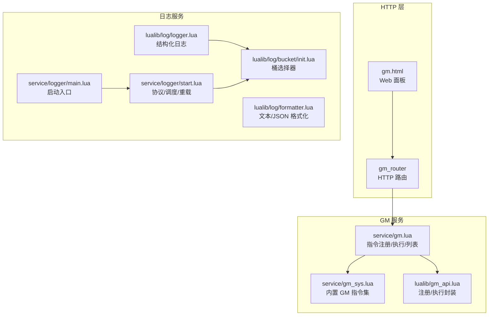
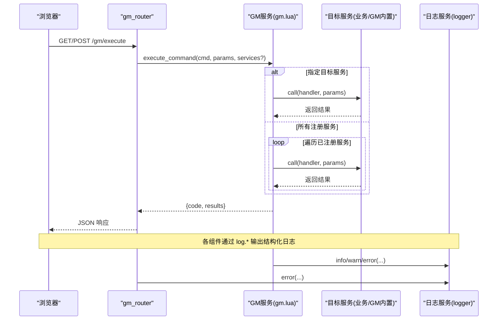
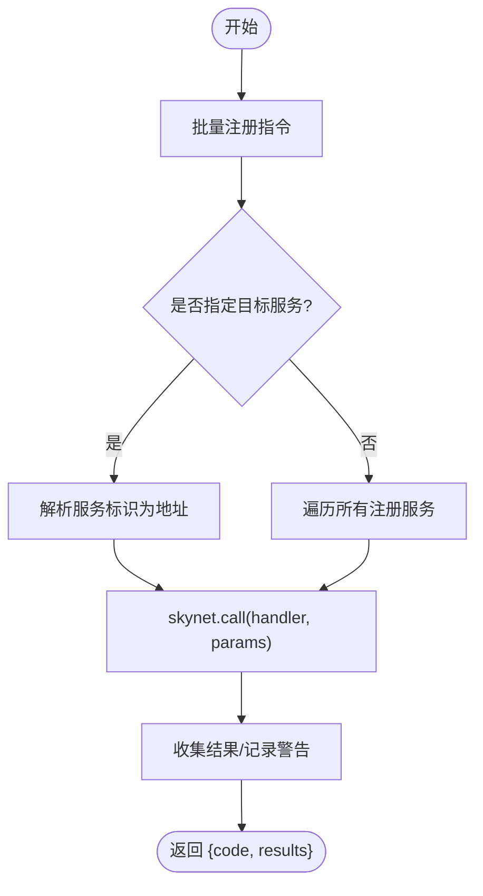
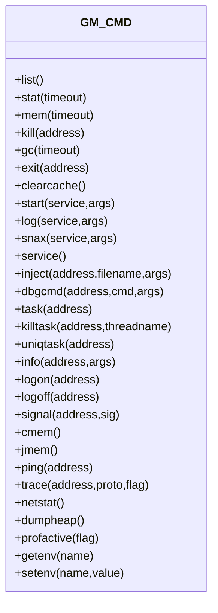
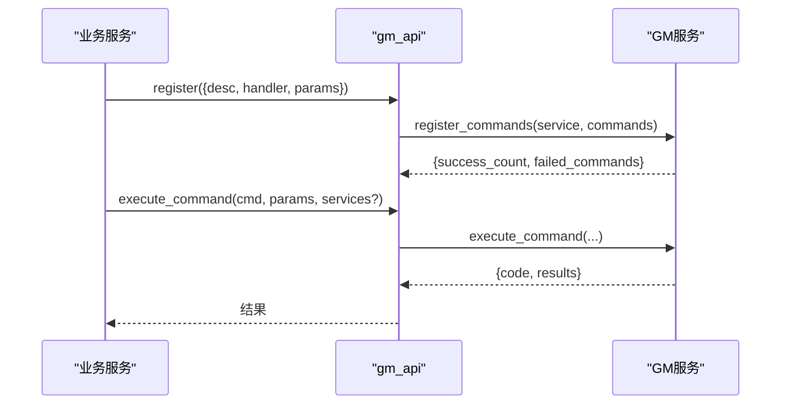
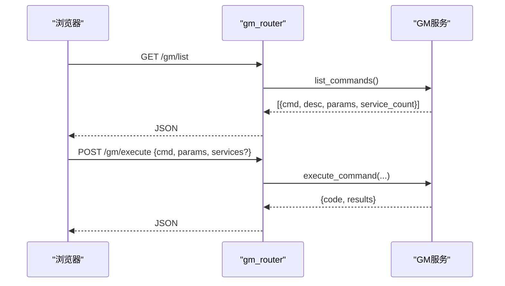
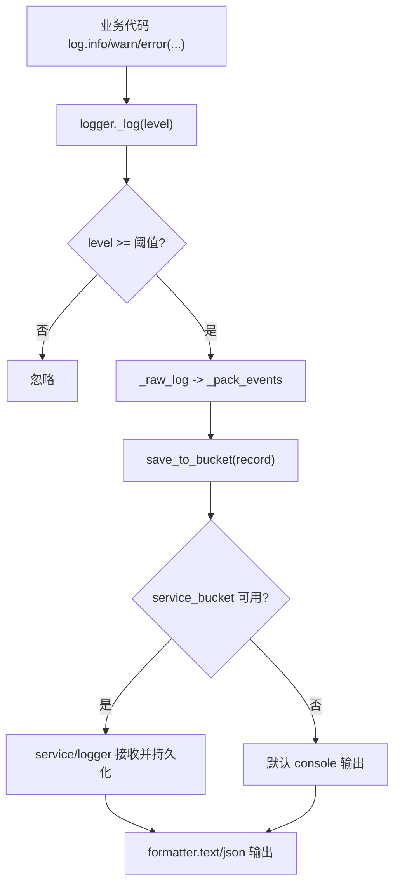
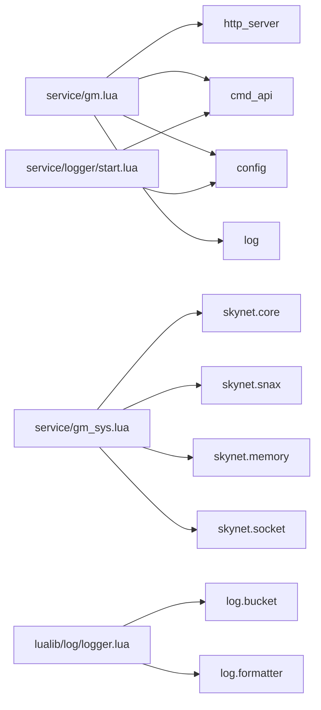

# 监控与日志

<cite>
**本文引用的文件**
- [service/gm.lua](file://service/gm.lua)
- [service/gm_sys.lua](file://service/gm_sys.lua)
- [lualib/gm_api.lua](file://lualib/gm_api.lua)
- [lualib/gm_router.lua](file://lualib/gm_router.lua)
- [public/gm.html](file://public/gm.html)
- [lualib/log/init.lua](file://lualib/log/init.lua)
- [lualib/log/logger.lua](file://lualib/log/logger.lua)
- [lualib/log/formatter.lua](file://lualib/log/formatter.lua)
- [lualib/log/bucket/init.lua](file://lualib/log/bucket/init.lua)
- [service/logger/main.lua](file://service/logger/main.lua)
- [service/logger/start.lua](file://service/logger/start.lua)
- [service/logger/cmd.lua](file://service/logger/cmd.lua)
- [etc/app/account1.app.lua](file://etc/app/account1.app.lua)
- [etc/app/account2.app.lua](file://etc/app/account2.app.lua)
</cite>

## 目录
1. [简介](#简介)
2. [项目结构](#项目结构)
3. [核心组件](#核心组件)
4. [架构总览](#架构总览)
5. [详细组件分析](#详细组件分析)
6. [依赖关系分析](#依赖关系分析)
7. [性能考虑](#性能考虑)
8. [故障排查指南](#故障排查指南)
9. [结论](#结论)
10. [附录](#附录)

## 简介
本文件面向 SkyExt 框架的监控与日志系统，重点说明 GM（Game Master）服务的指令注册、执行与管理接口；文档化日志系统的架构设计，包括多输出格式与日志级别管理；并给出监控系统集成方法、关键指标采集、日志分析工具与调试手段，以及告警配置、性能监控与故障诊断的最佳实践。

## 项目结构
SkyExt 将“GM 服务”和“日志服务”解耦：
- GM 服务负责暴露 HTTP 接口与内部命令分发，提供指令注册、批量执行、列表查询等能力，并通过统一路由对外提供服务。
- 日志系统由 logger 服务集中接收各模块日志，按配置写入多种后端（控制台、文件等），并提供重载、关闭等运维命令。

图表来源
- [lualib/gm_router.lua:20-148](file://lualib/gm_router.lua#L20-L148)
- [service/gm.lua:10-289](file://service/gm.lua#L10-L289)
- [service/gm_sys.lua:73-455](file://service/gm_sys.lua#L73-L455)
- [lualib/gm_api.lua:47-141](file://lualib/gm_api.lua#L47-L141)
- [service/logger/start.lua:24-84](file://service/logger/start.lua#L24-L84)
- [lualib/log/logger.lua:25-117](file://lualib/log/logger.lua#L25-L117)
- [lualib/log/bucket/init.lua:5-28](file://lualib/log/bucket/init.lua#L5-L28)

章节来源
- [lualib/gm_router.lua:20-148](file://lualib/gm_router.lua#L20-L148)
- [service/gm.lua:10-289](file://service/gm.lua#L10-L289)
- [service/gm_sys.lua:73-455](file://service/gm_sys.lua#L73-L455)
- [lualib/gm_api.lua:47-141](file://lualib/gm_api.lua#L47-L141)
- [service/logger/start.lua:24-84](file://service/logger/start.lua#L24-L84)
- [lualib/log/logger.lua:25-117](file://lualib/log/logger.lua#L25-L117)
- [lualib/log/bucket/init.lua:5-28](file://lualib/log/bucket/init.lua#L5-L28)

## 核心组件
- GM 服务（service/gm.lua）
  - 维护指令注册表与反向索引，支持批量注册、注销、列出指令，以及跨服务执行指令。
  - 启动 HTTP 服务器并挂载 gm_router 路由。
- GM 系统指令（service/gm_sys.lua）
  - 提供一系列系统级 GM 指令：服务列表、统计、内存、GC、启动/停止服务、注入脚本、任务查看、网络统计、堆转储、环境变量等。
- GM 客户端库（lualib/gm_api.lua）
  - 为业务服务提供统一的 GM 指令注册与执行封装，自动发现 .gm 服务地址。
- HTTP 路由（lualib/gm_router.lua）
  - 暴露 /gm/execute、/gm/list 等 REST 接口，解析参数并调用 GM 服务。
- Web 面板（public/gm.html）
  - 提供可视化命令列表、参数表单、结果展示与搜索过滤。
- 日志系统（lualib/log/* 与 service/logger/*）
  - 结构化日志记录、级别过滤、多后端输出（控制台、文件）、过载保护、SIGHUP 热重载、错误兜底。

章节来源
- [service/gm.lua:10-289](file://service/gm.lua#L10-L289)
- [service/gm_sys.lua:73-455](file://service/gm_sys.lua#L73-L455)
- [lualib/gm_api.lua:47-141](file://lualib/gm_api.lua#L47-L141)
- [lualib/gm_router.lua:20-148](file://lualib/gm_router.lua#L20-L148)
- [public/gm.html:658-800](file://public/gm.html#L658-L800)
- [lualib/log/logger.lua:25-117](file://lualib/log/logger.lua#L25-L117)
- [service/logger/start.lua:24-84](file://service/logger/start.lua#L24-L84)

## 架构总览
下图展示了从 HTTP 请求到 GM 指令执行，再到日志落盘的完整链路。

图表来源
- [lualib/gm_router.lua:20-118](file://lualib/gm_router.lua#L20-L118)
- [service/gm.lua:213-289](file://service/gm.lua#L213-L289)
- [lualib/log/logger.lua:108-129](file://lualib/log/logger.lua#L108-L129)

## 详细组件分析

### GM 服务（service/gm.lua）
- 指令注册与反向索引
  - 维护 g_commands（cmd_name -> 元信息+services）与 g_service_commands（service_address -> cmd_name 集合）。
  - 支持增量更新 handler/desc/params，并记录变更日志。
- 批量注册与注销
  - register_commands：批量注册，返回成功数与失败项。
  - unregister_service：按服务地址清理其所有指令，若无服务再引用则删除指令。
- 指令执行
  - execute_command：根据 target_services 过滤或全量执行；对每个服务以 pcall + skynet.call 调用对应 handler，收集结果并记录警告。
- 启动流程
  - 读取 gm_http_port 与 gm_agent_count 启动 HTTP 服务，注册 gm_router，并暴露 CMD 接口供其他服务使用。

图表来源
- [service/gm.lua:101-161](file://service/gm.lua#L101-L161)
- [service/gm.lua:183-289](file://service/gm.lua#L183-L289)

章节来源
- [service/gm.lua:10-289](file://service/gm.lua#L10-L289)

### GM 系统指令（service/gm_sys.lua）
- 覆盖服务生命周期、内存、网络、任务、追踪、环境等常用运维场景。
- 典型指令举例：
  - list/stat/mem：通过 launcher 获取服务列表、统计与内存信息。
  - kill/exit/start/snax/log：管理服务启停与日志服务启动。
  - inject/dbgcmd/task/killtask/uniqtask/info：远程注入脚本、调试命令、任务详情。
  - netstat/cmem/jmem/dumpheap/profactive：网络与内存统计、堆转储与性能剖析开关。
  - ping/trace：延迟探测与协议追踪。
  - getenv/setenv：环境变量读写。

图表来源
- [service/gm_sys.lua:73-455](file://service/gm_sys.lua#L73-L455)

章节来源
- [service/gm_sys.lua:73-455](file://service/gm_sys.lua#L73-L455)

### GM 客户端库（lualib/gm_api.lua）
- 为业务服务提供：
  - register(GM_CMD)：校验 desc/handler/params，生成处理器名 GM_XXX，批量注册至 GM 服务，并注册到 cmd_api。
  - execute_command(cmd_name, params, target_services)：调用 GM 服务执行指令，统一错误包装。
  - unregister()：服务退出时清理自身注册的指令。

图表来源
- [lualib/gm_api.lua:47-141](file://lualib/gm_api.lua#L47-L141)
- [service/gm.lua:101-161](file://service/gm.lua#L101-L161)

章节来源
- [lualib/gm_api.lua:47-141](file://lualib/gm_api.lua#L47-L141)

### HTTP 路由与 Web 面板（lualib/gm_router.lua + public/gm.html）
- 路由
  - GET/POST /gm/execute：解析 cmd/services/params，调用 GM 服务执行。
  - GET /gm/list：列出所有已注册指令。
  - GET /：返回 gm.html。
- Web 面板
  - 加载 /gm/list 渲染命令列表，支持搜索、参数表单、结果表格与折叠展开。

图表来源
- [lualib/gm_router.lua:20-148](file://lualib/gm_router.lua#L20-L148)
- [public/gm.html:707-778](file://public/gm.html#L707-L778)

章节来源
- [lualib/gm_router.lua:20-148](file://lualib/gm_router.lua#L20-L148)
- [public/gm.html:658-800](file://public/gm.html#L658-L800)

### 日志系统（lualib/log/* 与 service/logger/*）
- 初始化与全局钩子
  - log.init 读取配置设置 level/log_src/log_print_table，并替换 assert/error/pcall/xpcall，确保异常可被捕获并记录。
- 结构化日志
  - logger._pack_events 将 key-value 事件打包为 events 数组，避免字段冲突。
  - save_to_bucket 将记录投递到 bucket（优先 service/logger 提供的 service_bucket，否则默认 console）。
- 输出与格式化
  - formatter 支持 text/json 两种格式，text 支持 ANSI 颜色高亮，json 使用 cjson.safe 编码。
- 日志服务
  - start.lua 注册 SYSTEM/TEXT 协议处理，支持 SIGHUP 热重载 bucket；对 PTYPE_LOG 进行过载丢弃策略，PTYPE_LOG_ERR 不丢弃。
  - main.lua 作为特殊入口，捕获启动失败并写入 bootfail.log。
  - cmd.lua 暴露 put/close/reload 命令给外部控制。

图表来源
- [lualib/log/logger.lua:108-129](file://lualib/log/logger.lua#L108-L129)
- [lualib/log/bucket/init.lua:5-28](file://lualib/log/bucket/init.lua#L5-L28)
- [service/logger/start.lua:24-84](file://service/logger/start.lua#L24-L84)
- [lualib/log/formatter.lua:75-127](file://lualib/log/formatter.lua#L75-L127)

章节来源
- [lualib/log/init.lua:1-58](file://lualib/log/init.lua#L1-L58)
- [lualib/log/logger.lua:25-129](file://lualib/log/logger.lua#L25-L129)
- [lualib/log/formatter.lua:75-127](file://lualib/log/formatter.lua#L75-L127)
- [lualib/log/bucket/init.lua:5-28](file://lualib/log/bucket/init.lua#L5-L28)
- [service/logger/start.lua:24-84](file://service/logger/start.lua#L24-L84)
- [service/logger/main.lua:1-18](file://service/logger/main.lua#L1-L18)
- [service/logger/cmd.lua:6-18](file://service/logger/cmd.lua#L6-L18)

## 依赖关系分析
- GM 服务依赖 http_server、cmd_api、config、log；GM 系统指令依赖 skynet.core、snax、memory、socket。
- 日志系统依赖 time、util.table、log.bucket、log.log_level、traceback.c；logger 服务依赖 config、cmd_api、ptype。
- 配置中通过 log_config 定义多个输出桶（如 file/console），并在应用配置中启用。

图表来源
- [service/gm.lua:1-5](file://service/gm.lua#L1-L5)
- [service/gm_sys.lua:1-8](file://service/gm_sys.lua#L1-L8)
- [lualib/log/logger.lua:1-6](file://lualib/log/logger.lua#L1-L6)
- [service/logger/start.lua:1-10](file://service/logger/start.lua#L1-L10)

章节来源
- [service/gm.lua:1-5](file://service/gm.lua#L1-L5)
- [service/gm_sys.lua:1-8](file://service/gm_sys.lua#L1-L8)
- [lualib/log/logger.lua:1-6](file://lualib/log/logger.lua#L1-L6)
- [service/logger/start.lua:1-10](file://service/logger/start.lua#L1-L10)

## 性能考虑
- 指令执行
  - 批量执行时建议显式指定 target_services，减少不必要的广播调用。
  - 对耗时操作应合理设置超时与重试策略，避免阻塞 GM 服务。
- 日志吞吐
  - 日志服务在过载时会丢弃普通日志（PTYPE_LOG），但保留错误日志（PTYPE_LOG_ERR），保障关键问题可观测。
  - 可通过 SIGHUP 热重载日志配置，动态调整输出桶与轮转策略。
- 内存与剖析
  - 使用 jmem/cmem/netstat/dumpheap/profactive 等指令定位内存热点与网络瓶颈。
  - 结合 profiler 开启/关闭堆剖析，避免长期开启带来的开销。

[本节为通用指导，无需特定文件引用]

## 故障排查指南
- 常见问题
  - GM 服务未初始化：路由与 API 会返回不可用错误，检查 .gm 命名服务是否启动。
  - 指令不存在：execute_command 返回 command not found，确认指令已正确注册且服务存活。
  - 目标服务无效：parse_service_address 无法解析地址或服务未注册该指令，检查服务名/十六进制地址与注册情况。
  - 日志丢失：检查日志服务是否启动、bucket 配置是否正确、是否触发过载丢弃。
- 快速定位
  - 使用 GM 内置指令：ping、trace、netstat、cmem、jmem、dumpheap、profactive 等。
  - 使用 Web 面板：/gm/list 查看指令清单，/gm/execute 执行并查看结果。
  - 使用日志服务命令：put/close/reload 控制日志流。

章节来源
- [lualib/gm_router.lua:20-148](file://lualib/gm_router.lua#L20-L148)
- [service/gm.lua:183-289](file://service/gm.lua#L183-L289)
- [service/gm_sys.lua:326-455](file://service/gm_sys.lua#L326-L455)
- [service/logger/cmd.lua:6-18](file://service/logger/cmd.lua#L6-L18)

## 结论
SkyExt 的 GM 服务提供了完善的指令注册、执行与管理能力，配合 HTTP 路由与 Web 面板形成完整的运维入口；日志系统采用结构化设计与多后端输出，具备过载保护与热重载能力。通过内置 GM 指令与日志服务命令，可实现高效的监控、分析与排障。

[本节为总结性内容，无需特定文件引用]

## 附录

### 监控与日志最佳实践
- 告警配置
  - 基于日志关键字（如 Error/Exception）与 GM 指令返回码（非 0）建立告警规则。
  - 对关键 GM 指令（如 kill/start/inject）增加审计与审批流程。
- 性能监控
  - 定期采集 netstat、cmem、jmem、dumpheap 数据，结合时间序列存储进行分析。
  - 使用 trace 指令对慢路径协议进行采样，定位瓶颈。
- 故障诊断
  - 优先使用 ping/trace/task/uniqtask 缩小范围，再结合日志服务重载与关键词过滤定位根因。
  - 利用注入脚本与 dbgcmd 进行在线诊断与修复。

[本节为通用指导，无需特定文件引用]

### 配置示例参考
- 应用日志配置（文件+控制台）
  - 见 account1/app 与 account2/app 中的 log_config 示例，支持 size/day/hour 切分与文件大小限制。

章节来源
- [etc/app/account1.app.lua:1-20](file://etc/app/account1.app.lua#L1-L20)
- [etc/app/account2.app.lua:1-20](file://etc/app/account2.app.lua#L1-L20)