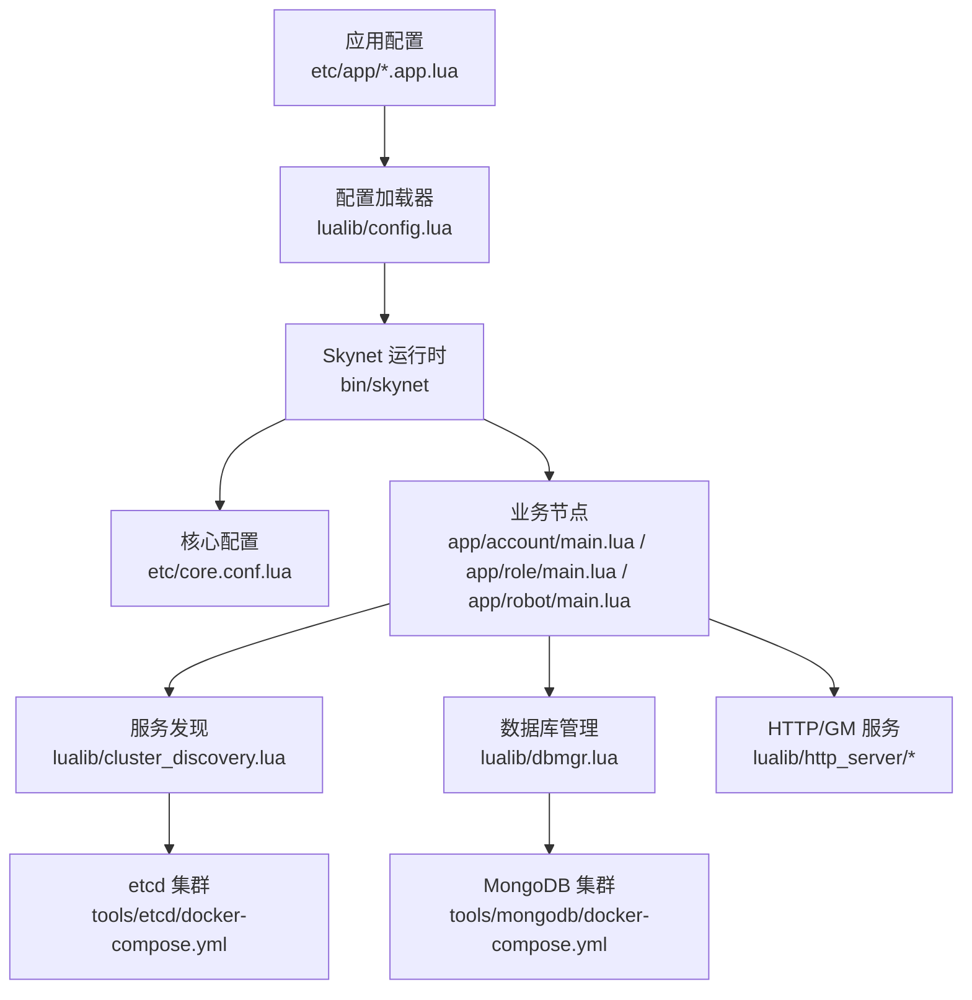
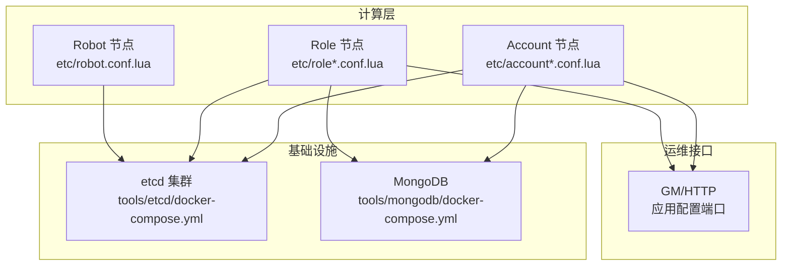
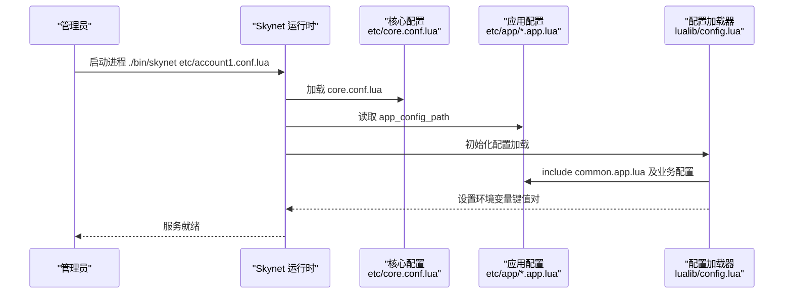
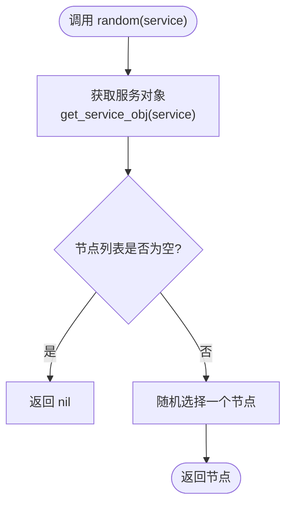
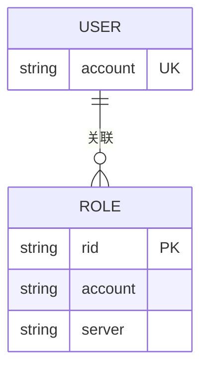
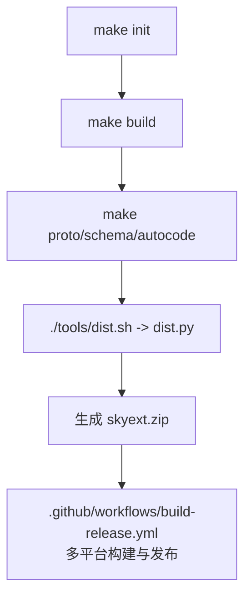
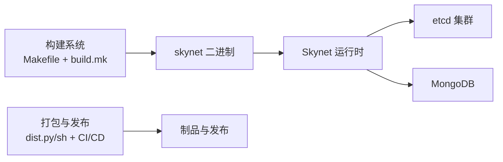

# 部署指南

<cite>
**本文引用的文件**
- [README.md](file://README.md)
- [Makefile](file://Makefile)
- [build.mk](file://build.mk)
- [core.conf.lua](file://etc/core.conf.lua)
- [account1.conf.lua](file://etc/account1.conf.lua)
- [role1.conf.lua](file://etc/role1.conf.lua)
- [robot.conf.lua](file://etc/robot.conf.lua)
- [common.app.lua](file://etc/app/common.app.lua)
- [account1.app.lua](file://etc/app/account1.app.lua)
- [role1.app.lua](file://etc/app/role1.app.lua)
- [robot.app.lua](file://etc/app/robot.app.lua)
- [config.lua](file://lualib/config.lua)
- [cluster_discovery.lua](file://lualib/cluster_discovery.lua)
- [docker-compose.yml（etcd）](file://tools/etcd/docker-compose.yml)
- [start.sh（etcd）](file://tools/etcd/start.sh)
- [docker-compose.yml（mongodb）](file://tools/mongodb/docker-compose.yml)
- [start.sh（mongodb）](file://tools/mongodb/start.sh)
- [dist.py](file://tools/dist.py)
- [dist.sh](file://tools/dist.sh)
- [build-release.yml](file://.github/workflows/build-release.yml)
</cite>

## 目录
1. [简介](#简介)
2. [项目结构](#项目结构)
3. [核心组件](#核心组件)
4. [架构总览](#架构总览)
5. [详细组件分析](#详细组件分析)
6. [依赖关系分析](#依赖关系分析)
7. [性能考虑](#性能考虑)
8. [故障排查指南](#故障排查指南)
9. [结论](#结论)
10. [附录](#附录)

## 简介
本指南面向生产环境，提供 SkyExt 框架的完整部署说明。内容涵盖：
- Skynet 运行时、MongoDB、etcd 等依赖的安装与配置
- 容器化部署方案（Docker Compose）
- 负载均衡、高可用与集群部署模式
- 服务启动脚本、进程管理与健康检查建议
- 打包发布与 CI/CD 集成

SkyExt 是基于 Skynet 的高性能分布式游戏服务器框架，支持账号节点与角色节点分离、基于 etcd 的服务发现、MongoDB 持久化、sproto 协议以及 JWT 认证等特性。

**章节来源**
- [README.md:9-47](file://README.md#L9-L47)

## 项目结构
SkyExt 采用分层配置与模块化设计：
- etc：节点与应用配置，包含核心配置与各业务节点配置
- app：各节点主入口（account、role、robot）
- lualib：通用库（配置加载、服务发现、数据库连接、HTTP 服务等）
- service：系统级服务（日志、Mongo 连接、协议加载等）
- tools：工具脚本与依赖服务编排（etcd、mongodb）
- build 产物：编译后的二进制、LuaC 字节码、协议与 schema 文件

**图表来源**
- [core.conf.lua:1-30](file://etc/core.conf.lua#L1-L30)
- [config.lua:88-142](file://lualib/config.lua#L88-L142)
- [cluster_discovery.lua:1-95](file://lualib/cluster_discovery.lua#L1-L95)
- [docker-compose.yml（etcd）:1-87](file://tools/etcd/docker-compose.yml#L1-L87)
- [docker-compose.yml（mongodb）:1-11](file://tools/mongodb/docker-compose.yml#L1-L11)

**章节来源**
- [README.md:112-147](file://README.md#L112-L147)
- [core.conf.lua:1-30](file://etc/core.conf.lua#L1-L30)

## 核心组件
- 配置加载：通过 config 模块统一读取并缓存配置，支持字符串、布尔、数值、表类型；应用配置文件由节点配置指定路径加载。
- 服务发现：基于 etcd 的集群发现，支持服务注册/注销、节点列表查询与变更订阅。
- 数据库管理：MongoDB 连接池与集合索引配置，区分中心库与角色库。
- HTTP/GM 服务：暴露 GM 接口与内部 HTTP 能力，端口在应用配置中定义。
- 构建与分发：Makefile 驱动编译、协议生成、代码生成与打包；CI/CD 多平台构建与发布。

**章节来源**
- [config.lua:6-72](file://lualib/config.lua#L6-L72)
- [config.lua:88-142](file://lualib/config.lua#L88-L142)
- [cluster_discovery.lua:10-20](file://lualib/cluster_discovery.lua#L10-L20)
- [cluster_discovery.lua:61-76](file://lualib/cluster_discovery.lua#L61-L76)
- [common.app.lua:21-72](file://etc/app/common.app.lua#L21-L72)
- [account1.app.lua:13-18](file://etc/app/account1.app.lua#L13-L18)
- [role1.app.lua:1-14](file://etc/app/role1.app.lua#L1-L14)
- [Makefile:21-46](file://Makefile#L21-L46)
- [build.mk:78-92](file://build.mk#L78-L92)

## 架构总览
SkyExt 的生产架构通常包括：
- Skynet 运行时：承载 account、role、robot 等服务进程
- etcd 集群：服务注册与发现、配置共享
- MongoDB：用户数据与角色数据持久化
- HTTP/GM：运维与调试接口
- 网关/客户端：外部接入层（本项目未内置网关，可结合外部网关使用）

**图表来源**
- [account1.conf.lua:1-4](file://etc/account1.conf.lua#L1-L4)
- [role1.conf.lua:1-4](file://etc/role1.conf.lua#L1-L4)
- [robot.conf.lua:1-4](file://etc/robot.conf.lua#L1-L4)
- [docker-compose.yml（etcd）:10-86](file://tools/etcd/docker-compose.yml#L10-L86)
- [docker-compose.yml（mongodb）:1-11](file://tools/mongodb/docker-compose.yml#L1-L11)
- [account1.app.lua:13-18](file://etc/app/account1.app.lua#L13-L18)
- [role1.app.lua:5-14](file://etc/app/role1.app.lua#L5-L14)

## 详细组件分析

### 配置加载与节点启动流程
节点启动时，Skynet 根据节点配置文件加载核心配置与应用配置，再由配置模块解析为环境变量供运行时使用。

**图表来源**
- [account1.conf.lua:1-4](file://etc/account1.conf.lua#L1-L4)
- [core.conf.lua:1-30](file://etc/core.conf.lua#L1-L30)
- [config.lua:88-142](file://lualib/config.lua#L88-L142)

**章节来源**
- [account1.conf.lua:1-4](file://etc/account1.conf.lua#L1-L4)
- [role1.conf.lua:1-4](file://etc/role1.conf.lua#L1-L4)
- [robot.conf.lua:1-4](file://etc/robot.conf.lua#L1-L4)
- [config.lua:88-142](file://lualib/config.lua#L88-L142)

### 服务发现与负载均衡
服务发现模块维护服务节点列表，支持随机选择节点以实现简单负载均衡，并通过事件通道订阅服务变更。

**图表来源**
- [cluster_discovery.lua:22-38](file://lualib/cluster_discovery.lua#L22-L38)
- [cluster_discovery.lua:61-76](file://lualib/cluster_discovery.lua#L61-L76)

**章节来源**
- [cluster_discovery.lua:10-20](file://lualib/cluster_discovery.lua#L10-L20)
- [cluster_discovery.lua:61-76](file://lualib/cluster_discovery.lua#L61-L76)

### 数据库连接与索引
MongoDB 配置分为 center（用户数据）与 role（角色数据），支持连接数、认证信息与集合索引定义。

**图表来源**
- [common.app.lua:31-72](file://etc/app/common.app.lua#L31-L72)

**章节来源**
- [common.app.lua:31-72](file://etc/app/common.app.lua#L31-L72)

### 构建与打包流程
构建过程包括依赖安装、编译 Skynet 与 C 扩展、生成协议与 schema、打包发布。CI/CD 支持多平台构建与 Release 发布。

**图表来源**
- [Makefile:11-46](file://Makefile#L11-L46)
- [build.mk:78-92](file://build.mk#L78-L92)
- [dist.sh:1-7](file://tools/dist.sh#L1-L7)
- [dist.py:129-192](file://tools/dist.py#L129-L192)
- [build-release.yml:13-133](file://.github/workflows/build-release.yml#L13-L133)

**章节来源**
- [Makefile:11-46](file://Makefile#L11-L46)
- [build.mk:78-92](file://build.mk#L78-L92)
- [dist.py:129-192](file://tools/dist.py#L129-L192)
- [build-release.yml:13-133](file://.github/workflows/build-release.yml#L13-L133)

## 依赖关系分析
- Skynet 运行时：由 Makefile 与 build.mk 负责编译与复制二进制
- etcd：通过 Docker Compose 启动三节点集群，用于服务发现与配置
- MongoDB：通过 Docker Compose 启动单实例或集群，用于数据持久化
- 工具脚本：dist.py/sh 负责打包；CI/CD 负责多平台构建与发布

**图表来源**
- [build.mk:78-92](file://build.mk#L78-L92)
- [docker-compose.yml（etcd）:10-86](file://tools/etcd/docker-compose.yml#L10-L86)
- [docker-compose.yml（mongodb）:1-11](file://tools/mongodb/docker-compose.yml#L1-L11)
- [dist.py:129-192](file://tools/dist.py#L129-L192)
- [build-release.yml:13-133](file://.github/workflows/build-release.yml#L13-L133)

**章节来源**
- [build.mk:78-92](file://build.mk#L78-L92)
- [docker-compose.yml（etcd）:10-86](file://tools/etcd/docker-compose.yml#L10-L86)
- [docker-compose.yml（mongodb）:1-11](file://tools/mongodb/docker-compose.yml#L1-L11)
- [dist.py:129-192](file://tools/dist.py#L129-L192)
- [build-release.yml:13-133](file://.github/workflows/build-release.yml#L13-L133)

## 性能考虑
- 线程数与连接池：核心配置中的 thread 参数影响并发处理能力；MongoDB 连接池大小需按负载调优
- 日志策略：按 size/line/day/hour 分割，控制日志文件大小与保留策略，避免磁盘占用过高
- 服务发现：合理设置节点数量与心跳间隔，确保快速故障转移
- HTTP/GM 端口：避免与业务端口冲突，限制请求体大小防止资源滥用

[本节为通用指导，不直接分析具体文件]

## 故障排查指南
- 启动失败日志：查看 bootfail.log 与节点日志文件，定位配置错误或依赖不可用
- etcd 连通性：确认 etcd 集群端口与网络可达，必要时调整 http_host 列表
- MongoDB 认证：检查用户名、密码、authdb 配置是否正确，集合索引是否创建成功
- 服务发现异常：检查服务注册/注销逻辑与事件通道订阅是否正常
- 构建问题：确认依赖安装与编译器环境，清理后重新构建

**章节来源**
- [common.app.lua:1-19](file://etc/app/common.app.lua#L1-L19)
- [common.app.lua:21-72](file://etc/app/common.app.lua#L21-L72)
- [cluster_discovery.lua:78-92](file://lualib/cluster_discovery.lua#L78-L92)

## 结论
SkyExt 提供了完整的分布式游戏服务器框架与生产部署能力。通过合理的配置与容器化编排，可实现高可用与可扩展的集群部署。配合 CI/CD 自动化构建与发布，能够提升交付效率与稳定性。

[本节为总结，不直接分析具体文件]

## 附录

### 生产环境部署要求
- Skynet 运行时：确保已编译并位于 bin 目录
- etcd：至少三节点集群，启用安全令牌与正确初始集群状态
- MongoDB：根据数据量与读写压力选择合适的副本集与索引策略
- 日志：集中收集与分析，设置合理的轮转策略
- 监控与健康检查：建议引入进程守护与探针（如 systemd、Docker healthcheck）

**章节来源**
- [docker-compose.yml（etcd）:10-86](file://tools/etcd/docker-compose.yml#L10-L86)
- [docker-compose.yml（mongodb）:1-11](file://tools/mongodb/docker-compose.yml#L1-L11)
- [common.app.lua:1-19](file://etc/app/common.app.lua#L1-L19)

### 容器化部署方案
- etcd：使用 tools/etcd/docker-compose.yml 启动三节点集群
- MongoDB：使用 tools/mongodb/docker-compose.yml 启动数据卷持久化的实例
- 应用容器：可将构建产物（dist.zip）解压后运行 skynet 进程，或使用镜像封装

**章节来源**
- [docker-compose.yml（etcd）:10-86](file://tools/etcd/docker-compose.yml#L10-L86)
- [docker-compose.yml（mongodb）:1-11](file://tools/mongodb/docker-compose.yml#L1-L11)
- [dist.py:129-192](file://tools/dist.py#L129-L192)

### 负载均衡与高可用
- 负载均衡：服务发现模块提供随机节点选择，适合简单场景；复杂场景可结合网关实现更精细的策略
- 高可用：etcd 三节点集群保证元数据可用性；MongoDB 副本集保障数据可靠性；多实例部署 Account/Role 节点提升容错能力

**章节来源**
- [cluster_discovery.lua:61-76](file://lualib/cluster_discovery.lua#L61-L76)
- [docker-compose.yml（etcd）:10-86](file://tools/etcd/docker-compose.yml#L10-L86)

### 集群部署模式
- 多实例 Account：通过不同配置文件（account1、account2）启动多个实例，共享 etcd 与 MongoDB
- 多实例 Role：通过不同配置文件（role1、role2）启动多个实例，配合服务发现动态路由
- Robot 压测：通过 robot 节点模拟客户端流量，验证集群性能与稳定性

**章节来源**
- [account1.conf.lua:1-4](file://etc/account1.conf.lua#L1-L4)
- [role1.conf.lua:1-4](file://etc/role1.conf.lua#L1-L4)
- [robot.conf.lua:1-4](file://etc/robot.conf.lua#L1-L4)
- [robot.app.lua:1-15](file://etc/app/robot.app.lua#L1-L15)

### 服务启动脚本与进程管理
- 启动命令：使用 bin/skynet 加载对应节点配置文件
- 进程管理：建议使用 systemd 或容器编排工具管理生命周期
- 健康检查：可通过 HTTP/GM 接口或自定义探针检查服务状态

**章节来源**
- [README.md:93-110](file://README.md#L93-L110)
- [account1.app.lua:13-18](file://etc/app/account1.app.lua#L13-L18)
- [role1.app.lua:5-14](file://etc/app/role1.app.lua#L5-L14)

### 部署自动化与 CI/CD 集成
- 本地构建：make init -> make build -> make proto/schema/autocode -> ./tools/dist.sh
- CI/CD：GitHub Actions 多平台构建，生成 zip 制品并发布 Release
- 版本管理：通过标签触发 Release 流程，自动归档多平台产物

**章节来源**
- [Makefile:11-46](file://Makefile#L11-L46)
- [build.mk:78-92](file://build.mk#L78-L92)
- [dist.sh:1-7](file://tools/dist.sh#L1-L7)
- [dist.py:129-192](file://tools/dist.py#L129-L192)
- [build-release.yml:13-173](file://.github/workflows/build-release.yml#L13-L173)