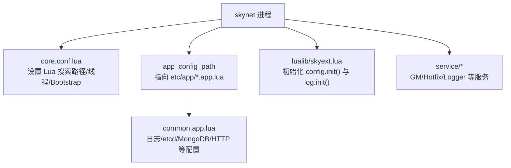
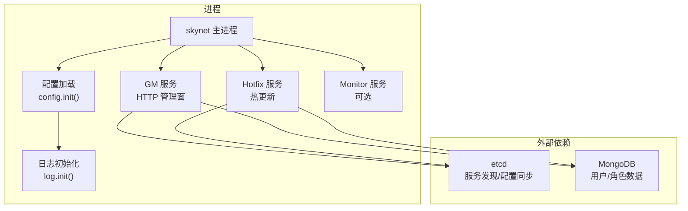
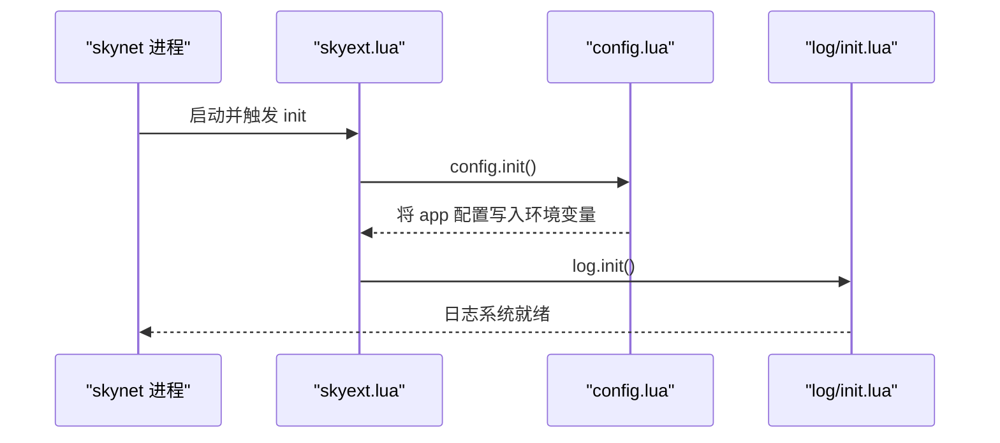
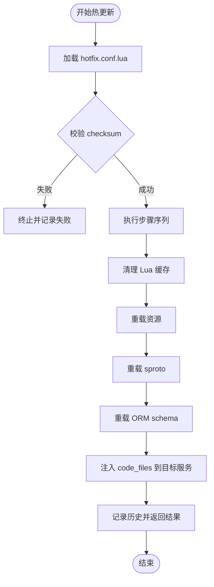
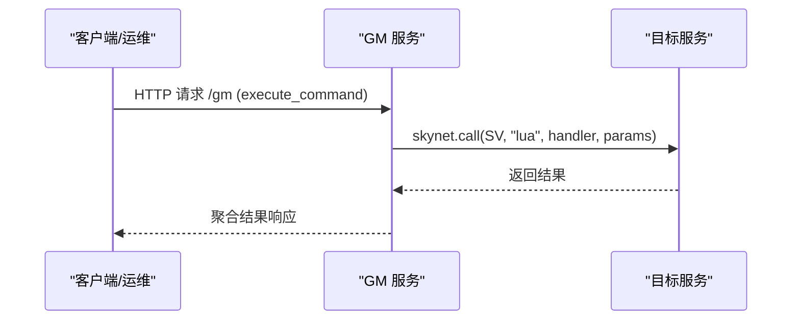
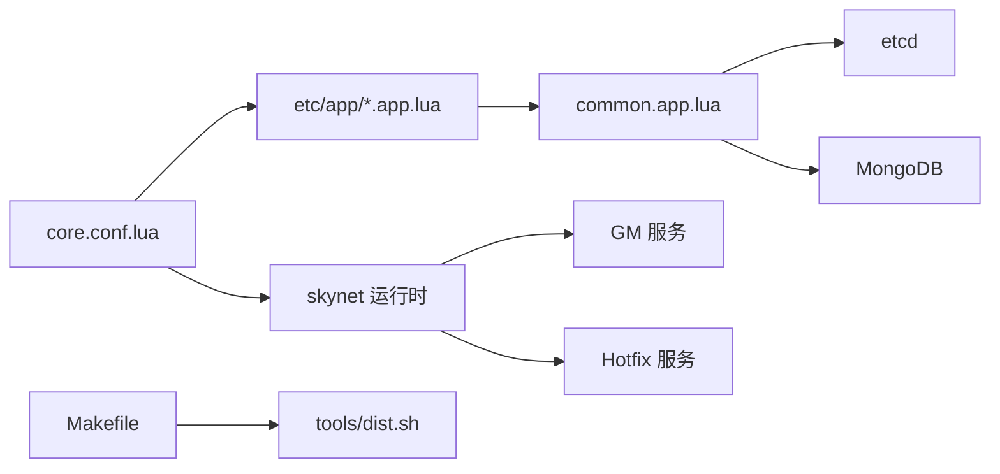

# 部署运维

<cite>
**本文引用的文件**
- [README.md](file://README.md)
- [core.conf.lua](file://etc/core.conf.lua)
- [account1.conf.lua](file://etc/account1.conf.lua)
- [role1.conf.lua](file://etc/role1.conf.lua)
- [common.app.lua](file://etc/app/common.app.lua)
- [monitor.app.lua](file://etc/app/monitor.app.lua)
- [config.lua](file://lualib/config.lua)
- [skyext.lua](file://lualib/skyext.lua)
- [hotfix.lua](file://service/hotfix.lua)
- [gm.lua](file://service/gm.lua)
- [logger/main.lua](file://service/logger/main.lua)
- [log/init.lua](file://lualib/log/init.lua)
- [Makefile](file://Makefile)
- [dist.sh](file://tools/dist.sh)
- [hotfix.sh](file://tools/hotfix.sh)
</cite>

## 目录
1. [简介](#简介)
2. [项目结构](#项目结构)
3. [核心组件](#核心组件)
4. [架构总览](#架构总览)
5. [详细组件分析](#详细组件分析)
6. [依赖关系分析](#依赖关系分析)
7. [性能与容量规划](#性能与容量规划)
8. [监控、日志与排障](#监控日志与排障)
9. [容器化与高可用](#容器化与高可用)
10. [服务扩展与插件集成](#服务扩展与插件集成)
11. [热更新与补丁管理](#热更新与补丁管理)
12. [生产配置与环境变量](#生产配置与环境变量)
13. [最佳实践与常见问题](#最佳实践与常见问题)
14. [结论](#结论)

## 简介
本文件面向 SkyExt 框架的生产部署与运维，覆盖配置管理、环境变量、配置文件结构、热更新机制、补丁管理与回滚策略、监控与日志、性能分析与故障诊断、服务扩展与插件集成、容器化部署、负载均衡与高可用设计，以及运维最佳实践和常见问题解决方案。内容基于仓库内现有实现进行系统化整理，确保可操作性和可追溯性。

## 项目结构
SkyExt 采用分层配置与模块化服务组织：
- 节点级配置位于 etc/*.conf.lua，定义启动参数、Lua 搜索路径、线程数等基础运行时信息。
- 应用级配置位于 etc/app/*.app.lua，定义业务相关配置（日志、数据库、etcd、HTTP 等）。
- 核心初始化由 lualib/skyext.lua 在进程启动时加载配置并初始化日志系统。
- 服务模块集中在 service/ 下，如 GM 管理、热更新、日志服务等。
- 工具脚本位于 tools/，提供打包、协议生成、热更新执行等能力。

**图表来源**
- [core.conf.lua:1-30](file://etc/core.conf.lua#L1-L30)
- [account1.conf.lua:1-4](file://etc/account1.conf.lua#L1-L4)
- [role1.conf.lua:1-4](file://etc/role1.conf.lua#L1-L4)
- [common.app.lua:1-100](file://etc/app/common.app.lua#L1-L100)
- [skyext.lua:61-80](file://lualib/skyext.lua#L61-L80)

**章节来源**
- [README.md:132-201](file://README.md#L132-L201)
- [core.conf.lua:1-30](file://etc/core.conf.lua#L1-L30)
- [account1.conf.lua:1-4](file://etc/account1.conf.lua#L1-L4)
- [role1.conf.lua:1-4](file://etc/role1.conf.lua#L1-L4)
- [common.app.lua:1-100](file://etc/app/common.app.lua#L1-L100)
- [skyext.lua:61-80](file://lualib/skyext.lua#L61-L80)

## 核心组件
- 配置中心与读取：lualib/config.lua 提供统一的环境变量读取与 app 配置加载，支持字符串、布尔、数值、表类型。
- 服务发现与集群：通过 etcd 配置项（见 common.app.lua）完成服务注册与发现。
- 数据持久化：MongoDB 连接池与集合索引配置（见 common.app.lua）。
- HTTP 与管理面：service/gm.lua 提供 HTTP 管理接口与指令分发；lualib/http_server 提供 HTTP 服务实现。
- 日志系统：lualib/log 封装日志输出，service/logger 负责启动失败兜底记录。
- 热更新：service/hotfix.lua 提供代码热注入、资源/协议/ORM schema 重载、校验与历史追踪。

**章节来源**
- [config.lua:1-145](file://lualib/config.lua#L1-L145)
- [common.app.lua:1-100](file://etc/app/common.app.lua#L1-L100)
- [gm.lua:291-309](file://service/gm.lua#L291-L309)
- [log/init.lua:41-55](file://lualib/log/init.lua#L41-L55)
- [logger/main.lua:1-18](file://service/logger/main.lua#L1-L18)
- [hotfix.lua:36-108](file://service/hotfix.lua#L36-L108)

## 架构总览
SkyExt 以 skynet 为内核，按角色拆分 Account 与 Role 节点，配合 etcd 做服务发现，MongoDB 做数据持久化，GM 服务暴露 HTTP 管理面，Hotfix 服务提供在线热更能力。

**图表来源**
- [skyext.lua:61-80](file://lualib/skyext.lua#L61-L80)
- [gm.lua:291-309](file://service/gm.lua#L291-L309)
- [hotfix.lua:418-455](file://service/hotfix.lua#L418-L455)
- [monitor.app.lua:1-10](file://etc/app/monitor.app.lua#L1-L10)
- [common.app.lua:21-72](file://etc/app/common.app.lua#L21-L72)

## 详细组件分析

### 配置加载与初始化流程
- 入口：skynet 进程启动后，由 lualib/skyext.lua 的 init 钩子调用 config.init() 加载应用配置，并将结果写入环境变量供后续模块读取。
- 应用配置：etc/app/*.app.lua 通过 include 机制组合公共配置 common.app.lua，支持嵌套表与类型转换。
- 日志初始化：log.init() 根据配置项初始化日志级别、输出目标，并替换 assert/error/pcall/xpcall 以增强错误捕获。

**图表来源**
- [skyext.lua:61-80](file://lualib/skyext.lua#L61-L80)
- [config.lua:88-142](file://lualib/config.lua#L88-L142)
- [log/init.lua:41-55](file://lualib/log/init.lua#L41-L55)

**章节来源**
- [skyext.lua:61-80](file://lualib/skyext.lua#L61-L80)
- [config.lua:88-142](file://lualib/config.lua#L88-L142)
- [log/init.lua:41-55](file://lualib/log/init.lua#L41-L55)

### 热更新机制与补丁管理
- 补丁包结构：hotfix/<时间戳>-patchN/ 包含 hotfix.conf.lua 与若干 code*.lua 补丁脚本。
- 配置校验：load_hotfix_config 读取并校验必需字段（desc、checksum、gitsha_base、gitsha_update、time），verify_checksum 对 update_files 与 code_files 合并计算 MD5 校验。
- 执行步骤：clear_lua_cache -> reload_res -> reload_sproto -> reload_orm_schema -> inject_code_files。
- 注入方式：通过 GM 服务的 debug.RUN 向目标服务动态注入补丁代码，解析 targets 列表并逐服务执行。
- 历史记录：维护 g_hotfix_history，支持 hotfix_history 查询最近 N 条记录。

**图表来源**
- [hotfix.lua:36-108](file://service/hotfix.lua#L36-L108)
- [hotfix.lua:110-156](file://service/hotfix.lua#L110-L156)
- [hotfix.lua:158-289](file://service/hotfix.lua#L158-L289)
- [hotfix.lua:291-416](file://service/hotfix.lua#L291-L416)

**章节来源**
- [hotfix.lua:36-108](file://service/hotfix.lua#L36-L108)
- [hotfix.lua:110-156](file://service/hotfix.lua#L110-L156)
- [hotfix.lua:158-289](file://service/hotfix.lua#L158-L289)
- [hotfix.lua:291-416](file://service/hotfix.lua#L291-L416)
- [hotfix.sh:1-7](file://tools/hotfix.sh#L1-L7)

### GM 管理服务与 HTTP 接口
- 功能：注册/批量注册/注销 GM 指令，列出指令，跨服务执行指令。
- HTTP：启动 HTTP 服务器并注册 gm_router，端口与并发 agent 数来自配置。
- 典型命令：mem/jmem/ping/trace/cmem 等用于内存与性能观测。

**图表来源**
- [gm.lua:213-289](file://service/gm.lua#L213-L289)
- [gm.lua:291-309](file://service/gm.lua#L291-L309)

**章节来源**
- [gm.lua:1-310](file://service/gm.lua#L1-L310)

### 日志系统与启动失败兜底
- 默认日志：lualib/log/init.lua 根据配置初始化日志级别、输出源，并替换全局断言与异常处理函数。
- 启动失败兜底：service/logger/main.lua 使用 xpcall 包裹启动逻辑，若失败则写入 bootfail.log 并中止进程，便于定位启动期问题。

**章节来源**
- [log/init.lua:41-55](file://lualib/log/init.lua#L41-L55)
- [logger/main.lua:1-18](file://service/logger/main.lua#L1-L18)

## 依赖关系分析
- 配置依赖：core.conf.lua 定义 Lua 搜索路径与线程数；app_config_path 指向具体应用配置；common.app.lua 提供通用配置。
- 运行时依赖：etcd（服务发现）、MongoDB（数据持久化）、HTTP 管理面（GM）。
- 构建与发布：Makefile 提供 proto/schema/autocode/format/lint/dist 等命令；tools/dist.sh 调用 dist.py 打包。

**图表来源**
- [core.conf.lua:1-30](file://etc/core.conf.lua#L1-L30)
- [common.app.lua:1-100](file://etc/app/common.app.lua#L1-L100)
- [Makefile:1-47](file://Makefile#L1-L47)
- [dist.sh:1-7](file://tools/dist.sh#L1-L7)

**章节来源**
- [core.conf.lua:1-30](file://etc/core.conf.lua#L1-L30)
- [common.app.lua:1-100](file://etc/app/common.app.lua#L1-L100)
- [Makefile:1-47](file://Makefile#L1-L47)
- [dist.sh:1-7](file://tools/dist.sh#L1-L7)

## 性能与容量规划
- 线程数：core.conf.lua 中 thread 控制工作线程数量，需结合 CPU 核数与任务特性调优。
- 日志吞吐：common.app.lua 中 log_overload_mqlen 控制日志队列长度，避免阻塞热点路径。
- 数据库连接：mongo_config.connections 控制连接池大小，需依据 QPS 与延迟目标评估。
- HTTP 管理面：gm.lua 中 gm_agent_count 控制管理面并发处理能力，避免管理流量影响业务。

[本节为通用指导，不直接分析具体文件]

## 监控、日志与排障
- 监控指标：通过 GM 服务的 mem/jmem/ping/trace 等命令获取内存、延迟与协议跟踪信息。
- 日志采集：日志输出至文件与控制台，可按 size/day/hour 切分；启动失败日志写入 bootfail.log。
- 排障建议：
  - 启动失败：检查 logger 兜底日志与配置项 bootfaillogpath。
  - 热更新失败：查看 hotfix 历史与步骤记录，确认 checksum 与服务可达性。
  - 协议不一致：启用 proto_checksum_enable 并在配置中指定 sproto_schema_path。

**章节来源**
- [gm.lua:326-380](file://service/gm_sys.lua#L326-L380)
- [common.app.lua:1-19](file://etc/app/common.app.lua#L1-L19)
- [logger/main.lua:1-18](file://service/logger/main.lua#L1-L18)
- [common.app.lua:74-77](file://etc/app/common.app.lua#L74-L77)

## 容器化与高可用
- 依赖容器化：etcd 与 MongoDB 可通过 tools/etcd 与 tools/mongodb 下的 docker-compose 快速拉起。
- 多实例部署：Account 与 Role 节点均支持多实例（account1/2、role1/2），通过 etcd 进行服务发现与路由。
- 高可用建议：
  - etcd 集群至少三节点，保障元数据一致性。
  - MongoDB 副本集或分片，提升读写能力与容灾。
  - 管理面（GM）可水平扩展，注意幂等与限流。

**章节来源**
- [README.md:64-110](file://README.md#L64-L110)
- [common.app.lua:21-29](file://etc/app/common.app.lua#L21-L29)

## 服务扩展与插件集成
- 新增服务：在 service/ 下创建新模块，遵循 skynet 服务规范；如需暴露 HTTP，可在 GM 路由中注册。
- 插件式扩展：利用 GM 指令注册机制（register_commands）将新功能以“指令”形式接入管理面。
- 配置扩展：在 etc/app/*.app.lua 中添加配置项，并通过 config.get_* 读取。

**章节来源**
- [gm.lua:101-131](file://service/gm.lua#L101-L131)
- [config.lua:6-72](file://lualib/config.lua#L6-L72)

## 热更新与补丁管理
- 补丁包规范：hotfix.conf.lua 必须包含 desc、checksum、gitsha_base、gitsha_update、time；update_files/code_files 指定待注入文件。
- 安全校验：MD5 校验保证补丁完整性；执行前清理缓存并选择性重载资源/协议/ORM schema。
- 回滚策略：
  - 保留历史补丁目录，必要时重新执行上一个稳定版本。
  - 通过 hotfix_history 查看最近执行记录，定位失败步骤。
  - 结合 Git 标签与 gitsha_base/gitsha_update 回溯代码基线。

**章节来源**
- [hotfix.lua:36-108](file://service/hotfix.lua#L36-L108)
- [hotfix.lua:291-416](file://service/hotfix.lua#L291-L416)
- [hotfix.lua:418-449](file://service/hotfix.lua#L418-L449)

## 生产配置与环境变量
- 节点配置：etc/account*.conf.lua 与 etc/role*.conf.lua 指定 app_config_path、start 与 include core.conf.lua。
- 应用配置：etc/app/common.app.lua 集中配置日志、etcd、MongoDB、sproto、JWT、HTTP 等。
- 环境变量：config.lua 通过 skynet.getenv 读取配置，init() 将 app 配置序列化后写入环境变量，供各模块按需读取。
- 关键配置项示例：
  - 日志：log_level、log_src、log_print_table、log_config
  - 存储：mongo_config（center/role）、user_db_name/role_db_name
  - 协议：sproto_index、sproto_schema_path、proto_checksum_enable
  - 认证：login_jwt_secret
  - HTTP：http_request_body_size、gm_http_port、gm_agent_count

**章节来源**
- [account1.conf.lua:1-4](file://etc/account1.conf.lua#L1-L4)
- [role1.conf.lua:1-4](file://etc/role1.conf.lua#L1-L4)
- [common.app.lua:1-100](file://etc/app/common.app.lua#L1-L100)
- [config.lua:120-142](file://lualib/config.lua#L120-L142)

## 最佳实践与常见问题
- 最佳实践
  - 使用 make dist 打包发布，确保构建产物一致。
  - 在生产环境开启 proto 校验，避免协议漂移。
  - 合理设置日志切分策略与队列长度，避免磁盘与内存压力。
  - 通过 GM 管理面进行健康检查与性能观测，建立告警阈值。
  - 热更新前备份当前运行状态，记录 gitsha 与变更说明。
- 常见问题
  - 启动失败：检查 logger 兜底日志与 app_config_path 是否正确。
  - 热更新失败：核对 hotfix.conf.lua 必填字段与 checksum；确认目标服务存在且可调用。
  - 数据库连接失败：验证 mongo_config.host/port/authdb 与网络连通性。
  - 协议不一致：确认 sproto_schema_path 指向最新编译产物，并启用 proto_checksum_enable。

**章节来源**
- [Makefile:21-47](file://Makefile#L21-L47)
- [common.app.lua:74-100](file://etc/app/common.app.lua#L74-L100)
- [logger/main.lua:1-18](file://service/logger/main.lua#L1-L18)
- [hotfix.lua:36-108](file://service/hotfix.lua#L36-L108)

## 结论
SkyExt 提供了完善的配置体系、热更新能力与管理面，适合分布式游戏服务器的生产部署与持续演进。通过合理的配置管理、严格的补丁校验、完善的日志与监控，以及容器化与高可用设计，可实现稳定高效的线上运维。建议在上线前完成压测与演练，确保各项指标与应急预案到位。