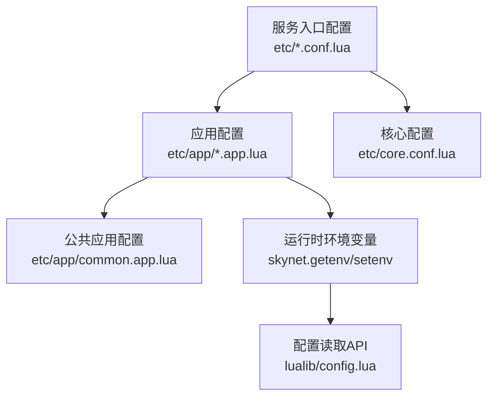
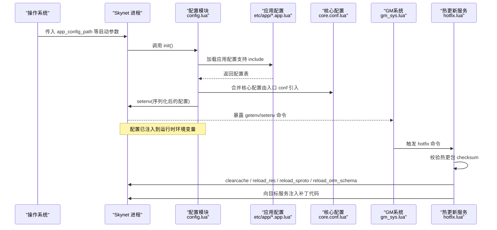
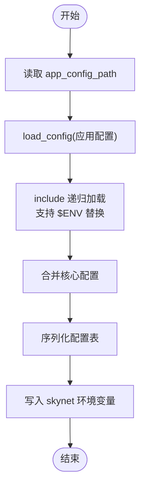
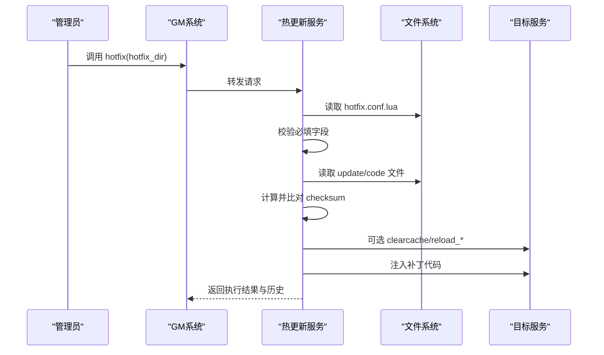
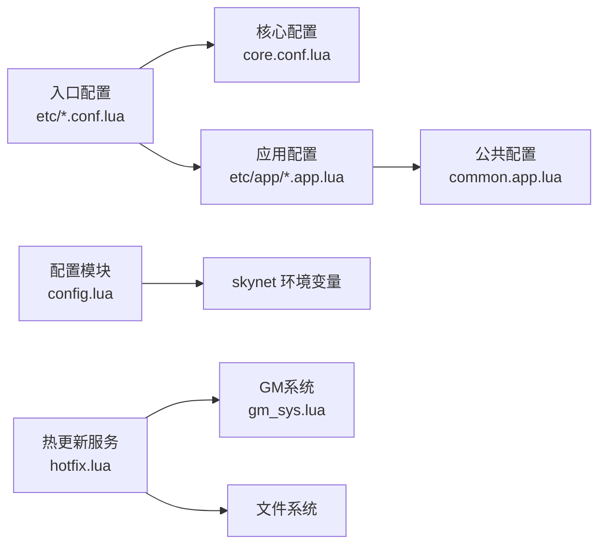

# 配置管理

<cite>
**本文引用的文件**
- [lualib/config.lua](file://lualib/config.lua)
- [lualib/skyext.lua](file://lualib/skyext.lua)
- [etc/core.conf.lua](file://etc/core.conf.lua)
- [etc/app/common.app.lua](file://etc/app/common.app.lua)
- [etc/app/account1.app.lua](file://etc/app/account1.app.lua)
- [etc/app/role1.app.lua](file://etc/app/role1.app.lua)
- [etc/app/robot.app.lua](file://etc/app/robot.app.lua)
- [etc/account1.conf.lua](file://etc/account1.conf.lua)
- [etc/role1.conf.lua](file://etc/role1.conf.lua)
- [etc/robot.conf.lua](file://etc/robot.conf.lua)
- [service/hotfix.lua](file://service/hotfix.lua)
- [hotfix/20260120-patch1/hotfix.conf.lua](file://hotfix/20260120-patch1/hotfix.conf.lua)
- [service/gm_sys.lua](file://service/gm_sys.lua)
</cite>

## 目录
1. [简介](#简介)
2. [项目结构](#项目结构)
3. [核心组件](#核心组件)
4. [架构总览](#架构总览)
5. [详细组件分析](#详细组件分析)
6. [依赖关系分析](#依赖关系分析)
7. [性能考虑](#性能考虑)
8. [故障排除指南](#故障排除指南)
9. [结论](#结论)
10. [附录：配置模板与示例](#附录配置模板与示例)

## 简介
本文件为 SkyExt 框架的配置管理文档，聚焦以下目标：
- 解释配置文件层级结构与加载机制（核心配置、应用配置、服务配置）
- 说明环境变量注入、配置热重载与配置校验能力
- 给出开发、测试、生产环境的配置最佳实践
- 提供关键参数（数据库连接、服务端口、日志级别等）的设置指引
- 提供常见配置错误的排查方法与解决方案

## 项目结构
SkyExt 采用“核心配置 + 应用配置 + 服务入口配置”的分层组织方式：
- 核心配置：定义路径、模块加载、线程数、引导服务等基础运行时参数
- 应用配置：按业务域拆分（如账号、角色、机器人），包含日志、协议、数据库、GM 端口等
- 服务入口配置：指定每个服务的启动脚本与应用配置路径，并引入核心配置

图示来源
- [etc/account1.conf.lua:1-4](file://etc/account1.conf.lua#L1-L4)
- [etc/role1.conf.lua:1-4](file://etc/role1.conf.lua#L1-L4)
- [etc/robot.conf.lua:1-4](file://etc/robot.conf.lua#L1-L4)
- [etc/core.conf.lua:1-30](file://etc/core.conf.lua#L1-L30)
- [etc/app/account1.app.lua:1-21](file://etc/app/account1.app.lua#L1-L21)
- [etc/app/role1.app.lua:1-30](file://etc/app/role1.app.lua#L1-L30)
- [etc/app/robot.app.lua:1-30](file://etc/app/robot.app.lua#L1-L30)
- [etc/app/common.app.lua:1-100](file://etc/app/common.app.lua#L1-L100)
- [lualib/config.lua:1-144](file://lualib/config.lua#L1-L144)

章节来源
- [etc/account1.conf.lua:1-4](file://etc/account1.conf.lua#L1-L4)
- [etc/role1.conf.lua:1-4](file://etc/role1.conf.lua#L1-L4)
- [etc/robot.conf.lua:1-4](file://etc/robot.conf.lua#L1-L4)
- [etc/core.conf.lua:1-30](file://etc/core.conf.lua#L1-L30)
- [etc/app/common.app.lua:1-100](file://etc/app/common.app.lua#L1-L100)
- [etc/app/account1.app.lua:1-21](file://etc/app/account1.app.lua#L1-L21)
- [etc/app/role1.app.lua:1-30](file://etc/app/role1.app.lua#L1-L30)
- [etc/app/robot.app.lua:1-30](file://etc/app/robot.app.lua#L1-L30)
- [lualib/config.lua:1-144](file://lualib/config.lua#L1-L144)

## 核心组件
- 配置加载器与访问器
  - 负责解析应用配置、支持 include 嵌套、环境变量替换、将结果写入 skynet 环境变量，并提供类型化读取接口
- 启动初始化
  - 在框架初始化阶段调用配置模块的初始化函数，确保所有配置已就绪
- 热更新与校验
  - 热更模块对热更包进行完整性校验、按需清理缓存、重载资源/协议/ORM 模式，并将补丁代码注入目标服务

章节来源
- [lualib/config.lua:1-144](file://lualib/config.lua#L1-L144)
- [lualib/skyext.lua:61-80](file://lualib/skyext.lua#L61-L80)
- [service/hotfix.lua:36-108](file://service/hotfix.lua#L36-L108)

## 架构总览
下图展示了从进程启动到配置生效的关键流程，以及热更新时的配置与代码注入链路。

图示来源
- [lualib/config.lua:88-142](file://lualib/config.lua#L88-L142)
- [lualib/skyext.lua:61-80](file://lualib/skyext.lua#L61-L80)
- [service/gm_sys.lua:434-460](file://service/gm_sys.lua#L434-L460)
- [service/hotfix.lua:317-416](file://service/hotfix.lua#L317-L416)

## 详细组件分析

### 配置加载与访问（config.lua）
- 加载流程
  - 通过入口配置中的 app_config_path 定位应用配置
  - 使用自定义 include 机制递归加载配置，支持 $ENV 形式的环境变量替换
  - 将最终配置表序列化为字符串后写入 skynet 环境变量，供各模块统一读取
- 访问接口
  - get/get_boolean/get_number/get_table：从 skynet 环境变量中取值并进行类型转换与缓存
- 错误处理
  - 加载失败或执行失败时抛出明确错误信息，便于快速定位

图示来源
- [lualib/config.lua:88-142](file://lualib/config.lua#L88-L142)

章节来源
- [lualib/config.lua:6-72](file://lualib/config.lua#L6-L72)
- [lualib/config.lua:88-142](file://lualib/config.lua#L88-L142)

### 启动初始化（skyext.lua）
- 在框架初始化阶段加载并初始化配置模块，随后初始化日志模块
- 若任一步骤失败，立即报错终止，避免运行期出现不一致状态

章节来源
- [lualib/skyext.lua:61-80](file://lualib/skyext.lua#L61-L80)

### 热更新与配置校验（hotfix.lua）
- 热更包配置校验
  - 要求必填字段：描述、校验和、基线版本、更新版本、时间戳
  - 校验逻辑：汇总 update_files 与 code_files 内容计算校验和，与配置中声明值比对
- 热更新步骤
  - 可选：清理 Lua 代码缓存、重载资源、重载 sproto、重载 ORM schema
  - 将补丁代码注入目标服务，并记录执行历史
- 安全与可观测性
  - 全量步骤记录成功/失败，便于回溯问题

图示来源
- [service/hotfix.lua:36-108](file://service/hotfix.lua#L36-L108)
- [service/hotfix.lua:317-416](file://service/hotfix.lua#L317-L416)
- [hotfix/20260120-patch1/hotfix.conf.lua:1-21](file://hotfix/20260120-patch1/hotfix.conf.lua#L1-L21)

章节来源
- [service/hotfix.lua:36-108](file://service/hotfix.lua#L36-L108)
- [service/hotfix.lua:317-416](file://service/hotfix.lua#L317-L416)
- [hotfix/20260120-patch1/hotfix.conf.lua:1-21](file://hotfix/20260120-patch1/hotfix.conf.lua#L1-L21)

### 环境变量与动态配置（gm_sys.lua）
- 提供 GM 命令以查询/设置 skynet 环境变量
- 可用于在线调整部分非持久化配置项（需谨慎评估影响范围）

章节来源
- [service/gm_sys.lua:434-460](file://service/gm_sys.lua#L434-L460)

## 依赖关系分析
- 入口配置依赖核心配置与应用配置
- 应用配置通常 include 公共配置，形成“公共 -> 具体应用”的继承式覆盖
- 配置模块依赖 Skynet 环境变量机制；热更新服务依赖 GM 系统与文件系统
- 日志、协议、ORM 等子系统通过 GM 命令被热更新服务驱动重载

图示来源
- [etc/account1.conf.lua:1-4](file://etc/account1.conf.lua#L1-L4)
- [etc/role1.conf.lua:1-4](file://etc/role1.conf.lua#L1-L4)
- [etc/robot.conf.lua:1-4](file://etc/robot.conf.lua#L1-L4)
- [etc/core.conf.lua:1-30](file://etc/core.conf.lua#L1-L30)
- [etc/app/common.app.lua:1-100](file://etc/app/common.app.lua#L1-L100)
- [lualib/config.lua:88-142](file://lualib/config.lua#L88-L142)
- [service/hotfix.lua:317-416](file://service/hotfix.lua#L317-L416)
- [service/gm_sys.lua:434-460](file://service/gm_sys.lua#L434-L460)

章节来源
- [etc/core.conf.lua:1-30](file://etc/core.conf.lua#L1-L30)
- [etc/app/common.app.lua:1-100](file://etc/app/common.app.lua#L1-L100)
- [lualib/config.lua:88-142](file://lualib/config.lua#L88-L142)
- [service/hotfix.lua:317-416](file://service/hotfix.lua#L317-L416)
- [service/gm_sys.lua:434-460](file://service/gm_sys.lua#L434-L460)

## 性能考虑
- 配置读取缓存：配置模块对已读取的环境变量进行本地缓存，减少重复查找开销
- 配置序列化：复杂配置表会被序列化为字符串存储于环境变量，注意大对象带来的内存与序列化成本
- 热更新步骤控制：按需开启 clearcache/reload_*，避免不必要的重启或重载导致抖动
- 日志轮转：合理设置日志文件大小与分割策略，避免磁盘占用过高

[本节为通用指导，不直接分析具体文件]

## 故障排除指南
- 启动时报“未找到应用配置路径”
  - 检查入口配置是否设置了 app_config_path，且路径指向有效的 .app.lua 文件
  - 参考：[lualib/config.lua:120-133](file://lualib/config.lua#L120-L133)
- 配置加载失败或 include 出错
  - 确认 include 路径正确，且被 include 的文件语法无误
  - 检查 $ENV 环境变量是否存在，缺失会抛错
  - 参考：[lualib/config.lua:88-117](file://lualib/config.lua#L88-L117)
- 热更新校验失败
  - 核对 hotfix.conf.lua 中的 checksum 与实际文件内容一致
  - 确认 update_files 与 code_files 列表完整且路径相对工程根目录正确
  - 参考：[service/hotfix.lua:71-108](file://service/hotfix.lua#L71-L108)
- 热更新步骤失败
  - 查看热更新历史与步骤记录，定位失败环节（clearcache/reload_*）
  - 参考：[service/hotfix.lua:317-416](file://service/hotfix.lua#L317-L416)
- 无法通过 GM 获取/设置环境变量
  - 确认 GM 服务已启动并可访问
  - 参考：[service/gm_sys.lua:434-460](file://service/gm_sys.lua#L434-L460)

章节来源
- [lualib/config.lua:88-142](file://lualib/config.lua#L88-L142)
- [service/hotfix.lua:71-108](file://service/hotfix.lua#L71-L108)
- [service/hotfix.lua:317-416](file://service/hotfix.lua#L317-L416)
- [service/gm_sys.lua:434-460](file://service/gm_sys.lua#L434-L460)

## 结论
SkyExt 的配置体系通过分层配置与环境变量注入实现灵活、可扩展的运行期配置管理。配合热更新与校验机制，可在保证安全性的前提下实现不停机更新。建议在生产环境中严格区分环境配置、最小化在线修改、完善热更新校验与回滚策略。

[本节为总结性内容，不直接分析具体文件]

## 附录：配置模板与示例

### 配置文件层级与职责
- 核心配置（core.conf.lua）
  - 作用：定义根路径、模块搜索路径、Lua/C 库路径、线程数、引导服务、日志服务等
  - 参考：[etc/core.conf.lua:1-30](file://etc/core.conf.lua#L1-L30)
- 应用配置（etc/app/*.app.lua）
  - 作用：按服务维度定义日志、网络端口、集群节点、数据库、协议、GM 端口等
  - 公共配置（common.app.lua）：存放跨服务共享的配置项（如日志、MongoDB、sproto、JWT 等）
  - 参考：
    - [etc/app/common.app.lua:1-100](file://etc/app/common.app.lua#L1-L100)
    - [etc/app/account1.app.lua:1-21](file://etc/app/account1.app.lua#L1-L21)
    - [etc/app/role1.app.lua:1-30](file://etc/app/role1.app.lua#L1-L30)
    - [etc/app/robot.app.lua:1-30](file://etc/app/robot.app.lua#L1-L30)
- 服务入口配置（etc/*.conf.lua）
  - 作用：指定应用配置路径、主脚本入口、引入核心配置
  - 参考：
    - [etc/account1.conf.lua:1-4](file://etc/account1.conf.lua#L1-L4)
    - [etc/role1.conf.lua:1-4](file://etc/role1.conf.lua#L1-L4)
    - [etc/robot.conf.lua:1-4](file://etc/robot.conf.lua#L1-L4)

### 环境变量注入
- 配置加载时支持 $ENV 形式的变量替换，变量来自操作系统环境变量
- 应用配置加载完成后，会将所有键值写入 skynet 环境变量，供运行时通过配置 API 读取
- 参考：
  - [lualib/config.lua:88-117](file://lualib/config.lua#L88-L117)
  - [lualib/config.lua:120-142](file://lualib/config.lua#L120-L142)

### 配置热重载与校验
- 热更新服务对热更包进行必填字段校验与内容校验和验证
- 支持按需清理缓存、重载资源/协议/ORM 模式，并将补丁代码注入目标服务
- 参考：
  - [service/hotfix.lua:36-108](file://service/hotfix.lua#L36-L108)
  - [service/hotfix.lua:317-416](file://service/hotfix.lua#L317-L416)
  - [hotfix/20260120-patch1/hotfix.conf.lua:1-21](file://hotfix/20260120-patch1/hotfix.conf.lua#L1-L21)

### 不同环境的最佳实践
- 开发环境
  - 使用本地 MongoDB、较短超时、较细粒度日志（DEBUG）
  - 降低并发与连接数，便于调试
- 测试环境
  - 隔离数据源与端口，启用必要监控与审计
  - 保持与生产一致的配置结构，仅替换值
- 生产环境
  - 严格校验热更包 checksum，限制在线修改
  - 日志分级为 INFO/WARN，合理设置轮转大小
  - 使用独立账户与最小权限访问数据库

[本节为通用实践指导，不直接分析具体文件]

### 关键参数设置指引
- 数据库连接（MongoDB）
  - 中心库与角色库的连接池大小、主机地址、端口、认证信息等
  - 集合索引定义
  - 参考：[etc/app/common.app.lua:21-72](file://etc/app/common.app.lua#L21-L72)
- 服务端口
  - 账号服务 HTTP 端口、GM HTTP 端口、网关端口、集群监听端口等
  - 参考：
    - [etc/app/account1.app.lua:13-18](file://etc/app/account1.app.lua#L13-L18)
    - [etc/app/role1.app.lua:1-14](file://etc/app/role1.app.lua#L1-L14)
    - [etc/app/robot.app.lua:1-15](file://etc/app/robot.app.lua#L1-L15)
- 日志级别与输出
  - 日志等级、是否打印源码位置、是否打印 table、输出目标（文件/控制台）、轮转策略
  - 参考：[etc/app/common.app.lua:1-19](file://etc/app/common.app.lua#L1-L19)
- 其他关键参数
  - sproto 协议索引与路径、协议校验开关、最大角色数、JWT 密钥、HTTP 请求体大小等
  - 参考：[etc/app/common.app.lua:74-100](file://etc/app/common.app.lua#L74-L100)

### 配置模板与示例
- 入口配置模板
  - 设置 app_config_path、start、include core.conf.lua
  - 参考：[etc/account1.conf.lua:1-4](file://etc/account1.conf.lua#L1-L4)
- 应用配置模板
  - 定义 log_config、服务端口、集群信息、数据库、sproto、JWT 等
  - 参考：
    - [etc/app/account1.app.lua:1-21](file://etc/app/account1.app.lua#L1-L21)
    - [etc/app/role1.app.lua:1-30](file://etc/app/role1.app.lua#L1-L30)
    - [etc/app/robot.app.lua:1-30](file://etc/app/robot.app.lua#L1-L30)
- 热更新配置模板
  - 必填字段：desc、checksum、gitsha_base、gitsha_update、time
  - 可选开关：clearcache、reload_res、reload_sproto、reload_orm_schema
  - 文件清单：update_files、code_files
  - 参考：[hotfix/20260120-patch1/hotfix.conf.lua:1-21](file://hotfix/20260120-patch1/hotfix.conf.lua#L1-L21)

章节来源
- [etc/core.conf.lua:1-30](file://etc/core.conf.lua#L1-L30)
- [etc/app/common.app.lua:1-100](file://etc/app/common.app.lua#L1-L100)
- [etc/app/account1.app.lua:1-21](file://etc/app/account1.app.lua#L1-L21)
- [etc/app/role1.app.lua:1-30](file://etc/app/role1.app.lua#L1-L30)
- [etc/app/robot.app.lua:1-30](file://etc/app/robot.app.lua#L1-L30)
- [etc/account1.conf.lua:1-4](file://etc/account1.conf.lua#L1-L4)
- [etc/role1.conf.lua:1-4](file://etc/role1.conf.lua#L1-L4)
- [etc/robot.conf.lua:1-4](file://etc/robot.conf.lua#L1-L4)
- [hotfix/20260120-patch1/hotfix.conf.lua:1-21](file://hotfix/20260120-patch1/hotfix.conf.lua#L1-L21)