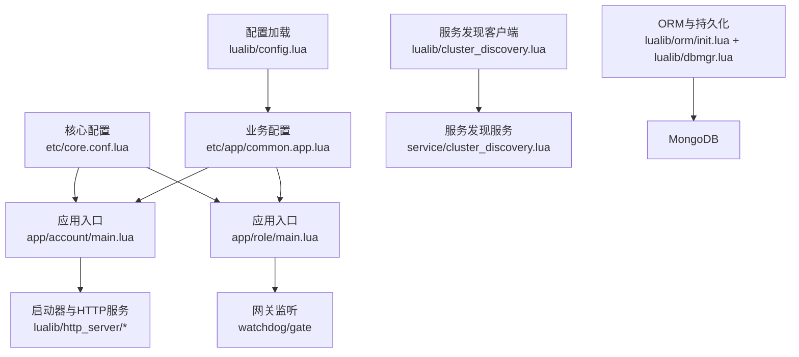
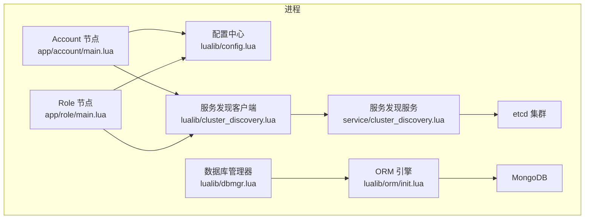
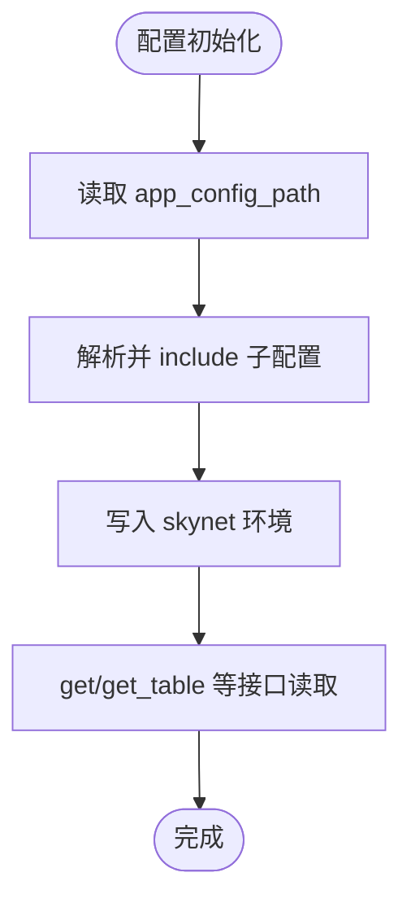
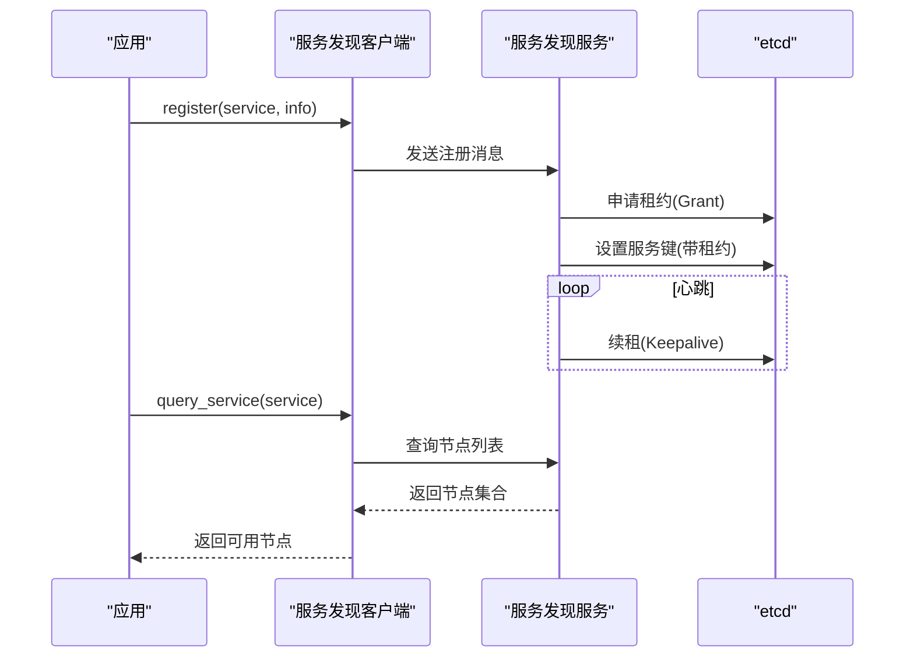
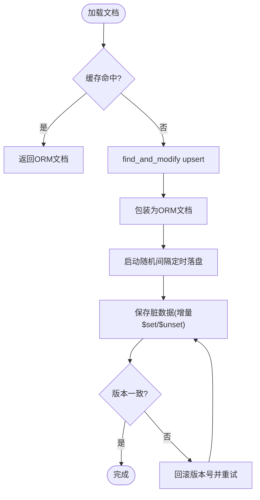
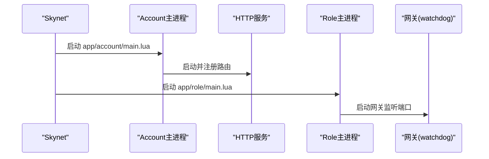
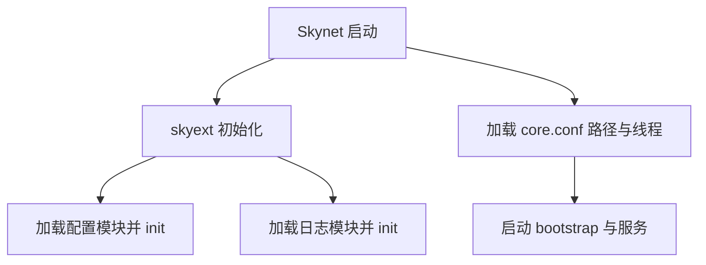
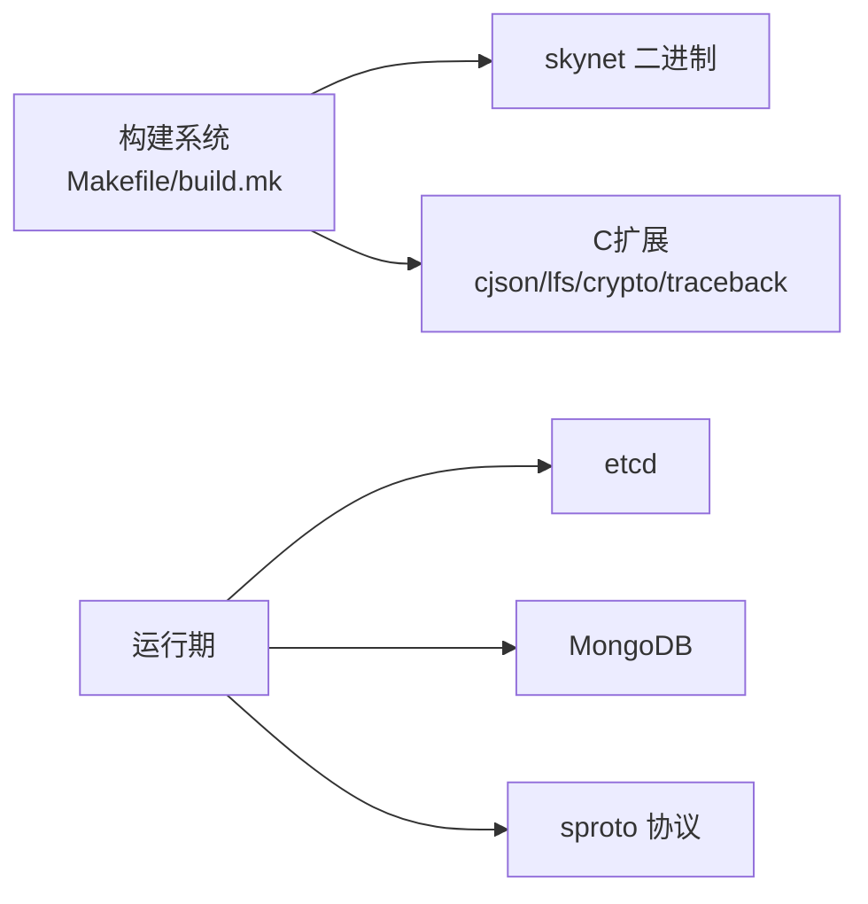

# 项目概述

<cite>
**本文引用的文件**
- [README.md](file://README.md)
- [Makefile](file://Makefile)
- [build.mk](file://build.mk)
- [core.conf.lua](file://etc/core.conf.lua)
- [account1.conf.lua](file://etc/account1.conf.lua)
- [role1.conf.lua](file://etc/role1.conf.lua)
- [common.app.lua](file://etc/app/common.app.lua)
- [skyext.lua](file://lualib/skyext.lua)
- [config.lua](file://lualib/config.lua)
- [cluster_discovery.lua](file://lualib/cluster_discovery.lua)
- [dbmgr.lua](file://lualib/dbmgr.lua)
- [orm/init.lua](file://lualib/orm/init.lua)
- [service/cluster_discovery.lua](file://service/cluster_discovery.lua)
- [app/account/main.lua](file://app/account/main.lua)
- [app/role/main.lua](file://app/role/main.lua)
</cite>

## 目录
1. [简介](#简介)
2. [项目结构](#项目结构)
3. [核心组件](#核心组件)
4. [架构总览](#架构总览)
5. [详细组件分析](#详细组件分析)
6. [依赖关系分析](#依赖关系分析)
7. [性能考量](#性能考量)
8. [故障排查指南](#故障排查指南)
9. [结论](#结论)
10. [附录：快速开始](#附录快速开始)

## 简介
SkyExt 是一个基于 Skynet 的分布式游戏服务器框架，采用微服务化设计，将账号服务（Account）与角色服务（Role）解耦部署，通过服务发现实现动态扩缩容。框架内置 ORM、MongoDB 持久化、sproto 协议管理、JWT 认证、日志系统以及基于 etcd 的服务注册与发现能力，并提供热更新等扩展能力。其目标是提供高性能、可扩展、易维护的游戏服务端基础设施，便于快速构建多人在线游戏后端。

## 项目结构
项目采用分层与模块化组织：
- 应用入口：app/account、app/role、app/robot
- 配置：etc/core.conf.lua 定义全局路径与线程数；etc/app/*.app.lua 定义业务配置
- 库与工具：lualib 提供 ORM、配置、服务发现、数据库、HTTP、协议等通用能力
- 服务：service 提供集群发现、日志、Mongo 连接、协议加载等后台服务
- 协议与模式：proto 与 schema 定义 sproto 协议与数据模型
- 构建与工具：Makefile、build.mk、tools 脚本用于编译、代码生成与打包

图表来源
- [core.conf.lua:1-30](file://etc/core.conf.lua#L1-L30)
- [common.app.lua:1-100](file://etc/app/common.app.lua#L1-L100)
- [app/account/main.lua:1-25](file://app/account/main.lua#L1-L25)
- [app/role/main.lua:1-25](file://app/role/main.lua#L1-L25)
- [cluster_discovery.lua:1-95](file://lualib/cluster_discovery.lua#L1-L95)
- [service/cluster_discovery.lua:46-275](file://service/cluster_discovery.lua#L46-L275)
- [dbmgr.lua:1-219](file://lualib/dbmgr.lua#L1-L219)
- [orm/init.lua:1-491](file://lualib/orm/init.lua#L1-L491)

章节来源
- [README.md:1-276](file://README.md#L1-L276)
- [Makefile:1-47](file://Makefile#L1-L47)
- [build.mk:1-106](file://build.mk#L1-L106)
- [core.conf.lua:1-30](file://etc/core.conf.lua#L1-L30)

## 核心组件
- 配置系统：统一读取节点与应用配置，支持字符串、数值、布尔与表类型，并注入到 skynet 环境供各模块使用
- 服务发现：客户端封装查询与订阅变更；服务端基于 etcd 租约与心跳维持服务注册信息
- ORM 与持久化：对象关系映射，脏标记与增量提交，定时落盘与卸载时强制落盘，版本控制避免并发写冲突
- HTTP 服务：Account 节点暴露 HTTP 接口，路由注册至 account_router
- 协议与鉴权：sproto 协议编解码与校验，JWT 登录令牌
- 日志系统：分级输出、文件与控制台双通道、可配置轮转策略

章节来源
- [config.lua:1-145](file://lualib/config.lua#L1-L145)
- [cluster_discovery.lua:1-95](file://lualib/cluster_discovery.lua#L1-L95)
- [service/cluster_discovery.lua:46-275](file://service/cluster_discovery.lua#L46-L275)
- [dbmgr.lua:1-219](file://lualib/dbmgr.lua#L1-L219)
- [orm/init.lua:1-491](file://lualib/orm/init.lua#L1-L491)
- [app/account/main.lua:1-25](file://app/account/main.lua#L1-L25)
- [common.app.lua:1-100](file://etc/app/common.app.lua#L1-L100)

## 架构总览
SkyExt 以 Skynet 为运行时，按职责拆分为多个独立进程（节点），通过消息总线与事件通道协作。Account 节点负责用户系统与 HTTP 接入；Role 节点负责角色逻辑与网关接入；两者均通过服务发现进行动态寻址；数据层通过 ORM 与 MongoDB 交互，配置由 etcd 与本地配置文件共同驱动。

图表来源
- [app/account/main.lua:1-25](file://app/account/main.lua#L1-L25)
- [app/role/main.lua:1-25](file://app/role/main.lua#L1-L25)
- [cluster_discovery.lua:1-95](file://lualib/cluster_discovery.lua#L1-L95)
- [service/cluster_discovery.lua:46-275](file://service/cluster_discovery.lua#L46-L275)
- [dbmgr.lua:1-219](file://lualib/dbmgr.lua#L1-L219)
- [orm/init.lua:1-491](file://lualib/orm/init.lua#L1-L491)
- [config.lua:1-145](file://lualib/config.lua#L1-L145)

## 详细组件分析

### 配置系统（Config）
- 功能要点
  - 从节点配置 app_config_path 加载应用配置，支持 include 与环境变量替换
  - 提供 get/get_boolean/get_number/get_table 统一访问接口
  - 将配置序列化后写入 skynet 环境，供其他模块按需读取
- 关键流程
  - 初始化时解析 app_config_path，执行 include 链，最终 setenv 所有键值
  - 支持 table 类型配置，内部序列化为字符串存储于环境

图表来源
- [config.lua:88-145](file://lualib/config.lua#L88-L145)

章节来源
- [config.lua:1-145](file://lualib/config.lua#L1-L145)
- [core.conf.lua:1-30](file://etc/core.conf.lua#L1-L30)
- [common.app.lua:1-100](file://etc/app/common.app.lua#L1-L100)

### 服务发现（Cluster Discovery）
- 客户端侧
  - 提供 register/unregister 注册与注销服务
  - 维护服务节点缓存，支持随机选择与获取全部节点
  - 订阅 service_change 事件，自动刷新节点列表
- 服务端侧
  - 基于 etcd 租约与心跳保活，周期性续租
  - 维护本地服务表，同步到 etcd，删除时清理
  - 开启 cluster 端口以便跨进程通信

图表来源
- [cluster_discovery.lua:1-95](file://lualib/cluster_discovery.lua#L1-L95)
- [service/cluster_discovery.lua:46-275](file://service/cluster_discovery.lua#L46-L275)

章节来源
- [cluster_discovery.lua:1-95](file://lualib/cluster_discovery.lua#L1-L95)
- [service/cluster_discovery.lua:46-275](file://service/cluster_discovery.lua#L46-L275)

### ORM 与数据持久化（ORM + DBMgr）
- ORM 特性
  - 文档型对象包装，字段变更追踪与脏标记传播
  - 支持嵌套对象与数组，序列化时跳过默认值
  - 增量提交：仅提交变更字段，减少网络与磁盘开销
- DBMgr 机制
  - 加载数据时 find_and_modify upsert，创建 ORM 文档并绑定定时落盘
  - 卸载时取消定时器并强制落盘，保证数据一致性
  - 版本控制：保存时携带 _version 乐观锁，防止并发覆盖

图表来源
- [dbmgr.lua:94-148](file://lualib/dbmgr.lua#L94-L148)
- [dbmgr.lua:150-198](file://lualib/dbmgr.lua#L150-L198)
- [orm/init.lua:315-491](file://lualib/orm/init.lua#L315-L491)

章节来源
- [dbmgr.lua:1-219](file://lualib/dbmgr.lua#L1-L219)
- [orm/init.lua:1-491](file://lualib/orm/init.lua#L1-L491)

### 应用入口与节点启动
- Account 节点
  - 启动 HTTP 服务，注册路由，处理用户相关请求
- Role 节点
  - 启动 watchdog/gate 监听客户端连接，承载角色逻辑

图表来源
- [app/account/main.lua:1-25](file://app/account/main.lua#L1-L25)
- [app/role/main.lua:1-25](file://app/role/main.lua#L1-L25)

章节来源
- [app/account/main.lua:1-25](file://app/account/main.lua#L1-L25)
- [app/role/main.lua:1-25](file://app/role/main.lua#L1-L25)

### 启动与初始化钩子
- skyext 在 skynet.init 中加载配置与日志，确保后续模块可用
- core.conf 定义 Lua 搜索路径、线程数、bootstrap 服务等基础参数

图表来源
- [skyext.lua:61-80](file://lualib/skyext.lua#L61-L80)
- [core.conf.lua:1-30](file://etc/core.conf.lua#L1-L30)

章节来源
- [skyext.lua:1-81](file://lualib/skyext.lua#L1-L81)
- [core.conf.lua:1-30](file://etc/core.conf.lua#L1-L30)

## 依赖关系分析
- 构建依赖
  - 平台检测与编译目标：Linux/macOS/FreeBSD/MinGW
  - 第三方库：lua-cjson、luafilesystem、libsodium、traceback
  - 产物：skynet 二进制、Lua/C 扩展 .so
- 运行依赖
  - etcd：服务注册与发现
  - MongoDB：数据持久化
  - sproto：协议序列化与校验

图表来源
- [Makefile:1-47](file://Makefile#L1-L47)
- [build.mk:1-106](file://build.mk#L1-L106)

章节来源
- [Makefile:1-47](file://Makefile#L1-L47)
- [build.mk:1-106](file://build.mk#L1-L106)

## 性能考量
- 数据落盘策略
  - 定时随机延迟落盘，降低集中写入抖动
  - 卸载时强制落盘，保障进程退出数据一致性
- 并发与一致性
  - ORM 脏标记与增量提交，减少无效写入
  - 版本控制乐观锁，避免并发覆盖
- 服务发现
  - 基于 etcd 租约与心跳，保证服务可用性
  - 客户端缓存与事件订阅，降低查询压力
- 资源与扩展性
  - 线程数与连接池可配置，适配不同负载场景
  - 多实例部署（Account/Role 多节点），水平扩展

[本节为通用指导，不直接分析具体文件]

## 故障排查指南
- 配置加载失败
  - 检查 app_config_path 是否正确，include 链是否完整
  - 确认环境变量与模板替换无误
- 服务发现异常
  - 检查 etcd 连通性与租约续期状态
  - 查看服务注册键是否存在且未过期
- 数据持久化问题
  - 观察 dbmgr 日志中的 save failed 与 not modified 错误
  - 确认 MongoDB 连接与索引配置正确
- 协议与版本
  - 启用 proto checksum 校验，避免协议不一致导致解析失败

章节来源
- [config.lua:88-145](file://lualib/config.lua#L88-L145)
- [service/cluster_discovery.lua:46-275](file://service/cluster_discovery.lua#L46-L275)
- [dbmgr.lua:53-92](file://lualib/dbmgr.lua#L53-L92)
- [common.app.lua:74-100](file://etc/app/common.app.lua#L74-L100)

## 结论
SkyExt 以 Skynet 为基础，结合 etcd 与 MongoDB，构建了高内聚、低耦合的微服务化游戏服务器框架。通过 ORM 与增量持久化提升数据层效率，借助服务发现实现弹性伸缩，配合完善的配置与日志体系，为游戏后端开发提供了稳定可靠的基座。未来可在监控、热更、GM 工具等方面持续完善，进一步提升运维与开发体验。

[本节为总结性内容，不直接分析具体文件]

## 附录：快速开始
- 环境要求
  - 操作系统：Linux/macOS/FreeBSD/Windows（MinGW）
  - 依赖：etcd、MongoDB、libsodium、lua-cjson、sproto
- 安装与初始化
  - 克隆仓库并初始化子模块
  - 编译项目与 C 扩展
- 启动外部服务
  - 启动 etcd 与 MongoDB（可使用 tools 下的 docker-compose）
- 生成协议与模式
  - 生成 sproto 与 ORM schema，并生成角色代理模块
- 启动节点
  - 启动多个 Account 与 Role 节点实例
  - 可选启动机器人进行压测

章节来源
- [README.md:48-110](file://README.md#L48-L110)
- [Makefile:11-47](file://Makefile#L11-L47)
- [build.mk:78-91](file://build.mk#L78-L91)
- [account1.conf.lua:1-4](file://etc/account1.conf.lua#L1-L4)
- [role1.conf.lua:1-4](file://etc/role1.conf.lua#L1-L4)